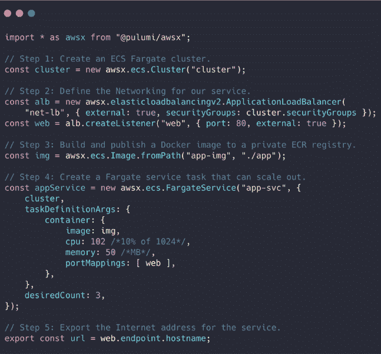

# Pulumi 人行横道旨在简化 AWS 的部署

> 原文：<https://thenewstack.io/pulumi-crosswalk-aims-to-simplify-deploying-to-aws/>

西雅图初创公司 [Pulumi](https://www.pulumi.com/) 发布了一个开源框架，它打包了在 AWS 上创建和部署应用程序的最常见模式，即亚马逊网络服务(AWS)的 Crosswalk。

Pulumi 的创始人兼首席执行官[乔·达菲](https://www.linkedin.com/in/joejduffy/)说:“Crosswalk 正在把你需要的所有服务带到 AWS 的生产中，并使它们更容易、更容易被更多的观众获得。

“我们不仅获得了易用性，还获得了最佳实践，不仅可以开始使用，还可以投入生产。当他们这样做时，他们从安全性和可靠性的角度获得了最佳实践。坦率地说，很多人甚至不需要考虑这个问题。”

在高层次上，它在概念上类似于 Rancher Labs 的 [Rio](https://github.com/rancher/rio) ，后者[将样板服务](https://thenewstack.io/rancher-rio-taking-care-of-the-first-half-of-the-developers-day/)打包在一个应用程序中，尽管该项目仅专注于 Kubernetes。

Pulumi 的云原生开发平台旨在消除管理 YAML 文件的麻烦。它允许开发者使用他们已经知道的编程语言来构建和部署容器、Kubernetes 和无服务器 Lambdas。

> “我不知道有多少次在 Teraform 或 CloudFormation 中看到同样的 2000 行代码来在亚马逊建立一个网络。”—乔·达菲

Duffy 说，通过在这个项目上与 AWS 合作，它已经创建了反复出现的模式库，并提取了最佳实践。该公司计划在未来对其他云采取相同的人行横道方法。

“我不知道有多少次在 Terraform 或 CloudFormation 中看到同样的 2000 行代码在亚马逊中建立一个网络。每个人都在那里重新发明轮子，”他说。有很多复制和粘贴正在进行，他继续说道。如果你在某个地方有安全问题，你可能会忘记更新你已经复制到的其他 10 个地方。

Crosswalk 构建在 Pulumi 开源 SDK 之上，支持包括 JavaScript、Python、TypeScript 和 Go 在内的语言，并将在其 SaaS 产品中提供。

人行横道包括:

*   **容器服务:**供应弹性容器服务(ECS)管理的集群，包括 Fargate、Kubernetes (EKS)和内置的身份和访问管理(IAM)、弹性负载平衡(ELB)和 CloudWatch 配置和集成的最佳实践。
*   **无服务器函数和 API:**基于 Lambda 的事件处理程序，用于 S3 桶、SQS 队列以及无服务器 API 网关。
*   **核心基础设施:**提供和管理核心网络服务，如虚拟专用云(VPC)、自动扩展组(ASG)以及应用和网络级弹性负载平衡器(ELB)
*   **认证和授权:**身份和访问管理(IAM)支持配置用户、策略和角色。
*   **使用声明性代码，通过 CloudWatch 仪表盘、指标和警报监控应用和基础设施**。
*   **CI/CD 集成**与弹性容器注册中心(ECR)和 AWS 代码服务，包括代码构建和代码管道。

Docker 的入门手册有六页，包括一些代码，但是有很多手工步骤。然而，达菲说，它还不能用于生产。

“一旦投入生产，您就要管理集群、负载平衡器和 Kubernetes。你从只想在一个容器中运行一个小应用程序，突然变成了 Kubernetes 或 Docker Swarm 等领域的专家，”他说。

人行横道使开始变得更加简单。

“这是 27 行代码，使用的是许多开发人员已经知道的语言。在这种情况下是 TypeScript。然而，这在 Amazon 中提供了一个完整的 ECS 集群，创建了一个负载平衡器，在一个私有注册表中构建并发布了一个 Docker 容器，并使用三个实例构建了一个负载平衡的服务…您不仅仅获得了更简单的开发人员体验。您将获得更简单的体验，并为生产做好准备。”

他说，如果这是用 Terraform 或 CloudFormation 编写的，很容易就会有数百行代码。

“因为抽象，你可以隐藏细节。开发人员不需要考虑这些服务的所有底层细节。他们可以相信这些软件包已经完成了所有工作。”

因为它们只是包，开发人员可以随着它们的发展重新安装它们。它们的版本就像应用软件一样。因此，随着那些最佳实践的发展，您对最佳实践的采用也可以发展。

Pulumi 在去年九月发布了对 Kubernetes 的支持。他说，Crosswalk 可以很容易地用于 AWS 上的 Kubernetes，以简单的方式建立虚拟私有云并编写 Lambda 事件。

Tableau Software 是一直使用人行横道的客户之一。

Tableau 的云工程高级总监 Pankaj Dhingra[表示:“我们的团队一直在寻找一种端到端的解决方案，以抑制 Kubernetes 在 AWS 上的复杂性，并确保我们遵循 AWS 的最佳实践。](https://www.linkedin.com/in/pandhi/)

“Pulumi 的 Crosswalk 努力使我们的团队能够比本土解决方案、脚本和 DSL(特定领域语言)的替代方法更好地扩展。我们的交付现已实现自动化，我们现在可以以更快的速度交付新的应用和基础设施功能，有时只需几个小时。”

Pulumi 是新堆栈的赞助商

通过 Pixabay 的特征图像。

<svg xmlns:xlink="http://www.w3.org/1999/xlink" viewBox="0 0 68 31" version="1.1"><title>Group</title> <desc>Created with Sketch.</desc></svg>