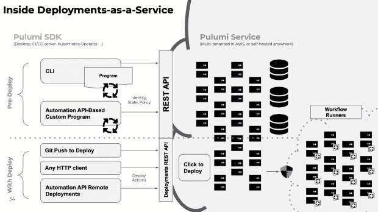

# Pulumi 引入了一键式部署

> 原文：<https://thenewstack.io/pulumi-introduces-one-click-deployments/>

底特律——有些事情应该很简单，但有时让一些事情正常运行会比应该的更难， [Pulumi](https://www.pulumi.com/) 创始人兼首席执行官[乔·达菲](https://www.linkedin.com/in/joejduffy/)在介绍该公司名为 Pulumi Deployments 的部署即服务技术时说。

该技术使用户能够通过 git commit、点击 Pulumi UI 中的按钮或调用新的 Pulumi Deployments REST API 来立即启动或更新现有的云应用程序和基础架构。

“以前的工作方式是，你在本地运行一个程序，Pulumi 服务会处理身份、状态和策略。它实际上没有在 Pulumi 服务中运行任何计算，这很好。但许多客户希望对他们在哪里运行这些东西有更多的控制权，”达菲上周在 [KubeCon+CloudNativeCon 北美](https://events.linuxfoundation.org/kubecon-cloudnativecon-north-america/)接受采访时说。

“有时你只想开始运行并说，‘嘿，我在那里有一个 git repo，当我签入它时，请只部署更改。’或者您想进入服务并说，“旋转我的凭据”，然后单击按钮。…所以我们添加了这项新功能，现在我们可以实际托管计算。打个比方，这有点像 GitHub 动作，但是对于你的基础设施来说，代码是思考其背后架构的一种方式。"

新功能包括:

*   **Deployments REST API** 提供完全控制，与 Pulumi 云中托管的服务器端部署进行交互。
*   **自动化 API 支持**连接了 Pulumi 支持语言的丰富库。客户端上运行的自动化 API 程序现在可以将基础设施代码(IaC)程序的执行卸载到 Pulumi 的完全托管部署即服务中。
*   **Git push to deploy** 允许用户连接 git repo 并在给定的项目路径上执行部署，以及其他 GitOps 工作流，如 pull request reviews。
*   **单击以部署**支持直接从 Pulumi 服务 UI 启动部署操作，包括更新、销毁和漂移检测，而无需从 CLI 启动操作。

Duffy 解释说，在部署启动之前，红色虚线上方的所有内容都是 Pulumi，下面描述的是新服务。

“我们已经有客户使用内部私有测试版来构建漂移检测、自动基础设施回收……短暂的环境，因此在拉请求期间，打开一个可以测试的全新环境，然后在代码合并后销毁它。达菲说:“这开启了很多场景。

大约一年前发布的[自动化 API](https://www.pulumi.com/docs/guides/automation-api/) ，位于部署的核心。正如首席技术官卢克·霍班在一篇博客文章中解释的那样，自动化 API 允许你[在你的应用代码](https://www.pulumi.com/blog/pulumi-deployments)中嵌入 Pulumi，允许你在上面创建定制的体验来适应你的用例。

新的 Deployments REST API 仅将自动化 API 从客户端带到基于云的服务。

对于部署，通过将其 GitHub 存储库连接到 Pulumi，开发人员可以通过将代码直接推送到其存储库来执行云应用和基础架构部署。该公司正在努力加强对 GitLab、Bitbucket 和其他平台的支持。

它还创建了一个[架构模板库](https://www.pulumi.com/blog/intro-architecture-templates/)，作为跨越 [AWS](https://thenewstack.io/pulumi-crosswalk-aims-to-simplify-deploying-to-aws/) 、微软 Azure、谷歌云和 Kubernetes 的云架构的基线蓝图。例如，有一些最佳实践架构，比如 Google Cloud 上的无服务器架构或 AWS 上的容器服务。模板允许您用一个命令定义该项目。

GitHub 开发人员关系副总裁 Martin Woodward[表示:“Pulumi Deployments 使团队能够通过将熟悉的基于 git 的工作流应用到他们的基础设施代码中，更快地将他们的代码带到云上。](https://github.com/martinwoodward)

## **一种方法，多种语言**

这家总部位于西雅图的公司专注于使用熟悉的编程语言提供一种单一一致的方法来管理基础设施。

5 月，该公司宣布了 Pulumi CrossCode 翻译技术，该技术使开发和运营团队能够将任何基础设施作为代码格式转换为 Pulumi，并与其他 IaC 系统管理的所有现有基础设施进行互操作。

它还在其他语言中增加了对 Java 和 YAML 的支持，包括任何 Java 虚拟机(JVM)语言(Java、Scala、Clojure)。NET (C#，F#，PowerShell)，Node.js (JavaScript，TypeScript)，Go 和 Python。

<svg xmlns:xlink="http://www.w3.org/1999/xlink" viewBox="0 0 68 31" version="1.1"><title>Group</title> <desc>Created with Sketch.</desc></svg>