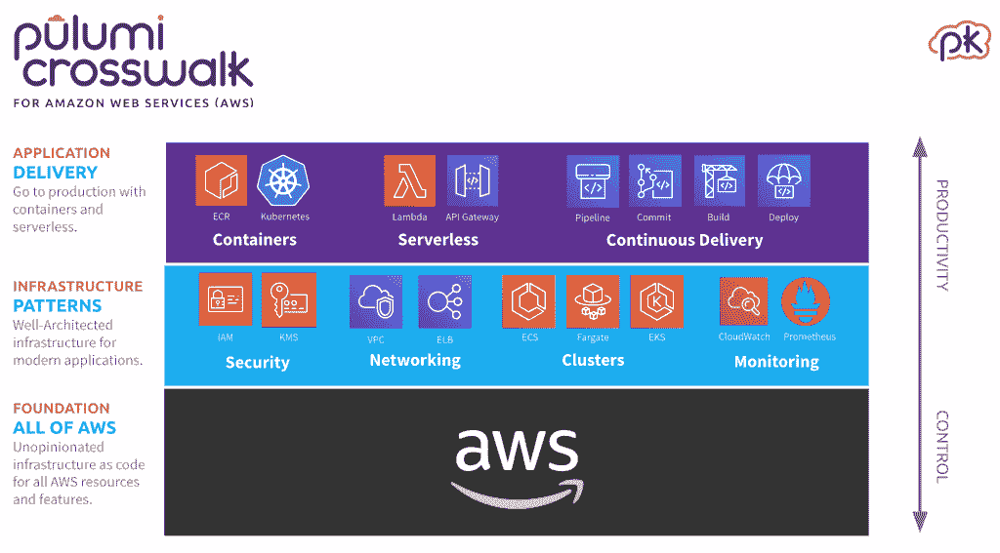

# Pulumi 使用真正的编程语言来实施云最佳实践

> 原文：<https://thenewstack.io/pulumi-uses-real-programming-languages-to-enforce-cloud-best-practices/>

基础设施即代码的想法可能是 DevOps 的基础，但初创公司 Pulumi 承诺的更像是基础设施即软件。

“我们正在做的是利用我们所知道的关于软件和软件工程的所有东西，并将它们应用到基础设施中，”Pulumi 创始人兼首席执行官 T2·乔·达菲告诉新堆栈。这为您提供了开发人员提高生产力所依赖的所有资源；这是以运营为中心的技术，如 Kubernetes，甚至许多云服务所缺乏的。

达菲指出:“现有的基础设施作为人们正在使用的代码技术，如 ARM 模板、CloudFormation、Terraform、Kubernetes、YAML 和 Helm charts，都没有使用编程语言，所以你无法在 IDE 中访问 IDE、测试框架、静态分析或重构等东西。”当使用 Pulumi 时，用户在 IDE 中编写代码，因此他们得到一个语句完成；如果他们犯了一个错误，他们会得到红色的曲线。当他们盘旋时，他们得到了文件。

可用于 JavaScript、TypeScript、Python 和 Go 的丰富工具生态系统超越了可用于 YAML 的语法高亮和林挺。使用 Duffy 所谓的“真正的”编程语言也意味着你可以利用人们熟悉的抽象、封装和组件化的编程概念。描述开发人员想要的基础设施的 Pulumi 项目比同等的 JSON 或 YAML 要简洁得多。

“真正的语言让你有能力用更小的东西构建更大的东西；我们可以利用抽象，封装无关紧要的细节。当我们开发新客户时，我们最大的工作就是删除大量的 JSON、YAML 和 DSL。通常 2000 行 YAML 代码会蒸发成三四行 JavaScript 或 Python 代码。我们是 YAML 清洁工，”他开玩笑说。

有了 Pulumi 为 AWS 开发的[新 Crosswalk 框架，这几行代码将会增加开发人员通常必须手动配置的几十个资源，即使是运行 Dockerized 应用程序这样的简单任务；这取决于你的经验水平，要么令人生畏，要么枯燥乏味，而且作为一个手动过程，它很容易出错。](/pulumi-crosswalk-aims-to-simplify-deploying-to-aws/)

旋转一个 VPC 并在 EKS 集群中使用它就像你所期望的那样工作，因为它们只是编程语言的抽象。达菲说，这些高级概念更多地映射到开发人员的心理模型。“因此，您只需几行代码就可以从容器进入生产环境，并且可以确信它默认使用了架构良好的 AWS 实践。你不必去阅读几十份白皮书来弄清楚如何使它安全；默认情况下，它是安全的。”

Duffy 声称，Pulumi 可以让无服务器感觉更像事件驱动编程。“但今天却不是这样，因为 YAML 与实际代码的比例通常是 1:1。而在这里，我呆在我的编辑器里，只是写代码，我在思考 S3 事件，就好像它们是真实的事件一样。”它简化了 AWS API Gateway 等高级服务的使用，他称之为“超级强大——无限扩展，您只需为您使用的服务付费——但今天难以置信地难以使用。”

[普鲁米 CEO 开门见山，描述了你与库伯内特](https://thenewstack.simplecast.com/episodes/pulumi-ceo-cuts-through-the-chafe-describes-your-real-relationship-with-kubernetes) 的真实关系

“有了 Pulumi，代码看起来就像一个 ExpressJS app 使用 API 启动和运行要容易得多。达菲说:“我们可以轻松添加仪表盘、指标和警报，比如当我的 P95 延迟进入油箱时，就可以为我消除这种松弛。”。

我们从许多提供商那里听到了开发人员生产力的承诺。这是谷歌试图通过[云代码](/googles-cloud-code-plug-ins-take-the-yaml-out-of-kubernetes/)和[云运行](/how-google-cloud-run-combines-serverless-and-on-demand-kubernetes/)实现的，也是[微软希望 KEDA 和奥西里斯](/microsoft-and-red-hats-keda-brings-event-driven-autoscaling-to-kubernetes/)能给 Kubernetes 上的事件驱动编程带来的；当开发人员想考虑的是他们的代码时，不要强迫他们处理操作基础设施。

但是 Pulumi 在它的目标平台和它对用户承诺的帮助上更有野心。

## 代码检查

Pulumi 不仅让开发人员将基础设施部署写成感觉熟悉的代码；它还检查代码。这甚至比 PowerShell 更上一层楼 Duffy 将 PowerShell 归类为“真正的”编程语言，并期望在未来支持它。".Net 在路线图上，围绕着它，我们很可能会提供 PowerShell。

“对于现有的 PowerShell SDKs，你基本上是开放的编码材料，这有点混乱。如果某件事失败了，你就会处于一种不确定的状态。假设出现了网络超时，或者您不小心按下了 ctrl-c 键，您的脚本就处于这种不确定的状态，您需要找出如何修复的方法，现在您将手动修复某个步骤。而且 API 调用没有被审计，所以你不知道为什么人们在运行脚本的时候会改变一些东西，”达菲说。

就连免费的[开源的 Pulumi SDK](https://github.com/pulumi/pulumi/tree/master/sdk) 都是用 Pulumi 云服务(有免费层)做语句管理；商业用途的付费层增加了策略控制和额外的秘密和身份管理。

“程序员向 Pulumi 描述他们需要什么样的基础设施，Pulumi 了解他们已经拥有什么，以及如何实现他们想要的基础设施，因为它控制着所有的管理基础设施，它对一切进行全面的审计。它很容易集成到您的 CI/CD 中。Duffy 说:“我们做事务检查点，以便在发生故障时能够从故障中恢复。

他解释说，由于这种状态管理，Pulumi 可以预览更新将对系统产生的变化，并预测影响。“它向你展示了一个计划。如果您进行部署，我们将删除这些资源并更新这些资源，顺便说一下，这可能会导致一些停机。”因此，在执行更新之前，您实际上已经理解了更新的语义。如果你打开代码脚本，这是你不会得到的一件事；没有办法知道脚本将要做什么，直到你运行它，那时可能就太晚了。"

他表示，政策控制给了工程领导和运营团队信心。“他们希望开发人员能够部署容器或无服务器功能或应用程序级服务，但他们希望开发人员使用 guardrails 来完成。他们不想让他们带来安全问题。有了 Pulumi，他们可以开发自己的最佳实践。如果某些人不应该进行某些类型的更改，您可以使用基于角色的访问控制来实施这些更改。如果我想确保我的团队不会部署未加密的 S3 存储桶；那种政策也可以放进去。”

强调“真正的”编程语言并不意味着 Pulumi 只面向开发者。“在我们推出之前，我担心我们会有一些对开发者有吸引力的东西，但要么疏远要么对基础设施工程师没有吸引力，但实际上恰恰相反，”Duffy 指出。

“对我们有利的一点是，厨师和木偶以及 Ansible 使用通用编程语言。这不太一样，因为它不是用于资源调配，而是用于配置，但这奠定了基础。如果他们在 Azure 中，大多数人都使用 Python 或 PowerShell 编写脚本，所以他们中的许多人都熟悉脚本。”无论他们是否意识到他们错过了什么，达菲坚持认为“他们一直在碰壁，因为他们没有真正的编程语言。”

让如此广泛的用户满意意味着跟上云更新和新版本的速度。其中一些来自社区和合作伙伴。人行横道中的最佳模式和实践是基于该公司认为对客户成功的方法，以及 AWS 的白皮书和指南。达菲预计社区捐助将有助于在未来扩大规模。

Pulumi 最近增加了对数字海洋的支持和对 Codefresh 的集成，Duffy 告诉我们 Crosswalk 可能会在“不太遥远的将来”支持 Azure、GCP 和 Kubernetes 甚至有可能 Pulumi 的一个子集完全专注于云原生技术，可以被划分出来并捐赠给 CNCF，但 Pulumi 本身将继续支持 Azure、AWS 和 GCP 上的广泛服务。

令人印象深刻的是，这些云上的新服务在发布后 48 小时内就得到支持(如果 Pulumi 在发布前获得访问权，这可能会更快)；这对于 Kubernetes、Azure 和 GCP 来说比 AWS 更容易，因为它们使用 OpenAPI 规范，允许小型创业团队自动生成支持它们所需的大部分代码。“一旦 Kubernetes 发布了将要发布的 git commit，我们就能打败他们，”Duffy 吹嘘道。

Pulumi 是新堆栈的赞助商。

特征图片(从左至右):普鲁米首席技术官卢克·霍班；Eric Rudder，Pulumi 总裁、首席运营官兼执行主席；乔达菲，普鲁米首席执行官。

<svg xmlns:xlink="http://www.w3.org/1999/xlink" viewBox="0 0 68 31" version="1.1"><title>Group</title> <desc>Created with Sketch.</desc></svg>