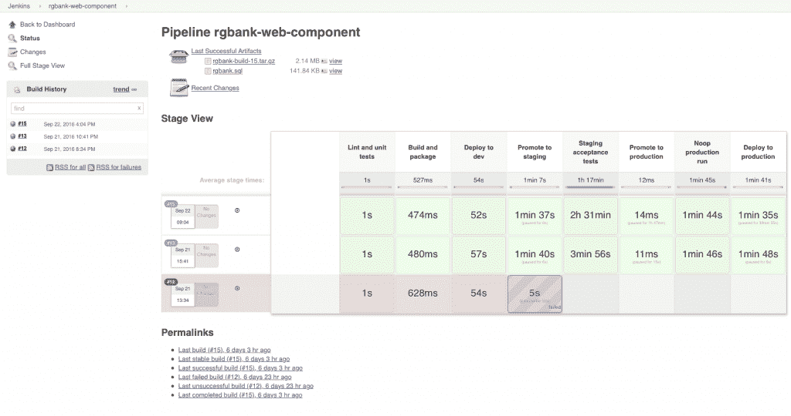

# Puppet 现在附带了 Docker 构建工具来自动化容器生产部署

> 原文：<https://thenewstack.io/puppet-now-comes-docker-build-tools/>

Puppet 希望将 Docker 构建过程合并到自己的 IT 自动化管理中。新版 Puppet Enterprise 旗舰平台 Puppet Enterprise 2016.4 包括构建 Docker 容器并自动将其运送到生产环境中的能力。

该软件的新版本在该公司的年度用户大会 PuppetConf 2016 上亮相。该软件还集成了 Jenkins 持续集成和部署工具以及新的编排功能。

Puppet 高级软件工程师加雷思·拉什格罗夫解释说:“Docker 很容易上手。他称 [Dockerfile](https://docs.docker.com/engine/reference/builder/) 为构建工具的“80%解决方案”,但表示复制粘贴是开发者使用它来重用图像的普遍方式之一。

“那么问题来了:当你有 500 个开发者和几百个服务时，那会是什么样子？三年后，你会不会得到一个非常分散、难以管理的东西？”他说。

Puppet Docker 映像构建[是为了提供一种一致的方式来构建和部署容器](https://puppet.com/blog/docker-image-build-orchestration-corrective-change-reporting-puppet-enterprise-2016-4)——它[反映了 Docker 构建计划的作用](https://forge.puppet.com/puppetlabs/image_build)，Rushgrove 说，但它专注于在更大的组织内扩展。你仍然以同样的方式构建，但是使用 Puppet 的新工具而不是 [docker build](https://docs.docker.com/engine/reference/commandline/build/) 命令。

Rushgrove 认为，木偶语言比 Dockerfile 更具组合性和可重用性。它允许开发人员创建可重用的模块，并与 Puppet 的测试工具一起插入到持续集成管道(CI/CD)中。

## 能见度

与以前的版本相比，Puppet Enterprise 2016.4 可以更深入地了解整个组织基础架构的变化原因。

“人们使用 Puppet 来[陈述]他们想要执行的安全和合规政策，如果有任何变化，让他们知道，”Puppet 产品营销副总裁 Tim Zonca 说。

“通常我们只是说，‘事情发生了变化，这不符合政策。我们会修好它的。现在我们会说，‘有些东西变了，但这是故意的。’有人通过木偶做到了这一点。你可以进去看看他们是怎么做的，这违反了政策。或者他们改变了木偶之外的东西。这可能是故意的或恶意的演员，但它是在木偶之外，我们修复了它。它有助于区分 Puppet 内部发生的事情，”Zonca 说。

这发挥了其增加的编排能力。由于缺乏可见性，传统的编排可能会导致冲突的配置或未记录的临时更改。现在，您可以在基础设施的特定部分编排分阶段的变更部署；根据存储在 Puppet 中的任何事实(如位置、环境和应用的配置资源)对基础架构和应用程序进行细分，并只对那些目标细分市场部署更改。

“您可以运行金丝雀部署。比如说，‘我想在这 10 个节点上运行它。“如果进展顺利，我希望能跨越 5000 个端点，”Zonca 说。

“你可以说，‘我想把它部署在我运行 Linux 的网络服务器上。寻找这个版本的 OpenSSL 和拥有它的节点，我需要更新这些变化。“它为您提供真正精细的控制，包括基于角色的控制—此人可以查看基础架构的这一部分—并针对基础架构中真正隔离的部分。”

根据 Zonca 的说法，Jenkins 的新版本允许用户将他们的基础设施定义为代码，尽管 Puppet Jenkins Pipeline 插件允许你以更自动化的方式将二者结合起来。

【T2

团队可以在 Jenkins 中构建连续的交付管道，由 Puppet Enterprise 协调管道中所有应用程序的部署任务。使用这个管道，Jenkins 用户可以建立 CI 管道，然后创建 Puppet 编排作业并将其推送到特定的应用程序或部分基础架构。现在所有这些都可以自动完成。

该公司还宣布了一个针对 VMware 的 [vRealize](http://www.vmware.com/products/vrealize-suite.html) 云管理平台的插件，该插件支持跨内部和多云环境的合规性基础架构的自助供应。

## **前路**

随着容器生产部署的增加，Puppet 和 Chef 等配置管理供应商面临着继续证明其相关性的挑战。随着红帽公司去年对 Ansible 的收购，他们正面临着 T2 日益增长的影响力。

最近一项 OpenStack 用户[调查](https://t.co/FO6WLdokyQ)注意到 Ansible 以及专注的编排工具如 [Kubernetes](/category/kubernetes/) 、Swarm 和 Mesos 的流行。

Zonca 说，去年秋天推出的 Puppet 自己的 [orchestrator](http://www.nextplatform.com/2015/10/05/puppet-takes-orchestration-up-the-stack-to-apps/) 扩展了其 PQL (Puppet Query Language)的使用，这是一种用于向 Puppet 提问的语法，可用于描述跨节点的服务，并可用作直接推动变化并观察其发生的语言。如果出现问题，您可以停止它，并在那里排除故障，然后继续推出。

Docker 集成技术是 Puppet 的 BlueShift 项目的成果，该项目于 4 月份启动，是“内部 Puppet 工程、我们的社区、技术公司及其社区之间的合作，提供了一种利用 Puppet 作为提供和管理新技术的通用语言的方式，”Zonca 此前告诉 New Stack。

[英特尔的乔纳森·唐纳森讨论 Kubernetes](https://thenewstack.simplecast.com/episodes/intels-jonathan-donaldson-discusses-kubernetes)

它之前为 Kubernetes 发布了一个[模块，使得编排环境可以用 Puppet 代码来管理；](https://thenewstack.io/puppet-labs-automates-kubernetes-accessibility-admins/)[用于管理 Docker 恶魔和容器的模块](https://forge.puppet.com/puppetlabs/docker_platform)；consult 的模块[，这是](https://forge.puppet.com/KyleAnderson/consul/readme) [Hashicorp](https://thenewstack.io/hashicorp-containers-should-be-managed-just-like-vms-so-where-does-that-leave-pets-and-cattle/) 的开源工具，用于发现网络上的服务，并且正在为 [Mesos](https://puppet.com/blog/using-puppet-mesos) 开发模块。

它正在研究如何将 Puppet 与 VMWare 的 Photon 和其他[容器即服务](https://thenewstack.io/emerging-containers-service-marketplace/)平台结合使用。

“很多工作只是表明我们的发展方向，”拉什格罗夫在谈到 BlueShift 时说。

红帽、[中间层](https://d2iq.com/)和[码头工人](https://www.mirantis.com/software/docker/kubernetes/)是新堆栈的赞助商。

特征图片:[面具与布偶](https://www.flickr.com/photos/indi/5153986128/in/photolist-dYXXBc-99v2tu-cHsrHW-oDgGr3-oDgGBU-daE953-5Ss1Tv-8nM4tU-pMhaTq-97xsDE-oVLntK-o7MYyN-8RrwvN-97xsRh-aYr1ve-oVuFPR-t7ega-t3Dej-97ukw6-oDgHw9-3CaRj-7avLdr-6tpFu2-eVkGgs-9SVcy-oVJxSm-6kMFQH-oVLoct-daE8jk-oVLnuM-4Rqm22-9uC6rW-qypCEw-qJcZVq-8cSmdh-7Zg5Ty-osUPpZ-xT84N-97xrz3-daEcUE-oTJvJE-qrHa6E-a6FmTp-7kWGi-4EjDK3-tabQr-a6FmQV-9C18JG-dY9mTH-8NimrD)，由 [Indi Samarajiva](https://www.flickr.com/photos/indi/) ，授权于**CC BY-SA 2.0**。

<svg xmlns:xlink="http://www.w3.org/1999/xlink" viewBox="0 0 68 31" version="1.1"><title>Group</title> <desc>Created with Sketch.</desc></svg>