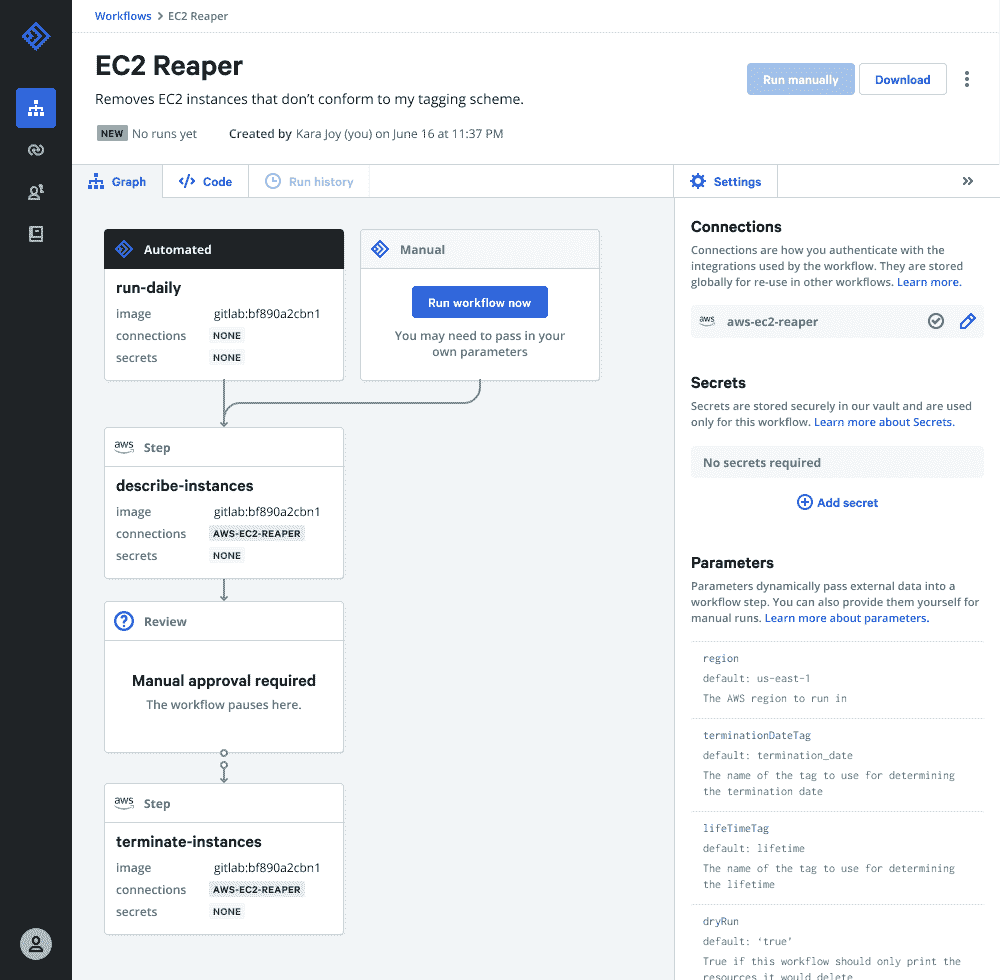

# Puppet Relay 为 DevOps 工作流提供事件驱动的自动化

> 原文：<https://thenewstack.io/puppet-relay-offers-event-driven-automation-for-devops-workflows/>

IT 自动化软件提供商 [Puppet](https://puppet.com/) 发布了其事件驱动的自动化平台 [Relay](https://relay.sh/) ，该软件用于管理任务驱动和模型驱动的自动化。Relay 附带了许多[预写的工作流](https://relay.sh/workflows/)以及与云平台、工具和 API 的连接，包括 PagerDuty、GitHub、Datadog、吉拉、Terraform 和 Slack。

“几乎系统的每个主要功能方面都是可插拔的，无论是我们自己还是社区。所有的规范和 API 都是公开的，工作流的每一步都是任何人，包括我们自己，或者包括用户社区，都可以自己构建的，”Puppet 首席技术官 Deepak Giridharagopal 说。

中继工作流引擎主要是用 Go 编写的，它利用其他几个开源项目来实现自己的目标。首先， [Ambassador](https://github.com/datawire/ambassador) ，开源的 Kubernetes-基于特使代理的微服务的本地 API 网关，处理事件数据的进入。Giridharagopal 说，这“就像一个服务网，但没有所有的复杂性”。 [Tekton](https://tekton.dev/) ，创建 CI/CD 系统的开源框架，提供了处理工作流的基本框架。最后， [Knative](https://knative.dev/) ，基于 Kubernetes 的平台，用于部署和管理现代无服务器工作负载，运行工作流程步骤，所有这些都被容器化并可在 GitHub 上获得，Puppet 增长副总裁 Alex Bilmes 解释道。

比尔梅斯说:“我们喜欢把接力描述为 IFTTT 或 Zapier，但这是针对 DevOps 的。“它基本上是通过侦听所有类型的外部事件来工作的，无论是 Splunk 容量警报触发、GitHub 拉请求被合并，还是新的 ECM 实例上线。从那里，我们可以触发一个工作流，该工作流有许多不同的步骤，客户可以按照他们想要的任何顺序来安排。一个步骤可以是供应一个环境，或者取消供应一个[Amazon Web Services 的] s3 存储桶。"

比尔梅斯解释说，用户可以直接在 YAML 或通过使用可视化界面编辑工作流，该公司提供了许多潜在的使用案例，例如删除不同提供商之间未充分利用的云资源，提供事件响应，实施安全控制，甚至自动供应云基础设施和部署最新版本的软件。

“有这么多新的构建模块，这么多新的 API，很难跟上。就我们如何建造东西而言，比以往任何时候都有更多的选择。这种选择的尴尬是好的，因为它给了你很多如何构建东西的选择，但我确实认为人们有很大的机会来构建工具，这些工具不一定通过消除选择来简化，而是通过帮助你拥抱所有的复杂性来帮助你简化和理解事物，”Giridharagopal 说。“这往往是我们试图在接力赛中遵循的管理原则之一。我并不幻想人们会在有很多选择的情况下，缩小自己的书库规模，或者把它们整合成更少的东西，但我仍然深深同情他们简化的愿望。”

感兴趣的用户可以[报名](http://puppet.com/relay-sh)参加今天开始的接力公测。

[https://www.youtube.com/embed/0jXF1qLFMC8?feature=oembed](https://www.youtube.com/embed/0jXF1qLFMC8?feature=oembed)

视频

亚马逊网络服务是新堆栈的赞助商。

目前，新堆栈不允许直接在该网站上发表评论。我们邀请所有希望讨论某个故事的读者通过 [Twitter](https://twitter.com/thenewstack) 或[脸书](https://www.facebook.com/thenewstack/)访问我们。我们也欢迎您通过电子邮件发送新闻提示和反馈: [feedback@thenewstack.io](mailto:feedback@thenewstack.io) 。

<svg xmlns:xlink="http://www.w3.org/1999/xlink" viewBox="0 0 68 31" version="1.1"><title>Group</title> <desc>Created with Sketch.</desc></svg>