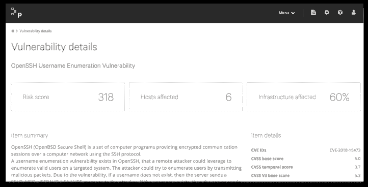

# Puppet 通过 Puppet 修复将其自动化重点转向安全性

> 原文：<https://thenewstack.io/puppet-turns-its-automation-focus-to-security-with-puppet-remediate/>

[傀儡](https://puppet.com/)发布了[傀儡补救](https://puppet.com/products#secure)，这是一款新产品，将该公司的基础设施自动化软件扩展到安全领域，为其用户提供自动化的安全漏洞补救。虽然一些安全工具可以提供漏洞所在位置的信息，但 Puppet Remediate 可以获取这些信息，并对软件和基础架构进行必要的更改以消除漏洞。Puppet Remediate 与三家领先的安全供应商 Tenable、Qualys 和 Rapid7 合作，接收漏洞信息，提供漏洞优先级评估，然后提供补救措施。

Puppet 产品副总裁 [Matt Waxman](https://www.linkedin.com/in/matt-waxman-9a2411) 在接受 New Stack 采访时表示，安全漏洞修复的状况令人担忧，Puppet 为基础设施带来自动化的时机已经成熟。

“长期以来，Puppet 在很大程度上帮助自动化了许多运营团队每天都要面对的单调、容易出错、令人崩溃的工作。几十年来，漏洞管理的方式一直是许多类似类型的非常容易出错的手动工作来修复漏洞，”Waxman 说。“我们所看到的有点令人难以置信，但最先进的是电子表格。实际上，安全团队定期进行基于 CVE 的扫描，他们将扫描结果归档、创建电子表格，并执行非常非常面向手动的操作，然后移交给运营团队采取补救措施。”

在一份声明中，Puppet 引用了 pone mon Institute 2018 年的一份报告，该报告发现组织每周在漏洞响应上花费约 320 个小时。该公司表示，有了 Puppet Remediate，这一时间可以通过自动化大幅缩短。该产品是使用其开源 [Bolt](https://puppet.com/products/bolt) 编排工具构建的，该工具通过 SSH 或 WinRM 直接连接到远程节点，以便修复漏洞。韦克斯曼强调，补救意味着采取行动，而不仅仅是发出警报。

“当我们谈到补救时，我们实际上是指在给定的操作系统上更新软件包或执行命令，或者关闭防火墙上的端口。我们不只是开一张罚单，”韦克斯曼说。“我们实际上是在利用 Puppet 的自动化能力和广阔的生态系统，我们必须去执行那个行动。运营团队可以了解哪些问题已经得到补救，并可以与他们的安全团队进行交流，因为这是一项持续的工作。这不会只发生一次。”

也就是说，补救不是自动的，尽管这个过程是自动的。仪表板显示漏洞及其优先级，例如，由于 Puppet 与基础架构直接相连，它可以知道某个漏洞可能会对您的特定情况产生多广泛的影响，将其排在仅影响一小部分基础架构的另一个漏洞之前。

Puppet Remediate 目前附带四个预构建的补救任务，它表示这些任务将处理 80%以上的典型补救工作负载。然而，该产品是可扩展的，Puppet Forge 充当了一种市场，供 Puppet 用户共享自动化任务，如 Bolt 任务。

Waxman 还强调，Puppet 可以与几乎任何环境一起工作，无论是容器化、虚拟化还是其他环境，重点是能够处理现代架构通常的混合和多云特性。

“在某些情况下，客户会将现有的虚拟机放在容器中运行。它们都容易受到相同类型的漏洞的影响。Puppet Remediate 支持基于容器的操作系统以及任何其他操作系统，”Waxman 说。“我们对原生云的看法是，它是现有的许多架构模式之一，大多数客户寻求的是管理混合环境或多云环境的能力。我们解决问题的方式基本上是通过交付一组混合的用例。”

Puppet 是新堆栈的赞助商。

来自 Pixabay 的 falco 特写图片。

<svg xmlns:xlink="http://www.w3.org/1999/xlink" viewBox="0 0 68 31" version="1.1"><title>Group</title> <desc>Created with Sketch.</desc></svg>