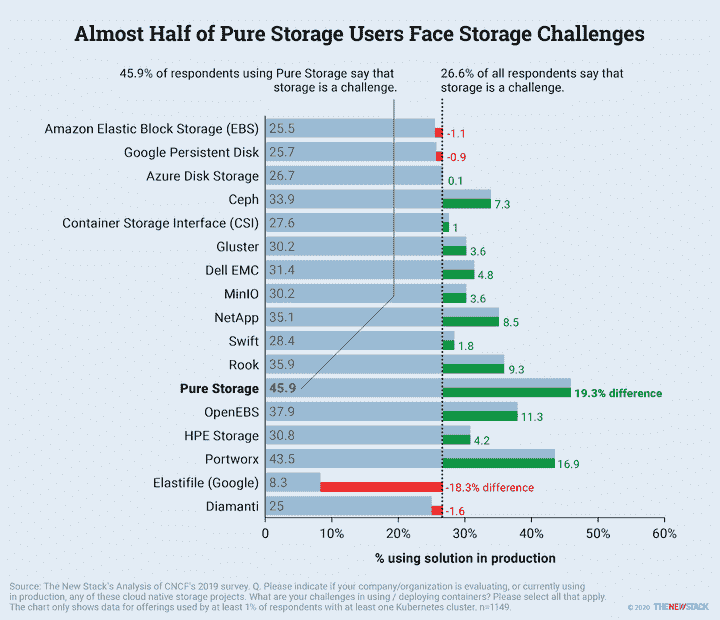

# 纯粹是为了购买 Portworx 以增强云原生存储的实力

> 原文：<https://thenewstack.io/pure-to-purchase-portworx-for-prowess-in-cloud-native-storage/>

存储软件和服务提供商 [Pure Storage](https://www.purestorage.com/) 正在收购 [Portworx](https://portworx.com/) ，这是一家成立五年的公司，旨在成为云原生存储软件提供商。Pure 将支付约 3.7 亿美元收购以 Kubernetes 为主的 Portworx。

Portworx 团队将作为一个新的业务部门加入 Pure，致力于使客户能够运行云原生数据服务。Pure 将继续销售 Portworx 平台，作为一个独立的实体，将其引入自己的全球销售渠道。Pure 将提供额外投资，在额外的存储基础设施和云服务上运行 Portworx 产品。

Portworx 产品组合提供了在使用任何 Kubernetes 平台的任何云中运行数据服务的工具，并提供了全面的企业存储功能，包括内置的高可用性、数据保护和数据安全。Portworx 软件将与纯硬件阵列(如 FlashArray、FlashBlade)以及纯“即服务”和其他基于云的服务配合使用。它还将被集成到 [Pure Service Orchestrator](https://www.purestorage.com/solutions/infrastructure/containers.html) 软件中，该软件允许组织提供容器存储即服务。

## 了解云原生技术

此次收购对 Pure 来说也是一笔不错的交易，Pure 在将存储技术应用到云计算领域方面一直落后。根据 451 Research 的数据，2020 年，95%的新应用程序都是在容器中开发的。Gartner 估计，到 2025 年，85%的全球企业将在生产中使用集装箱。根据 Gartner 的数据，跨多个云(“多云”)运行运营也成为企业面临的一个紧迫问题，81%的企业现在使用两个或更多的云提供商。

TNS 分析师 Lawrence Hecht 指出了 Pure Storage 在应对新兴云本地市场方面面临的挑战。

在一篇博客文章中，Portworx 的联合创始人兼首席架构师 Vinod Jayaraman 写道，容器会在三个方面给为虚拟机构建的系统带来压力:

*   *传统存储系统是管理员驱动的，而容器是自动化和应用驱动的。存储系统本身必须能够感知应用程序，以便提供最佳的资源调配、计划和操作，例如应用程序一致的快照。*
*   *容器是高度动态的——它们快速启动和关闭，并且不依赖于任何主机——这是为相对静态的环境构建的现有存储协议所不支持的。*
*   *容器使应用程序密度至少提高了 10 倍，这需要以完全不同的规模支持快照等存储操作。*

大约五年前，“开发人员开始意识到机器不是宇宙的中心，而是他们的应用程序才是最重要的。他们需要以应用为中心，而不是以机器为中心。讽刺的是，容器让他们打破了这种思维模式。这定义了从以机器为中心的控制平面到以应用为中心的控制平面的转变，”Portworx 首席执行官 [Murli Thirumale](https://www.linkedin.com/in/murlithirumale/) 在[的另一篇博客文章](https://portworx.com/portworx-joins-pure/)中写道。收购完成后，Thirumale 将成为 Pure Storage 的副总裁兼该公司云原生业务部门的总经理。

Portworx 基于订阅的存储平台软件被奥迪、康卡斯特、ESRI、通用电气数字、克罗格、汉莎航空、加拿大皇家银行和 T-Mobile 等公司使用。GigaOm 将这项技术命名为 Kubernetes 数据存储的领导者。

Portworx 是新堆栈的赞助商。

<svg xmlns:xlink="http://www.w3.org/1999/xlink" viewBox="0 0 68 31" version="1.1"><title>Group</title> <desc>Created with Sketch.</desc></svg>