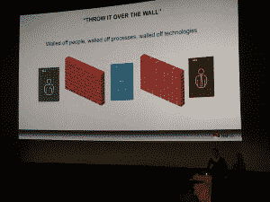
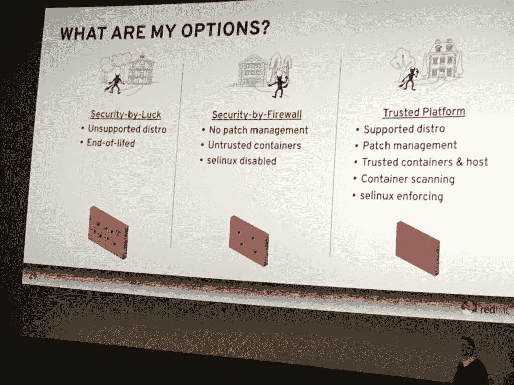

# 英国集装箱营地:持续安全的一些最佳实践

> 原文：<https://thenewstack.io/pursuing-continuous-security-containers-devops/>

虽然容器为企业迁移到 DevOps 风格的软件开发工作流提供了基础，但企业仍然对新兴技术的安全隐患保持警惕。今年九月，在英国的[集装箱营地， Red Hat 首席技术专家](https://container.camp/uk/2016/) [Chris Van Tuin](https://www.linkedin.com/in/chrisvantuin) 提供了一些在持续开发和集成的同时维护持续安全的技巧。

根据今年 6 月发布的 ClusterHQ [容器使用状态](https://clusterhq.com/assets/pdfs/state-of-container-usage-june-2016.pdf)调查，容器采用的最大驱动因素是开发人员效率的提高(39%的受访者)和容器如何支持微服务(36%)。

在过去的两年里，大多数公司至少已经在考虑使用某种容器技术来利用这些好处。但是，直到最近，有一种东西一直阻碍着企业在生产环境中采用容器:安全性。

对于大多数企业来说，安全是重中之重。但是，去年有 61%的人认为集装箱的安全性是他们的主要不确定性，而今年只有 11%的人重复了这一担忧。那么是什么引发了 [DevOps 转向容器](https://thenewstack.io/ci-cd-devops-and-containers-a-winning-trio/)的戏剧性转变呢？在决定采用哪种技术时，安全性还重要吗？

## 为什么要冒险？

在最近的一项调查中，TechValidate 和 Red Hat 发现企业仍然担心的六个主要安全风险，Van Tuin 谈到了这六个风险:

*   员工没有采取适当的安全措施(36%)
*   外部安全漏洞的威胁(32%)
*   容器可以是未修补的或不可修补的(14%)
*   受到员工内部攻击的威胁(11%)
*   影子 IT 或秘密 IT，在未经批准的情况下在组织内构建和使用(4%)
*   自带设备，带自己的设备上班(3%)

这些安全风险如何适应容器？当然，它们都像容器一样涉及人的因素，但是 Van Tuin 概述了五个与容器相关的主要安全风险:

*   内核漏洞:Docker 构建于 Linux 内核提供的容器技术之上，与 VM 不同，该内核在所有容器及其主机之间共享
*   拒绝服务(DoS)攻击，使用户无法使用机器或网络
*   容器突破，这通常发生在人们在容器内使用 root 权限运行不受信任的应用程序时
*   中毒图片:你需要知道是谁创建了这些图片，而范图恩说 64%的官方图片都有安全漏洞
*   泄露的秘密

信息安全专家 [Lenny Zeltser](https://zeltser.com/) 在他最近的一篇关于安全补丁漏洞管理需求的文章中呼应了[中毒图片的威胁](https://zeltser.com/security-risks-and-benefits-of-docker-application/)。他写道，传统上，安全补丁是如何独立于应用程序安装到系统中的。由于容器通过依赖关系紧密地集成了应用程序，因此容器的映像作为应用程序部署过程的一部分被修补。

当您可以运行应用程序的多个实例时，他称之为“容器蔓延”，这对 DevOps 来说很好，但它间接导致 Docker 映像存在于不同的安全补丁级别。

虚拟机的通常防御计划是运行漏洞扫描器，但这在容器方法中不起作用。

“对容器友好的方法需要什么还不清楚。然而，它承诺的优势是需要更少的更新，使开发和运营更加紧密，并定义了一组需要修补或锁定的清晰的软件组件，”Zeltser 写道。

最近在 ops、infosec、QA 和安全审计领域更快地采用容器的好处是，这意味着最终有更多的人参与容器，这意味着更多的人参与识别和填补这些安全漏洞。

## 克服潜在的安全风险

虽然这些安全风险适用于所有的容器提供商，但毫无疑问，这个生态系统被一个玩家所主导，Docker 占了 90%。

但是，正如 [Adrian Mouat](https://thenewstack.io/author/adrian_mouat/) 在[他的关于主题](https://www.oreilly.com/ideas/five-security-concerns-when-using-docker)的 O'Reilly 报告中所写的那样，“虽然你肯定需要意识到与安全使用容器相关的问题，但是如果使用得当，容器可以提供比单独使用虚拟机(VM)或裸机更安全和高效的系统。”

类似地，虽然 Zeltser 已经写了很多关于 Docker 和其他容器的潜在安全风险，但他认为我们已经提到的操作优势和其他安全优势可以超过这些风险。

重要的是了解 Docker 的潜在安全风险，我们能够学习克服它的工具和技术。

容器使得隔离传统上直接在同一主机上运行的应用程序变得更加容易。例如，在一个容器中运行的应用程序只能访问由另一个容器显式公开的端口和文件。

Zeltser 说:“容器鼓励将应用程序环境视为短暂的、相当静态的系统，这些系统存在多年，积累了导致风险的工件。

因此，容器使得控制安装什么样的数据和软件组件变得更加容易。这种灵活性和更新的快速发布以及代码拼图的独立部分意味着在应用程序更新的同时允许更频繁的安全补丁。

在他的演讲中，Van Tuin 添加了一些具体的方法来克服 Docker 带来的一些典型的安全风险。

首先，由于人类通常是任何事情的最大安全风险，你可以从要求最小密码长度的公司开始，或者强制执行个人身份密钥之类的系统，比如去年在 Dockercon EU 上发布的 YubiKeys。

Van Tuin 建议的克服这种安全风险的另一个主要方法是通过一系列工具，如 [**OpenSCAP**](http://open-scap.org) 来评估、测量和执行安全基线。无论你使用什么类型的软件，自动扫描安全漏洞是很重要的。OpenSCAP 还提供了一组工具和守护程序，您可以在 Docker 级别和映像级别针对您的主机运行这些工具和守护程序。

他还说, [Kubernetes](/category/kubernetes/) 开源容器编排工具已经通过安全扫描实现了自动化构建。

您可以让容器共享相同的硬件和内核，但您可以知道哪些容器是坏的，这就是您需要确保您有正确的流程和技术来尽快隔离的地方。

Van Tuin 提到的一个非常有趣的问题是，他问观众中有多少人禁用了用于支持访问控制安全策略的 [**SELinux(安全增强的 Linux)**](https://en.wikipedia.org/wiki/Security-Enhanced_Linux) 机制。绝大多数人都这么做了，这并不明智。

“在容器世界中，您必须在系统上启用 SELinux。你需要有一个额外的安全级别，这样进程只能与它被设计用来通信的对象进行通信。”

Van Tuin 继续将可爱的扩展运输比喻应用于如何从一开始就保证集装箱的安全。

“从运输的角度来看，你不是在码头包装集装箱，而是在工厂包装以防万一。Kubernetes 提供了自动测试的能力，以便在规模扩大时进行测试。”

这种想法是，不要在生产环境中修补这些容器，而是重新构建一个新版本，通常是自动的。然后，一旦通过，就进入测试阶段，然后自动部署。

“你可以映射新版本并删除旧的坏版本，”范图恩继续说道。“如果 1.2 版出现问题，我可以根据需要自动回滚到 1.1 版。”

除此之外，RedHat CTO 还提供了一些最终的容器安全最佳实践:

*   仅运行来自可信方的图像。
*   容器应用程序应该放弃特权。
*   主机操作系统很重要。
*   应用这些内核安全补丁，并有一个工具过程来自动监控它。
*   不要禁用 SELinux！
*   检查容器图像的安全缺陷。
*   努力实现自动化构建和自动化部署。
*   将安全扫描纳入您的 CI/CD 渠道。

TNS 分析师 [Lawrence Hecht](https://thenewstack.io/author/lawrence-hecht/) 为本文做出了贡献。

<svg xmlns:xlink="http://www.w3.org/1999/xlink" viewBox="0 0 68 31" version="1.1"><title>Group</title> <desc>Created with Sketch.</desc></svg>