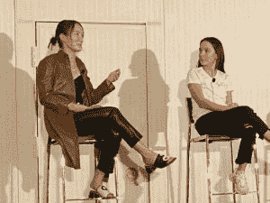
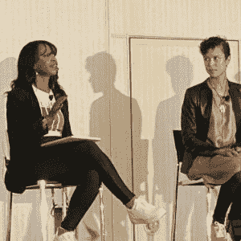
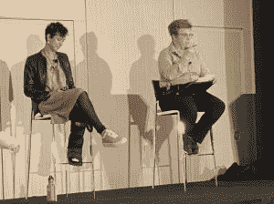

# 推回去:技术领域的女性如何克服冒名顶替综合症

> 原文：<https://thenewstack.io/pushing-back-how-women-in-tech-overcome-imposter-syndrome/>

更正:本文的前一版本暗示该面板将在 YouTube 上提供。没有计划在该频道上发布该事件的视频。

在 [KubeCon+CloudNativeCon 北美](https://www.cncf.io/kubecon-cloudnativecon-events/?utm_content=inline-mention) 有一个很棒的关于科技行业女性和非女性人士的专题小组。但就像历史书上那些假装用几页纸涵盖黑人或女性历史的轶事章节一样，这个小组被放到了太平洋时间第三天的最后。作为现场直播活动，它甚至没有与其他 229 场会议演示一起发布在 YouTube 上。

小组成员讨论了女性和非出生人口的冒名顶替综合症——如果它真的存在的话——以及如何在科技领域开拓影响力。他们变得真实、原始和足智多谋，在这里我们与你分享他们的见解和经验。

由 Chronosphere 赞助的 EmpowerUs 小组展示了我们的新同事[科琳·科尔](https://twitter.com/colleencoll)和[希瑟·乔斯林](https://twitter.com/ha_joslyn)，以及 Chronosphere 的[艾琳娜·巴斯蒂安](https://www.linkedin.com/in/elenorebastian/)，谷歌的[索菲亚·瓦加斯](https://twitter.com/Sophia_IV)和艾瑞泽·艾的[郑秀晶·柯克兰](https://www.linkedin.com/in/krystal-kirkland/)。

## 超越冒名顶替综合症

云原生技术是如此之新，以至于几乎没有人能够成为专家。然而，我们大多数人都生活在一种近乎持续的状态中，怀疑自己是否属于这个世界。

大约一年前，当 Bastian 加入可观测性提供商 Chronosphere 时，她的背景是构建 web 应用程序，她说她对数据和可观测性一无所知。她想知道如何才能对她管理的团队施加影响——成功是什么样的？什么叫现实？

她意识到，“超时空领域有很多这方面的专家，我不需要成为专家就能成为一名成功的管理者。”相反，Bastian 将她的可观察性提升委托给了她的团队，意识到“我可以专注于我热爱的事情，即人、文化和流程，并建立一个包容、有趣、工作与生活平衡的企业。这是我擅长的，也是我擅长的。”

郑秀晶·柯克兰(左)和埃莉诺·巴斯蒂安

当然，技术让我们经常被技术专家包围，所以我们必须愿意寻求帮助，但我们也必须停止贬低自己的知识，只是因为我们所在的大多数房间都是白人。科尔说:“有这种影响力是因为大多数时候，他们想从你身上学到一些东西。”

当 Vargas 开始她在 Forrester 的前一份工作时，她的年龄是她咨询的大多数人的一半。但她刚刚花了两年时间研究数据中心市场，因此，为了证明她在谈判桌上的地位，她的策略是经常向客户提供大量信息，直到她发现他们可以学习的东西。

“一旦他们发现你知道一些他们不知道的事情，平衡就会改变。它变成了一个对话。他们开始听你的。你开始谈论它，而不是仅仅试图引起他们的注意。”巴尔加斯继续说，你必须通过工作变得对自己的知识感到舒适，才能成为你正在谈论的事情的专家。

不要忘记，技术通常需要新的视角。Bastian 提醒稀疏的 KubeCon 观众，作为一个自我认同为技术绿色的人，你经常可以提出许多所谓的专家和更高级的人忘记的事情。

## 抵制强加综合症

但也许冒名顶替综合症不是真的？柯克兰认为，如果我们都经历了冒名顶替综合症，我们不可能都是冒名顶替者:

“我觉得冒名顶替综合征就像是你肩上的多重负担，‘你看上去不像那部分人。’你太年轻了。\ ' \ '你的性别不符合。我经常觉得我迷失在其中，我看不到我的知识和专业技能，我不得不回到我和我的知识中。"

也许它应该被称为强加综合症。当 New Stack 为另一篇文章采访开发者倡导者 Nikema Prophet 时，她谈到了冒名顶替综合症是如何作为自我价值的一部分强加给别人的:

“我认为，在科技领域处于少数的人群中说出冒名顶替综合征是对我被视为异类的真实回应。这是把责任推到被边缘化的人身上，而不是看他们所处的环境。一切都在对外向我表明，你不希望我在这里。”

所以下次你质疑你的位置时，检查一下自己——这是来自内部的有效位置还是来自外部的影响？

## 击退无意识和有意识的偏见

对于女性，尤其是有色人种女性来说，这是一场与职场中的煤气灯、微侵犯和更糟糕的事情的持久战。一位观众询问如何让一位不断要求她给他点午餐的男同事闭嘴——她的角色不是助理或任何类似的任务。Kirkland 和 Vargas 说，要推后询问你在实际工作中应该优先考虑什么，以便为他的午餐订单腾出时间。或者给他一张当地披萨店的传单。

科琳·科尔(左)和索菲亚·巴尔加斯

科尔甚至不得不解决偏见问题，她只需在 KubeCon 工作旅行时入住酒店。一些白人上下打量她，给了她一个不请自来的炸鸡推荐。

“我是科技界的一名黑人女性，黑人女性最不受尊重，也最不得不放弃。总的来说，女性在工作场所最不受尊重，”她说。

但 Coll 不再管理任何人的特权或脆弱性。首先要认识到别人对你的感觉和你对自己的感觉之间的差异。然后了解你的公司对你的感觉。

她说你必须反击——为了你自己，也为了你的组织:

“如果你变成了你自己，但你却反其道而行之，公司怎么会兴旺发达呢？当有人说了不好的话，而且是无意识的偏见，你会反击吗？你愿意冒这个险吗？你会生气吗？你准备好白色航班了吗？或者，你是否希望，从他们的角度来看，他们希望留在原地，为了公司和你，他们想要那个机会，因为你是他们的同事，他们会支持你。”

是的，你可能会被视为一个麻烦制造者，但是，由于巨大的技术人才缺口，我们经常处于一个特权地位，在那里我们可以很容易地找到另一个技术角色。但这也是利用这种特权为他人说话，当你看到有人处于不舒服或更糟糕的情况时，进行干预并大声说出来。

> “我有太多的事情要做，我再也无法管理白人的脆弱和白人的特权了。”

科琳学院

“himterupting”——通常是白人男性同事 Y 谈论通常是女性或非白人同事 X——是行动中常见的无意识偏见。不要害怕说出“X，你刚才说什么？”或者“正如 X 所说……”或者“不好意思，我对 X 说的话更感兴趣。”

在任何情况下，帮助或干预都是有力量的。

## 从对手变成盟友

Joslyn 以引用[只有 9%的开发人员是女性](https://insights.stackoverflow.com/survey/2021)和其他性别少数群体来开始主持小组会议。这不仅是可耻的，而且也是危险的——因为如果我们负责建设未来，那么未来在本质上就是破碎的。

Vargas 说，为了让组织在日常工作中避免偏见，他们首先必须承认这些偏见。然后“让尽可能多的人回顾事情，因为你可能看不到——获得反馈总是值得的。”

作为一名研究分析师，Vargas 说数据可以是一个很好的媒介。在她目前在谷歌的职位上，他们对员工进行了匿名调查，询问各种术语:这种语言让你感觉更不舒服还是更不舒服？这创造了一种安全的方式，任何人都可以说出来，然后数据被汇总，这样员工就觉得他们并不孤单，从而证实“不仅仅是我”某些语言存在问题。

索菲亚·巴尔加斯(左)和希瑟·乔斯林

组织需要理解一个房间里只有一个人是多么令人沮丧和沮丧。正如柯克兰所指出的，“在 STEM 和生活中，女性经常互相争斗。尤其是在这些小众领域，感觉只有一个象征性女性的位置。所以，如果你和其他女人在一起，那么你(感觉自己)必须为之奋斗。”

她继续说，团队和组织有责任创造一个不像是为某个位置而战的环境。自上而下以及两者之间，组织必须表明他们“对女性和不同的想法和思想开放。”在 Arize，这体现在围绕更加多样化的招聘工作的目标，以及为女性和性别少数群体员工创造一个安全的空间。

巴尔加斯说，女性需要养成互相鼓励的习惯——无论是一对一的鼓励，还是在会议上大声称赞，宣传他人的工作。这可以是在博客帖子或研究论文中恰当地引用某人的话，或者在较小的场合或会议中，可以是在提出他们的想法之前，指名道姓地说出他们的想法。帮助人们被看见是很重要的。

“你总会遇到其他需要支持和关系网的人，”巴尔加斯说，并指出，不管你有多“环保”，你都有东西可以回报。

T2 有很多不同种类的导师，甚至不一定是官方的。尤其是当你在进入科技行业之前，常常不得不克服如此多的繁文缛节和内部知识。柯克兰说:“我觉得现在我有责任帮助年轻女孩找到前进的道路，找到她们进入科技行业的途径。”

不要忘记，你不仅有权得到你的团队或公司的尊重，也有权得到你的顾客和客户的尊重。正如柯克兰指出的那样，当少数族裔同事受到无意识或直接有意识偏见的伤害时，那些处于特权地位的人应该挺身而出。无论环境如何，一个盟友都必须承受打击并做出努力。

<svg xmlns:xlink="http://www.w3.org/1999/xlink" viewBox="0 0 68 31" version="1.1"><title>Group</title> <desc>Created with Sketch.</desc></svg>