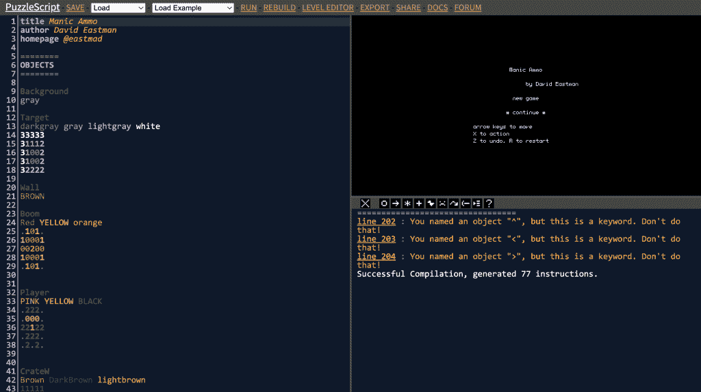
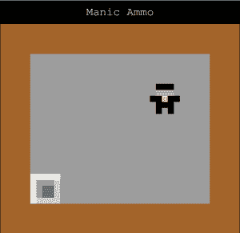

# Puzzle script:html 5 益智游戏引擎开发指南

> 原文：<https://thenewstack.io/puzzlescript-a-devs-guide-to-an-html5-puzzle-game-engine/>

企业软件通常属于四种应用类型之一:发布、搜索、实现和对话。幸运的是，网络擅长做所有这些事情。管理您希望维护的服务或平台或您的组织内部也需要同样的四个元素。这篇文章是关于一个特殊的例子，一个“开源 HTML5 益智游戏引擎”，我们可以很容易地探索，然后从中提取这些原则。同时，学习如何制作很酷的小益智游戏。

“Increpare”(更广为人知的名字是[斯蒂芬·拉维尔](https://en.wikipedia.org/wiki/Increpare_Games))不久前写了[谜题剧本](https://www.puzzlescript.net/)。它描述了一个脚本和一个专门研究推箱子式瓷砖游戏的游戏规则的平台。推箱子？你知道，在这个游戏中，你只能用[推箱子。这套原创的谜题实际上相当令人沮丧，但却是对你计划和执行技巧的一次很好的检验。从 Puzzlescript](https://www.mathsisfun.com/games/sokoban.html) [图库](https://www.puzzlescript.net/Gallery/index.html)可以看到，这些小游戏有很多有趣的变种。

## 定义游戏规则、关卡和区块

让我们从一个创作者的角度来看看 Puzzlescript 平台；也就是一个潜在的出版商。所有游戏都被分成**个关卡**，玩家角色通过箭头键，或“W”、“A”、“S”和“Z”移动。任何关卡都是由(画得很差的)方块组成的，这些方块的排列方式会逐渐阻止你到达**获胜状态**。完成一个级别会让你进入下一个级别。当然，快速吸收这一切的最好方法就是玩任何游戏。最初的箱子里只有墙壁、板条箱和带点的地板。

所以你的工作是定义你的游戏规则，设计游戏关卡，并绘制方块。

要编写自己的**游戏规则**，可以使用 [Puzzlescript 脚本](https://www.puzzlescript.net/Documentation/rules101.html)。因此，举例来说，下面的规则认为，如果一个球员走向一个板条箱，板条箱本身应该在同一方向移动:

```

[>  Player  |  Crate]  ->  [>  Player  |  >  Crate]

```

这代表了推箱子中的标准推送交互。读作“将左手边的图案(玩家移动到有固定板条箱的方格中)替换为右手边的图案(玩家移动到方格中，板条箱移动到下一个方格中)”。所以它实际上是一个**翻译**。你需要考虑游戏引擎如何检查所有即将发生的活动，解释每个翻译，然后重新绘制游戏。如果你是一个普通的益智游戏玩家，你会从现代热门游戏《巴巴就是你》中熟悉这一点。

让我们来看看一个叫做[疯狂弹药](https://www.puzzlescript.net/play.html?p=7057244)的特定谜题脚本游戏的代码(作者告诉我他对此没意见)。这似乎是一个关于某人被困在弹药库的荒诞故事。现在点击底部的“黑客”链接，你可以看到屏幕被分成三个窗口。



右上方的窗口允许你运行当前编译的游戏。所以如果你点击它并按下空格键，游戏就会在窗口中运行。但是我们感兴趣的是左边的源代码窗口。您可以看到标题“objects ”,事实上似乎有一个很长的格式化数据列表。你会很快发现这些是游戏的 5×5 方块的视觉表现，用数字代码表示它们的基本颜色。例如，“玩家”是由黑色和粉红色的头，黄色的肚子。多好的小家伙啊。


清单的其余部分被清楚地分成了标题部分，包括“规则”。在那里你会看到一些熟悉的谜题脚本:

```

=====
RULES 
===== 

[Bang]  ->  [background]
[boom]  ->  restart
[>  player][Droid]  ->  [>  player][>  Droid]
[>  Player  |  Shell]  ->  [>  Player  |  >  Shell]  
[>  Droid  |  Shell]  ->  [>  Droid  |  >  Shell]

```

所以你可以看到，在我们最初的例子中，玩家可以像推板条箱一样推贝壳。

所有这些快速访问的目的是让潜在的创作者能够通过摆弄现有的游戏来开始他们的旅程。例如，您可以通过在规则下添加以下代码行来愉快地使游戏不可玩。重建游戏从头开始试:

```

[>  Player  |  target]  ->  [target  |  >  Player]

```

在运行它之前，你能看到它做了什么吗？“Winconditions”是完成一个级别需要满足的唯一规则。这就是上面的黑客如此具有破坏性的原因。

```

==============
WINCONDITIONS
==============

All Player on Target

```

这种直接参与应用程序的有趣方法非常有效。相比之下，仅仅将一些应用程序代码上传到 GitHub 并要求人们克隆它并在本地运行它实际上是对网络的糟糕使用。允许低摩擦的参与方式(比如添加一行代码，在同一页上查看发生的事情)有助于将实验者转变为创造者。



## Puzzlescript 平台

使用 puzzlescript 编写小游戏肯定和任何代码 dojo 一样是对开发和设计技能的良好测试。然而，这篇文章是关于整个平台的。

当你在公司内部开发和支持一个应用程序或工具时，你需要从一个**实践社区的角度来考虑。**一个工具或应用只有在拥有忠实用户的情况下才会蓬勃发展，而用户自己必须成为拥护者。这意味着你需要经营一个论坛，至少引导它。尽管 Puzzlescript 已经过时了，你还是可以在论坛上看到当前[月](https://groups.google.com/g/puzzlescript)的条目。斯蒂芬更新了平台，希望不会破坏旧游戏。自从我上次使用它以来，已经有了很多新的功能。

这个平台是如何进行搜索和履行的？画廊页面可以通过谜题名称或作者进行搜索，也许一些标签元数据不会出错。因为每个游戏都可以表示为一个链接，所以其他网站可以按照自己的意愿管理游戏。有一个单一的网址来编辑或播放是非常有效的。这个网站按照游戏的大小和挑战性来分类。事实上，当前的游戏列表似乎保存在一个 [json 文件](https://www.puzzlescript.net/games_dat.js)中，因此导出您自己的索引是微不足道的。游戏也托管在 itch.io 上。

但是让我们来欣赏一下这个平台是如何模拟所有这些企业目标的。首先，它可以帮助您发现 Puzzlescript 是什么，基本的推箱子难题是什么，并介绍定义规则可以实现什么。然后，它允许用户创建自己的难题，它还存档现有的难题。还有一个允许玩家交换提示和建议的论坛——也是作者正式交流的地方。

因此，该平台以一种相当直接的方式涵盖了内容创作者、设计者、黑客、玩家、维护者和管理者。你能说支持你的工具、应用或服务的其他平台以如此高效的方式提供了所有方面吗？

当然，网站本身在 Github 上，因为它是开源的。因此，为什么不设计一个漂亮的小益智游戏，同时欣赏一个良好的全栈平台如何在野外工作。

<svg xmlns:xlink="http://www.w3.org/1999/xlink" viewBox="0 0 68 31" version="1.1"><title>Group</title> <desc>Created with Sketch.</desc></svg>