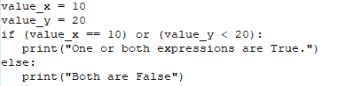
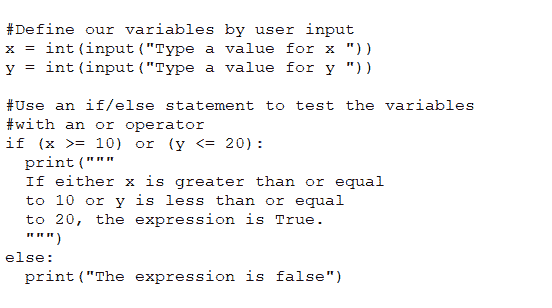

# Python 初学者:和/或操作者

> 原文：<https://thenewstack.io/python-for-beginners-and-or-operators/>

我们又回到 Python 了。就好像我们从未离开过。到目前为止，我们已经用[列表](https://thenewstack.io/python-for-beginners-lists/)、[将输入保存到文件](https://thenewstack.io/yet-more-python-for-beginners-saving-input-to-a-file/)、[函数和 if/else 语句](https://thenewstack.io/so-much-more-python-for-beginners-functions/)、[接受来自用户的输入](https://thenewstack.io/even-more-python-for-non-programmers/)等等覆盖了很多领域。我们将继续我们的旅程，使用这种奇妙且易于学习的语言，以及在许多语言中发现的另一个非常受欢迎的特性……and/or 运算符。

还记得上次我们谈到 if/else 语句时的情形吗？

如果 X 为真，那么 Y 否则 Z？

换句话说，如果 X = 2，那么 X 是偶数，否则就是奇数。

理解 If/else 语句是绝对重要的，因为它们使函数能够根据条件的结果来执行。

我们可以用操作符做类似的事情，这实际上使得创建更复杂的语句成为可能。我们不局限于 if/else 语句，比如如果 X = 2，那么 X 是偶数，否则它是奇数，我们可以这样做，如果 X = 10，Y = 12，那么 X 和 Y 都是奇数，否则它们可能不是奇数。

这是一个相当愚蠢的例子，因为 X 可能是 10，Y 可能是 20，两者都是偶数。为了使这一点更清楚，我们可以这样做:

如果 X <= 2，Y <= 2，则两个数之和小于 5。

您可以在条件语句中使用这些逻辑运算符，这些条件语句要么为真，要么为假。and/or 运算符都可以测试条件并决定程序将采用哪条执行路径。这是直截了当的布尔逻辑，它允许您创建表达式来评估某事是真还是假。

理解 Python 中的以下布尔概念很重要:

*   布尔值是一个可以为真或假的值。
*   布尔值不是真就是假(大小写很重要)。
*   布尔变量是可以为真或为假的变量，用作标志来指示特定条件是否存在。
*   布尔表达式是返回真或假的表达式。
*   布尔上下文可以是用于计算布尔值的 if 条件和/或 while 循环。
*   操作数是由运算符连接的表达式中的对象。
*   布尔逻辑运算符是 AND、OR 和 NOT。

在其最基本的形式中，运算符是这样工作的:

因此，谈论真假是很重要的，因为乍一看可能有点奇怪。对于 Python，如果一个子表达式(在上面的例子中，子表达式是 X 和 Y)为真，那么表达式为真。对于计算结果为 False 的表达式，两个表达式都必须为 False。这就是工作原理。

*   10 < 20 and 10 > 5 =真
*   10 < 20 and 10 > 20 =真
*   10 < 5 and 10 > 30 =假

让我们把它移到 Python 代码中，好吗？让我们用以下命令打开 Python 控制台，而不是一开始就编写程序:

`python3`

您现在应该看到:

`>>>`

键入以下内容:

`exp1 = 10 < 20`

然后，键入:

`exp1`

Python 应该打印出:

`True`

为什么？因为 10 比 20 小。

好的，现在输入:

`exp2 = 10 > 5 `

键入`exp2`，Python 将再次打印出`True`。

现在，键入:

`exp3 = 10 > 20`

接下来是:

`exp3`

Python 应该打印出:

`False`

我们现在拥有的是:

*   exp1 =真
*   exp2 =真
*   exp3 =假

让我们使用我们的运算符。类型:

`exp1 or exp2`

这应该打印出`True`，因为两个子表达式都为真。接下来，键入:

`exp1 or exp3`

这仍然会打印出`True`,因为我们的一个子表达式为真。

让我们用下面的代码创建第四个子表达式:

`exp4 = 10 < 5`

现在，键入:

`exp3 or exp4`

猜猜 Python 报告了什么？假的。为什么？因为两个子表达式都是假的。

现在，让我们将它迁移到 Python 应用程序中。使用以下命令退出 Python 控制台:

`exit()`

用以下内容创建新文件:

`nano operators.py`

我们将创建一个简单的程序，如果一个或两个表达式都为真，它将打印出来。这其中的大部分你应该已经很熟悉了。我们的程序看起来像这样:



你应该已经知道这个程序的结果，因为虽然 value_y 的值不小于 20，但是 value_x 的值等于 10。因为其中一个子表达式为真，所以结果为真。保存并关闭文件，然后使用以下命令运行它:

`python3 operators.py`

让我们允许用户输入两个变量的值。我们用下面的行来做这件事:

```
x  =  int(input("Type a value for x "))
y  =  int(input("Type a value for y "))

```

接下来，我们使用一个 if/else 语句，如下所示:



我们的整个程序看起来像:

保存并关闭文件。运行程序时使用:

`python3 operators.py`

您将被要求输入 2 个数字。一旦你这样做了，程序将比较这些数字并打印“*如果 x 大于或等于 10 或 y 小于或等于 20，表达式为真”*如果一个子表达式为真，或“*表达式为假”*如果两个子表达式都为假。

以下输入的数字将显示以下结果:

*   10 10 =真
*   1 10 =真
*   1 30 =假

但是如果我们把*或者*改成*和*呢？这会改变我们的结果吗？是的。我们的新应用程序将是:

使用上面的程序，我们的结果将是:

*   10 10 =真
*   1 10 =假
*   1 30 =假

为什么要改变？因为 and 运算符只有在两个操作数都为真时才返回 true，而 or 运算符在两个操作数都为真时才返回 True。

这就是 and/or 运算符。在你掌握它们的工作原理之前，你可能会想尝试一下。但是，随着您对 Python 领域的深入了解，了解这些函数将变得非常重要。

<svg xmlns:xlink="http://www.w3.org/1999/xlink" viewBox="0 0 68 31" version="1.1"><title>Group</title> <desc>Created with Sketch.</desc></svg>