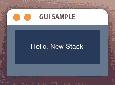
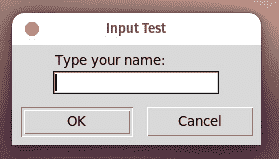

# Python 初学者:如何构建 GUI 应用程序

> 原文：<https://thenewstack.io/python-for-beginners-how-to-build-a-gui-application/>

到目前为止，在我们的 [Python 初学者](https://thenewstack.io/an-introduction-to-python-for-non-programmers/)系列中，我们已经讨论了 Python 的许多方面，比如[列表](https://thenewstack.io/python-for-beginners-lists/)、[变量](https://thenewstack.io/more-python-for-non-programmers/)、[元组](https://thenewstack.io/python-for-beginners-when-and-how-to-use-tuples/)、[函数](https://thenewstack.io/so-much-more-python-for-beginners-functions/)、[从文件中读取文本](https://thenewstack.io/python-for-beginners-how-to-read-text-from-a-file/)，等等。

到目前为止，教程的一个共同点是我们只构建基于文本的应用程序。这些应用程序非常棒，非常方便(尤其是在不包含桌面环境的机器上，或者您需要它们在后台工作)。你甚至可能认为 Python 不能构建具有图形用户界面(GUI)的应用程序。

你猜怎么着？确实是。

这些 GUI 应用程序能够使用以下功能:

*   单选按钮
*   清单
*   菜单
*   下拉列表
*   价值轮
*   价值条
*   更多

只需 GUI 工具包的一点帮助，您就可以用 Python 创建 GUI 应用程序。不相信我？让我告诉你怎么做。

我将在 [Pop 上演示！_OS](https://pop.system76.com/) Linux，但是这可以在任何支持 Python 的发行版中实现。

## 安装 PySimpleGUI

在使用 Python 创建任何 GUI 应用程序之前，我们必须安装一个 Python 库，该库将各种 GUI 库(如 Tkinter、Qt (pyside2)、wxPython 和 Remi)封装在一个包中，以实现快速简单的 GUI 编程。PySimpleGUI 默认为 Tkinter，但是您可以根据需要进行切换。

换句话说，安装 PySimpleGUI 为您提供了开始用 Python 构建 GUI 应用程序所需的一切。

要安装 PySimpleGUI，您需要一台已经安装了 Python 的机器。您还需要 pip 来进行安装。如果您尚未安装 pip，请使用以下命令进行安装:

`sudo apt-get install python3-pip -y`

安装了 Pip 后，现在可以使用以下命令安装 PySimpleGUI:

`python3 -m pip install pysimplegui`

至此，您已经准备好开始构建您的第一个 GUI 应用程序了。

## 你好，新堆栈！

我们将构建的第一个 GUI 应用程序是一直很受欢迎的 Hello，World(带有新的堆栈扭曲)。首先，您必须知道 PySimpleGUI 库必须导入到您的应用程序中。我们以前这样做过，所以这应该是第二天性。

我们将把 PySimpleGUI 作为 *sg* 导入到我们的应用程序中，代码行为:

有了这一行，我们可以用 *sg* 调用任何 PySimpleGUI 函数。

我们的下一行将为应用程序定义按钮的布局。这一行将按钮的文本定义为“Hello，New Stack ”,按钮的大小为 30 x 4。这一行看起来是这样的:

```
layout  =  [[sg.Button('Hello, New Stack',  size=(30,4))]]

```

注意这一行使用了一个元组(在()内)和一个列表(在[]内)来绘制按钮。

我们的下一行为应用程序绘制了实际的窗口，如下所示:

```
window  =  sg.Window('GUI SAMPLE',  layout,  size=(200,100))

```

上面看到的是一个变量(window)，它使用 PySimpleGUI 函数窗口绘制一个标注为 GUI SAMPLE 的图形元素，大小为 200×100。

最后，我们使用。read()函数(从文件中返回指定的字节数。缺省值是-1，表示整个文件)来操作一个按钮，点击下面的行:

```
event,  values  =  window.read()

```

我们的整个脚本(带注释)看起来是这样的:

```
#Import PySimpleGUI
import PySimpleGUI as sg

#Draw the button
layout  =  [[sg.Button('Hello, New Stack',  size=(30,4))]]

#Draw the window
window  =  sg.Window('GUI SAMPLE',  layout,  size=(200,100))

#Define what happens when the button is clicked
event,  values  =  window.read()

```

将该文件另存为 *hello_world.py* 。使用以下命令运行程序:

`python3 hello_world.py`

然后你应该会看到一个带有可点击按钮的小窗口(**图 1** )。



**图 1:** 我们的 GUI Python Hello，世界应用。

单击 Hello，New Stack 按钮，窗口将关闭。

## 接受用户输入

这一次，我们将创建一个接受用户输入的 GUI。这一次我们将导入 [*Tkinter*](https://docs.python.org/3/library/tkinter.html) 包(随 PySimpleGUI 一起安装)来完成繁重的工作。我们把这个文件叫做 *input_gui.py* 。第一行导入 *Tkinter* ，看起来像这样:

接下来，我们将使用
从 Tkinter 导入*简单对话框*

```
from tkinter import simpledialog

```

然后我们用
定义根窗口

定义了根窗口后，我们可以定义输入对话框(将窗口命名为“输入测试”)并提示用户键入他们的名字:

```
USER_INP  =  simpledialog.askstring(title="Input Test",
                                   prompt="Type your Name:")

```

最后，我们在终端窗口中打印出用户输入，代码如下:

`print("Hello", USER_INP)`

我们的整个应用程序如下所示:

```
# Import tkinter and simpledialog
import tkinter as tk
from tkinter import simpledialog

# Define the root window
ROOT  =  tk.Tk()

# Define input dialog
ROOT.withdraw()

# Define the input dialog
USER_INP  =  simpledialog.askstring(title="Input Test",
                                   prompt="Type your Name?:")

# Print the user input
print("Hello",  USER_INP)

```

保存并关闭文件。使用以下内容运行应用程序:

`python3 input_gui.py`

您将看到一个小 GUI 窗口，询问您的姓名，并带有确定和取消按钮(**图 2** )。



**图 2:** 我们用于用户输入的 GUI。

键入您的姓名，然后点按“好”以查看打印在终端窗口中的信息。

现在，你已经用 Python 创建了你的第一个 GUI 应用程序。正如你所看到的，这种用户友好的语言不仅限于基于文本的应用程序。事实上，Python 是一种非常通用的语言，这使得它更加有用。

<svg xmlns:xlink="http://www.w3.org/1999/xlink" viewBox="0 0 68 31" version="1.1"><title>Group</title> <desc>Created with Sketch.</desc></svg>