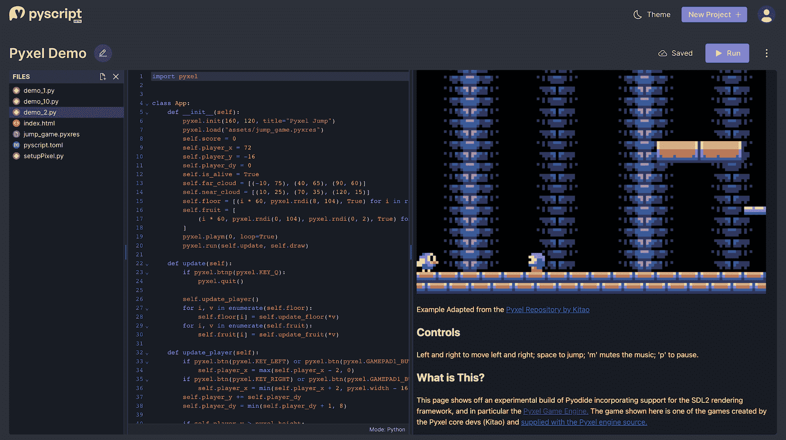

# 浏览器中的 Python:免费的 PyScript SaaS 发布

> 原文：<https://thenewstack.io/python-in-the-browser-free-pyscript-saas-launches/>

Anaconda 从今天开始提供免费的 Pyscript 软件即服务 Pyscript.com，这距离去年 4 月推出开源语言项目已经将近一年了。它将允许开发者将 Python 部署到浏览器中，与其他 HTML 内容一起运行。

据 PyScript.net 的 T2 称，PyScript 本质上是 HTML，但有一个 Python 库的生态系统，这是去年启动的原始项目。它利用 [Pyodide](https://thenewstack.io/5-steps-to-propel-python-into-the-next-decade/) 、 [WASM](https://thenewstack.io/wasm-for-the-frontend-a-look-at-developer-uses/) 和 web 技术让 Python 在浏览器中运行。

Anaconda 首席架构师和 PyScript 创建者 Fabio Pliger 告诉新的堆栈:“你可以用[Pyscript.com](https://pyscript.com/)做的任何事情，你都可以不用它——就像你可以运行自己的 Git 服务器并自己访问 Git 一样。”。“但是 GitHub 为你提供了许多精致和优秀的功能，所以注册并开始使用它们是有意义的。我认为 PyScript.com 也是如此。我在哪里可以找到人们正在创建的新插件？我可以去 Pyscript.com 找找，列一个清单，上面有哪些可以买，哪些更受欢迎，等等。”

PyScript.net 的原始项目仍将保留并会发展，但 PyScript.com 在一个免费的编码平台上整合了一个集成开发环境，具有 Python 支持的数据交互和计算功能。该平台现在作为软件服务普遍免费提供，尽管有计划增加付费层。

开发人员将能够在基于浏览器的 IDE 中开发一个关于 PyScript.com 的项目，然后——更重要的是——在浏览器中部署应用程序，并通过 url 进行共享。

## PyScript.com 从 IDE 走向发布

Pliger 说，以前，如果开发人员想学习 Python，他们必须下载 Python，配置环境，并在本地机器上安装包。

“通过 PyScript，我们试图减少这种情况，并说你只需要编辑一个 txt 文件，我们将在浏览器中构建你的环境和一切，而你不必关心资源或安装或诸如此类的事情，”他解释道。“PyScript.com 基本上是一个用户可以创建、共享、部署和复制 PyScript 项目的空间。”

一旦开发人员登录并开始一个项目，他们会看到一个 IDE，看起来很像 Visual Studio 或其他 IDE，带有“Hello World”脚本。PyScript.com 也将提供插件，所以，举例来说，如果一个老师想要给一个幻灯片打分，他将能够找到一个插件来实现这个功能。

“我们试图创造一种简单的体验，并向用户推荐最佳实践，”Pliger 说。“PyScript 的设计非常灵活。例如，当我创建一个新项目时，我可以选择这条路线，即分别定义我的 Python 文件和其他内容，或者我可以说，打印‘Hello world’这样就可以了，这对新手用户来说很好。”

应用程序是从 IDE 中自动部署的。

“我可以给你发送一个链接，你可以看到应用程序正在运行——所有这一切都在几秒钟之内，”他说。“相比之下，Python 中的一个难题是，一旦我有了自己的应用程序，我该如何将它部署给我的用户？”

像 GitHub 一样，PyScript.com 允许用户复制他人的项目，并根据编码者自己的修改修改程序。Anaconda 还创建了模板来简化功能的添加。

“PyScript 中的一个概念是，你有允许你设置包的配置文件，你使用依赖项、插件和类似的东西，”他说。“这就像说‘包等于数字’一样简单。突然之间，我有了一个包含 NumPy 的版本，我也可以使用它们了。”

虽然 IDE 对开发人员来说很熟悉，但项目不想做的一件事是创建一个可能会淹没非程序员的超级强大的编辑器。这是因为 PyScript 的目标之一是成为 99%的非程序员网络用户的语言，正如 [Anaconda 联合创始人兼首席执行官王蒙杰在 7 月份告诉新堆栈](https://thenewstack.io/pyscript-a-browser-based-python-framework/)的那样。

“对于那些说‘我不明白为什么有必要这样做’的人，我想说的最重要的一句话就是，这与你无关，”王说。“这是为了所有的小学生，你不用花一下午的时间去教他们如何构建自己的第一个应用程序。”

## PyScript.com 的未来特征

当然，[开发商仍然是一个主要的考虑因素。许多开发人员会喜欢的一个附加功能是为 Pyscript.com 计划的命令行界面，它将使开发人员能够在自己的机器上编码，然后与 PyScript.com 实时同步。](https://thenewstack.io/four-takeaways-from-pyscript-demo/)

“例如，如果你是 GitHub 用户，你想使用它，我们希望鼓励你这样做，并说，继续使用你的工具，继续使用一切，只使用你需要的功能，如易于部署或共享能力等，”Pliger 说。

还计划添加更多的社交支持，这样用户就可以跟踪其他人，看看他们在做什么项目，并克隆项目。他说，已经有来自维护者和其他测试参与者的游戏和其他项目的演示。Pliger 演示了一个游戏，看起来很像最初的超级马里奥兄弟，并在浏览器中工作。

图片来自 Anaconda

“我对人们正在做的事情感到惊讶，”他说。“对于学生和那些想编程但不会编程的人来说，游戏是一个抓住他们兴趣的渠道，对吗？如果你去一个班级，告诉他们，“今天我们要学习 Python，学习如何在屏幕上打印东西，”[……]你会失去他们的兴趣。但是，如果你去说，‘嘿，我们要用 Python 来自动化《我的世界》，并创建块和类似的东西，’突然你抓住了他们的兴趣，他们实际上想学习如何为自己的利益使用它。我觉得很厉害。”

他补充说，另一个实用的注意事项是，教师可以在学生正在学习的内容中的一页上运行脚本，因此不需要两页——这将带来强大的学习体验。

《Pyscript.com》将会有付费层级，但目前，Anaconda 希望鼓励“热情的个人来帮助铺平 PyScript 的未来，”新闻稿称。它为那些希望更多参与项目的人提供一次性收费 150 美元的创始人套餐。创始人将提前获得测试版功能，拥有直接向核心开发者反馈的渠道，并在新功能发布后获得一年的无限制访问权。此外，创始人将获得特别版服装，以 PyScript 的新吉祥物兔子为特色。

自 2022 年首次亮相以来， [PyScript 的 GitHub](https://github.com/pyscript/pyscript) 已经增长到超过 15，000 颗星，每月的使用量达到 20，000 多名 web 开发人员、数据科学从业人员和学习者。

<svg xmlns:xlink="http://www.w3.org/1999/xlink" viewBox="0 0 68 31" version="1.1"><title>Group</title> <desc>Created with Sketch.</desc></svg>