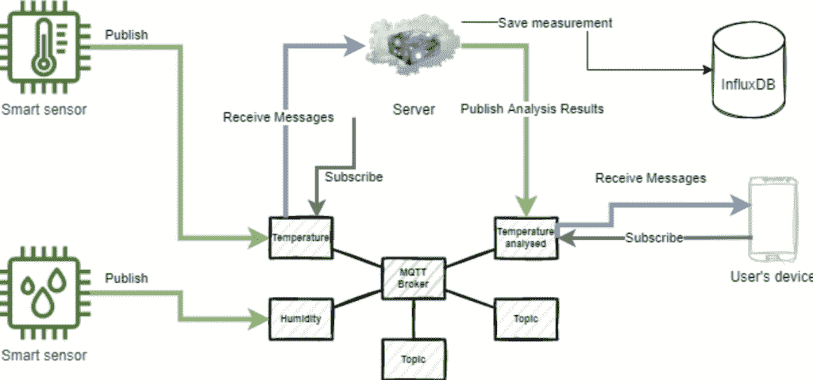
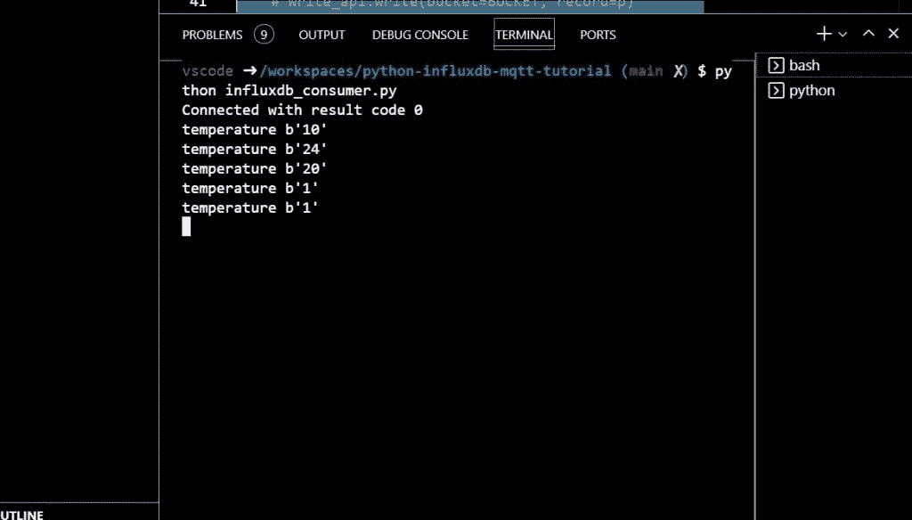
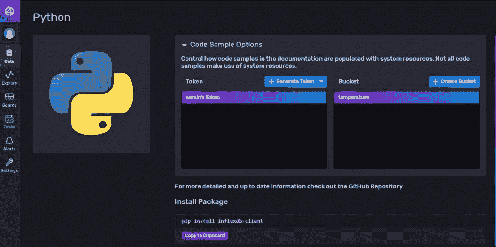
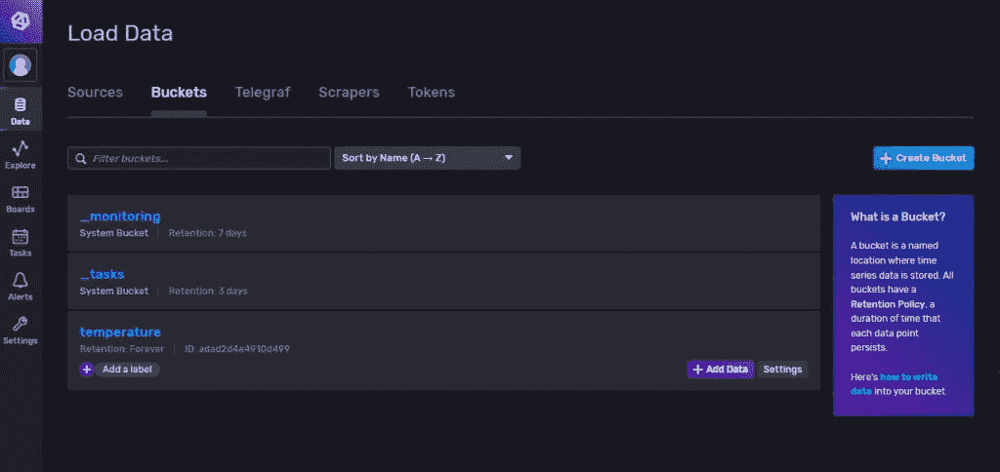
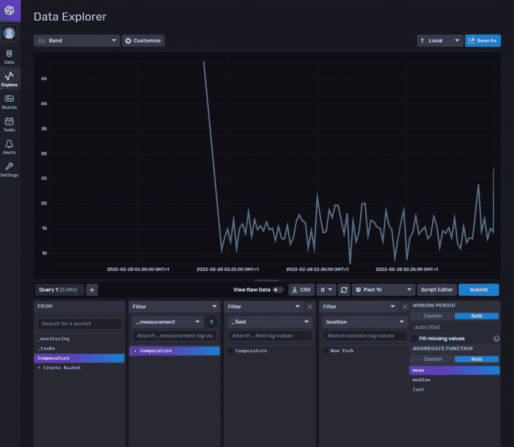
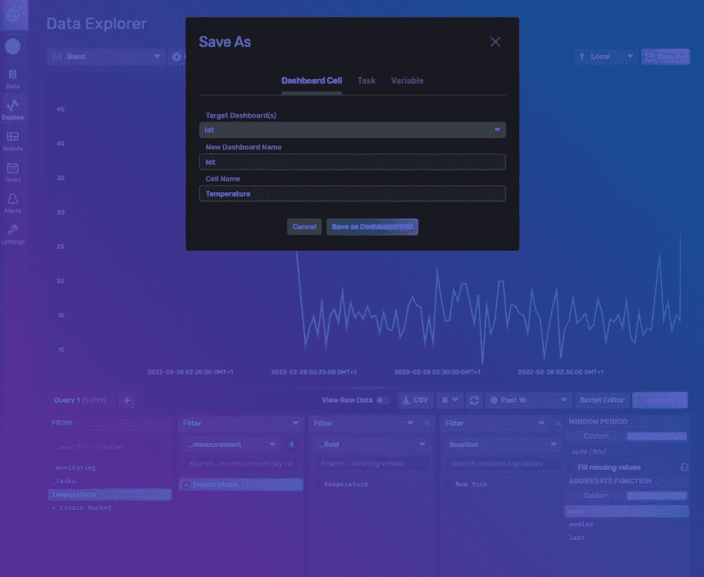
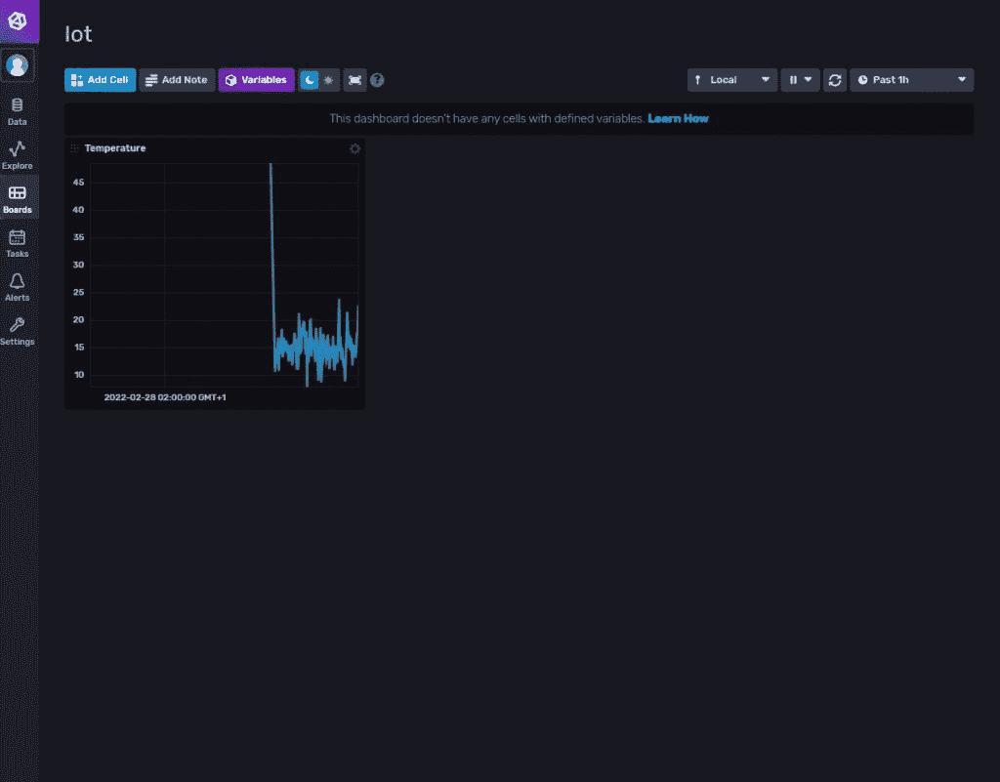

# Python MQTT 教程:用 InfluxDB 存储物联网指标

> 原文：<https://thenewstack.io/python-mqtt-tutorial-store-iot-metrics-with-influxdb/>

[MQTT](https://www.influxdata.com/integration/mqtt-monitoring/?utm_source=vendor&utm_medium=referral&utm_campaign=2022-04-05_spnsr-ctn_python-mqtt-tutorial_tns) 是用于[物联网](https://www.influxdata.com/solutions/industrial-iot/?utm_source=vendor&utm_medium=referral&utm_campaign=2022-04-05_spnsr-ctn_python-mqtt-tutorial_tns) (IoT)的标准消息协议，因为它需要最少的资源，并且可以由连接设备中的小型微控制器执行。

 [亚历山大·库代洛

Alexandre 是复杂系统工程和管理专家。自从他开始职业生涯，为加拿大一家领先金融机构的数字化转型做出贡献以来，他一直信奉 DevOps 文化。他的热情是 DevOps 革命和工业工程。他喜欢自己有足够的后知之明来两全其美。](https://www.linkedin.com/in/alexandre-couedelo/) 

物联网设备确实需要这种类型的轻量级协议，因为它能够以最低的硬件要求保证快速可靠的通信，从而保持较低的功耗和制造成本。

智能温度传感器等物联网设备定期通过互联网传输信息，但在您从测量中推断出任何有意义的信息之前，您需要将其存储在一个足够大的数据库中。智能传感器测量并不复杂，但它们高度依赖于时间常数——何时进行测量——因此，[时序数据库，如 InfluxDB](https://www.influxdata.com/time-series-database/?utm_source=vendor&utm_medium=referral&utm_campaign=2022-04-05_spnsr-ctn_python-mqtt-tutorial_tns) ，提供了存储和处理这类数据的有效选项。

在本文中，您将学习如何使用 [Python](https://www.python.org) 创建一个智能传感器，它使用 MQTT 在互联网上传输测量结果，并将数据存储在 [InfluxDB](https://www.influxdata.com/?utm_source=vendor&utm_medium=referral&utm_campaign=2022-04-05_spnsr-ctn_python-mqtt-tutorial_tns) 中。您还将了解 InfluxDB 生态系统，它提供了可以可视化和查询数据的数据库和 UI 工具。

## MQTT 是什么？

MQTT 是一种基于事件(发布和订阅)的通信协议，专门用于支持物联网设备在高延迟和低带宽环境中高效通信。高延迟和低带宽环境通常指的是蜂窝网络，如 2G 或 3G。网络成本是运营物联网基础设施的[主要费用之一。使用像 MQTT 这样的轻量级协议有助于降低物联网设备的费用。](https://itrexgroup.com/blog/how-much-iot-cost-factors-challenges/#)

MQTT 中的基本组件是代理，它协调发布/订阅(发布和订阅)通信。这个概念可以用一个图表来更好地解释:



MQTT 代理架构图由 Alexandre coudelo 提供

当传感器(发布者)向主题发送消息时，MQTT 代理管理主题；然后，代理将消息发送回订阅该主题的任何应用程序(消费者)。消费者可以是用户的智能手机或云中的后端应用程序。

最常见的模式是为原始数据(温度、湿度等)设置主题。)和已处理数据的主题。后端应用程序将监听`temperature`，处理数据，并在相关时向`temperature analyzed`发布消息。这就是 InfluxDB 发挥作用的地方；后端应用程序需要将数据存储在某个地方，以便能够获得日平均温度或比单点测量更适合最终用户的温度预测。

[物联网传感器](https://www.influxdata.com/blog/how-influxdb-iot-data/?utm_source=vendor&utm_medium=referral&utm_campaign=2022-04-05_spnsr-ctn_python-mqtt-tutorial_tns)最受欢迎的用例是资产跟踪(世界各地卡车和货物的位置)、远程区域监控(例如，农场的温度和湿度)、资源优化(能源和水消耗)和位置/工作场所分析(污染、噪音和空气质量)。

在本文中，您将通过创建一个假的智能温度传感器来构建一个基于远程监控用例的示例。

## 使用 InfluxDB 存储物联网指标

本教程分三部分展开。首先，您创建一个发布`temperature`主题的智能传感器。然后设置 InfluxDB，最后创建一个后端应用程序，它使用来自`temperature`主题的消息，并将它们存储在数据库中。

您可以使用这个 [GitHub 库](https://github.com/xNok/python-influxdb-mqtt-tutorial)来跟随本教程。

## 用 Python 创建智能传感器

首先，您将创建一个向 MQTT 发送数据的简单 Python 脚本；这代表智能温度传感器。这个脚本将成为您系统中的 MQTT 发布者。

安装`paho-mqtt`库:

然后你需要生成随机数据。在这个任务中，你将使用 [Faker](https://faker.readthedocs.io/en/master/index.html) 。如果你还没有安装它，你需要安装它:

现在创建您的智能传感器(MQTT publisher)。在本例中，您将使用一个名为[MQTT . eclipse projects . io](http://mqtt.eclipseprojects.io)的公共测试 MQTT 代理，并每秒向一个名为`temperature`的主题发送随机整数(代表温度)。

创建一个名为`smart_sensor.py`的新 Python 文件，并使用下面的代码:

```
"""

MQTT Smart temperature Sensor

"""

import time.

import paho.mqtt.client as mqtt
from faker import Faker

# connect to the MQTT broker

MQTT_BROKER_URL  =  "mqtt.eclipseprojects.io"
MQTT_PUBLISH_TOPIC  =  "temperature"

mqttc  =  mqtt.Client()
mqttc.connect(MQTT_BROKER_URL)

# Init Faker, our fake data provider
fake  =  Faker()

# Infinite loop of fake data sent to the broker
while True:

temperature  =  fake.random_int(min=0,  max=30)
mqttc.publish(MQTT_PUBLISH_TOPIC,  temperature)
print(f"Published new temperature measurement: {temperature}")
time.sleep(1)

```

现在你可以运行你的脚本:

太好了！现在您正在向 MQTT 代理发送数据，所以是时候设置 InfluxDB 并创建另一个脚本来订阅您的`temperature`主题并将数据存储在数据库中。


智能温度传感器运行

## 设置 InfluxDB

您可以使用 [Docker](https://www.docker.com) 来运行 InfluxDB，它非常适合本地开发。然而，InfluxDB 支持许多平台:Linux、macOS、Windows、Docker 和 Kubernetes。您可以在 [InfluxDB 的安装页面](https://docs.influxdata.com/influxdb/v2.0/install/?utm_source=vendor&utm_medium=referral&utm_campaign=2022-04-05_spnsr-ctn_python-mqtt-tutorial_tns)上选择最适合您需求的安装。你也可以使用 [InfluxDB Cloud](https://www.influxdata.com/products/influxdb-cloud/?utm_source=vendor&utm_medium=referral&utm_campaign=2022-04-05_spnsr-ctn_python-mqtt-tutorial_tns) 来开始，而不需要在你的机器上安装任何东西。

要开始设置，您需要定义一个`docker-compose.yml`文件，该文件定义了以下配置:

```
version:  '3.3'

services:
influxdb:
image:  influxdb:2.0.7
environment:

DOCKER_INFLUXDB_INIT_MODE:  setup
DOCKER_INFLUXDB_INIT_USERNAME:  ${INFLUXDB_USERNAME}
DOCKER_INFLUXDB_INIT_PASSWORD:  ${INFLUXDB_PASSWORD}
DOCKER_INFLUXDB_INIT_ORG:  ${INFLUXDB_ORG}
DOCKER_INFLUXDB_INIT_BUCKET:  ${INFLUXDB_BUCKET}
DOCKER_INFLUXDB_INIT_ADMIN_TOKEN:  ${INFLUXDB_TOKEN}

ports:
-  "8086:8086"

```

您还需要创建一个`.env`文件来定义这个`docker-compose.yml` :
中需要的环境变量

```
INFLUXDB_USERNAME=admin
INFLUXDB_PASSWORD=admin1234
INFLUXDB_TOKEN=F-QFQpmCL9UkR3qyoXnLkzWj03s6m4eCvYgDl1ePfHBf9ph7yxaSgQ6WN0i9giNgRTfONwVMK1f977r_g71oNQ==
INFLUXDB_URL="http://localhost:8086"
INFLUXDB_ORG=iot
INFLUXDB_BUCKET=temperature

```

现在，让 InfluxDB 开始吧。你应该在你的`docker-compose`命令中使用`--env-file`来强制 Docker 考虑`.env`:

```
docker-compose  --env-file  .env up

```

在本地运行 InfluxDB 的情况下转到`http://localhost:8086`，应该会登陆到 InfluxDB UI。您将在您的`.env`文件中找到凭证。可以看到，`InfluxDB`不仅仅是一个数据库；这是一个有助于管理和可视化数据的生态系统。稍后您将了解到更多这方面的内容。

现在是时候创建一个 MQTT 消费者了，它接收您的温度测量值并将它们存储在 InfluxDB 中。

## 创建 MQTT 和 InfluxDB 客户端

首先，您需要安装`influxdb-client`:

`pip install 'influxdb-client[ciso]'`

将所有的常量放在一个地方也是一个好主意。它防止你重复自己和犯错误。由于您已经在`.env`中存储了最重要的一个，您将需要`dotenv`将它们加载到您的脚本中:

`pip install python-dotenv`

现在您需要从 MQTT 逻辑开始。订阅话题需要两个回调函数:`on_connect`和`on_message`。

当您的应用程序成功连接到代理时，会调用`on_connect`。您将使用这个函数来订阅主题`temperature`。因此，每当您的智能传感器发布关于该主题的消息时，就会调用`on_message`函数。您将使用`on_message`回调将温度测量值发送到 InfluxDB。

使用下面的代码创建一个名为`influxdb_consumer.py` :
的新 Python 文件

```
MQTT subscriber  -  Listen to  a  topic and sends data to InfluxDB

import os
from dotenv import load_dotenv
import paho.mqtt.client as mqtt

load_dotenv()  # take environment variables from .env.

# InfluxDB config
# TODO

# MQTT broker config
MQTT_BROKER_URL  =  "mqtt.eclipseprojects.io"
MQTT_PUBLISH_TOPIC  =  "temperature"

mqttc  =  mqtt.Client()
mqttc.connect(MQTT_BROKER_URL)

def on_connect(client,  userdata,  flags,  rc):
""" The callback for when the client connects to the broker."""
print("Connected with result code "+str(rc))

# Subscribe to a topic
client.subscribe(MQTT_PUBLISH_TOPIC)

def on_message(client,  userdata,  msg):
""" The callback for when a PUBLISH message is received from the server."""
print(msg.topic+" "+str(msg.payload))

## InfluxDB logic
# TODO

## MQTT logic - Register callbacks and start MQTT client
mqttc.on_connect  =  on_connect
mqttc.on_message  =  on_message
mqttc.loop_forever()

```

上述示例中仍然缺少与 InfluxDB 相关的代码，但是在此之前，您应该测试您的系统，以查看消费者是否收到了智能传感器发送的消息。确保`smart_sensor.py`仍在运行，然后运行`influxdb_consumer.py`:

`python influxdb_consumer.py`

您应该会看到温度测量结果:



使用消息的后端应用程序

现在，您已经能够从代理接收消息，将它们存储在 InfluxDB 中。

接下来，您需要配置 InfluxDB 客户端。您将使用预配置的`INFLUXDB_TOKEN`，这对于测试来说很方便，但是您也可以通过 UI 创建一个新的令牌。您的 InfluxDB 实例应该仍在运行。

返回 UI([http://localhost:8086](http://localhost:8086))并生成一个新的认证令牌；然后点击**数据**。之后，在**客户端库**中，需要选择 Python。此部分允许您创建身份验证令牌:



为 InfluxDB 生成令牌

```
import os
from dotenv import load_dotenv
from influxdb_client import InfluxDBClient,  Point
from influxdb_client.client.write_api import ASYNCHRONOUS
import paho.mqtt.client as mqtt

# take environment variables from .env
load_dotenv()

# InfluxDB config
BUCKET  =  os.getenv('INFLUXDB_BUCKET')
client  =  InfluxDBClient(url=os.getenv('INFLUXDB_URL'),
token=os.getenv('INFLUXDB_TOKEN'),  org=os.getenv('INFLUXDB_ORG'))
write_api  =  client.write_api()

```

*An important thing to know about InfluxDB is the difference between fields and tags. Both are key-value pairs, but tags act as indexes for your record. In this case, the `field` is the measurement and `tag` could be filtered data, for instance, by `location`. The other key concepts of InfluxDB are defined on this [page](https://docs.influxdata.com/influxdb/v2.0/reference/key-concepts/data-elements/?utm_source=vendor&utm_medium=referral&utm_campaign=2022-04-05_spnsr-ctn_python-mqtt-tutorial_tns).*

现在将`on_message`回调更新为将测量结果写入 InfluxDB:
的代码

```
def on_message(client,  userdata,  msg):
""" The callback for when a PUBLISH message is received from the server."""
print(msg.topic+" "+str(msg.payload))

# We received bytes we need to convert into something usable
measurement  =  int(msg.payload)

# InfluxDB logic
point  =  Point(MQTT_PUBLISH_TOPIC).tag("location",  "New York").field("temperature",  measurement  )
write_api.write(bucket=BUCKET,  record=point)

```

确保`influxdb_consumer.py`和`smart_sensor.py`仍在运行。如果是，新的数据点应该每秒钟添加到数据库中，这样您就可以在 InfluxDB UI 中可视化您的数据。

## 在 InfluxDB Web UI 中可视化数据

转到`http://localhost:8086`并点击数据；然后选择存储桶。你应该看到你的体温:



InfluxDB UI:列出存储桶

选择温度桶。现在，您应该已经登录到数据资源管理器，您可以在其中查询数据并将其可视化:



InfluxDB UI:数据浏览器

这里的一个很好的功能是，一旦您创建了符合您需要的可视化效果，您可以单击“另存为”并将其添加到您选择的仪表板中:



InfluxDB UI:保存到仪表板

由于有了 UI，您的应用程序不需要任何第三方可视化工具和仪表板。



InfluxDB 用户界面:仪表板

## 结论

现在您知道了如何使用 Python 为 MQTT 创建发布者和消费者。不仅如此，您还可以将智能传感器测量结果存储在时间序列数据库中，并实时可视化。

通过提供快速查询和类型相关数据的聚合，InfluxDB 的数据库在处理物联网数据方面特别有效。它还附带了一个强大的 UI，您可以在其中可视化您的数据，并在同一个位置创建一个仪表板。

<svg xmlns:xlink="http://www.w3.org/1999/xlink" viewBox="0 0 68 31" version="1.1"><title>Group</title> <desc>Created with Sketch.</desc></svg>