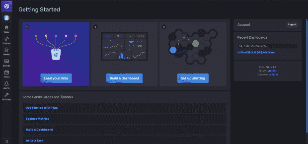
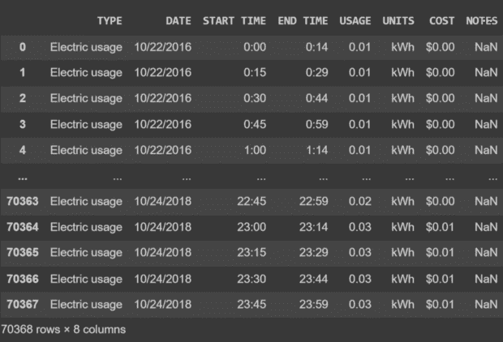
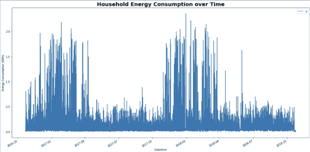
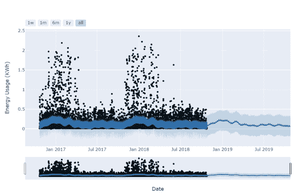
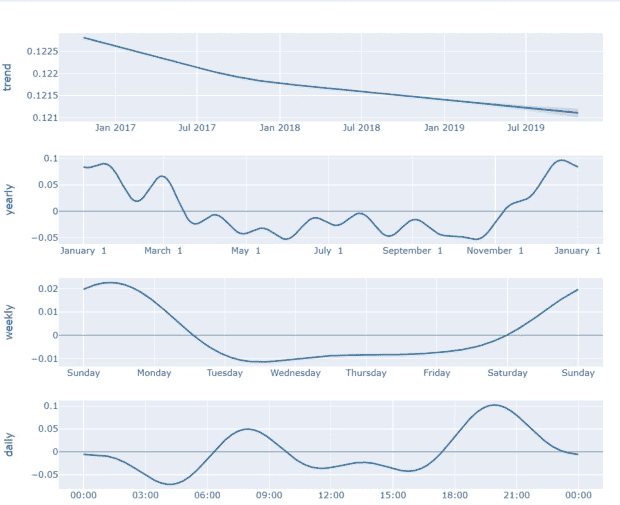

# Python 时间序列预测教程

> 原文：<https://thenewstack.io/python-time-series-forecasting-tutorial/>

生活在快速变化的社会中的一个结果是，所有系统的状态也同样快速地变化，随之而来的是操作的不一致性。但是如果你能预见这些不一致会怎么样呢？如果你能看到未来会怎么样？这就是[时间序列数据](https://www.influxdata.com/what-is-time-series-data/?utm_source=vendor&amp;utm_medium=referral&amp;utm_campaign=2022-10_python-forecasting_global&amp;utm_content=tns)能够有所帮助的地方。

时间序列数据是指在不同时间点描述特定系统的数据点的集合。时间间隔取决于特定的系统，但通常情况下，数据是根据每个记录的日期和/或时间来安排的。这意味着一个系统的时间序列数据是其各种状态久而久之的详细记录。每个数据点都可以通过其时间戳进行唯一标识。有些人可能会认为所有的数据都是时间序列数据，然而，并不是所有的记录都以这样一种方式记录，即系统随时间变化的细节得到保留。

为了保持你的系统的转换，你需要[时间序列预测](https://www.influxdata.com/time-series-forecasting-methods/?utm_source=vendor&utm_medium=referral&utm_campaign=2022-10_python-forecasting_global&utm_content=tns)，这是使用可用的时间记录来预测系统在以后的状态。因此，给定一个系统从远古到昨天的记录，预测系统今天和明天状态的过程就是时间序列预测。您可以使用时间序列预测来预测天气或股票价格。它还有助于在更多的[工业设施](https://www.influxdata.com/what-is-industry-4-0/?utm_source=vendor&utm_medium=referral&utm_campaign=2022-10_python-forecasting_global&utm_content=tns)中进行预测性维护，以及预测能源资源的使用情况以进行适当的管理。

在本教程中，您将学习更多关于使用 [InfluxDB](https://www.influxdata.com/?utm_content=inline-mention) 进行时间序列预测的知识，以及如何构建一个时间序列预测器来预测未来。

## 了解时间序列预测

如前所述，时间序列预测是使用存储的特定系统过去的时间戳记录来预测未来会发生什么的过程。

请注意，过去和未来在开发过程中使用得更宽松。给定一个特定的参考点，之前记录的所有数据点都是“过去”，之后记录的所有数据都被称为“未来”

使用过去来预测未来听起来可能有些棘手，因为您可能会问，“在没有目标列的情况下，如何将数据划分为功能和目标？”首先，定义一个窗口。这个窗口实际上是指你需要回溯多长时间才能做出预测。这有助于设置一个分界点，超过该分界点，数据点对预测的影响可以忽略不计。使用此窗口，您可以在数据集上滑动以生成训练数据。

假设您有一家公司一年的销售数据，时间窗为 60 天:1 月 1 日至 2 月 29 日。这 60 天将用于预测 3 月 1 日的销售额(假设是闰年)。接下来，您将使用从 1 月 2 日到 3 月 1 日的数据来预测 3 月 2 日的销售额。这是逐步进行的，直到你考虑从 11 月 1 日到 12 月 30 日预测 12 月 31 日的销售额。

除了销售，时间序列预测还可以用来预测天气。有了关于温度、相对湿度和其他天气相关参数的历史信息，就可以预测以后的天气。

时间序列预测也被用来预测各种组织的股票价格，给出它们的历史数据。类似地，从标准货币到加密货币的货币价格可以使用时间序列预测来预测。

在更工业化的一端，有了关于各种机械工厂设备工作状况的数据，就可以预测未来的状态，这有助于及早发现故障，以便在零件损坏和停止运行之前进行维护。这被称为“预测性维护”

在能源效率领域，有了关于家庭或特定家庭的电力消耗的信息，配电公司可以有效地供应电力，使得那些在特定时间需要更多电力的人得到足够的电力。组织和家庭可以使用这些信息来了解他们的功耗趋势，并实施管理以节省资金。

时间序列预测和其他形式的时间序列数据分析的用例是无穷无尽的，这就是为什么了解如何有效地使用时间序列预测非常重要。

## 使用 InfluxDB 实现时间序列预测

为了演示如何有效地进行时间序列预测，本教程包括一个使用 InfluxDB 的数据准备和建模过程的演练。为了保留上下文，将处理的示例问题涉及在给定 15 分钟时间间隔内测量的家庭能源消耗数据的情况下预测家庭能源消耗。

## 设置 InfluxDB

要设置 InfluxDB，导航到 [InfluxDB OSS 文档](https://docs.influxdata.com/influxdb/v2.2/?utm_source=vendor&utm_medium=referral&utm_campaign=2022-10_python-forecasting_global&utm_content=tns)并点击**开始**按钮。这是 InfluxDB 的开源版本，可以在本地服务器上设置。按照特定操作系统(在本例中为 Windows)的[安装 InfluxDB](https://docs.influxdata.com/influxdb/v2.2/install/?t=Windows) 页面上的安装说明安装并启动 InfluxDB 操作系统。

`[InfluxDB OSS installation instructions](https://imgur.com/cJSETdB.png)`

此时，您应该在本地服务器上运行 InfluxDB。在您的浏览器中输入此本地服务器的 URL，以访问 InfluxDB 界面。然后输入您的姓名、密码、组织和存储段名称，以完成 InfluxDB 设置。完成后，您将被带到 InfluxDB OSS 主页:



另一个无需在计算机上进行任何设置就可以开始使用 InfluxDB 的选项是使用一个免费的 [InfluxDB Cloud](https://cloud2.influxdata.com/signup/?utm_source=vendor&utm_medium=referral&utm_campaign=2022-10_python-forecasting_global&utm_content=tns) 实例。

## 将数据加载到 InfluxDB 中

设置好 InfluxDB 后，现在需要将数据加载到数据库中。首先从[这个页面](https://www.kaggle.com/datasets/jaganadhg/house-hold-energy-data)下载 CSV 数据。

在将 CSV 文件直接上传到 InfluxDB 之前，必须对其进行[注释](https://docs.influxdata.com/influxdb/v2.2/reference/syntax/annotated-csv/#annotations)。因为这个 CSV 文件没有注释，所以将使用 [InfluxDB Python 客户端](https://github.com/influxdata/influxdb-python)将数据写入数据库。这将让您很好地了解数据如何流入 InfluxDB。

接下来，导航到 **API 令牌**选项卡，如果不存在 API 令牌，单击**生成 API 令牌**按钮。然后单击新创建的令牌的名称，以查看和复制全访问 API 令牌，如下所示。此令牌将用于验证您从客户端到 InfluxDB 的连接:

[InfluxDB OSS 生成令牌](https://imgur.com/CPRvSsb.png)

知道了 API 令牌、存储桶和组织之后，导航到您喜欢的代码编辑器，并为这个项目创建一个文件夹。然后将之前下载的 CSV 文件转移到该父文件夹中的新的`data/`目录中。

使用以下 Windows 命令创建并激活名为`.venv`的 Python 虚拟环境:

```
python  -m  venv  .venv
.venv\Scripts\activate.bat

```

接下来，安装本教程所需的所有库，并将 API 令牌设置为环境变量:

```
pip install pandas influxdb-client matplotlib
pip install fbprophet

```

完成后，创建一个脚本并导入必要的库:

```
python
import os
from datetime import datetime
import pandas as pd
from influxdb_client import InfluxDBClient,  Point,  WritePrecision
from influxdb_client.client.write_api import SYNCHRONOUS
token  =  os.getenv("INFLUX_TOKEN")
organization  =  "forecasting"
bucket  =  "energy_consumption"

```

在这里，您安装了`os`模块来加载环境变量，安装了 [pandas](https://pandas.pydata.org) 库来加载 CSV 文件，安装了 InfluxDB 方法来简化编写过程。接下来，将 API 令牌、组织和存储段名称加载到正确命名的变量中。

现在您需要创建 InfluxDB 客户端并实例化`write_API` :

```
python
PORT  =  8086
client  =  InfluxDBClient(url=f"http://127.0.0.1:{PORT}",  token=token,  org=organization)
write_api  =  client.write_api(write_options=SYNCHRONOUS)
df  =  pd.read_csv('data/D202.csv')

```

在前面的代码中，您定义了运行 InfluxDB 服务器的`PORT`号。然后，通过传入运行服务器的 URL、API 令牌和组织名称作为参数，实例化 InfluxDB 客户端。

接下来，使用之前定义的`client`实例调用`write_API`方法。最后，在这个代码片段中，您使用`read_csv`方法将 CSV 文件作为 Pandas DataFrame 加载。这是数据集的样子:



数据集的视图

```
python
for index,  row in df.iterrows():
    print(index,  end=' ')
    stamp  =  datetime.strptime(f"{row['DATE']}, {row['START TIME']}",  
                                "%m/%d/%Y, %H:%M")
    p  =  Point(row["TYPE"])\
        .time(stamp,  WritePrecision.NS)\
        .field("usage(KWh)",  row["USAGE"])\
        .tag("cost",  row["COST"])
    write_api.write(bucket=bucket,  org=organization,  record=p)

```

这个片段包含实际的编写步骤。在这里，您循环通过

[Pandas DataFrame](https://www.influxdata.com/blog/getting-started-with-influxdb-and-pandas/?utm_source=vendor&utm_medium=referral&utm_campaign=2022-10_python-forecasting_global&utm_content=tns)

并打印索引以跟踪进度。接下来，将开始时间转换为日期时间对象。该开始时间随后用于定义该数据点的时间字段。

先前导入的 InfluxDB 点对象用于配置要上载的数据行。每个点实例应该有一个时间、字段和一个或多个标签。“时间”是指记录该数据点的时间。该字段是以千瓦时(kWh)为单位的使用数据，成本作为标签。

最后，在循环的每次迭代中，调用 write API 将数据点写入数据库中的存储桶。

## 从 InfluxDB 中读取数据

接下来，您必须将存储在 InfluxDB 上的数据读入 Python 环境进行训练:

```
python
query_api  =  client.query_api()
query  =  f'from(bucket:"{bucket}")'  \
' |&gt; range(start:2016-10-22T00:00:00Z, stop:2018-10-24T23:45:00Z)'\
' |&gt; filter(fn: (r) =&gt; r._measurement == "Electric usage")'  \
' |&gt; filter(fn: (r) =&gt; r._field == "usage(KWh)")'

```

这里，您再次调用 InfluxDB 客户端实例，但是这一次，您选择查询 API，因为您的目标是从数据库中读取数据。然后创建查询。InfluxDB 使用一种简单易用的脚本语言，称为 [Flux](https://docs.influxdata.com/flux/v0.x/?utm_source=vendor&utm_medium=referral&utm_campaign=2022-10_python-forecasting_global&utm_content=tns) 。在 Python 中，用字符串编写 Flux 查询。在这个查询字符串中，您指定了要读取的存储桶。接下来，定义希望查询的时间范围。最后，声明过滤器来选择数据点，这些数据点在其度量和字段属性中包含指定的信息。在这种情况下，`"Electric usage"`测量值和`"usage(KWh)"`字段:

```
python
result  =  query_api.query(org=organization,  query=query)
data  =  {'y':  [],  'ds':  []}
for table in result:
    for record in table.records:
        data['y'].append(record.get_value())
        data['ds'].append(record.get_time())
    print("here")
df  =  pd.DataFrame(data=data)
df.to_csv('data/Processed_D202.csv',  index=False)
In this snippet,  you parse the query using the  `query_api.query`  method alongside the organization.  Then you create storage to hold the results and loop through the query results.  As you iterate through,  you collate the results in the earlier defined storage,  which in this case is  a  Python dictionary.  The processed data is saved as  a  CSV file in the  `data/`  directory when this is done.

```

## 用预言家预测

从 InfluxDB 加载数据后，下一步是构建预测模型。脸书创建并发布了 [Prophet](https://facebook.github.io/prophet/) ，这是一个用 Python 和 r 编写的名副其实的高性能时间序列预测库。 [Prophet 的设计](https://www.influxdata.com/blog/forecasting-with-fb-prophet-and-influxdb/?utm_source=vendor&utm_medium=referral&utm_campaign=2022-10_python-forecasting_global&utm_content=tns)是为了处理任何给定时间序列中的异常值、各种变化(季节、月、日等)和缺失数据。它还提供了有助于调整模型以获得更好性能的参数。

Prophet 模型的输入是由两列组成的 DataFrame，`y`和`ds`。`y`代表感兴趣的变量(能源使用量)，`ds`指的是`datetime`属性。如您所见，上一节中的 DataFrame 列不是随机命名的。

首先，导入 Prophet 库和其他用于数据处理和可视化的库:

```
python
import fbprophet
import matplotlib.pyplot as plt
import pandas as pd
df  =  pd.read_csv('data/Processed_D202.csv')
df['ds']  =  pd.to_datetime(df['ds']).dt.tz_localize(None)
df_copy  =  df.set_index('ds')

```

导入所需的库后，将处理后的数据读入一个数据框，将时间戳列转换成一个`Datetime`对象，并移除时区以避免绘图时出错。然后创建数据帧的副本，将时间戳列设置为索引:

```
python
df_copy.plot(kind='line',
 xlabel='Datetime',
 ylabel='Energy Consumption (KWh)',
 )
plt.title('Household Energy Consumption over Time',  fontweight='bold',  fontsize=20)
plt.show()

```

这里，您使用创建的 DataFrame 的副本来可视化数据，如下所示。您可以看到，在接近年底和明年年初的时候，能源消耗出现了峰值。这是一种季节性变化，任何训练有素的模型都可以识别:



能源消耗数据图

```
python
energy_prophet  =  fbprophet.Prophet(changepoint_prior_scale=0.0005)
energy_prophet.fit(df)
energy_forecast  =  energy_prophet.make_future_dataframe(periods=365,  freq='D')
energy_forecast  =  energy_prophet.predict(energy_forecast)
energy_prophet.plot(energy_forecast,  xlabel  =  'Date',  ylabel  =  'Energy Usage (KWh)')  # 0.0005
plt.title('Household Energy Usage')
plt.show()

```

接下来，实例化 Prophet 模型并使其符合数据。在实例化 Prophet 时，您将传递

`changepoint_prior_scale`

控制预测器灵活性的参数。接下来，您将创建一个测试数据框，用于使用 Prophet 进行预测。此数据帧是从输入数据中的最后一天起 365 天内构建的，与输入中观察到的时间间隔相同。然后使用将它解析到模型中进行预测

`.predict`

方法。最后，绘制结果以查看预测与训练数据的匹配程度。有人指出，较小的

`changepoint_prior_scale`

参数导致更好的预测:



预测结果

在这里，您可以看到预测值大致遵循前几年发生的趋势。您还可以查看预测的组件趋势，以了解能源消耗在一天、一周或一年中的变化情况:

`python
energy_prophet.plot_components(energy_forecast)`



预测组件

有了这样的信息，你就可以做出关于能源分配或能源消耗管理的重要决定。

## 结论

在本教程中，您了解了时间序列数据和预测的重要性。您还学习了如何通过 Python 客户端与 InfluxDB 交互，以及如何使用 Prophet 构建预测器。

借助 InfluxDB，您可以使用来管理应用程序中的时间序列数据并执行分析。[今天试试 InfluxDB】](https://www.influxdata.com/get-influxdb/?utm_source=vendor&utm_medium=referral&utm_campaign=2022-10_python-forecasting_global&utm_content=tns)

<svg xmlns:xlink="http://www.w3.org/1999/xlink" viewBox="0 0 68 31" version="1.1"><title>Group</title> <desc>Created with Sketch.</desc></svg>