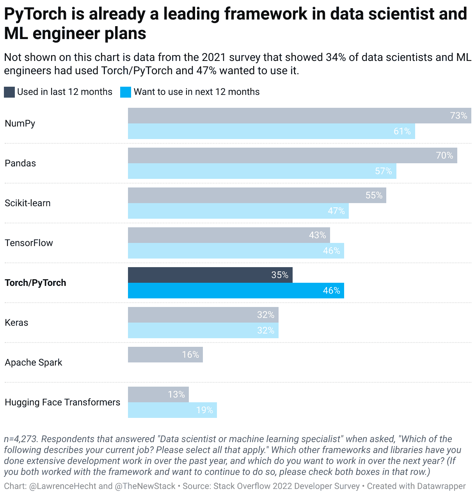

# PyTorch 将 AI/ML 带回它的研究，开源根源

> 原文：<https://thenewstack.io/pytorch-takes-ai-ml-back-to-its-research-open-source-roots/>

Meta 决定启动 PyTorch 基金会，并向 Linux 基金会贡献 PyTorch 机器学习框架，这表明该技术已经成熟，并向其开源根源迈进了一步。

专注于人工智能研究的公司 [CPMAI](https://www.cognilytica.com/cpmai/) (原名[cognelytica](https://thenewstack.io/snorkel-tackles-ais-most-tedious-task/))的管理合伙人 [Ronald Schmelzer](https://www.linkedin.com/in/rschmelzer/) 说，除了人工智能在文本和图像生成、自然语言处理、计算机视觉以及模式检测和预测分析方面的一些应用之外，人工智能的采用似乎停滞不前。

Schmelzer 告诉 New Stack:“开源在市场上的采用速度比供应商解决方案快得多，这可以从许多快速发展的初创公司、独角兽和 IPO 公司遇到的困难中看出。”“随着开源技术和数据在人工智能领域的领先地位，Meta 放松对 PyTorch 的控制并让社区指导其发展也就不足为奇了。”

## PyTorch 基金会

PyTorch 转移到独立的新 PyTorch 基金会，隶属于 Linux 基金会，其管理委员会由来自 AMD、AWS、Google Cloud、Meta、微软 Azure 和 Nvidia 的代表组成。Meta AI 在一篇[博客文章](https://ai.facebook.com/blog/pytorch-foundation/)中说 [PyTorch 基金会](https://pytorch.org/foundation)将作为这项技术的管理者，并将通过会议、培训课程和其他倡议来支持 PyTorch。

Meta AI 表示，自 2018 年 PyTorch 1.0 发布以来，PyTorch 已成为人工智能研究的通用语言。“该框架将继续成为 Meta 的人工智能研究和工程工作的一部分，”该团队在其帖子中说。“PyTorch 也是亚马逊网络服务、微软 Azure、 [OpenAI](https://thenewstack.io/microsoft-demos-ai-development-at-build-using-openai-codex/) 以及许多其他公司和研究机构构建的人工智能研究和产品的基础。”

这些组织大多是 PyTorch 基金会的创始成员。

“这是一个脸书+谷歌+ AWS 对微软的故事，”新堆栈的分析师 Lawrence E. Hecht 说。“堆栈溢出调查收集了近 4000 名用户的数据。与研究平均值相比，他们最近更有可能使用谷歌云(35%比 20%)。相差 75%。这也让谷歌超越了微软 Azure(py torch 用户的 25%和整体用户的 23%)，更接近领先的 AWS (44%比 41%)。

## 炒作过去？

“在许多方面，人工智能正在退回到一些研究和开源根源，投资者和盈利性公司对人工智能的炒作和兴趣似乎正在减弱，”Schmelzer 说。“我们已经过了人工智能炒作的巅峰，正在逐渐降温。是的，我们已经过了人工智能的非理性繁荣，进入了一些清醒的现实。像 C3、 [DataRobot](https://thenewstack.io/predibase-takes-declarative-approach-to-automl/) 和其他公司现在真的很难做，因为人工智能在许多组织中都不是首选。”

Constellation Research 的分析师 Holger Mueller 指出，一般来说，在一个独立的组织中拥有一个开源框架更好。“我们也可以假设 Meta 认为 PyTorch 不再是它想要单独投资的地方——也许它与元宇宙用例不那么相关，”他说。

## 开源第一

根据 Linux 基金会执行董事吉姆·泽姆林的说法，AI/ML 是一个真正的“开源优先”的生态系统。大多数流行的 AI 和 ML 工具和框架都是开源的。Zemlin 在一篇博客文章中说:“社区显然重视透明性和开源精神”,并指出 Linux 基金会将为 PyTorch 提供一个中立的家园。

此外，PyTorch 基金会的使命是通过用 PyTorch 培养和维持开源、厂商中立项目的生态系统来推动人工智能工具的采用。它将使最先进的工具、库和其他组件民主化，让每个人都可以使用这些创新。Meta 说，它还将专注于 PyTorch 和相关生态系统的业务和产品营销。这种转变不会导致 PyTorch 的代码和核心项目发生任何变化，包括其独立的技术治理结构。

“截至 2022 年 8 月，PyTorch 是世界上发展最快的五个开源软件社区之一，与 Linux 内核和 Kubernetes 并列，”Zemlin 说。“从 2021 年 8 月到 2022 年 8 月，PyTorch 统计了超过 65，000 次提交。超过 2，400 名投稿人参与了这项工作，提交问题或 PRs 或撰写文档。这些数字使 PyTorch 成为历史上最成功的开源项目之一。”

## 5 ^(周年纪念日)

今年 1 月，PyTorch 庆祝了它在 Meta 的人工智能实验室成立五周年。现在，所有的版本、特性和技术方向都将继续由 PyTorch 的社区驱动:从单个代码贡献者，那些审查和提交变更的人，到模块维护者。

“PyTorch 基金会的成立将确保未来几年商业决策由多元化的成员群体以透明和公开的方式做出，”PyTorch 首席维护者兼 Meta 人工智能研究员[sou Smith chint ala](https://www.linkedin.com/in/soumith/)在[的博客文章](https://pytorch.org/blog/PyTorchfoundation/)中说。

然而，他说，技术决策仍然在个人维护者的控制之下。

虽然到目前为止，PyTorch 的业务治理是无组织的，并且“像一个斗志昂扬的初创公司”，但下一步是支持多个利益相关者的利益。

“我们选择了 Linux 基金会，因为它拥有丰富的组织经验，可以托管大型多利益相关方开源项目，实现组织结构的适当平衡，并为这些项目找到具体的解决方案，”Chintala 说。这样的项目有 Linux、 [Kubernetes](https://thenewstack.io/primer-how-kubernetes-came-to-be-what-it-is-and-why-you-should-care/) 、 [Node.js](https://thenewstack.io/node-js-creator-blasts-node-js-offers-a-secure-typescript-based-alternative/) 、 [Hyperledger](https://thenewstack.io/blockchain-hyperledger-project-grows-ibm-adds-ecosystem/) 和 [RISC-V](https://thenewstack.io/open-source-risc-v-serving-a-side-of-software-with-chips/) 。

<svg xmlns:xlink="http://www.w3.org/1999/xlink" viewBox="0 0 68 31" version="1.1"><title>Group</title> <desc>Created with Sketch.</desc></svg>