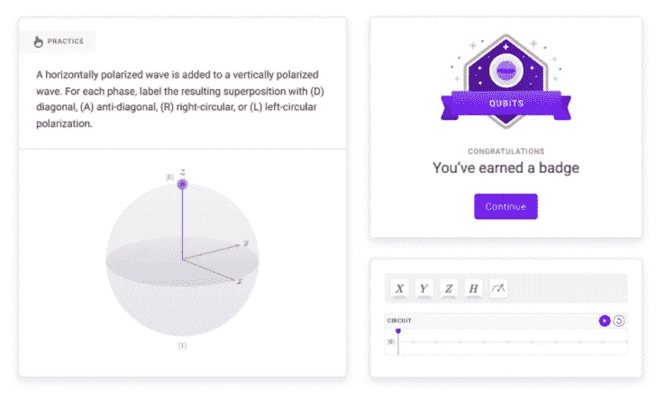
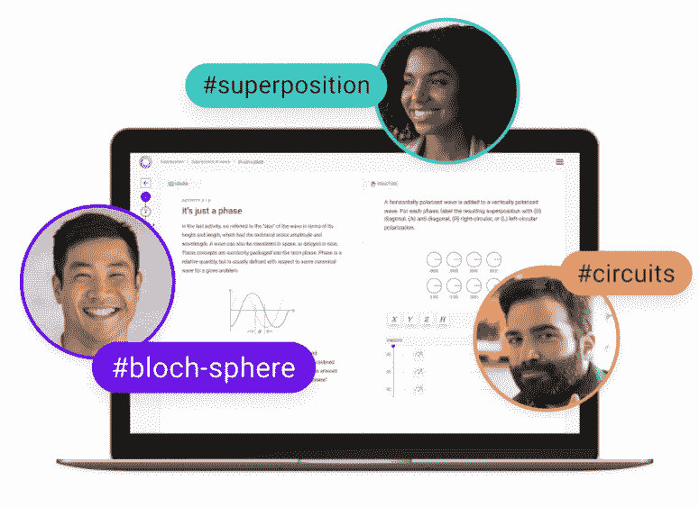

# Q-CTRL 黑欧泊:面向大众的量子学习

> 原文：<https://thenewstack.io/q-ctrl-black-opal-quantum-learning-for-the-masses/>

越来越多的努力让更多的程序员、数据科学家、工程师和其他技术专家进入新兴的量子计算领域。对物理学等学科的博士和硕士学位的投资，以及针对高中和更低年级学生的项目，有助于满足 T2 对该领域熟练员工快速增长的需求。

量子解决方案制造商 Q-CTRL 的创始人兼首席执行官 [Michael Biercuk](https://www.linkedin.com/in/mjbiercuk/) 表示，所有这些投资都是合理且必要的。然而，他们缺少了至关重要的第三个组成部分，Biercuk 告诉新的堆栈。

“这个等式中被忽略的是所有邻近的专家，他们不是中学六年级的学生，也不打算在这个领域获得博士学位，因为他们已经成为专业软件工程师 15 年了，希望利用他们的技能，”他说。“我们需要这些人，就像我们需要量子物理学或量子计算的博士一样。"

## **黑欧泊推出**

为了解决这个群体的问题，Q-CTRL 本月推出了 [Black Opal](https://q-ctrl.com/products/black-opal/) ，这是一个交互式学习平台，使用视觉和动画工具、动手任务、沙盒进行培训，并提供一个合作社区来帮助 Biercuk 所谓的“好奇的技术专家”更容易地了解量子计算，从[量子位](https://thenewstack.io/quantum-switchable-qubit-quickly-flips-between-storage-and-fast-calculation-modes/)(量子位)到叠加(量子计算机的一个功能，它同时存在于几个独立的量子状态中)到布洛赫球(单位球表面上量子位状态的几何表示)。

这位首席执行官说，这些人“可能是本科生，可能是知名的专业开发人员或工程师，也可能是高管”。“但他们希望深入了解这一领域，这样他们才能真正利用这一优势，获得战略优势。这是技能培训差距的一部分，但我们认为这是真正被忽视的一部分。”

Q-CTRL 成立于 2017 年，其理念是建立控制机制，以解决量子技术中的挑战，如提高硬件性能，加速实用量子计算机的发展。该公司在四年内筹集了 4040 万美元，其中包括 8 月份最新一轮的 2200 万美元。

“Q-CTRL 专注于让量子技术变得有用，”Biercuk 说，他已经在量子计算领域工作了二十年。“我们非常精通技术。我们构建基础设施软件，使量子计算机性能更好。我们建造量子传感器，使我们能够在没有 GPS 的情况下进行新形式的地球观测或导航，这一切都是由我们在量子控制方面的特殊专业知识实现的。我们是量子计算行业的推动者。”

## **Q-CTRL 客户中的 IBM、ri getti**

他说，该公司的客户包括 IBM、量子计算公司 [Rigetti](https://www.rigetti.com/) 和美国国家实验室。当准备好自己的劳动力时，Q-CTRL 的高管们看到了他们自己的工程师在量子计算方面的技能差距，并开发了一系列旨在帮助他们跟上速度的程序，其中许多程序已经在 Black Opal 中整合和产品化。

“我们为我们的产品雇佣了前端工程师、DevOps 工程师和后端工程师，我们需要让他们在某种程度上跟上速度，”这位首席执行官说。“所有这些不同的因素汇集在一起，激励我们打造这款产品。最终对我们来说，它既是对社区的服务——它满足了更广泛的量子产业的真正需求——但它也是一座重要的桥梁，让许多对这一领域感兴趣的人进入我们更具技术性的产品。”

量子计算行业正处于硬件加速发展的阶段。IBM 本月宣布了其最新的量子处理器“鹰”——一种 127 量子位的芯片——并计划在未来几年内推出一种新的量子系统和超过 1000 量子位的芯片。还有其他知名公司，如 T4、谷歌、微软和霍尼韦尔，以及越来越多的初创公司也在硬件领域取得进展。也就是说，实用的量子计算系统还需要几年的时间。

## **让软件开发人员工具就位**

与此同时，随着量子计算的成熟，人们也在努力使[应用程序和开发工具](https://thenewstack.io/lambeq-a-toolkit-for-quantum-natural-language-processing/)就位。然而，Biercuk 说，与开发经典计算机相比，量子编程面临一系列挑战。其中之一是硬件相对较新。

“我们还没有到可以像在普通电脑上那样完全抽象硬件的地步，”他说。“现在有更多的 JavaScript 开发人员或 Python 开发人员不知道晶体管是如何工作的。然后是真正懂硬件的人。硬件的发展在量子计算方面还太不成熟，现在需要更多的知识才能得到真正的实际输出。”

他说，通过给量子计算机编程，人们试图建立必要的抽象和框架来给量子计算机编程。

“它们正在开发中，现在，所有引领这个行业的人至少对引擎盖下发生的事情有一些了解，”Biercuk 说。“对于想要获得战略优势的人来说，这些知识是必不可少的。这就是我们在黑欧泊的培训中要融入的内容。这显然是量子编程，但它也让人们深入了解幕后发生的事情，这样你就可以现实地利用量子计算机，并在你正在做的[算法开发](https://thenewstack.io/algorithm-speeds-monte-carlo-predictions-on-quantum-computers/)中挑战极限。”

## **传播量子知识**

Black Opal 可以在任何浏览器上访问，它的一个目标是让所有参与量子计算的人——软件工程师、开发人员甚至高管——熟悉该领域，以便他们可以在团队和职业生涯中做出好的决策和好的投资。

这位首席执行官说，编程都是用 Python 完成的，并补充说，“如果你能用 Python 编程，你就能给大多数量子计算机编程，但你不知道你在做什么。没有一些知识，在这个领域取得进展几乎是不可能的。Q-CTRL 和其他公司非常努力地专注于改进硬件，以至于我们可以让这些抽象变得真正实用和有价值。但现在，你必须清楚引擎盖下发生了什么，这一点非常重要。”

这要从基本概念开始，比如量子计算或叠加中的测量，或者以直观的方式为可能没有物理学背景的人解释量子位。Black Opal 的创建理念是将专家驱动的内容与产品焦点相结合，使用交互性、3D [JavaScript](https://thenewstack.io/javascript-forecast-whats-ahead-for-ecmascript-2022/) 等工具以及现代程序员期望从技术教育项目中获得的其他技术。

到目前为止，关于量子物理学的大部分信息来自教科书，最近，YouTube 上的互动和多媒体视频也有所增加。比埃尔克说，Q-CTRL 想要改变这种状况。

“我们的产品由两种关键活动构成，”他说。“一个是学习途径。您可以逐步浏览有详细内容的课程。互动增加了内容。它有动画。它有互动活动和问题等等。…它们与我们所说的实践途径相匹配，这是一个开放世界的沙盒，可以玩到您将在学习途径中发展的关键技能。”

<svg xmlns:xlink="http://www.w3.org/1999/xlink" viewBox="0 0 68 31" version="1.1"><title>Group</title> <desc>Created with Sketch.</desc></svg>