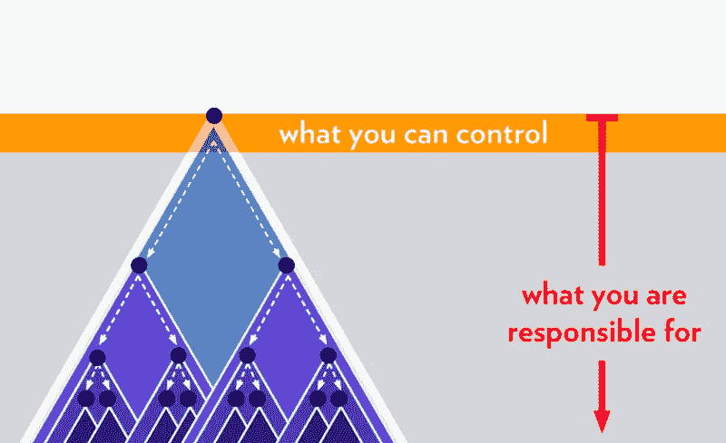

# 问答:Ben Sigelman 谈微服务中“深度系统”的出现

> 原文：<https://thenewstack.io/qa-ben-sigelman-on-the-emergence-of-deep-systems-in-microservices/>

在将整体软件架构分解为离散的模块化块的过程中，[微服务](https://thenewstack.io/category/microservices/)最近通过提高软件敏捷性、应用可伸缩性和自治性而成为了一种流行的 IT 挑战解决方案。但是，伴随着新的、面向服务的软件架构的这些好处而来的是新的挑战。随着微服务的兴起已经转化为令人难以置信的多层结构，相应地需要了解、跟踪和监控这些离散的分布式元素如何在这些日益“深入的系统”中相互交互

为了更好地了解“深度系统”的出现和影响，我们采访了 [LightStep](https://lightstep.com/) 的首席执行官兼联合创始人[本·西格曼](https://www.linkedin.com/in/bensigelman/)，该公司为深度、多层系统提供[可观测性](https://thenewstack.io/observability-a-3-year-retrospective/)解决方案。除了共同创建 [OpenTracing](https://opentracing.io/) 和 [OpenTelemetry](https://opentelemetry.io/) OSS 项目，Sigelman 之前还与谷歌合作，部署 [Dapper 分布式跟踪](https://ai.google/research/pubs/pub36356)，并推出他们的高可用性时间序列收集、存储和分析平台 Monarch。

**什么是“深度系统”，它们与微服务的出现有什么关系？这种情况和过去有什么不同？**

我们的行业采用微服务是为了更快地交付高质量的软件。由于数百名开发人员在一个业务单元中工作，我们需要创建单独管理的单元——“微服务”——可以由小团队独立自主地开发、部署和操作。

但是这些微服务实际上并不是独立的，当然:它们依赖于其他微服务，其他微服务也依赖于它们。架构的*深度*是端到端应用堆栈中独立管理的层的*数量，包括微服务、单片和托管云服务。“深层系统”是具有四个或更多这些独立管理的层的生产架构。*

现在，从某种意义上来说，自从 20 世纪 40 年代函数调用的发明以来，堆栈已经“很深”了。深度*系统*的不同之处在于，这些现代*分布式*堆栈中的每一层都是由不同的开发团队开发、部署和操作的。当请求跨越层和团队之间的界限时，传统的工具完全崩溃，调查步履蹒跚:这就是为什么深度系统与灾难性的随叫随到的转变、性能之谜、无法解释的回归、团队间的相互指责以及降低功能速度的总体缺乏信心高度相关，并最终导致创新。

**当前系统的“深度”如何影响控制和责任？**

这是非常重要的一点。我在一篇[博客文章](https://lightstep.com/blog/how-deep-systems-broke-observability-and-what-we-can-do-about-it/)和各种演讲中提到过这个问题(例如，这个在 [QCon](https://qconsf.com/sf2019/presentation/architectures-scale-deep-regaining-control-deep-systems) 上的演讲和这个在[Systems @ Scale conference](https://atscaleconference.com/videos/systems-scale-2019-how-deep-systems-broke-observability-and-what-we-can-do-about-it/)上的演讲)，但是用文字来说明比用文字来描述更容易:

压力可以简单地定义为“无法控制的责任”在这种情况下，深度系统对 DevOps 压力如此之大的原因很容易理解。*根据设计*，在微服务架构中，开发人员只控制他们自己的服务，然而*他们最终要对他们在深层系统中所依赖的一切的性能和可靠性负责*。当下游有许多层独立管理的服务时，一个人所控制的和一个人所负责的之间很快就会出现分歧，这是一个巨大的问题。

**为什么我们需要重新思考可观察性的“三大支柱”？**

微服务的可观察性充斥着误导和/或被误导的建议。也许最突出的是，所谓的“可观察性的三个支柱”——踪迹、度量和日志——只是可观察性解决方案的*原始输入数据*。充其量，它们是“遥测技术的三大支柱”，或者更讽刺地说，“我们已经被并购的三种产品，现在需要找到一种营销方式。”在任何情况下，围绕作为不同*产品*功能的踪迹、度量和日志构建可观察性策略是一个重大错误:建立可观察性实践的唯一明智的方法是围绕实际的用例和工作流。虽然跟踪、度量和日志在这些工作流中都有它们的位置，但是将它们作为单独的功能处理意味着在发布、事件和性能调查期间，您将(至少)打开三个选项卡，并且进一步意味着当您从一个切换到另一个(并且一次又一次地返回)时，您将丢失上下文。

> 所谓的“可观察性的三个支柱”——踪迹、度量和日志——只是一个可观察性解决方案的*原始输入数据*——本·西格曼

使用便携式高性能仪器收集您的跟踪、指标和日志。我偏爱 OpenTelemetry 或它的前身项目 OpenTracing 和 OpenCensus(现在已经合并，很清楚)，但任何厂商中立的项目都可以。然后围绕三个关键用例构建可观察性:

1.  部署新的服务版本(即创新)，
2.  降低 [MTTR](https://en.wikipedia.org/wiki/Mean_time_to_repair) (即强制 [SLO](https://en.wikipedia.org/wiki/Service-level_objective) s)、
3.  提高稳态性能(即提高 SLO)。

很难找到直接构建这些用例的供应商。LightStep 是其中之一，但要明确的是，作为创始 CEO，我有一些确认偏见！但是这些才是在可观察性方面真正重要的事情——不要被拖入基于原始数据类型的令人困惑的评估中；他们不会自己创造价值。

**你提出了哪些解决方案，它们是如何运作的？**

对于深层系统，困难的问题通常涉及多个服务之间的交互，这些服务跨越分布式堆栈的多个独立管理的级别进行通信。跟踪是模拟这些多服务、多层依赖关系的唯一遥测类型，因此跟踪必须构成深层系统中可观测性的基础。

例如，假设您构建、监控和维护*服务 A* 。如果*服务 A* 依赖于*服务 Z*——可能通过几个中介——并且*服务 Z* 推出了一个坏的版本，这将很可能对*服务 A* 和中间的一切的性能和可靠性造成严重破坏。这里正确的方法是从服务 A 的角度构建应用程序 ***的模型，并在类似上面的*服务 Z* 的假设错误发布之前、期间和之后拍摄该模型的快照。通过在每个快照中集合数千个轨迹，可观察性解决方案可以找到非常强的统计证据，证明*服务 A* 行为的回归是由于*服务 Z* 中版本标签的变化；此外，还可以将负面变更与其他指标和服务 Z* 中的日志关联起来，无论是在不良发布之前还是之中。**

LightStep 使用像[快照](https://lightstep.com/blog/snapshots-detailed-system-behavior-saved-shareable/)和[相关性](https://lightstep.com/correlations/)这样的构建模块开创了这种方法——使用自助式 [LightStep Play](https://lightstep.com/play/) 演示可以轻松体验。

你的方法 **与同类竞争对手有何不同？**

从历史上看，大多数其他方法并没有将分布式跟踪数据放在第一位——因此，它们几乎没有办法分析或表示深层系统中服务之间的复杂依赖关系。近年来，面向度量或日志记录的产品已经将分布式跟踪“放在一边”，通常作为可以在跟踪可视化工具中手动检查的单个数据点。

这种生硬、简单的方法可以有效地识别有限数量的异常问题，但是生产中的复杂问题更加微妙。LightStep 的方法是独一无二的，它对单个跟踪进行采样和分析，以解决特定的高价值问题:“在这个版本中出了什么问题？”，“为什么上个季度性能下降了？”，“为什么我的寻呼机响了？!"

例如，我们的一个客户最近经历了一次特定后端性能的突然下降，深入到他们的堆栈中，结果发现根本问题是他们 100，000 个客户中的一个客户在 2000 年前改变了他们的流量模式。这在查看聚合跟踪统计信息后的几秒钟内就很明显，尽管他们估计仅查看日志、指标甚至单个跟踪信息就需要几天时间。

这一切都是可能的，因为 LightStep 的卫星架构允许我们的产品以相同(或更低)的成本访问比传统 SaaS 解决方案多 100 倍的数据。有了如此多的数据，以及共处一地的存储和计算，我们提取了更多关于深层系统的上下文；这就是为什么我们赢得了 Lyft、GitHub、Twilio、安德玛等进步客户的信任。

在未来，你认为这个行业会朝着什么方向发展？你的公司目前正在采取什么样的未来步骤？

我们的行业仍然在思考深度系统的全部操作和管理含义。不久，我们将认识到高质量的可观测性是深度系统高速开发的绝对先决条件，可观测性策略必须围绕关键用例，而不仅仅是围绕遥测。OpenTelemetry 项目也将在供应商、云提供商和关键 oss 基础设施软件中变得无处不在。这对开发者和运营商来说是一件好事，因为高质量的遥测技术将是高性能的、厂商中立的和“默认开启的”

此外，可观察性技术的消费者将理所当然地要求定价单位是可预测的、可控制的，并且与这些解决方案所解决的挑战的范围成比例-今天，传统解决方案中的定价与不可预测且与价值相关性差的数据量相关联。

就 LightStep 而言，我们将继续做迄今为止让我们成功的事情:在我们为深度系统构建简单、有主见的可观察性产品时，仔细倾听我们的客户和潜在客户。由于最近对自动化遥测收集和单一服务分析功能的关注，个人开发人员现在可以在几分钟内采用 LightStep，并立即对自己服务的性能和可靠性进行更好的控制，特别是在部署新版本或推理下游依赖关系时。展望未来，LightStep 将吸收越来越多形式的遥测技术，并在整个软件生命周期中继续围绕用例开发新产品——这样，我们的产品就可以强大而不令人难以招架。

<svg viewBox="0 0 68 31" version="1.1" xmlns:xlink="http://www.w3.org/1999/xlink"><title>Group</title> <desc>Created with Sketch.</desc></svg>