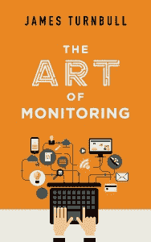

# 詹姆斯·特恩布尔:微服务时代的监控艺术

> 原文：<https://thenewstack.io/qa-james-turnbull-art-monitoring-age-microservices/>

 到目前为止，有远见的系统架构师开始意识到，迁移到微服务架构需要一套全新的监控工具。传统的应用程序监控工具是为长期运行的物理服务器而构建的，并不适合监视可能在不到一分钟的时间内出现和消失的短暂容器。

[James Turnbull](https://jamesturnbull.net/) 一直在关注微服务监控的新兴实践，最近出版了一本关于这个主题的书——《监控的艺术》，既提供了一些技术细节，也提供了监控动态系统的整体策略。*此处阅读摘录[。](https://thenewstack.io/introducing-riemann/)*

白天，特恩布尔是 Kickstarter 的首席技术官，此前他在 Docker、Venmo 和 Puppet Labs 担任技术领导职务。作为一个大忙人，他也写过关于 Docker、LogStash、Puppet、Nagios 和 Linux 的书。

我们采访了 Turnbull，寻求一些关于微服务监控的免费建议，并了解他的新书可以为项目经理、系统架构师、系统管理员或首席技术官提供的更多信息。

**是什么让传统监控工具不太适合微服务/容器架构？**

传统的监控假设主机或服务是长期存在的。我们现在生活在一个有云、虚拟化和容器的世界里；基础设施发展迅速，变化也非常快。容器出现和消失的速度远远快于您为它们设置 Nagios 检查的速度。你有一个整体的景观，那里存在动态快速移动的短期基础设施。这种传统的监控领域几乎没有解决这个问题。

过去，你可能有一台服务器，它运行 Apache，运行你的网站或某种类型的网络服务或应用程序。该服务器可能作为物理服务器存在了一段时间，然后作为虚拟机存在。它的寿命可能和应用程序一样长。您知道它运行 Apache，并且您可能监控它的磁盘、CPU 和内存。它很少改变。

然后，突然之间，你的应用程序或运营团队中的新贵说，“我们要运行 Docker 这个东西。我们将在一个容器集群上运行我们的 web 应用，而不是服务器。”如果我们想要更多的容器，我们只需添加更多的容器。

所以负责下水的人说，“嗯，集装箱叫什么？”一个运营人员说，“嗯，这只是一串随机的数字。”监控人员说，“那么，我该如何监控呢？”“我不知道。去搞清楚。”

> 所以这仍然是一个相当不成熟的市场。许多开源工具也开始具备容器意识，比如 Sensu 和 Nagios。但是我认为根本的问题是一个架构问题，那就是当前的工具不太适合容器或服务架构。

因为你要做什么？一个容器的出现和消失就像它的正常运行时间可以用分钟或秒来衡量一样。假设您已经完成了一个触发事务的服务。该服务只存在几秒钟，但是您希望以某种方式跟踪它的性能。你想知道它正在运行。

 [监控的艺术:目录

*   **第 1 章**:监控简介
*   **第 2 章**:监控、度量和测量
*   第 3 章:黎曼事件和度量
*   **第 4 章**:存储和绘制指标，包括 Graphite 和 Grafana
*   **第 5 章**:带 collectd 的基于主机的监控
*   **第 6 章**:监控主机和服务
*   第 7 章:容器——另一种主机
*   **第八章**:日志和测井，包括构造测井和 ELK 叠加
*   **第 9 章**:构建监控应用
*   第十章:警戒和警戒管理
*   **第 11-13 章**:监控应用和堆栈
*   附录 Clojure 的介绍](https://www.artofmonitoring.com/) 

因此，您必须弄清楚要监控的正确抽象是什么。是集装箱吗？是服务吗？是服务中容器的数量吗？你必须执行传统的监控过程，通过 thing 一台机器，说，“告诉我这是什么状态，比如我连接到 Apache 端口 80 了吗？做一个 HTTP Get，返回一些内容。”

如果您不知道运行您的服务的这个东西的名称，并且您不能保证当您 ping 它时它会在那里，您如何监控它？所以这就提出了一大堆非常有趣的挑战。

关于公司可能使用的软件，是开源软件还是商业解决方案？

我认为目前，特别是在监控服务和容器领域，工具集有限。很明显，许多商业公司正在更新他们的服务，比如 Datadog 和 New Relic，使其具有容器意识。但是直到最近，容器中还没有很多挂钩。没有太多可供监控的 API。你可以做最基本的事情，比如查询 Docker 守护进程。如果你有一项服务，你真的需要写一份健康检查。

所以这仍然是一个相当不成熟的市场。许多开源工具也开始具备容器意识，比如 Sensu 和 Nagios。但是我认为根本的问题是一个架构问题，那就是当前的工具不太适合容器或服务架构。

因此，我在书中提出的是，传统上监控这种情况的两种类型。一种是基于轮询的监控，Nagios 就是这样做的，它轮询一个服务，说:“你在吗？告诉我你是什么状态。”还有基于推送的监控。

因此，在这种情况下会发生什么，服务或容器可能会醒来并开始运行，容器内是服务发现工具。它醒来后告诉监控系统，“我还活着！这是我的衡量标准。”

在这种情况下，监控系统要么 pings 某种配置管理数据库(CMD)，要么像 etcd 或[consult](https://www.consul.io/)这样的工具。

在某种程度上，如果容器消失了，它就停止输出指标，您的监控系统就会说，“哼，我再也没有得到任何指标了。我需要担心这个吗？”它可以轮询出一个发现系统来询问“那个容器还是一个东西吗？我还需要在乎吗？哦，不是的。你已经关机了。好吧。我再也不需要为此担心了。”或者它说，“那个容器应该还在那里，我没有从它那里得到更多的数据。我现在应该做点什么。我应该采取一些行动。我应该告诉一些人，我期待看到的这些容器或服务之一已经消失了。”

**你对等式的另一边有什么想法吗，向管理员展示所有这些指标？**

所以我认为，直到最近，关于监控真正有趣的事情是，传统的警报往往是基于电子邮件的。他们往往会看到类似这样的错误消息，“主机 A 上的磁盘使用率为 88%。警告。”或者，“主机 A 上的磁盘使用率为 95%。关键。”如果我看那个警报，它不是很有背景，对吗？我真的不明白我是不是有问题。

那么 95%可以吗？15tb 的 95%。在过去的 30 秒内，它是否从 88 增加到 95，并且它将达到 100%并撞倒机器。还是会增量式增长？刚刚打到 95。再过一个月可能会达到 96。

> 如果人们要随叫随到，如果他们的睡眠将被打扰，如果他们的家庭生活将被打乱，你希望通过不让他们重复做不重要的事情来最小化这种经历的痛苦。

所以我不知道这种警告的背景。

例如，如果您正在处理应该由计算机使用的数据，如指标或日志条目，请将其转换为结构化形式。如果你正在处理应该由人类使用的数据，例如，我将在凌晨三点被来自 [PagerDuty](https://www.pagerduty.com/) 的警报吵醒，那么给我一些上下文。

这意味着，如果我打开手机或笔记本电脑，发现 95%的磁盘都在这台机器上，那么我的警报应该包含显示过去 24 小时内磁盘增长情况的图表，还可能包含该机器的一些其他状态的图表，如该机器的 CPU 和内存已达到最大值。那台机器上肯定发生了什么事。我可以采取一些行动。

与其花前几分钟看警报，试图弄清楚这是不是一个问题，我可以立即得到一些相关的背景。

如果人们要随叫随到，如果他们的睡眠将被打扰，如果他们的家庭生活将被打乱，你希望通过不让他们重复做不重要的事情来最小化这种经历的痛苦。但是，如果他们被重要的事情吵醒，你需要减少理解和解决问题的时间。

**如果你想比较跨系统的度量，你需要一套一致同意的定义，定义什么是被度量的，什么是应该实际进行度量的工具。你认为这两方面有什么问题吗？**

当您考虑监控时，您需要标准化您在整个环境中监控的内容。因此，如果我测量 CPU 或磁盘，我使用的是相同的指标、相同的数据。所以我在做一个苹果对苹果的比较。

如果我有一个正在监控的应用程序，我会每十秒钟采样一次事务率。但是在机器上，我是以一秒的间隔对磁盘 I/O 进行采样的。因此，如果有一些差异，我将这两个指标关联起来，其中一个是每十秒，另一个是每秒。因此，如果我有不同的分辨率，我很容易错过十秒钟窗口内的行为，这些行为可能会影响一秒钟间隔内的指标。

> 我首先看一下业务指标。我首先关注我客户和企业关心的事情

所以在这本书里，我鼓励人们选择一个解决方案，并在任何地方都保持一致，这样你就总是在相同的粒度上比较事物。

还有定义。例如，如果您创建像 use ast 1 . application group . application name . Apache . httpcommand . get 这样的指标，那就是一个模式，您应该像对待一个模式一样对待它，这样您就知道计算 get 命令的每个应用程序都是相同的路径，相同的模式。这样你就知道组织中的任何人都了解这个应用程序发生了什么，并且[可以]将正在使用的应用程序的行为与 Heroku 上或 Docker 容器中或其他地方的应用程序的行为进行比较。

**有没有一个或几个指标是您在提高绩效时首先考虑的标准指标？**

我不知道有一个单一的衡量标准。我认为这取决于您的应用程序做什么，以及客户对该应用程序的期望是什么。我首先看一下业务指标。我首先关注我客户和企业关心的事情，例如，响应时间。

亚马逊非常关心一个人一键下单有多容易。一键订购一定会让亚马逊赚到一大笔钱。因此，如果一键订购没有响应，那肯定会导致人们不使用它。

因此，我考虑了这一点，并开始衡量这一点，然后深入到应用程序，寻找与该业务指标相关的所有指标。产生这种结果的因素是什么？我的 API 的速度，我的数据库事务的速度，诸如此类。接下来，我将查看基础架构指标，如多少内存和磁盘等。所有这些都可以归结为一件事，比如一键订购的响应时间。

然后，如果点击订单的响应时间突然发生变化，比如以前是 3 微秒，现在是 5 微秒，我可以深入了解并询问哪些事情发生了变化。我可能看到一台机器真的很奇怪。那里发生了什么事？数据库系统真的在运转。啊哈！我们应该为那个特定的表添加一个索引。

然后，一旦我们得到索引，响应时间就下降到 3 毫秒。我回到了正轨，我的客户也很高兴。"

**出版这本书的目的是什么？**

我写这本书是作为一个框架，一个潜在的方法。我选择了一些我喜欢的技术，但我也推荐了一大堆其他技术，所以我提供了这些替代技术的优缺点。

希望它能激发灵感，让你思考如何监控你的系统。至少，它应该让人们想到他们可以以不同的方式进行监控。这就是我的意图，是提供一个提高监控水平的路线图，而不是一个关于如何实现一些工具的技术指南。

TNS 研究分析师劳伦斯·赫特对本文有贡献。

<svg viewBox="0 0 68 31" version="1.1" xmlns:xlink="http://www.w3.org/1999/xlink"><title>Group</title> <desc>Created with Sketch.</desc></svg>