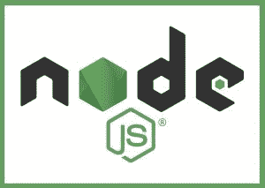
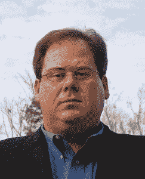

# 认识一下 Node.js 基金会的新任执行董事马克·辛克尔

> 原文：<https://thenewstack.io/qa-mark-hinkle-new-executive-director-node-js-foundation/>

如今， [Node.js](https://nodejs.org/en/) 正处于从网络、物联网和桌面应用到微服务架构的一切事物的罩下。Node 每月超过 1500 万次下载，每周超过 10 亿次包下载，使其成为世界上最大的开源平台。

[Node.js 基金会](https://nodejs.org/en/foundation/)成立于 2015 年，在 Linux 基金会的支持下，旨在支持 Node 的持续增长和发展。该基金会代表了对节点生态系统的开放治理，从财富 500 强公司到个体经营者自由职业者，每个群体的成员名单都在稳步增长。

就在上周，基金会董事会正式任命马克·辛克尔为该组织的执行董事。或者，正如 Hinkle 所描述的，“我戴上了 Node.js 基金会的[恐怖海盗 Roberts](https://www.wired.com/2015/02/ross-ulbricht-didnt-create-silk-roads-dread-pirate-roberts-guy/) 的面具——这是一种半开玩笑的方式，表明我在这里帮助确保 Node.js 在我离开很久以后继续成为一个健康、不断增长的生态系统。”

[认识一下 Mark Hinkle，Node.js 基金会的新任执行董事](https://thenewstack.simplecast.com/episodes/meet-mark-hinkle-the-new-executive-director-for-the-node-js-foundation)

这是职业生涯的一次侧面跳跃，因为辛克尔已经担任了 Linux 基金会的营销副总裁。不过，不要让营销头衔迷惑了你——Hinkle 拥有坚实的技术背景，可以追溯到 20 世纪 90 年代，为互联网服务提供商 Earthlink(前身是 MindSpring)提供技术支持。在此期间，Zenoss、Cloud.com、Citrix 和一些较小的科技初创公司都有很好的表现，几乎都专注于开源和社区问题。Hinkle 还在 2000-2004 年间担任 LinuxWorld 杂志的主编。

在把他的办公椅搬到他的新办公室两周后，马克·辛克尔与新的 Stack 谈论了所有关于 Node 的事情。

你什么时候开始在新岗位上工作的？

我已经在 Linux 基金会工作了一年零三个月，但是在最后的四个月里，我一直在探索 Node 基金会。我一直在帮助解决 Node 的事情，比如为我们的 Node 互动会议寻找赞助，同时加快一切的速度。

这一切是怎么发生的？我一直在 Linux 基金会工作，推动世界上最大的共享技术合作。当我去年秋天去奥斯汀的 Node.js Interactive 时，我立即被 Node.js 社区吸引住了。参与其中的个人的热情让我惊叹不已。Node.js 项目和社区令人难以置信的成就给我留下了深刻的印象，我走出会议，立即打电话给我的老板(Linux 基金会执行董事[吉姆·泽姆林](https://www.linkedin.com/in/zemlin/))并告诉他，“我想参与这个项目——这是一个难以置信的机会。”

**对于我们这些开发者来说，“节点”意味着运行时环境。但你是 Node.js 基金会的负责人。有什么区别？**

在加入 Node 后，我积极地去做，因为尽管没有很多正式的结构，但它的进步给我留下了深刻的印象。(这是)有机的、草根的增长，所有这些人在没有支持或组织的情况下使用和创造。所以我想帮助所有这些实体和人们——主持所有的建设系统和所有的志愿者，组织会议，协调资源。该基金会作为一种指导实体，帮助培育这个生态系统。

我认为，与其说我们自己在做这项工作，不如说我们在支持和促进节点社区的工作，帮助实现这种协作。

合作主要在两个领域。首先，你有生态系统的集体智慧。所有的小东西加起来很酷，就像所有的 npm 包加起来支持 Node。第二，协调——将所有这些部分组合在一起。集体和协调部分都是必不可少的。比如举办会议，为开发者提供一个聚集成一个社区的地方。这不会就这样发生——这是一项繁重的工作，需要有意识的协调。

**你现在是如何找到基金会的——你的[情况如何](http://www.urbandictionary.com/define.php?term=sitrep)？你希望在未来把事情带到哪里？**

我们开始行动了。Node.js 基金会并没有那么老。我们试图找到基金会如何支持社区的动力，使 Node 取得如此巨大的成功。

短期目标是设定目标。就在今天早上，我还在看我将在下次董事会上提出的目标。这是我认为的目标，但我是新人，所以请告诉我你的想法。从长远来看，我们将继续努力:

*   让更多的人参与进来——去年，我们将提交者的人数增加了一倍，从大约 600 人增加到 1200 多人。

*   吸引公司参与 Node——个人在那里，我们也希望公司加入。

*   创建活动，让所有的公司和个人面对面，建立牢固的关系，让虚拟社区更有功能。一旦你们坐下来一起喝杯啤酒或咖啡，并对彼此有了一点了解，就更容易和某人一起工作了。

*   围绕 Node 继续推动和促进基线能力认证计划。对于一项被广泛采用的技术来说，这是至关重要的事情之一:你如何证明某人真的擅长这项技术？认证标志着生态系统是真实存在的，并且会一直存在下去。

*   支持代码和学习事件，在 Node 中非常活跃的工作组。所以[我们]正在想办法确保他们拥有成功所需的资源。

Node.js 是否应该被视为一个运行时或环境，或者它是否可以作为一个最小的框架，这是不同开发者派别之间的争论——你站在这场争论的哪一边？

这完全是视角的问题。那个摇摆的台阶怎么样？

所以，说真的，Node 并不是所有用例的终极解决方案。说它只是一个运行时的人有一个比 Node 提供的更复杂的用例。那些称之为框架的人非常适合 Node。例如，Twitter 的用例非常具体，每天向移动设备发送数百万条消息，Node 可以很好地适应这种情况。

取决于你如何来到 Node，它可以像盲人来看大象的寓言。如果你是一个移动开发者，它看起来像一个移动开发平台。如果你是一名物联网人士，你可能会将其视为大规模实现该技术的一种方式，就像 [Skycatch](https://www.skycatch.com/) 在无人机方面所做的那样。由于来自云，Node 看起来像一个潜在的 API 代理。诸如此类。

我们希望人们理解节点就是所有这些东西。出于这些原因以及更多原因，该节点是合适的位置。

**写的最后一本书？最近读过的书？**

我只写了一个——“[Windows 到 Linux 商业桌面迁移](https://www.amazon.com/Windows-Linux-Business-Desktop-Migration/dp/1584504226/)”一个真正的翻页机！回到过去，每年，我们 Linux 世界的每个人都会说，“这将是 Linux 桌面的最后一年！”但是因为 Android，我写的很多东西最终都变成了现实。

至于阅读，我刚刚读完穆赫辛·哈米德的《[如何在崛起的亚洲变得暴富》、](http://www.npr.org/2013/03/05/172897018/hamids-how-to-for-success-filthy-rich-in-irony)》(这是一部小说，讲述了一个极度贫困的街头顽童如何成为南亚工业巨头的故事，而不是书名重复的那种“不惜一切代价快速致富”的商业书籍)。在那之前的书是蒂姆·费里斯的《[巨人的工具:亿万富翁、偶像和世界级表演者的策略、惯例和习惯》。我想我是在他的一个播客里听说的。](https://toolsoftitans.com/)

**你办公室外的激情是什么？**

我是一个烧烤迷。我明天要去奥斯汀，我最喜欢的烧烤就在盐湖城。其余的时间，我是一个大后院烧烤的家伙。我喜欢自己吸烟——我办公室外面有一个大绿蛋吸烟者。由于科技的奇迹，我甚至可以远程控制我的吸烟机上的风扇。

**最后的话？**

现在技术被采用的方式不再是等级森严，从顶层到底层，用户。如今，用户和提供解决方案的供应商一样拥有控制权，因此需要合作。不再是“下载我的试用共享软件，经历公司收购中最不愉快的购买周期之一，然后最终因为你的供应商没有提供测试期间承诺的所有功能而不高兴。”

开源把所有这些都置之不理。因此，我们在这里是为了确保人们知道在更大的开源世界中正在发生什么，它如何能够与 Node 融合在一起，并向所有正在做所有真正令人敬畏的事情的人学习。

我真的很期待向大家展示 Node 的所有功能，以及使用它的所有方式。开始讲述所有的故事——NASA 现在正在宇航服中使用 Node，这多酷啊？！我很幸运能来到这里。

<svg xmlns:xlink="http://www.w3.org/1999/xlink" viewBox="0 0 68 31" version="1.1"><title>Group</title> <desc>Created with Sketch.</desc></svg>