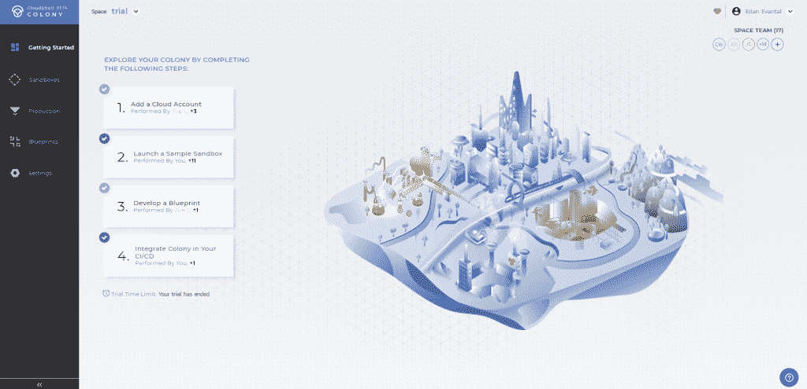

# 质量:从基础设施即代码到环境即服务

> 原文：<https://thenewstack.io/quali-from-infrastructure-as-code-to-environments-as-a-service/>

“基础设施即代码”的概念是作为一种帮助自动化服务器管理和配置过程的方式出现的，事实也的确如此。虽然这种方法也提供了像对待软件设计一样对待基础设施设计的方法，有了版本控制和协作，它仍然需要高水平的专业技能和知识。

根据公司声明，云沙盒供应商 [Quali](https://www.quali.com/) 希望通过本周发布的有限可控可用性的 [Cloudshell Colony](https://www.quali.com/cloudshell-colony) 使任何人，从 it 和项目经理到开发人员和开发团队，都可以“从单一控制台管理云资源的使用”。换句话说，Quali 希望以代码的形式提供基础设施的好处，而不需要先决的专业知识。

当我们[去年与 Quali](/quali-wants-to-be-the-netflix-for-cloud-development-sandboxes/) 交谈时，该公司宣布其意图是通过提供部署在任何公共、私有或混合云上的用于开发、测试、演示、培训等的自助服务环境，成为“云开发沙箱的网飞”。然而，该解决方案是为采用内部云或混合云的公司提供的，而不是为使用云原生方法的公司提供的。根据该公司的声明，Cloudshell Colony 提供了一个 SaaS 版本的 Cloudshell，“为 DevOps 团队、开发人员和测试人员提供了公共云上可重用的应用环境，如亚马逊网络服务、支持 Kubernetes 部署的微软 Azure”。

[https://www.youtube.com/embed/CU_004kRMxE?feature=oembed](https://www.youtube.com/embed/CU_004kRMxE?feature=oembed)

视频

“设置环境容易出错、耗时，并且难以自动化和排除故障。Quali 首席执行官 Lior Koriat 在声明中表示:“更具挑战性的是，要以一种可扩展的方式为多个团队服务，包括对基础设施一无所知的团队成员，同时还能与 CI/CD 管道无缝合作。”。“CloudShell Colony 旨在通过使用更少的代码和更好的错误处理来提高管道稳定性，从而更高效地交付 IT 环境，消除配置不一致，并增强 DevOps 价值链中所有利益相关方的能力。”

Koriat 解释说，Cloudshell Colony 不仅消除了与定义基础设施相关的许多复杂性，还允许您使用可视化编辑器或在 YAML 中定义环境。

“作为用户，你不需要设置或管理 Kubernetes 的任何复杂性。“Cloudshell Colony 让你不用考虑这些复杂性，”Koriat 说。“Cloudshell Colony 类似于基础设施即代码，但我们允许用户直观地描述环境。当你是开发人员时，使用代码很容易，但当你不是开发人员时，就很难了。有一些解决方案允许开发人员或 DevOps 团队用代码定义云基础设施。我们意见不同。我们在上面一层。我们为您的应用提供治理和环境，最终转化为底层代码。”

除了消除复杂性，Koriat 还解释说，Cloudshell Colony 有助于轻松地从一个云迁移到另一个云。

“通过使用像我们这样的解决方案，您可以将自己从云锁定中释放出来，”Koriat 说。“你可以采用完全相同的蓝图，在 Azure 或亚马逊网络服务上运行。在不同的云上迁移和运行只需很少的工作或成本。”

Cloudshell Colony 目前与 AWS、Azure 和 Kubernetes 合作，未来计划与谷歌云平台合作。对于版本控制，它支持 GitHub 和 Bitbucket，GitLab 支持也计划在未来推出。支持的 CI/CD 和管道工具目前包括 Azure DevOps、TeamCity 和 Jenkins，支持的工件库包括 S3 桶和 Azure 存储，Artifactory 仍处于规划阶段。

Quali 目前提供 Cloudshell Colony 的 30 天免费试用，预计将于 2019 年 4 月宣布全面上市。

通过 Pixabay 的特征图像。

<svg xmlns:xlink="http://www.w3.org/1999/xlink" viewBox="0 0 68 31" version="1.1"><title>Group</title> <desc>Created with Sketch.</desc></svg>