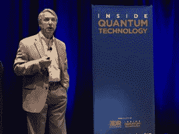
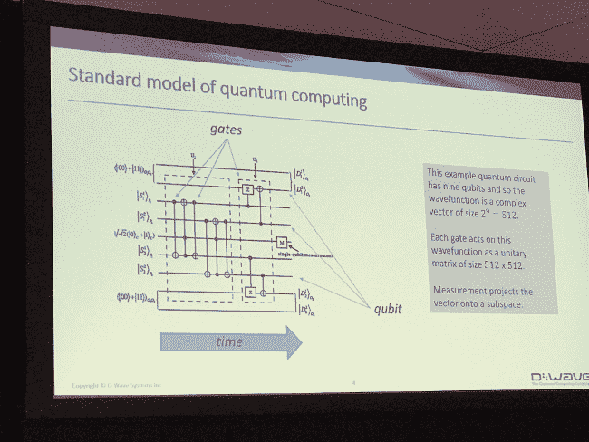
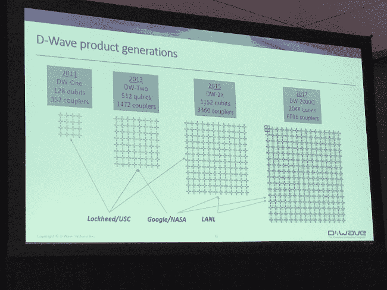
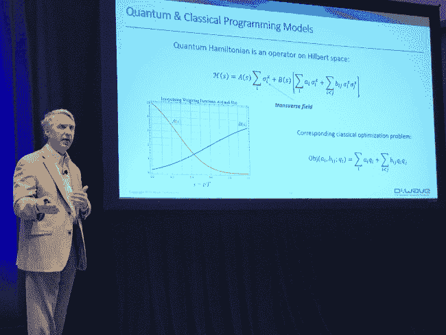
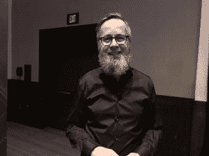
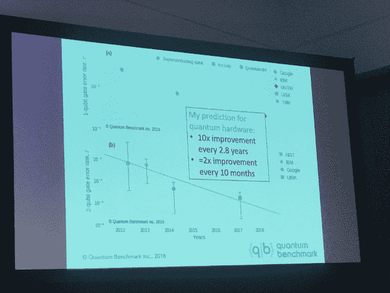

# 量子计算挑战商业化

> 原文：<https://thenewstack.io/quantum-computings-challenging-liftoff-to-commercialization/>

如果说从最近的两起波音 737 Max 飞机坠毁悲剧中可以学到什么的话，那就是我们建造的复杂系统(比如飞机)将需要前所未有的安全测试。早期的报告似乎表明，困扰飞机导航系统的实际上是一个安全功能，但它自己的故障逃避了无数小时的测试和建模。

正是这种复杂的系统建模可能最终将量子计算带入商业领域。

像区块链一样，量子计算已经成为一段时间以来被吹捧为革命性的技术之一，有望成为可能的解决方案，如果不是现成可行的话。大约十年来，量子计算一直在慢慢接近 IT 的商业领域，每一代新一代量子比特(qubit)计算机都在解决实际问题方面显示出更多的前景，这种问题是人们花钱解决的。

D-Wave 的爱德华“丹尼”达尔，在内部量子技术会议。

因此，上周在波士顿举行的 [Inside Quantum Technology](https://iqtevent.com/) 会议将自己定位为第一个以商业为导向的量子计算活动，并试图回答量子计算在实际产生大量收入方面的问题。

答案是:还没有。

“明年不会有价值 10 亿美元的量子产业。或者后年。或者后年，”风险投资公司 [StrangeWorks](https://www.strangeworks.com) 的首席执行官 [Whurley](http://whurley.com/) 在他的演讲中说道。

尽管如此，创新的步伐确实在加快，并吸引了投资者和系统建设者的目光。

IBM 量子计算应用研究员特拉维斯·斯霍尔滕在他的演讲中说:“这项技术正在走出学术界，进入商业领域。”。IBM [提供](https://www.research.ibm.com/ibm-q/)云量子计算服务。随着[工具包已经可用](https://www.microsoft.com/en-us/quantum/development-kit)，微软计划通过其 Azure 云提供量子协同处理服务。微软甚至将其量子研究团队转移到 Azure 集团。量子计算初创公司 [D-Wave](https://www.dwavesys.com/home) ，已经提供量子计算机超过十年，提供[一分钟完全免费的托管量子计算](https://cloud.dwavesys.com/leap/login/)(这比你预期的要多得多，甚至可能用不上)。

但是，前面仍然有技术障碍，更不用说让全世界的软件开发人员放弃他们的智能感知而学习物理的巨大挑战了。即使完全商业化，这种激进的方法也只有少数初步用途，特别是高性能计算(HPC)社区正在处理的那些用途。

好消息是，行业参与者已经确定了一些体系结构方法，并开始着手构建所有需要的工具。如果成功的话，它们将帮助我们走过纯数字计算的时代。

## 技术发展水平

物理学家理查德·费曼在 20 世纪 80 年代早期想出了“量子计算”的想法，作为模拟复杂科学问题的一种方式，特别是围绕量子力学的问题(费曼自己发现有必要通过图表来思考问题)。将量子态映射回二进制“数字”态会消耗太多资源。为什么不把量子物理学中的一个问题映射到一个以量子特性为基础的系统中呢？

量子特性可以以量子比特的形式被捕获。它们通常由一个电子或磷原子的原子核锻造而成，可能由一个 T2 约瑟夫森结转换。就其本质而言，量子位能够同时保持两种不同的状态，每种状态的程度不同，并以概率表示——非常适合量子建模。

量子计算系统制造商 [D-Wave](https://www.dwavesys.com/home) 的首席研究科学家[爱德华“丹尼”达尔](https://www.linkedin.com/in/edward-denny-dahl-1b67676/)解释道:“它可以完全是‘0’或者完全是‘1’或者两者之间的某种组合。”。"这是一个非常抽象的计算模型。"

来自 D-Wave 的爱德华·丹尼·达尔

达尔解释说，量子计算机的设计主要分为两大阵营。

一个是 gate 模型，基于[量子傅立叶变换](https://medium.com/@jonathan_hui/qc-quantum-fourier-transform-45436f90a43) (QFT)，一种[快速傅立叶变换](https://www.mathworks.com/help/matlab/ref/fft.html) (FFT)的量子实现，一种[通过将基于时间的信号转换为基于频率的信号(反之亦然)将](https://www.mathworks.com/help/matlab/math/fourier-transforms.html)信号从噪声中分离出来的方法。由物理学家彼得·肖尔发明的 QFT 将这些变换原理应用到量子层面，在那里它们可以被用于相移量子门。

达尔警告说，这种方法在纠错方面有很大的开销。可能需要多达 100 个量子位来对生产量子位进行纠错。“纠错是可能的，但开销很大，”达尔说。

达尔偏向于他自己公司的方法:退火，这是一种有着几百年历史的冶金技术，向一个系统添加热能——传统上是加热——然后移除这些能量以将材料弯曲成所需的状态。D-Wave 的退火方法不是使用能量，而是使用量子波动([不确定性的气泡](https://www.sciencedaily.com/releases/2018/08/180820113053.htm)在一个均匀的空间中弹出)来建立一个配置空间。每组量子位元都有一组对应的、数量更多的耦合器，将它们连结在一起。

达尔承诺，如果你可以将一个问题转化为某种景观，它可以以量子形式进行计算，并补充说一组大约 8000 个数字可以构成一幅景观。

该领域似乎正在确定一种通用的架构风格。通过会议，人们反复讨论量子协同处理，而不是量子计算。量子计算的大部分准备工作将继续用人们反复提到的“经典计算机”来完成。

## 市场优化

事实证明，费曼为量子计算机列出的任务清单非常有先见之明。今天，最好的用例是解决那些太复杂的问题，即使是通过一群商业服务器也很难解决。

达尔提到了 D-Wave 感兴趣的三个领域:优化、材料模拟和机器学习。

优化可能类似于以最有效的方式安排大量的航班或送货。英国在线杂货店 [Ocado](https://www.ocado.com/webshop/startWebshop.do) 使用 D-Wave 机器为机器人生成最佳路线，为顾客组装市场食品篮。

材料模拟是一种新兴的用例，在这种情况下，量子计算机可以表征材料的属性，如相变。他们可以充分利用将一组粒子的动能和势能相加的哈密顿算符。

IBM 的斯霍尔滕进一步解释说，模拟更大的分子需要更大深度的电路。他说，发现这些性质的过程将是迭代的，将一个试验状态运送到一个量子平台来估计能量，能量被返回到相邻的经典系统。

IBM 的特拉维斯·斯霍尔滕。

IBM 本身一直在研究量子计算，以解决机器学习和风险分析方面的大量工作。通过 ML，该公司希望增加建模的维度数量，量子计算提供了一种比较两种不同模型的方法。量子计算还可以极大地减少进行[蒙特卡罗模拟](https://www.investopedia.com/terms/m/montecarlosimulation.asp)的时间，这是风险分析的一个基本要素。

空中客车公司全球研究和技术合作经理 Paolo Bianco 解释说:[航空航天公司](https://www.linkedin.com/in/paolobianco1/)[空中客车](https://www.airbus.com/)已经在认真研究量子计算的竞争优势。该公司长期以来一直是高性能计算(HPC)的狂热用户，也被称为[超级计算](https://www.top500.org/)，以解决其最大的计算。昆腾的[行情同样看好](https://www.nextbigfuture.com/2019/01/airbus-cto-predicts-a-quantum-computing-era-in-aerospace.html)，[至少投资了一家初创企业](https://www.prnewswire.com/news-releases/qc-ware-raises-6-5-million-series-a-financing-for-its-cloud-quantum-computing-software-service-300678415.html)， [QC Ware](https://qcware.com/press) 。

空中客车公司一直在寻找量子计算来进行[故障树分析](http://asq.org/quality-progress/2002/03/problem-solving/what-is-a-fault-tree-analysis.html)，这是一种可以用来找到导致系统故障的最小故障数量的技术(空中客车公司的竞争对手波音公司可能需要[多一点](https://qz.com/1575509/what-went-wrong-with-the-boeing-737-max-8/))。与其他公司一样，空客正在寻找一种经典-量子混合方法，量子可以定义最小集，并将其交给经典或 HPC 计算来完成任务。

为了刺激该领域的更多创新，这家航空航天巨头推出了空中客车量子计算挑战赛，这是一组棘手的空中飞行物理问题(包括飞机爬升优化、翼盒和飞机装载设计优化)。迄今为止，已有来自 44 个国家的 292 个团队和个人报名参赛。

## **秘密成分:人**

胡利

这是空客的明智之举。量子计算的最大挑战不是技术，而是建立一支劳动力队伍来编程和运行量子计算设备。发言者和与会者反复表示，鉴于经典计算开发所需的技能与量子计算编程所需的技能完全不同，这尤其棘手。

“你不能让一个软件开发人员成为量子计算工程师，”Whurley 说。"为了操纵这些机器，你需要了解心理学."

许多与会者认为，就像早期计算需要理解底层硬件一样，量子计算也需要理解物理学。虽然传统观点认为这是通过框架等建立正确抽象的问题，但其他人，如 Whurley，认为差距太大，量子计算无法用经典计算的语言来表达。

“这是一种教育，而不是抽象的东西，”他说。

Whurly 的总部位于奥斯汀的 StrangeWorks 正在寻找量子计算的“长期投资”，尽管他承认现在开始挑选赢家还为时过早。他说:我们还没有到英特尔和 AMD 竞争的阶段。

我们什么时候到达那里？该领域的许多乐观主义者预测，量子计算最早将在 2021 年成为一个成熟的行业，而其他人预计几十年内不会繁荣。

“这是一个非常长远的观点，我们需要在这个领域，”Whurley 说。

## 量子优势

在这次会议上，许多人谈到我们什么时候可能会看到(不幸命名的)“量子优势”，量子计算达到经典计算无法比拟的熟练程度(“传统计算”)？).

然而，达到这样的量子优势有其自身的问题:确保准确性。

许多人认为，拥有 50 个量子位的量子计算机是 quantum 超越最强大的 HPC 计算机的关键。然而，你如何检查工作呢？像谷歌这样的从业者故意保持他们的设计简单，这样他们的结果可以被经典计算机检查，[乔·艾默生](https://www.linkedin.com/in/joseph-emerson-qig)，[量子基准](https://quantumbenchmark.com/)的首席执行官，滑铁卢大学应用研究教授指出。

量子基准的首席执行官乔·爱默生。

数字计算和量子计算完全不同。数字计算是离散的和可预测的。量子计算是连续的，容易出错。他说，量子计算的能力呈指数增长，但错误率增长得更快。

“纠错是你想要建立的架构的核心，”微软量子计算业务开发总监 [Ben Porter，](https://twitter.com/MuchPorter)在他自己的演讲中表示同意。

Pixabay 的 skeeze 的专题图片。

<svg xmlns:xlink="http://www.w3.org/1999/xlink" viewBox="0 0 68 31" version="1.1"><title>Group</title> <desc>Created with Sketch.</desc></svg>