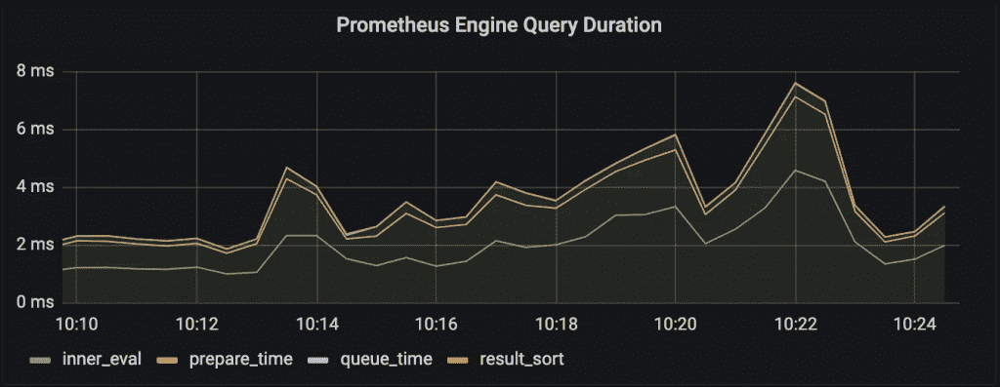
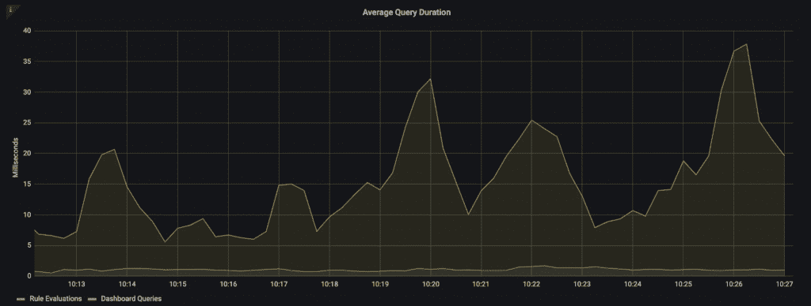

# 普罗米修斯世界中的查询优化

> 原文：<https://thenewstack.io/query-optimization-in-the-prometheus-world/>

我们从遭遇 Prometheus 挑战的工程组织那里听到的一个常见动机是关于查询性能。随着我们收集的指标数据量的增加，通过控制面板和警报使用这些数据的成本自然会变得更高。但是普罗米修斯提供了什么工具来帮助我们呢？在这篇文章中，我们将看看 Prometheus 为查询工作负载提供的一些可见性，以及我们用来提高慢速查询性能的选项。

## 什么决定了查询性能？

 [约翰·波托克尼

John 是 Chronosphere 的高级销售工程师，在监控和可观测性领域拥有近十年的经验。John 最初是一名从事时序数据收集和分析的工程师，后来担任了售前/客户支持职位，并与多个行业的公司合作解决他们独特的可观察性挑战。](https://www.linkedin.com/in/johnpotocny/) 

在我们深入这里的细节之前，让我们讨论一下影响查询性能的最大因素。一般来说，在查询数据时，除了硬件限制之外，整体性能的最大因素是我们需要考虑/处理多少数据才能生成结果。我们以前在实践中可能都经历过这种情况——当针对小数据集运行时，简单和复杂的查询都会很快返回，但是随着数据量的增加，性能会相应地开始下降。对于像 Prometheus 这样的时序数据库，我们可以特别关注两个因素，这两个因素决定了给定查询将考虑多少数据:

1.  一个查询需要处理多少个不同的序列？
2.  一个查询需要处理多少个数据点？

在这两者之间，我们通常更关心一个给定的查询处理多少个系列，尽管如果您的查询是在一个长时间范围内，数据点/样本的数量也开始变得重要。这就是为什么在长时间存储指标数据时，通常建议将指标数据下采样到较低的分辨率。除了节省存储成本之外，当我们希望一次查询几周或几个月的数据时，它还为我们带来了有意义的性能提升。

## 普罗米修斯给了我们怎样的可观测性？

既然我们已经了解了是什么决定了 Prometheus 查询的性能，那么让我们深入研究一下工具，以帮助我们确定是否有需要优化的查询。首先，如果您将 Prometheus 配置为自我抓取，它确实包含一些关于查询工作负载的高级指标，例如关于执行用户发出的查询所花费的时间与自动执行的规则(如记录或警报规则)的信息。这有助于我们跟踪 Prometheus 查询的总体性能，并在某个规则组的执行时间即将超过其执行间隔时提醒我们。



注意上图中`queue_time`**基本为 0；这是我们通常所期望的，除非服务器看到的并发请求超过了服务器的`query.max-concurrency`**标志所允许的数量。****

 ****

这里明显缺少的是任何关于针对 Prometheus 运行的查询的一般效率的信息。没有任何指标告诉我们有多少序列/数据点是从数据库中获取的，而不是返回给用户的。这就产生了一个问题，因为正如我们上面提到的，相对而言，查看有多少数据被读取和返回是了解我们的查询有多昂贵的最好方法。我们仍然可以使用可用的指标来检测查询是否缓慢，但是需要做额外的工作来了解这是因为它们正在获取许多不同的系列、获取许多数据点，还是因为存在其他问题，例如 Prometheus 缺乏可用的资源。

除了了解查询总体上是否高效/高性能，我们还想了解哪些查询在我们的工作负载中开销最大。从可用的指标中，我们可以看到 Prometheus 是否在评估警报和记录规则查询与临时查询上花费了更多时间，以及在规则查询导致问题的情况下，哪些规则组的开销最大。但是，我们在这里没有看到查询本身——对于 Prometheus 来说，这将是一个太大的基数，无法发送回自身。

为了了解特定查询的性能，我们可以启用`Prometheusquery`日志，它会将包含对服务器执行的每个查询的详细信息的 JSON 对象写入指定的日志文件。下面是输出的一个例子:

```
{
 "params":  {
      "end":  "2020-02-08T14:59:50.368Z",
      "query":  "up == 0",
      "start":  "2020-02-08T13:59:50.368Z",
      "step":  5
 },
 "stats":  {
      "timings":  {
 "evalTotalTime":  0.000447452,
 "execQueueTime":  7.599e-06,
 "execTotalTime":  0.000461232,
 "innerEvalTime":  0.000427033,
 "queryPreparationTime":  1.4177e-05,
 "resultSortTime":  6.48e-07
      },
      "samples":  {
 "totalQueryableSamples":  80,
 "peakSamples":  24
      }
      },
      "ts":  "2020-02-08T14:59:50.387Z"
}

```

这里的“计时”信息告诉我们给定的查询在各个执行阶段花费了多长时间，类似于我们上面看到的指标。从 Prometheus 版开始，包含了“samples”统计信息，它告诉我们获取的样本总数，以及在查询执行期间同时处理的样本的峰值数量—这与服务器的`query.max-samples`**标志有关，因此这里过高的值告诉我们是否需要增加服务器的限制。(请注意，增加此值也可能会增加内存使用量)。除了每个查询的统计数据之外，该文件还将包含启动查询的 HTTP 客户端/端点的详细信息，或者在警报/记录规则的情况下，包含与查询相关联的规则组的名称。**

 **这是有用的信息，但是该解决方案也有一些缺点:

*   在复杂的环境中，很难识别特定的用户发起的查询来自哪里。理想情况下，我们应该知道细节，比如与之相关的仪表板的名称，但不幸的是，Prometheus 自己无法确定。
*   我们无法限制记录到查询日志中的内容，这意味着在生产环境中，它将会快速增长。理想情况下，我们可以设置一个阈值，只记录超过一定持续时间的查询，或者在它们执行时获取一定数量的时间序列/数据点，因此我们只记录我们感兴趣的昂贵查询。

## 我们如何优化我们的查询？

我们已经看到了在 Prometheus 中识别缓慢/低效查询的选项。那么我们有什么选择来优化它们呢？我们在开始时注意到，PromQL 的查询性能主要取决于一个查询必须处理多少个系列/数据点，这意味着我们应该关注减少查询必须获取的系列/数据点数量的策略，以便优化查询。概括地说，我们有几个可用的策略:

### 缩短查询运行的时间范围

这显然是不理想的，因为它限制了我们考虑我们正在查看的数据的趋势的能力，但是当您有一个缓慢的查询并且需要更快地获得结果时，这也可能是最快的选择。

### 降低被查询指标的分辨率

如果我们降低数据的分辨率，那么我们将减少在给定时间段内评估查询所需处理的数据点的数量。这可能是一种合理的方法，特别是当我们试图提高查询的性能时，这种方法可以追溯到很长的时间窗口。不过在《普罗米修斯》中要做到这一点可能有些棘手。因为 Prometheus 不支持缩减采样数据，所以我们控制指标分辨率的唯一方法是通过我们配置的作业的刮擦间隔。这并没有给我们太多的灵活性。如果您希望获得用于检查最近行为的细粒度数据和用于长期趋势的较低分辨率数据，那么您必须配置两个重复的指定不同间隔的抓取作业，这意味着 Prometheus 上的更多负载、更多复杂性和更混乱的用户体验，因为用户需要明确地选择在他们的查询中查询哪个作业。Prometheus 的一些长期存储解决方案确实支持下采样数据，所以如果你遇到这个问题，如果你还没有使用，它们是值得考虑的。

### 减少被查询系列的数量

这通常是 Prometheus 查询的优化方式，通过使用记录规则来预聚合在新指标下查询的时间序列。不过，录制规则确实有几个缺点:

*   需要为您尝试优化的每个指标/查询定义它们，这意味着随着您的指标用例以及数据量的增长，您可能很快就会管理数百甚至数千个指标/查询。
*   此外，记录规则在系统的后台运行，因此您要向数据库添加恒定的负载来评估它们。这意味着添加更多的规则来优化不同的查询可能会成为 Prometheus 的一个重要工作来源，并导致其资源需求以超出您预期的速度增长。
*   还值得注意的是，因为规则是定期评估的，所以与原始序列可用时相比，来自给定规则的可用数据可能会有延迟。如果一个记录规则正在查询从另一个记录规则生成的指标名称，情况会变得更糟。新数据可用性的最坏情况时间变成数据的临时间隔加上链中涉及的所有规则的执行间隔。
*   最后，我们必须记住使用记录规则的结果来代替原始查询，否则，我们看不到任何好处。这意味着我们的规则需要被最终用户发现和理解，它们不能在后台透明地添加并自动加速我们的查询。

除了使用记录规则之外，我们还可以考虑从我们的应用程序发出的指标中删除维度，以便收集更少的时间序列；这里显而易见的权衡是，维度越少，对我们系统的了解就越少。这也不总是一个选项。如果您处理的是来自现成应用程序的指标，而不是您自己开发的指标，那么如果不进行聚合，就不可能减少所收集数据的基数。

## 超时空球如何帮助

如果您因为 Prometheus 设置中的查询性能问题而通读了这篇文章，那么您并不孤单！正如我们在开头所说的，这是我们看到的一个常见问题，也是我们一直在帮助解决的一个问题。

通过升级 Prometheus，Chronosphere 的客户经常会看到查询性能的显著提高，他们拥有所有熟悉的工具来优化查询性能，以及新的工具，如 [Chronosphere 的聚合规则](https://chronosphere.io/learn/how-can-recording-and-roll-up-rules-help-your-metrics/)或我们的[查询构建器](https://chronosphere.io/learn/announcing-query-builder-to-supercharge-your-promql/)来帮助理解是什么使缓慢的查询效率低下。我们还为客户提供了他们如何查询系统的详细视图，因此很容易理解工作负载的总体表现:

如果您有兴趣了解更多关于我们如何帮助您升级普罗米修斯体验的信息，[请告诉我们。](https://chronosphere.io/contact/)我们希望收到您的来信！

<svg xmlns:xlink="http://www.w3.org/1999/xlink" viewBox="0 0 68 31" version="1.1"><title>Group</title> <desc>Created with Sketch.</desc></svg>******