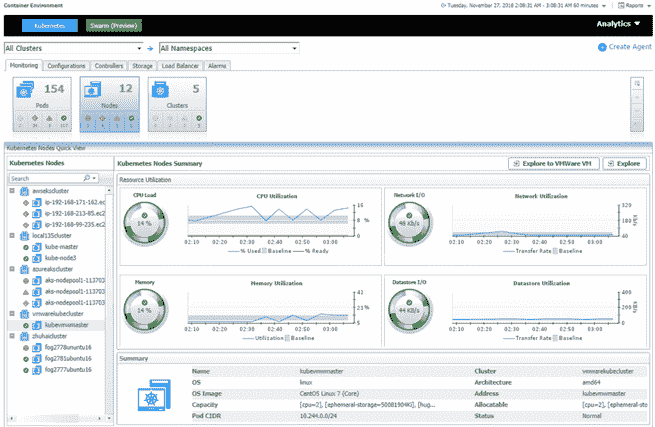

# Quest Software 负责集装箱管理

> 原文：<https://thenewstack.io/quest-software-takes-on-container-management/>

对于已经在 IT 行业工作了三十多年的 Quest Software 的首席技术布道者 T2 的阿德里安·摩尔来说，容器主要是新的名称。然而，对于 Quest 遍布 100 个国家的 130，000 家公司中的许多公司来说，集装箱是下一件大事，但它们可能还没有实现飞跃。根据最近的 [Cloud Foundry 报告](https://www.cloudfoundry.org/digital-transformation-2019/)，38%的受访者已经在使用容器，另外 43%的受访者正在评估或在有限的部署中使用容器，一半的受访者表示他们预计在未来两年内使用微服务。

像这样的数字就是 Quest 的原因，Quest 是一家 IT 支持工具提供商，如[fog light for virtual ization](https://www.quest.com/products/foglight-for-virtualization-enterprise-edition/)，正在寻求帮助组织采用其新发布的 Foglight Container Management 的容器，该公司声称，它“提供跨物理、虚拟和云环境的容器及其主机的实时和历史分析”，并充当“所有利益相关者在支持基础设施的上下文中查看容器的通用工具集，”根据公司声明。

“我们在 Foglight 集装箱管理方面所做的是以稍微不同的方式考虑集装箱化。我们在基础设施的背景下看待它，”Moir 在一次采访中说。“要了解基本容器化应用程序的性能，需要依赖于基础设施。在容器和基础设施的上下文中，我们现在可以实际看到哪些机器使用了过多的内存和/或网络。我们可以提取其中的信息，并将其呈现出来。”

Foglight 容器管理是一个独立的附加工具，它为容器和微服务增加了额外的可见性，同时还可以与 Quest 的其他工具(如 Foglight for Virtualization)一起使用。Foglight Container Management 能够通过 API 提供对 Kubernetes 和 Docker Swarm 的监控，提供各层容器(集群、节点、容器)的数据，并在容器热图和容器散点图中显示这些数据。

热图“提供了资源(容器、集群和主机)的实时和历史使用情况的视图，并使捕捉资源猪变得简单”，而散点图“允许用户通过三个不同的维度将 Docker 主机、集群和容器置于任何收集的指标之上。”此外，Foglight Container management 在与 Foglight for Virtualization 配合使用时，可帮助管理员评估虚拟机和容器的性能指标，以确定支持基础设施是否会影响容器性能。

Moir 在一份公司声明中表示:“IT 组织越来越多地致力于通过使用容器来实现应用部署和管理的现代化，但许多组织在大规模管理容器方面遇到了困难，因为通常需要使用不同的工具才能做到这一点。”。“借助 Foglight Container Management，IT 团队现在可以在一个位置访问实时和历史集装箱分析，为这些团队提供有效推动成功和可持续的集装箱部署战略所需的监控指标。”

在一次采访中，Moir 解释说，Quest 还提供工具来帮助其客户确定他们是否应该转移工作负载或留在原地。

“我们可以查看正在累积的成本，并使用机器学习和人工智能，根据您当前的增长率或变化率，或者您在各个领域改变工作负载的方式，我们可以预测云或本地的成本水平。在这种旅程发生之前，你可以看到接下来会发生什么。“对于正在过渡的人来说，这是一个非常理想的选择，可以将传统与新并列在一起，看看一个相对于另一个的表现如何，以及新堆栈中的问题在哪里。”

Moir 将当前的生态系统与多年前虚拟机的繁荣进行了比较，解释说创新会导致脱节，从而导致对 Foglight 容器管理等工具的需求。

Moir 说:“这有点像回到 10 年前的虚拟化时代，当时人们只是将虚拟机放在所有东西上，一切都很好，但突然之间，所有东西都停止了。”。“现在，容器变得越来越容易操作，也越来越容易扩展，但突然间，开发运维人员和基础设施供应人员之间出现了脱节。”

<svg xmlns:xlink="http://www.w3.org/1999/xlink" viewBox="0 0 68 31" version="1.1"><title>Group</title> <desc>Created with Sketch.</desc></svg>