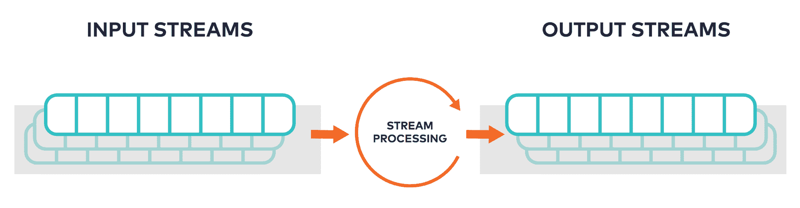

# 使用 ksqlDB 快速启动 Apache Kafka 流处理

> 原文：<https://thenewstack.io/quickstart-to-apache-kafka-stream-processing-with-ksqldb/>

Kafka 是收集和存储事件数据的事实上的标准——但是您能在您的应用程序中实时使用这些数据吗？这比看起来要复杂得多——您需要集成、保护和扩展不同的事件存储、处理和查询系统。这就是我们创建 [ksqlDB](https://ksqldb.io/) 的原因，这是一个专门为流处理应用程序构建的数据库。

## 什么是流处理？

Kafka 非常适合通过其持久的仅附加日志来处理事件。然而，对这些事件流实时采取行动可能是一个挑战。这就是像 ksqlDB 这样的流处理器的用武之地。KsqlDB 提供了一个处理模型来处理事件组，就像它们是内存中的集合一样，并使它们可以通过 SQL 访问。



流处理在数据**事件**传入时处理它们，并在它们传出时将它们推入被称为**主题**的管道。数据是不可变的，所以应用程序可以从一个主题中读取，计算新的信息，然后根据需要将结果推送到另一个主题中。

## 什么是流式数据库？

 [迈克尔·德罗加利斯

Michael 是 Confluent 的流处理产品负责人，负责所有与计算相关的事情背后的方向和策略。](https://www.linkedin.com/in/michael-drogalis-01029924/) 

流式数据库提供单个 SQL 接口，帮助您构建流处理应用程序，而不是与许多不同的子系统进行交互。因此，您不是处理事件和主题，而是处理流和表。流是一个主题，但是有一个明确定义的模式。SQL 用于创建这些流，定义它们的模式，插入、过滤和转换数据。同时，ksqlDB 负责执行这些语句的所有底层管理工作，因此您可以专注于开发您的应用程序。

## 创建新的流

正如所暗示的，要定义新的流，您可以使用 SQL CREATE 命令。虽然命令本身是相对简单的 SQL，但通过一些扩展，它最终控制了底层的 Kafka 主题，而无需用户直接接触 Kafka。

一个流有一个模式和一个给定的键，它们是命令的重要部分:

```
CREATE STREAM readings  (
    sensor VARCHAR KEY,
    location VARCHAR,
    reading INT
)  WITH  (
    kafka_topic  =  'readings',
    partitions  =  3,
    value_format  =  'json'
);

```

每当建立一个新的流，卡夫卡都会创建一个空的新主题，并相应地进行划分。ksqlDB 将这些定义的元数据存储在自己的主题中，每个 KsqlDB 服务器都可以将这些元数据作为对象的全局目录进行访问。

## 向流中插入行

SQL 用户会立即意识到我们使用标准的 INSERT 语句向流中添加数据。同样，不了解流管理、主题、分区等。开发人员需要开始将数据添加到这些流中。

下面是一些示例数据，在我们构建示例时，您可以加载这些数据

```
INSERT INTO readings  (sensor,  location,  reading)  VALUES  ('sensor-1',  'wheel',  45);
INSERT INTO readings  (sensor,  location,  reading)  VALUES  ('sensor-2',  'motor',  41);
INSERT INTO readings  (sensor,  location,  reading)  VALUES  ('sensor-1',  'wheel',  42);
INSERT INTO readings  (sensor,  location,  reading)  VALUES  ('sensor-3',  'muffler',  42);
INSERT INTO readings  (sensor,  location,  reading)  VALUES  ('sensor-3',  'muffler',  40);

INSERT INTO readings  (sensor,  location,  reading)  VALUES  ('sensor-4',  'motor',  43);
INSERT INTO readings  (sensor,  location,  reading)  VALUES  ('sensor-6',  'muffler',  43);
INSERT INTO readings  (sensor,  location,  reading)  VALUES  ('sensor-5',  'wheel',  41);
INSERT INTO readings  (sensor,  location,  reading)  VALUES  ('sensor-5',  'wheel',  42);
INSERT INTO readings  (sensor,  location,  reading)  VALUES  ('sensor-4',  'motor',  41);

INSERT INTO readings  (sensor,  location,  reading)  VALUES  ('sensor-7',  'muffler',  43);
INSERT INTO readings  (sensor,  location,  reading)  VALUES  ('sensor-8',  'wheel',  40);
INSERT INTO readings  (sensor,  location,  reading)  VALUES  ('sensor-9',  'motor',  40);
INSERT INTO readings  (sensor,  location,  reading)  VALUES  ('sensor-9',  'motor',  44);
INSERT INTO readings  (sensor,  location,  reading)  VALUES  ('sensor-7',  'muffler',  41);

```

在创建记录并序列化其内容之前，数据库检查每个记录的模式是否有效。

当我们讨论将行插入到流中时，请记住数据最终也将作为事件记录进入 Kafka 主题。已经使用 Kafka 的应用程序可以继续与 ksqlDB 应用程序并行运行。

## 转换事件流

接下来，我们开始通过修改其内容并将结果作为新的流发布来增加流的价值。使用 SQL 进行简单的转换不需要低级定制消费者/生产者代码。

这个持久查询将一个流(**读数**，如上)转换成一个名为 **clean** 的新流，该流将一个字段中的文本修改为大写。

```
CREATE STREAM clean AS
SELECT sensor,
reading,
UCASE(location)  AS location
FROM readings
EMIT CHANGES;

```

该查询创建一个作为新流运行的微型应用程序。当一个流接收新行时，持久查询 **(pq1)** 遍历每一行并写入另一个流。发出更改允许查询继续运行，并监视最近的事件。

在幕后，ksqlDB 将查询的物理执行计划编译为 Kafka Streams 拓扑。作为后台服务运行，它在新的主题记录到达时做出反应。处理在 ksqlDB 服务器上进行，并且可以跨节点进行水平伸缩。

## 从流中过滤出行

与转换类似，SQL WHERE 子句也可以进行过滤。不需要新的应用程序代码，并且相应地创建和管理新的流。

```
CREATE STREAM high_readings AS
    SELECT sensor,  reading,  location
    FROM clean
    WHERE reading  >  41
    EMIT CHANGES;

```

如你所见，我们在这一点上毫不费力地将几个流链接在一起。KsqlDB 机制通过链传播您的数据更改。

## 将流操作合并为一个

为了简化我们已经创建的东西，我们必须去掉我们不需要的流。

```
CREATE STREAM high_pri AS
    SELECT sensor,
 reading,
 UCASE(location)  AS location
    FROM readings
    WHERE reading  >  41
    EMIT CHANGES;

```

我们可以通过将操作合并成一个包含更多 SQL 的新流来绕过多个流。

## 管理分区键

在 Kafka 中，分区控制数据局部性(它在集群中的位置)。选择记录的关键方式至关重要，尤其是在使用 Kafka 客户端处理数据的情况下。我们在第一个示例中定义了键列 **(sensor)** ，但是在 ksqlDB 中，我们可以使用 PARTITION BY 子句来更改它。

```
CREATE STREAM by_location AS
    SELECT *
    FROM high_pri
    PARTITION BY location
    EMIT CHANGES;

```

当所有行具有相同的 **location** 值时，它们会协同定位，从而允许更高级的有状态操作，如流式连接和增量聚合。

这个最终的动画展示了整个工作流程，现在你可以看到所有相似颜色(相同位置)的圆都在同一个分区上结束。

## 了解有关 ksqlDB 的更多信息

我们只是触及了 ksqlDB 工作方式的表面，它的构造是简洁、可组合和优雅的。它们应该允许你比以前更快地开发新的应用程序和解决方案，而不会稀释 Kafka 的核心概念。

关注我们的[流处理博客](https://www.confluent.io/blog/category/stream-processing/)来讨论加入、伸缩、容错和时间如何工作。每一个都是一个迷人的世界。在那之前，没有什么可以替代[亲自尝试 ksqlDB](https://ksqldb.io/quickstart.html)。

<svg xmlns:xlink="http://www.w3.org/1999/xlink" viewBox="0 0 68 31" version="1.1"><title>Group</title> <desc>Created with Sketch.</desc></svg>