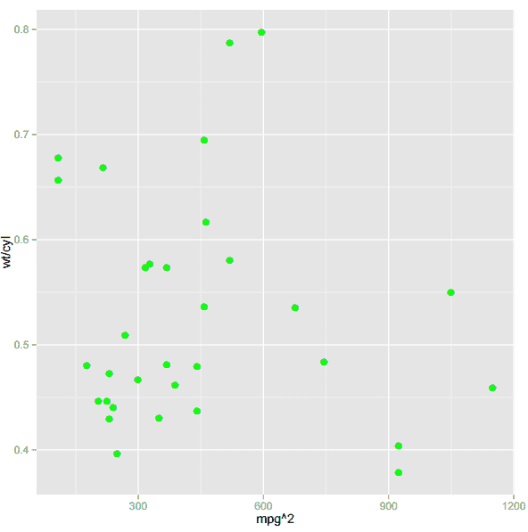
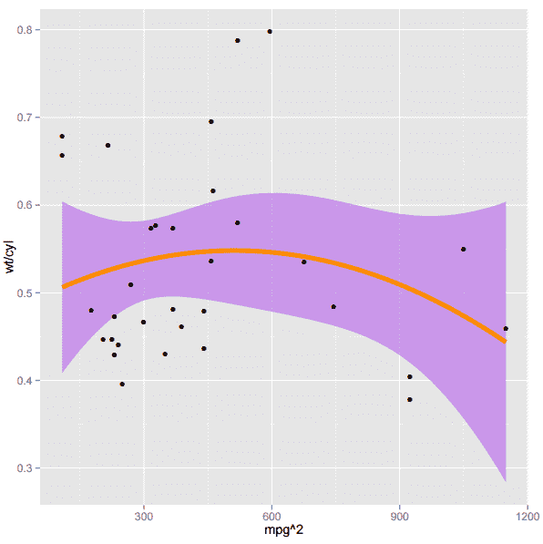

# r 包:使用 ggplot2 绘制分层图

> 原文：<https://thenewstack.io/r-package-drawing-layered-plots-with-ggplot2/>

如果 qplot 是 ggplot2 的组成部分，那么 ggplot 命令就是 ggplot2 包的超级组件。虽然 qplot 提供了一种灵活性较差的快速绘图，但 ggplot 支持分层图形，并提供了对图形的每一种美感的控制。ggplot 数据应为 data.frame 格式，而 qplot 应为 vector 格式。新手喜欢 qplot，而高级用户更喜欢 ggplot。阅读更多来自 stackoverflow.com 的文章。

在我们开始之前，记得首先将 ggplot2 库加载到当前工作会话中。

## **ggplot**

ggplot 设计为在多个层中工作，从原始数据层开始，然后添加统计信息层。我们将 ggplot 定义为 ggplot(数据，映射)，并可以使用 ggplot2 库中可用的内置数据集 mtcars。
这里有一个简单的例子:

输出将是:

```
[1]  "mpg"   "cyl"   "disp"  "hp"    "drat"  "wt"    "qsec"  "vs"    "am"    "gear"
[11]  "carb"

```

此处，输出将以如下格式显示(一个包含 11 个变量的 32 个观察值的数据帧):

```
Format:
[,  1]   mpg    Miles/(US)  gallon
[,  2]   cyl    Number of cylinders
[,  3]   disp   Displacement  (cu.in.)
[,  4]   hp     Gross horsepower
[,  5]   drat   Rear axle ratio
[,  6]   wt     Weight  (lb/1000)
[,  7]   qsec   1/4  mile time
[,  8]   vs     V/S
[,  9]   am     Transmission  (0  =  automatic,  1  =  manual)
[,10]   gear   Number of forward gears
[,11]   carb   Number of carburettors

```

这将显示数据集 mtcars 中的前几个条目:

```
mpg cyl disp   hp drat     wt   qsec vs am gear carb
Mazda RX4          21.0    6   160  110  3.90  2.620  16.46   0   1     4     4
Mazda RX4 Wag      21.0    6   160  110  3.90  2.875  17.02   0   1     4     4
Datsun  710         22.8    4   108   93  3.85  2.320  18.61   1   1     4     1
Hornet  4  Drive     21.4    6   258  110  3.08  3.215  19.44   1   0     3     1
Hornet Sportabout  18.7    8   360  175  3.15  3.440  17.02   0   0     3     2
Valiant            18.1    6   225  105  2.76  3.460  20.22   1   0     3     1

```

这将输出气缸类别(汽车的气缸数量)。你可以看到只有三个类别可用:

```
[1]  6  6  4  6  8  6  8  4  4  6  6  8  8  8  8  8  8  4  4  4  4
8  8  8  8  4  4  4  8  6  8  4
Levels:  4  6  8

```

```
ggplot(mtcars,  aes(factor(cyl)))

```

这不会绘制图形，所以先将其分配给某个变量，然后添加一些 geom(数据的几何图形)层，如条形图或线图:

```
g  &lt;-  ggplot(mtcars,  aes(x=factor(cyl)))
g  +  geom_bar(fill  =  "green")

```

[](https://thenewstack.io/wp-content/uploads/2015/04/ggbar.png) 
通过用 geom 设置下面的选项，我们可以得到一个彩色边框:

```
g  +  geom_bar(fill  =  "green",color="violet",size=2)

```

观察粗细尺寸=2(默认尺寸=1)的条的紫色边框:
[](https://thenewstack.io/wp-content/uploads/2015/04/ggbar2.png) 更多选项可以调整条的宽度:

```
g  +  geom_bar(fill  =  "green",color="violet",size=2,width=.5)

```

观察到，由于宽度=.5，实际条形宽度减少到初始宽度的一半:
[](https://thenewstack.io/wp-content/uploads/2015/04/ggbar-width2.png)

## **关于几何对象的更多信息**

geom(数据几何)有许多选项，用户可以在其中绘制图形层:

## **互换坐标**

使用 coord_flip()命令可以交换坐标。例如，要获得计数与因子(气缸)的关系图，在前面的图中再添加一个操作，如下所示:

```
g  +  geom_bar(fill  =  "green",color="violet",size=2,width=.5)+  coord_flip()

```

新命令的结果如下所示:
[](https://thenewstack.io/wp-content/uploads/2015/04/gbarflip.png)

## **图的美学**

美学是“aes”，它的功能是描述数据列的关系。“AES”**函数带有许多选项(如填充、颜色、形状、大小等。)生成美学映射来描述数据中的变量如何映射到 geoms 的视觉属性。使用 ggplot，我们可以编写公式来计算要绘制的数据点:** 

```
p&lt;-ggplot(mtcars,  aes(x  =  mpg^2,  y  =  wt/cyl))
p+geom_point(color="magenta",size=4,shape=8)

```

[](https://thenewstack.io/wp-content/uploads/2015/04/geompt.png) 
一旦我们将图形存储在某个变量中，比如说 p，那么我们可以在它的上面添加层，这是一种在早期图形上叠加新图形的方法。观察如何向存储在 p:
中的原始图形添加层

```
p+geom_point(color="magenta",size=4,shape=8)
+geom_line(color="green")
+geom_jitter(color="yellow",size=2)

```

[](https://thenewstack.io/wp-content/uploads/2015/04/geomptln.png)

## **绘制您的数据**

要使用 ggplot()绘制数据，我们需要将其存储在 data.frame:

```
&gt;  a&lt;-c(10,10,20,20,35,45,50,50,50)
&gt;  b&lt;-  a
&gt;  da&lt;-data.frame(a,b)
&gt;  da
a   b
1  10  10
2  10  10
3  20  20
4  20  20
5  35  35
6  45  45
7  50  50
8  50  50
9  50  50
&gt;  q&lt;-ggplot(da,aes(x=a,y=b))

```

## **几何点()对几何抖动()**

使用 geom_point()，每当数据中有重复点时，它只显示一次。另一方面，geom_jitter()显示了它的多重存在。现在，我们将比较 q+几何点(color="red ")和 q+几何抖动(color="blue ")的图形:

[](https://thenewstack.io/wp-content/uploads/2015/04/geom-jt.png)

[T32](https://thenewstack.io/wp-content/uploads/2015/04/geom-jt2.png)

## **从图表中获取更多信息**

绘制图形需要命令知识，而理解图形信息需要一些统计知识。当我们查看数据点时，我们希望看到 *x* 轴上的点与 *y* 轴上的点之间的关系。这可以通过[线性回归](https://en.wikipedia.org/wiki/Linear_regression)看出。如果 *x* 已知，数据的最佳拟合线可用于预测 *y，*。

```
p+geom_point(color="green",size=3)

```

[](https://thenewstack.io/wp-content/uploads/2015/04/gpointcol.png) 
用 method="lm":
给数据点画线

```
p+geom_smooth(fill="purple",color="darkorange",size=2,method="lm")  
+geom_point()

```

[](https://thenewstack.io/wp-content/uploads/2015/04/smooth-im.png) 

```
p+geom_smooth(fill="purple",color="darkorange",size=2,method="lm",formula=y  ~  poly(x,2))+geom_point()

```

[](https://thenewstack.io/wp-content/uploads/2015/04/polysmooth.png) 

```
p+geom_smooth(fill="red")

```

添加平滑[条件意味着](https://en.wikipedia.org/wiki/Conditional_expectation) :

```
ggplot(mtcars,  aes(x  =  mpg^2,  y  =  wt/cyl))
+geom_smooth(fill="purple",color="darkorange",size=2)
+geom_point(color="green")

```

T32

```
ggplot(mtcars,  aes(x  =  mpg^2,  y  =  wt/cyl))
+geom_smooth(fill="purple",color="darkorange",size=2)
+geom_jitter(color="green",shape=2)
+geom_point(color="yellow")

```

T37

## **视口**

使用 viewport()函数，首先绘制主图形，然后在图形上的一个小区域中绘制子图形。它有参数 *x* 、 *y* 、高度和宽度来控制尺寸和位置。

```
vp&lt;-viewport(width=unit(2,''cm''),height=unit(3,''cm''))

```

默认情况下， *x* ， *y* 控制视口中心的位置:

[](https://thenewstack.io/wp-content/uploads/2015/04/tryvp.png)

### 用视口生成子情节的步骤

将图保存在两个变量中，比如 *a* 和*b:*

```
a&lt;-p+geom_point(color="green",size=3)
b&lt;-p+  geom_smooth(fill="purple",color="darkorange",size=2,method="lm",formula=y  ~  poly(x,2))  +   geom_point()

```

现在定义一个新的 pdf 文件为:

```
pdf("tryvp.pdf",width=4,height=4)

```

然后，用 viewport()函数定义一个子窗口:

```
subvp&lt;-viewport(width=.4,height=.4,x=.75,y=.35)

```

接下来，在提示符下键入 *b* 打开存储在 *b* 中的主图形:

然后，将 *a* 中存储的图形叠加到视口中，如:

将图形设备重定向回控制台:

打开 tryvp.pdf 查看图形 *a* 叠加在图形 *b* 上的输出。

## **添加图例**

```
p  &lt;-  ggplot(mpg,  aes(displ,  hwy))
p  +  geom_jitter(aes(colour  =  cyl))

```

[](https://thenewstack.io/wp-content/uploads/2015/04/gglegend.png) 
在 mpg 数据集中，两个轴(displ 和 hwy)被标绘并存储在 *p* 中。通过 *aes* 从 mpg 数据集中添加第三个成分( *cyl* ，我们看到 *cyl* 中的色差。请注意自动生成的图例。

## 将多个图形分面在一起

分面通过将数据分成子集来创建多个图表，每个图表并排显示，从而在图层上工作。

首先将 mtcars 的原始数据赋给变量 *p* 。然后添加一层点到 *p* ，沿着 wt 和 mpg 轴绘制。通常，在二维图中，我们只能考虑两列数据；但是，由于颜色参数的原因，我们可以将第三列(cyl)表示如下:

```
&gt;  factor(mtcars$cyl)
  [1]  6  6  4  6  8  6  8  4  4  6  6  8  8  8  8  8  8  4  4  4  4  8  8  8  8  4  4  4  8  6  8  4
Levels:  4  6  8

```

“cyl”只有 4、6、8 三个不同等级。

由于列“gear”的 facet_wrap()，我们可以再考虑一个参数。基于该列，将有不同的数据子集，这些子集将使用 facet_wrap()绘制。看看 gear 怎么只有 3、4、5 三个不同等级:

```
&gt;  factor(mtcars$gear)
  [1]  4  4  4  3  3  3  3  4  4  4  4  3  3  3  3  3  3  4  4  4  3  3  3  3  3  4  5  5  5  5  5  4
Levels:  3  4  5

```

输出将根据档位产生子集:

[](https://thenewstack.io/wp-content/uploads/2015/04/facet.png)

## 在一个表格中容纳更多绘图

使用库 gridExtra，可以将两个独立的图形添加到一个表中。首先，需要安装软件包 gridExtra:

```
library(gridExtra)
grid.arrange(  plot1,  plot2,  ncol=2)

```

这篇文章到此结束，它向我们介绍了 ggplot2 的几个高级特性。要了解更多关于 ggplot2 的信息，请访问 ggplot2 网站。练习的代码可以在这里找到[。](https://github.com/manjushajoshi/R-code/blob/master/ggplot2-adv/ggplot2-adv.R)

Manjusha Joshi 是科学计算的自由开源软件的自由职业者。她是一名数学家，也是 Pune Linux 用户组的成员。

<svg xmlns:xlink="http://www.w3.org/1999/xlink" viewBox="0 0 68 31" version="1.1"><title>Group</title> <desc>Created with Sketch.</desc></svg>**