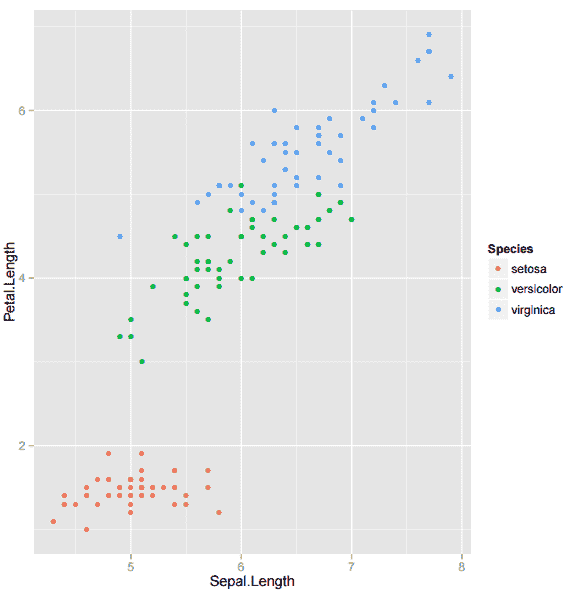

# r 包:使用 ggplot2 绘制快速图

> 原文：<https://thenewstack.io/r-package-drawing-quick-plots-with-ggplot2/>

一张图片胜过千言万语——这意味着一个复杂的概念可以用一幅图像来表达，使人能够从视觉上吸收大量的数据。流行的 R 包使用 ggplot2 从可用的数据中描绘有意义的图形，并且只需要最低限度的技能来创建图形数据的图片。这个概念的建立是为了准确地表示数据，而不用担心图形的复杂性。

这种图形表示是通过使用内置数据集和 r。

## 开始创作

ggplot2 是一个使用 R 语言的绘图系统，它使用了图形的语法。它说明了两个重要的命令:

1.  **qplot()** :快速出图。
2.  **ggplot()** :允许图形的更多细节。它还允许分层图形。

让我们回顾一下 ggplot2 的基本工作原理，从深入了解 R.
中可用的内置数据开始

```
&gt;  library(ggplot2)
&gt;  data(women)
&gt;  colnames(women)
[1]  "height"  "weight"

```

这将显示数据的所有列名。使用 head 命令，我们可以查看如下数据:

```
&gt;  head(women)

height weight
1      58     115
2      59     117
3      60     120
4      61     123
5      62     126
6      63     129

```

在数据集“女性”中有两个参数:身高和体重。

现在让我们将这些参数传递到 qplot():

```
  &gt;  qplot(height,weight,data=women)

```

结果图如下所示:

[](https://thenewstack.io/wp-content/uploads/2015/03/womenplot.png)

上图显示了身高与体重的关系，默认情况下是以磅为单位绘制的。

让我们通过发出命令
来绘制下面的线图

```
  &gt;  qplot(height,weight,data=women,geom=c("point","line"))

```

[](https://thenewstack.io/wp-content/uploads/2015/03/Wth-lineplot.png)

在 ggplot2 中，用于表示数据的几何对象称为“geom”

如果我们既要寻找表示，也要寻找点和线，同样需要传递给 geom。在这里，几何基本上是表示几何的论点。

回想一下:当我们想在 R 编程中声明一个集合时，我们使用 c。

我们为 geom 传递了两个选项，所以我们必须使用一个集合。
要改变图形的颜色，比如从黑色变成红色，我们必须发出:

```
  &gt;  qplot(height,weight,data=women,color="red")

```

但这不是颜色选项的唯一用途——用颜色命令试试一个参数:

```
  &gt;  qplot(height,weight,data=women,color=height)

```

 [](https://thenewstack.io/wp-content/uploads/2015/03/womenhtplot.png)[](https://thenewstack.io/wp-content/uploads/2015/03/womenhtplot.png) 从上面的图形中注意到，我们可以在特定的颜色渐变中得到高度，图形旁边多余的图例是自动添加的。

通过添加更多选项，包含更多图例，如下所示:

```
  &gt;  qplot(height,weight,data=women,color=height,size=weight)

```

这里有两个传说——一个代表身高，另一个代表体重。注意点的大小随着重量的增加而变化。
[](https://thenewstack.io/wp-content/uploads/2015/03/wthplot.png)

## 更多地块的更多数据集

让我们仔细看看数据集“iris ”,它包含如下给出的 iris 数据集的信息。 [](https://thenewstack.io/wp-content/uploads/2015/03/womenhtplot.png) 

```
&gt;  data(iris)
&gt;  colnames(iris)
[1]  "Sepal.Length"  "Sepal.Width"   "Petal.Length"  "Petal.Width"   "Species"

```

仔细查看该数据显示的不同列:之前，我们只使用了两列。现在，第三列的效果表明，在将它传递给 color 之后，我们应该看到什么:

```
&gt;  qplot(Sepal.Length,  Petal.Length,  data  =  iris,  geom  =  "point",  color  =  Species)

```

现在让我们找到 iris 数据集下可用的不同物种:

```
&gt;  levels(iris$Species)
[1]  "setosa"  "versicolor"  "virginica"

```

指定“颜色=物种”的效果将导致为不同的物种显示不同的颜色，包括图例。

[](https://thenewstack.io/wp-content/uploads/2015/03/iris.png)

## **使用更多选项**

geom 有许多选项，以下是一些最常用的选项。有些选项适用于单列数据信息，有些则适用于双列信息。

回忆:为了在图表上绘制数据，我们需要两个坐标( *x* ， *y* )。

*   当数据以单列形式提供时，它会根据该数据的频率范围(计数)进行绘图。
*   两列代表( *x* ， *y* )数据。

例如:

```
&gt;  qplot(Sepal.Length,data=iris,geom=”histogram”)

```

这将绘制萼片的直方图。带计数的长度。还有许多更有趣的选择。对于直方图，我们考虑单列萼片。长度，我们使用选项“填充=物种”给图形添加更多丰富多彩的信息:

```
&gt;  qplot(Sepal.Length,data=iris,geom=”histogram”,fill=Species)

```

 [](https://thenewstack.io/wp-content/uploads/2015/03/qplotfill.png)[](https://thenewstack.io/wp-content/uploads/2015/03/qplotfill.png) 让我们执行另一个名为 Orange 的数据集。看看它包含的不同列名:

要查看它保存的数据，只需键入下面的命令:

现在，让我们绘制出年龄与“数据=橙色”相对于颜色的周长的关系图:

```
&gt;  qplot(age,  circumference,  data  =  Orange,  geom  =  c("point",  "line"),  color  =  Tree)

```

T13

## qplot 的其他有用选项

更多选项请访问以下网址:[http://www.cookbook-r.com/Graphs/](http://www.cookbook-r.com/Graphs/)和 http://docs.ggplot2.org/current/

## **存储图形**

经过一些试验和错误，你将能够获得良好的图形。r 还提供了一种存储图形的方式:

```
pdf(“figfilename.pdf”)
qplot(age,circumference,data=Orange)
graphics.off()

```

1.  创建一个可以重定向图形输出的文件。
2.  键入图形的命令。
3.  通过发出 graphics.off()将输出重定向到控制台。

在本教程中，我们刚刚见证了使用 ggplot2 进行数据分析的图形世界的开端。

在下一篇文章中，我们将看看 ggplot()命令如何帮助我们绘制复杂的图形。

练习的代码可以在[这里找到。](https://github.com/manjushajoshi/R-code/blob/master/ggplot2next/ggplot2next.R)

Manjusha Joshi 是科学计算的自由开源软件的自由职业者。她是一名数学家，也是 Pune Linux 用户组的成员。

特色图片[通过](https://www.flickr.com/photos/fcb/5891463838/in/photolist-cGsdg1-9Z38B5-cYfndA-azBryi-aMJdRk-jtfhEn-aMJhMT-a5srHB-9YBhWJ-a8HGBH-a8M2e5-a8M9Ho) Flickr 知识共享。

<svg xmlns:xlink="http://www.w3.org/1999/xlink" viewBox="0 0 68 31" version="1.1"><title>Group</title> <desc>Created with Sketch.</desc></svg>