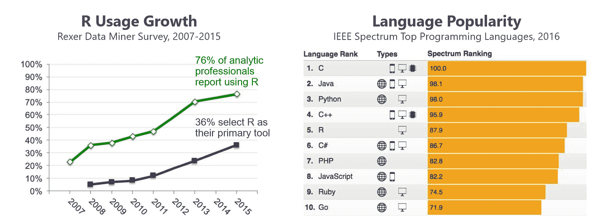
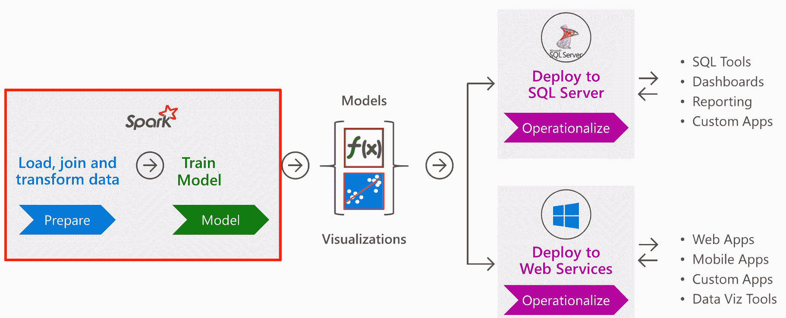
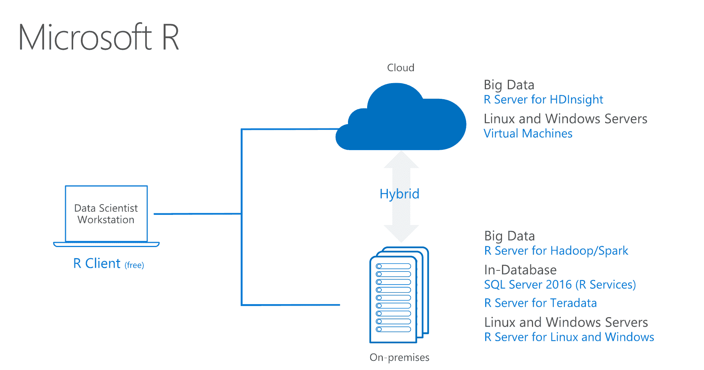
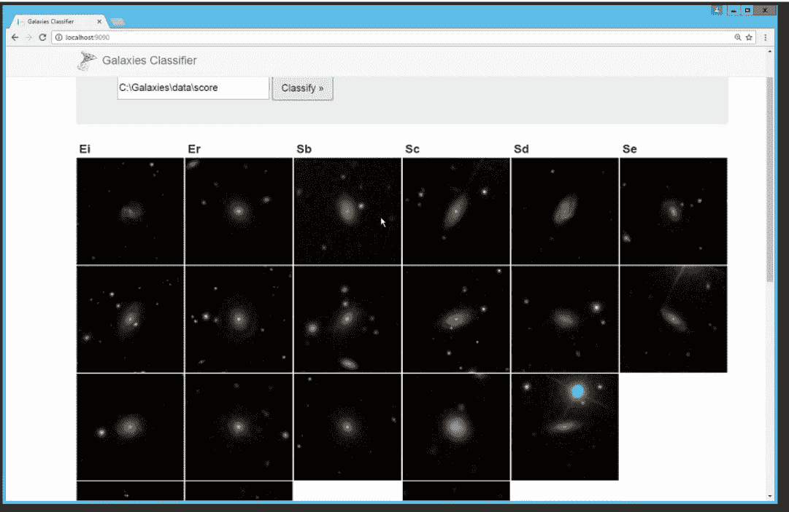
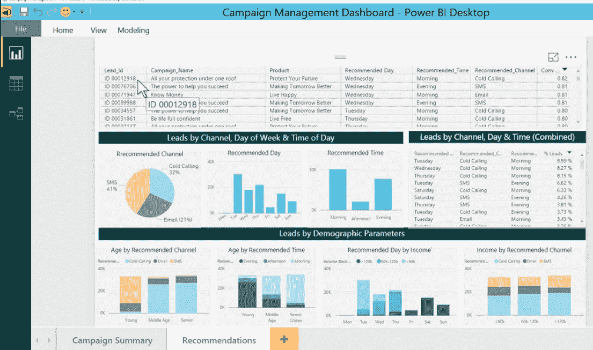

# R Server 9 增加了机器学习来处理数据

> 原文：<https://thenewstack.io/r-server-9-adds-machine-learning-work-data-lives/>

由数据科学家构建的 [R 编程语言](https://www.r-project.org/)一直是数据科学家的工具。但是微软的 [R Server 9](https://www.microsoft.com/en-us/cloud-platform/r-server) ，这是自微软收购创造这个发行版的公司 Revolution Analytics 以来，第一个全新版本的 R 商业软件包，现在也瞄准了新的受众——拥有开发人员和分析师以及数据科学家的企业客户。

这使得处理来自更广泛来源的数据变得至关重要，因为如今企业面临着如此复杂的环境。

r 服务器已经支持 [Apache Spark](http://spark.apache.org/) 1.6 数据处理框架；R Server 9(构建在开源的 R 3.3.2 上)增加了对 Spark 2.0 的支持，因此您可以利用新的选项来处理流数据和改进的内存管理子系统。

“通过 SparkR 库，你可以混合调用 R 中的大规模并行算法和本地 Spark，”R 服务器团队的主要项目经理 Bill Jacobs 解释道。

R Server 9 现在还可以连接到 [Apache Hive](https://hive.apache.org/) 进行实时查询，以及 [Apache Parquet](https://parquet.apache.org/) 进行列存储，这是一种将数据加载到 Spark 数据帧中的方式，以便由微软的 ScaleR 函数进行分析。ScaleR 旨在处理太大而不适合内存的数据集，它可用于 Azure HDInsight，很快将用于 Azure 机器学习服务，以及 R Server(以及免费的微软 R 客户端，用于较小的数据集)。

在 Spark 中开发部署到 SQL Server 或 web 服务。

R Server 9 现在也可以在 Ubuntu、SuSE、RedHat 和 CentOS 上运行，支持 Cloudera、Hortonworks 和 MapR Hadoop 发行版。

正如微软高级分析团队的巴拉特·桑德胡所说，“企业中的数据正在飞速增长，并且存在于多个平台上，因此客户需要这种更接近数据并且存在于多个平台上的智能。我们希望利用客户拥有的东西；我们希望利用他们拥有的技能和知识，以及他们已经投资的系统。”

微软有多种选择与 r 合作。

## 数据平台上的机器学习

这些高级分析现在包括机器学习算法和数据转换，基于微软广泛的机器学习工作。从 Skype Translator 到 Bing 到 Exchange，微软正在广泛的产品中使用[机器学习](/category/machine-learning/)，并已经提供了许多算法作为认知服务 API，你可以在自己的代码中调用。

R Server 9 中新的 [MicrosoftML](https://msdn.microsoft.com/en-us/microsoft-r/microsoftml-introduction) 包包括六个多线程算法(基于微软团队使用的机器学习，但被推广到更广泛的场景中有用):

GPU 加速的深度神经网络应该比只使用 CPU 的模型有明显更高的性能。微软表示，训练多层定制网络的速度高达 8 倍。

*   快速线性 SDCA(随机双坐标上升方法)学习器，支持 L1 和 L2 缓存正则化，用于二进制分类和线性回归。微软表示，这种训练速度是逻辑回归的两倍。
*   用于二元分类和回归的快速提升决策树。
*   用于二元分类和回归的快速随机森林。
*   逻辑回归，支持 L1 和 L2 正规化。
*   基于单类支持向量机的二分类异常检测
*   这些算法在 R Server for Windows，免费的 R Client for Windows 和 SQL Server R Services 现在；他们将在 2017 年第一季度推出 Linux 和 Hadoop。

它们可以让您进行文本分类，例如，情感分析或分类支持票，创建客户流失预测、垃圾邮件过滤、欺诈和风险分析、点击和需求预测的模型，或者创建神经网络来解决复杂的机器学习问题，如图像分类或 OCR 和手写分析。

尽管神经网络的拓扑结构可以任意深入，但构建一个六层神经网络只需要 60 行脚本。唯一的限制是你所拥有的计算能力。层数越多通常意味着训练时间越慢。

MicrosoftML 还包括机器学习转换管道，允许您在使用数据进行训练或测试之前，使用以下调用创建一组自定义的转换来突出您的数据:

*   **concat()** 将多个列组合成一个向量值列，从而加快训练时间。
*   **categoricalHash()** 使用哈希将分类值转换为指示数组，这在您有大量类别时非常有用。
*   **categorial()**使用字典将分类值转换为一个指示数组，用于少量固定数量的类别。
*   **selectFeatures()** 使用计数或交互信息模式从列表中选择特征。
*   **featurizeText()** 通过语言检测、标记化、文本规范化、特征生成和术语加权，从您的文本中生成一包 n 元单词序列，它还可以删除太常见而无用的“停用词”。

你可以使用新的算法和 RevoScaleR 函数来导入、清理和可视化你的数据，以及现有的开源软件包。GPU 加速的深度网络。

用 R Server 9 中的 FastLinear、FastTree、FastForest、Logistic Regression、神经网络和 OneClassSVM 机器学习算法构建的星系图像分类器。

## 在更多地方使用你的模型

R Server 9 旨在与企业系统很好地集成。Jacobs 说:“R 面临的最大挑战是如何成为大型应用程序中可操作、可嵌入、可集成的组件。”“现在，您可以从 Spark 获得 R 模型，并将其移动到 SQL Server 系统、Linux 系统、Hadoop 集群、Windows 服务器系统或 Teradata。”

一种方法是过去被称为部署者服务器；这个特性现在已经集成到了 R Server 中，现在它只是被称为“操作化能力”。它已经可以在 Windows、RHEL 和 CentOS 以及 Ubuntu 上的独立服务器安装中使用，并将于 2017 年在 SLES11、Teradata、Hadoop 和 SQL Server R 服务中使用。但是微软认为 [SQL Server 2016](https://www.microsoft.com/en-us/sql-server) 中新的 R 支持是企业将分析模型转化为可以在业务中大规模使用的解决方案的理想方式，而不仅仅是看看报告。

这是新的 [SQLRutils](https://msdn.microsoft.com/en-us/library/mt604847.aspx) 包中的一行命令，用于将 R 脚本嵌入 SQL Server 数据库中的 [T-SQL](http://searchsqlserver.techtarget.com/definition/T-SQL) 存储过程中，您可以通过任何连接到数据库的应用程序或网站来访问它。如果你创建一个神经网络，你会得到一个二进制 blob，它是数据库中经过训练的神经网络的序列化版本。

“它运行在数据库中，可以大规模并行运行，具有多线程和多核，”Jacobs 解释道。"它还提供了所有的安全性，因为数据永远不会离开数据库引擎."

当 SQL Server 的 Linux 版本在 2017 年发布时，这将变得更加广泛，但这不是唯一的新选项。为了加快您开始使用 R 模型的速度，并确保 R Server 中的模型随着技术平台的发展而保持有用，R Server 9 还可以使用 [Swagger API](https://swagger.io/) 框架，轻松地将两个模型甚至任意 R 脚本作为 web 服务公开，您可以从任何编程语言调用这些 web 服务作为 API。

再说一遍，这是一个创造霸气的简单过程。JSON 文档；这是数据科学家可以自己做的事情，从 [RStudio](https://www.rstudio.com/) 、 [R Tools for Visual Studio](https://www.visualstudio.com/vs/rtvs/) 或 [Jupyter notebook](http://jupyter.org/) ，并将文件发送给将要使用该模型的开发人员。应用程序开发人员运行另一个命令来生成创建 API 的 Swagger 代码，然后他们可以在他们的应用程序中调用几行代码。

这比使用 R 的传统部署过程要快得多。通常，R 服务器项目经理 [Carl Nan](https://www.r-bloggers.com/author/carl-nan/) 指出，“在数据科学家构建 R 模型之后，应用程序开发人员需要花费很长时间来转换到其他编程语言，以便他们可以在生产中将其与业务应用程序集成。这是一个容易出错的过程，创新速度缓慢，最终导致陈旧的模式。”

这使得你在 R Server 中创建的机器学习模型与微软和谷歌等供应商提供的商业机器学习 API 一样容易使用。

雅各布斯指出，新的选项意味着你在 R 中创建的机器学习和分析模型不依赖于你构建它们的平台，也不依赖于你当前使用它们的平台。您可以在一个环境中训练，在多个环境中部署。“没有一个平台是永恒的。我们在这里做的一些事情是提供可移植性，允许您构建混合应用程序。但随着时间的推移，在一个地方构建代码并在另一个地方运行代码的能力也提供了一种面向未来的形式，这种形式将大量数据科学家的工作从正在使用的平台的特性中抽象出来，并使他们的工作持续很长时间。"

另一方面，对于没有数据科学家的企业，微软也在为特定问题制作现成的解决方案模板。雅各布斯说:“有时，自己动手的方法可能会让外行人陷入困境，需要做很多工作才能获得最初的好结果。”

[第一个模板](https://gallery.cortanaintelligence.com/Solution/e992f8c1b29f4df897301d11796f9e7c)预测潜在客户何时会转化为客户，创建一个指示板，建议是否使用电子邮件、短信或电话来联系这些潜在客户，甚至是在什么时间和哪一天联系他们。建立数据模型通常需要数周的工作。它基于保险行业，所以如果你有数据科学家，所有代码都在 GitHub 上，所以你可以把它加载到 R 中，并根据你自己的数据验证模型。

在较小的范围内(或出于开发目的)，R Server 的几个关键新功能也在免费 R client 的 [3.3.2](https://cran.r-project.org/bin/windows/base/) 版本中，包括机器学习库和 OlapR、MRSDeploy 和 SQLrutils 包。

R Server 9 对机器学习的支持来自 SQL Server 下一版本的第一个社区技术预览版——当前版本嵌入了 R 支持，但没有新的包。

来自 Microsoft 解决方案模板的潜在客户转换仪表板。

由[内森·安德森](https://unsplash.com/@nathananderson)通过 [Unsplash](https://unsplash.com/?photo=ZDYDZ2Zwpgs) 拍摄的特写图像。来自微软的其他图片。

<svg xmlns:xlink="http://www.w3.org/1999/xlink" viewBox="0 0 68 31" version="1.1"><title>Group</title> <desc>Created with Sketch.</desc></svg>