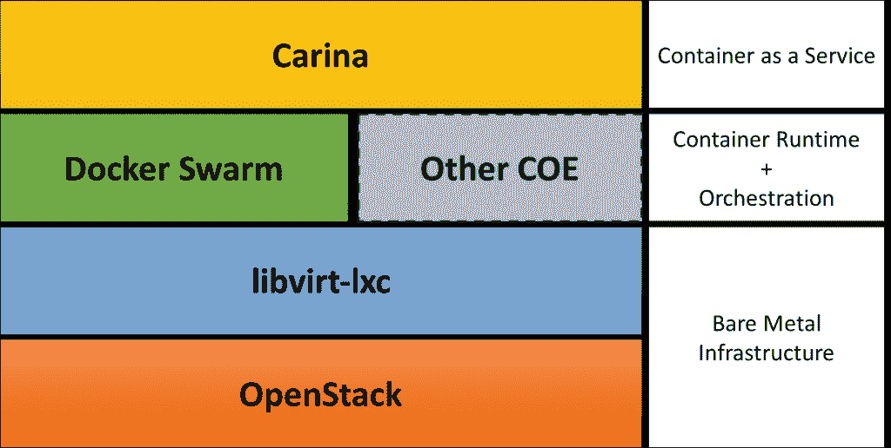
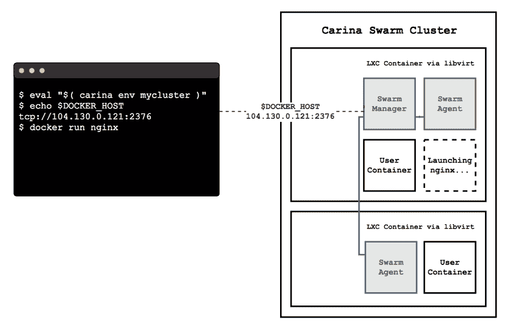
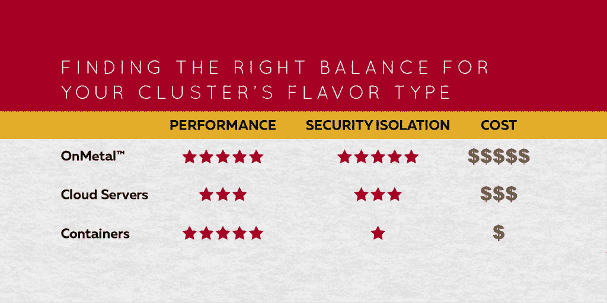

# Rackspace 的 carina:open stack 驱动的软件，用于运行容器即服务

> 原文：<https://thenewstack.io/rackspace-carina-bare-metal-caas-based-openstack/>

Rackspace 的 Carina 于 2015 年 10 月在东京 OpenStack 峰会上推出，目前处于预览模式，是新兴的[集装箱即服务](https://thenewstack.io/the-year-ahead-ops-and-the-rise-of-container-as-a-service/) (CaaS)市场的早期参与者之一。Carina 由 [OpenStack](https://wiki.openstack.org/wiki/Magnum) 提供支持，旨在提供集装箱和裸机基础设施的最佳选择。

## Rackspace 为什么要造 Carina？

Rackspace 投资集装箱有多种原因。Rackspace 杰出的建筑师 Adrian Otto 创建了 Project Magnum，这是一项旨在使 Docker Swarm、Apache Mesos 和 Kubernetes 等容器编排引擎(COE)成为 OpenStack 生态系统中的一等公民的计划。奥托在 Rackspace 积极参与 CaaS 的建设，这使他成为领导 Magnum 项目的自然选择。他和他的团队正在 Rackspace 构建 Carina，以获得在 OpenStack 上交付 COE 所需的第一手经验。

> Rackspace 希望 Carina 成为在云中运行容器的参考实现。

Rackspace 一直将裸机服务器视为其云的关键差异化因素之一。该服务被称为 [OnMetal，](https://www.rackspace.com/cloud/servers/onmetal)它使用 [OpenStack 的 Project Ironic](https://wiki.openstack.org/wiki/Ironic) 来交付不同类别的 IaaS。这是首批基于 OpenStack 的商业裸机产品之一。Carina 层叠在裸机平台上，以提供最佳性能。CoreOS 是面向容器的精简 Linux 操作系统[,支持裸机基础设施](https://coreos.com/blog/coreos-on-rackspace-onmetal-cloud-servers/),使其成为运行容器化工作负载的最佳平台。裸机和 CaaS 的结合使得 Carina 成为市场上独一无二的平台。

托管私有云业务对 Rackspace 非常重要。它的许多客户运行由 Rackspace 工程师维护和管理的隔离基础设施。Carina 在技术上设计为既可以在公共云上运行，也可以在私有云上运行。随着 Rackspace 通过与 AWS 和微软的合作关系进入[托管服务业务](https://www.rackspace.com/en-in/managed-aws)，它甚至可能提供 Carina 作为托管 CaaS，可以在 Rackspace 团队管理的环境中部署。与 [Joyent Triton](https://www.joyent.com/blog/understanding-triton-containers) 一样，Carina 是一个运行公共云的 CaaS，但可以选择部署在私有云上。这使得 Carina 成为 CaaS 市场的主要竞争者。

凭借 OpenStack 的强大根基，Rackspace 希望 Carina 成为在云中运行容器的参考实现。该公司不希望将 COE 的选择局限于特定的实现。Carina 旨在运行 Docker Swarm、Kubernetes，将来可能还会运行其他 Coe。Project Magnum 分享了运行多个编排引擎的相同理念。目前版本的 Carina 仅针对 Docker Swarm 进行了优化。

Rackspace 非常清楚在裸机上的多租户环境中运行 CaaS 的风险。当它的竞争对手选择提供在虚拟机中运行的容器时，Rackspace 却不遗余力地为裸机设计 CaaS。在没有虚拟化的情况下实现多租户是一件艰难的事情。Rackspace 的工程团队在不牺牲性能和安全性的情况下找到了一个折中的办法。他们利用 Linux 内核的能力在壁垒之间建立起强大的壁垒。在 Carina 的未来版本中，客户可以在虚拟机和裸机之间进行选择。

Carina 的另一个设计目标是保留原生 API 和工具体验。配置集群后，Carina 不再碍事，让开发人员和运营团队通过本机工具处理编排引擎。在 Docker Swarm 的情况下，Carina 的用户可以依靠熟悉的工具，如 **docker-compose** 来管理工作负载。对于客户来说，使用 Carina 的体验是流畅和无缝的。在支持本地工具和 API 方面，相同的理念被扩展到 Project Magnum。

## 船底座上的码头工人群

Carina 支持的第一个 COE 是 [Docker Swarm](https://thenewstack.io/docker-swarm-wins-scaling-benchmark-dont-take-gospel/) ，这使得它成为公共云中运行 Docker 本机集群和编排引擎的少数 CaaS 产品之一。

开发人员可以使用门户或 CLI 开始使用 Carina。部署容器化应用程序的第一步是创建集群。每个集群运行一个或多个 Carina 节点。Carina 环境中的节点主要是由物理机中的 **libvirt** 提供的 LXC 容器。它们不应该与 Docker 群节点混淆，后者通常是指带有群代理的机器。

Rackspace 使用 [LXC](https://linuxcontainers.org/) 作为隔离的基本单位，而不是使用昂贵且较慢的虚拟机。Docker 容器被安排在每个 Carina 节点中，这有一些含义。与传统环境不同，不可能通过 SSH 进入节点。将主机文件系统装载为 Docker 卷也有限制。每个 Carina 节点都有 20GB 的磁盘空间、4GB 的 RAM、两个 vCPUs 和一个 IPv4 地址。

一旦创建了包含一个或多个节点的 Carina 集群，就可以将凭证包下载到本地机器上。这附带了 TLS 证书和环境变量，用于配置本地 Docker 客户机与集群的群端点进行对话。运行附带的 shell 脚本后，开发人员可以使用 docker-compose 等工具来部署和管理应用程序。

当 Carina 将来支持更多 Coe(如 Kubernetes)时，体验将几乎是相似的。

## 关键特征

为什么开发人员和运营团队应该使用 Carina？以下是使其成为独一无二的 CaaS 的一些功能:

### 自动缩放

Carina 的底层基础设施由运行时不断监控和管理。客户可以提供为容器预留内存和计算能力的提示。当 80%的保留内存或 CPU 被消耗时，Carina 会触发自动扩展操作来增加节点。但是，永远不会缩减或删除集群，以避免可能的数据丢失。

### 表演

Rackspace 声称，Carina 经过优化，可以提供最佳性能。这是由于与裸机服务器的集成和用于隔离的 LXC 架构。

### 开发者体验

Carina 在管理容器的生命周期方面有着精心设计的经验。该门户有一个直观的界面，用于配置、扩展和重建集群。CLI 提供了一个简单而强大的机制来处理 CaaS 基础设施。对于自动化需求，Carina 有一个专用的 API，CLI 也使用它。

### 数据卷容器和覆盖网络

Carina 支持 Docker 的最新功能，如专用卷容器和覆盖网络。可以创建前端和后端网络，将面向公众的容器与包含敏感应用程序的容器分开。Docker 数据卷容器支持将持久数据移动到专用容器，这些容器可以与应用程序容器一起移动。由于 Rackspace 使 Carina 保持最新，Docker 的新功能可以很容易地利用。

## 摘要

随着 CaaS 领域的竞争加剧，Rackspace 必须与 Carina 一起快速前进。它在 OpenStack 中的领导地位正在帮助该公司在其公共云上推出一些创新，如 Project Magnum 和 Project Ironic。Carina 的成功取决于它在混合场景中的运行情况，在混合场景中，客户可以在私有云与公共云之间无缝移动容器。看看 Carina 是否会支持 Windows 容器和 Hyper-V 容器也很有趣。

CoreOS、Docker 和 Joyent 是新堆栈的赞助商。

由 [Samuel Scrimshaw](https://unsplash.com/samscrim) 根据 [cc0](https://unsplash.com/license) 授权拍摄的专题图片。

*这篇文章于 4 月 22 日更新，添加了更新的图形和术语。*

<svg xmlns:xlink="http://www.w3.org/1999/xlink" viewBox="0 0 68 31" version="1.1"><title>Group</title> <desc>Created with Sketch.</desc></svg>