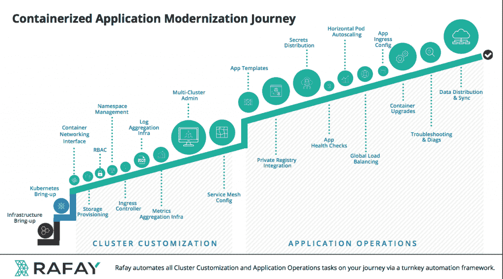

# Rafay 希望在 Kubernetes 上提供一种更简单的部署方式

> 原文：<https://thenewstack.io/rafay-wants-to-provide-a-simpler-way-to-deploy-on-kubernetes/>

在 Kubernetes 上部署应用程序实在是太复杂了， [Rafay](https://rafay.co/) 的首席执行官兼联合创始人哈齐布·布哈尼说，这是最近一个普遍的说法:

“我认为代码是基础设施的黑暗面。它变得太复杂了，”他说。“我们需要一个抽象层，这样任何公司——不仅仅是脸书和 Twitter——都可以采用这些技术，并快速启动和运行。”

总部位于加州桑尼维尔的 Rafay 在 Kubernetes 上提供了一个基于 SaaS 的自动化层，用于容器化应用程序的生命周期管理，作为 SaaS 的产品。

它提供了大多数公司在 Kubernetes 上运行时必须自己构建的东西，而不仅仅是选择云:

*   我如何把我的代码放在所有正确的地方？
*   我如何启动并运行我的集群？
*   我如何保持我的环境安全？
*   我如何足够快地更新我的配置？
*   我如何调试这些环境？
*   如何取出我的日志；我如何获得我的指标？

“我们想，‘如果我们把 80%的工作，也就是 DevOps 团队必须做的工作积压下来，作为 SaaS 产品提供给他们，会怎么样？’他们可以把时间集中在为公司创造价值上，而不是(这么做)，”他说。

### 解决分娩疼痛

布哈尼和联合创始人[赫曼思·卡武鲁鲁](https://www.linkedin.com/in/hkavuluru/)亲身经历了他们之前的公司 Soha Systems 建造这一切，该公司于 2016 年被 Akamai 收购。

“作为这项技术的消费者，我们经历过这个问题，”他说。“我们想，‘哇，这太痛苦了。还有谁有这个问题？有人需要解决这个问题。事实证明，那个人就是我们。"

大多数公司没有懂 Kubernetes 的员工，也很难雇佣懂的人。与此同时，正如 [Dark](/dark-a-new-programming-language-for-deployless-deployments/) 联合创始人 [Paul Biggar](https://twitter.com/paulbiggar?ref_src=twsrc%5Egoogle%7Ctwcamp%5Eserp%7Ctwgr%5Eauthor) 最近指出的，开发人员需要了解的技术列表越来越长，指向了[云原生景观图](https://cdn.thenewstack.io/media/2016/12/e99e2b63-cloud-native-lanscape-v0.9.2.jpg)中的 455 个工具。

Budhani 说:“正在制造产品的公司专注于制造该产品，而不太考虑实现该产品交付的机制。”

但是交付已经成为无数公司的焦点，包括 Chef、VMware、Rancher、Dark 和其他旨在将创新的[工具](https://thenewstack.io/ci-cd-with-kubernetes-tools-and-practices/)引入流程的公司，正如持续集成/持续交付(CI/CD)的 CI 方面所发生的那样。

他说，许多公司都在寻找解决同样问题的方法，但今天真正的竞争是自己动手。

“我们的观点是，这可能不是每个公司都应该做的事情。对于谷歌的脸书来说，建造这个东西可能是一种优势。但如果你是一家典型的企业，这真的是你想花钱的地方，还是你更愿意把钱花在为公司创造价值上？”他说。

### SaaS 发行

这个平台在 CI 之后启动。Rafay 不提供 Kubernetes 分布。它可以运行在任何云或内部。

它提供:

*   **应用程序抽象:**抽象层将业务需求转化为 YAML 或掌舵图。它在逐个容器的基础上提供应用健康检查；水平 pod 自动缩放；app 入口配置；故障排除和诊断；名称空间管理和入口控制器。
*   **集群蓝图:**这些模板工作流使开发人员和 sre 能够在公共云和私有云的不同环境中复制集群。它提供持久存储；跨集群、环境和云聚合日志数据；并提供容器网络接口和服务网格。
*   **多集群操作:**在多个区域或混合环境中部署和[管理](/kubernetes-steering-the-ship-with-cloud-native-management/)集群的联合框架。这包括加密的秘密分发和更新；应用程序升级，包括金丝雀更新；数据分发和同步；和全局负载平衡。
*   **企业集成:**与常用工具的集成，用于机密管理、运行时配置更新、日志和指标聚合。

作为 SaaS 的产品，Kubernetes 集群由用户在网站上注册。你确定你的代码的位置。您可以从您的持续集成系统中单独构建和部署自动化，例如 Jenkins 或 CircleCI。

“你将你的容器指向 Rafay 平台，并在一个非常高的层次上告诉它你想要完成什么:我是前端容器中的一个应用程序。我有一个后端容器和一个数据库。我想让他们用这种方式互相交流。我想用这种方式来扩展它们，”布哈尼说。

“我们提供的一项服务是，如果你不了解 Kubernetes，也不想与 YAML 打交道，你就不必这么做。你可以描述这一切，我们将为你写 YAML。它知道普罗米修斯是如何工作的，豆荚是如何在库伯内特斯工作的。它是为不想考虑 Kubernetes 的开发人员设计的，但同时，如果你在一家复杂的公司，我们管理 YAML，但也管理 Helm charts。”

其客户包括日本移动电信公司 NTT Docomo，也是其投资者之一，以及网络安全供应商 SonicWall。

Rafay 最近与 Red Hat 和 D2iQ(前身为 Mesosphere)合作。它已经[开源了](https://github.com/rafayopen/)一些性能工具，并正在通过一系列代码来简化应用程序和集群管理，并为 Kubernetes 和 Kubernetes 常驻应用程序提供蓝图，这些应用程序可能会在明年年初开源。

在宣布该公司最近获得 800 万美元的首轮融资时，[山脊投资公司(Ridge Ventures)负责人、WP Engine 创始人本·梅特卡夫](https://www.linkedin.com/in/benmetcalfe/)说:

“Rafay 代表着一个成功的、经验丰富的团队，为一个已经成熟到可以颠覆的市场带来创新。正如亚马逊基于统一和抽象不同的开源工具创建了整个云行业，我们看到了 parallels 为软件自动化、管理和应用分发带来的革命性变化。我们相信拉法将在这一转变中发挥重要作用。”

红帽是新堆栈的赞助商。

特征图片: [Serge Bystro](https://www.flickr.com/photos/sergebystro/) 的[kunsthopfassage 漏斗墙](https://www.flickr.com/photos/sergebystro/9116707403/in/photolist-eTBvup-bY4qxY-qHWq4E-51WX3-6DNm1u-eQySws-w4DX4g-2sNiZm-9oR4Fb-78npUz-pymfri-ne4kif-eQntCK-vZxNX-Ro6Fk-zVwd-78rj3J-eQySAm-9ZWhBU-2cDn3N-4HWDCR-78rirE-4sPFh3-78nqW4-3nP3c-nJoiJb-8Y3Z5t-2bVMqX-cLaQmb-tqA2M-87cdux-bxf34c-8jUmi4-mubZee-dNYbhg-cuhTCb-aQnpYV-LPu4D-eNPdz-YB41k8-7817yF-DjnuLj-5MH9Aq-oFiKUn-VVLkap-9KT9U7-2adZvih-kGWCdW-dGiMqk-ad6aQ5)。根据 CC BY-SA 2.0 获得许可。

<svg xmlns:xlink="http://www.w3.org/1999/xlink" viewBox="0 0 68 31" version="1.1"><title>Group</title> <desc>Created with Sketch.</desc></svg>