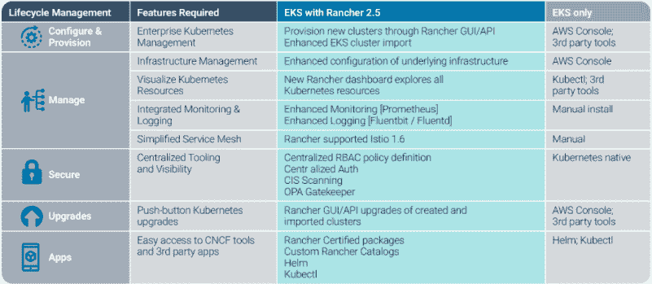
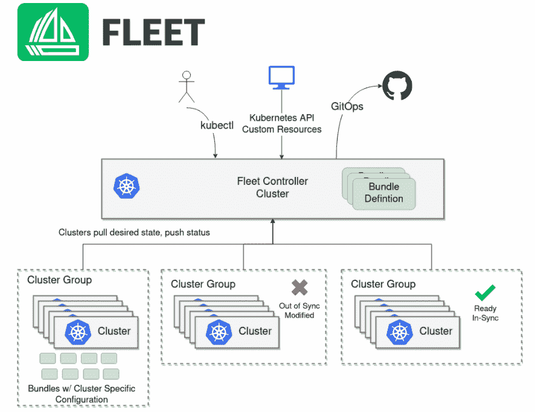

# Rancher 2.5 计划成为 Kubernetes 为 GitOps 打造的股票

> 原文：<https://thenewstack.io/rancher-2-5-sets-out-to-be-the-stock-kubernetes-build-for-gitops/>

Forrester Research 最近发布的一份报告将 Rancher 和 Red Hat 描述为面向容器化环境的多云平台的领导者，将 VMware 描述为“强劲的表现者”。Rancher 最近发布了其同名 Kubernetes 平台的版本 [2.5](https://rancher.com/blog/2020/rancher-2-5-delivers-computing-everwhere-strategy) ，并通过这样做，进一步定义了这种分布与这些竞争对手的不同，Rancher 首席执行官兼联合创始人[盛亮](https://www.linkedin.com/in/shengliang/)告诉新堆栈。

相比之下，Red Hat 和 VMware 的 Kubernetes 平台和工具分别与 VMware 的 Hypervisor 和 Red Hat 的 OpenShift 平台更垂直地集成，Liang 说。梁说，K8s 的每个版本都是定制的，“一直到操作系统”，同时他补充说，一旦收购完成后与 SUSE 合并，Rancher 将仍然是一个独立的单位[。](https://thenewstack.io/suse-will-gain-a-foothold-in-the-kubernetes-ecosystem-with-rancher-purchase/)

“牧场主可以“管理所有的 Kubernetes 发行版，”梁说。他说，Rancher 2.5 可以跨越多达 100 万个通过云计算原生计算基金会认证的集群。

梁说，与在垂直整合平台上扩张相反，Rancher 将继续“在我们可以的地方增加价值”。梁说，这就是 2.5 关注边缘和大规模 GitOps 的原因。他说，GitOps 的能力包括向成千上万个不同的集群推送应用程序更新的能力，这些集群通常“分布在世界各地”。

通过使用开源 Rancher，组织可以使用 Rancher 来依赖 Kubernetes“作为一个非常好的标准化层”，而不必为云原生部署支付 Kubernetes 发行版的许可费，梁说。“如果你使用的是亚马逊网络服务，为什么你要建立一个集群…并且必须支付第三方许可证？”梁问道，并补充道“亚马逊将免费提供这项服务。”

对于扩展的边缘延伸，Rancher 2.5 提供了梁所描述的针对高安全性美国政府用例的高级认证要求。

Rancher 还在今年早些时候创建了用于 GitOps 支持的开源项目 [Fleet](https://github.com/rancher/fleet) 。在 Fleet 的功能中，Fleet 用于管理集群部署，包括从 YAML、舵图和 Git 上加载的其他文件进行更新。梁说，Fleet 是“我们用来在 Rancher 中获得 GitOps 的底层技术”，而作为一个独立的开源平台，Fleet 可以在没有 Rancher 的情况下用于 GitOps。

Rancher 2.5 提供的其他功能包括梁所说的亚马逊弹性 Kubernetes 服务(EKS)集群的“全生命周期管理”。这些功能包括导入、供应、升级、配置、观察、保护和自动扩展，Rancher 称之为“所有亚马逊 EKS 集群”

Rancher 还为 Kubernetes 添加了有状态应用程序和数据支持选项。一个例子包括今年早些时候发布的 Rancher 与 Rancher 2.5 集成的持久存储产品 [Longhorn](https://longhorn.io/) 。

“所以现在，有了 Rancher，您就可以开箱即用所有持久存储，”梁说。

Forrester Research 报告将 Rancher 的覆盖范围确定为多云 Kubernetes 提供商的突出特征。Forrester 总结道:“参考客户对 Rancher 全面的应用程序目录覆盖、广泛的公共云基础架构集成、对云原生开源社区的积极参与、出色的客户支持、坚如磐石的稳定性以及快速实现价值的能力表示赞赏。“Rancher 是寻求在各种各样的云平台和边缘环境中提供成熟的多云容器管理平台的公司的理想选择。”

作为一个标准，Rancher 寻求“加倍努力”，梁说。“我们只在力所能及的地方增加价值——这已经足够了，”他说。

<svg xmlns:xlink="http://www.w3.org/1999/xlink" viewBox="0 0 68 31" version="1.1"><title>Group</title> <desc>Created with Sketch.</desc></svg>