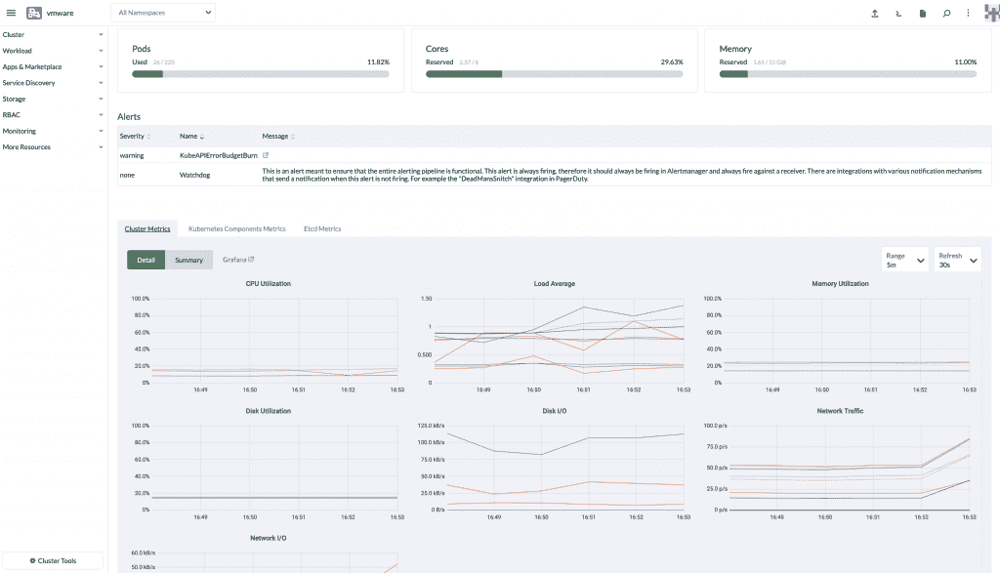

# Rancher 2.6 旨在简化 Kubernetes 云部署

> 原文：<https://thenewstack.io/rancher-2-6-designed-to-ease-kubernetes-cloud-deployments/>

创建 [SUSE Rancher 2.6](https://github.com/rancher/rancher/releases) 的目的主要是帮助 DevOps 团队更轻松地跨不同的云环境部署和管理 Kubernetes 环境。

虽然提供“对跨三个主要云提供商托管的集群的完整生命周期管理支持”有点营销的味道，但 SUSE 的其他意思是，Rancher 现在正在超越其 Kubernetes 先驱根基，作为一个专门面向边缘应用程序的容器编排器。因此，Rancher 2.6 旨在取代让 Kubernetes 集群在[微软 Azure Kubernetes 服务(AKS)](https://azure.microsoft.com/en-us/services/kubernetes-service/) 、[谷歌 Kubernetes 引擎(GKE)](https://cloud.google.com/kubernetes-engine) 和[亚马逊网络服务](https://aws.amazon.com/?utm_content=inline-mention)、[亚马逊弹性 Kubernetes 服务(EKS)](https://aws.amazon.com/eks) 上运行所需的各种工具。

SUSE Rancher 首席技术和产品官托马斯·迪·吉亚科莫博士告诉新堆栈:“SUSE Rancher 通常解决了在任何地方以任何形式利用 Kubernetes 进行云原生应用开发和管理的复杂性。”。此次发布的最新版本进一步简化了用户体验，同时不影响 Rancher 的功能，并扩展了与超大规模和安全方面的集成

Rancher 2.6 的发布是在 SUSE 去年收购 Rancher 之后，因为两家公司都表示，他们寻求结合 SUSE Linux 和 Rancher Kubernetes 编排工具和平台的优势。

迪·吉亚科莫说，虽然作者尚未测试该平台，但 SUSE 表示，它的目标是支持组织的数字化转型，因为它们转向了多云、混合 IT 的基础设施方法。“越来越多地利用开源的云原生解决方案，如 Kubernetes，来帮助他们更快地扩展和提供更好的客户体验，”他说。“SUSE Rancher 通过提供完全开源的解决方案来帮助这些用户管理、优化和构建他们的 Kubernetes 环境，从而帮助他们弥合这一转型鸿沟。”

SUSE 还试图通过新版本来满足开发人员和运营团队成员的需求，因为许多 DevOps 团队仍在努力将 Kubernetes 上的应用从内部部署到不同的云环境。

“随着越来越多的组织转向混合 IT 或多云基础设施模式，现代企业环境正变得越来越复杂，”迪·吉亚科莫说。“运营团队受益于管理任何 Kubernetes 集群的简单而复杂的方法，开发人员可以专注于软件开发并推广他们的应用。在 SUSE Rancher 和这个最新版本之前，运营商必须处理复杂的异构集群管理，开发人员需要了解在哪里部署。”

迪·吉亚科莫传达的其他 SUSE Rancher 2.6 更新包括:

*   图像扫描和日志可追溯性”来帮助我们的用户和客户加强他们的安全状况
*   为 SUSE 容器映像集成了 [SLE BCI](https://registry.suse.com/) “以提供一个安全稳定的容器基础映像，并引入了 GitOps 供应的技术预览。”
*   一种“集群 API”功能，允许用户在其环境中试验部署定制的集群模板。“这些功能使我们的客户和用户能够采取先发制人的方法来实现合规性和安全性，同时鼓励他们在其环境中创新和创造。”

迪·吉亚科莫说，在这些新功能中，新的 UX 有助于 IT 运营商在其环境中运行关键功能时提高工作效率。“我们从以前的版本和我们的社区中获得了反馈，以更新 SUSE Rancher 平台体验，这样我们的用户就可以快速、自信地部署和管理集群、访问工具和仪表盘，帮助他们节省时间和资源。”

迪·吉亚科莫说，对微软 AKS 和谷歌 GKE 集群以及亚马逊 EKS 的全面生命周期管理支持，为 DevOps 团队提供了“跨所有三大云提供商的全面互操作性”。

“这意味着我们的用户现在可以获得一致的管理体验，并且不管他们的群集托管在哪里，都可以获得群集环境的实时状态，”他说。“此外，他们现在可以跨提供商将现有集群导入 SUSE Rancher 并进行管理，或者从 SUSE Rancher 部署新集群。这意味着，我们追求多云或混合 IT 战略的任何客户或用户现在都可以获得一种解决方案，帮助他们集中管理整个环境中的运营。”

<svg xmlns:xlink="http://www.w3.org/1999/xlink" viewBox="0 0 68 31" version="1.1"><title>Group</title> <desc>Created with Sketch.</desc></svg>