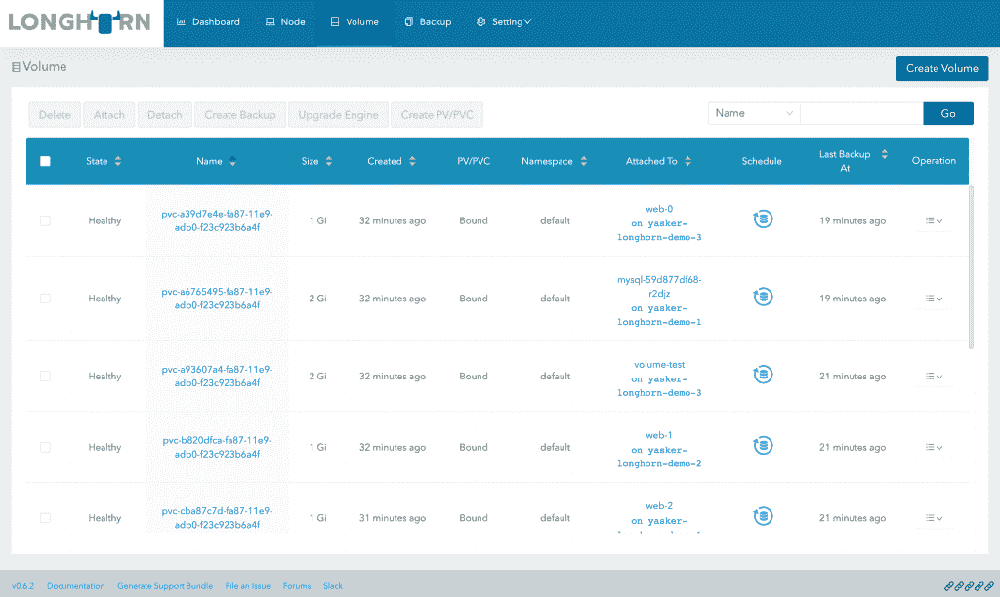

# Rancher 将其“Longhorn”Kubernetes 持久存储软件捐赠给 CNCF

> 原文：<https://thenewstack.io/rancher-donates-its-longhorn-kubernetes-persistent-storage-software-to-cncf/>

Kubernetes 用户可能会面临有状态工作负载的挑战，云原生软件和支持提供商 [Rancher Labs](https://rancher.com/) 已经将其开源 [Longhorn](https://longhorn.io/) Kubernetes 块存储软件捐赠给[云原生计算基金会](https://www.cncf.io/)，在那里它将加入 CNCF 沙盒级别的其他 20 个当前[项目](https://www.cncf.io/sandbox-projects/)。

“我认为这是双赢。这对社区来说是一个巨大的胜利，因为 Longhorn 是一项非常棒的技术，是 CNCF 需要进一步推广 Kubernetes 等技术的技术。所以，这对 CNCF 来说太棒了，”Rancher Labs 首席执行官盛亮在接受 New Stack 采访时说。“这对牧场主也有好处，因为我们正全力以赴开发 K3S、轻量级 Kubernetes 和牧场主。Rancher 不会成为一家仓储公司。仅仅是盈利和构建企业 Kubernetes 平台本身，我们就忙得不可开交。通过让它成为 CNCF 的一部分，我们可以吸引更多的人来使用它。”

> Gluser 和 Ceph“被设计为由某个存储管理员运行。在 Kubernetes 的世界中，许多这些东西往往由 DevOps 团队部署，因此[存储层]需要更加轻量级和简单得多。”— Rancher Labs 首席执行官盛亮。

沙盒级别的 CNCF 项目是三个级别中最早的，旨在进展到孵化和最终毕业级别。作为一个沙盒项目，CNCF 的目标是提高项目的知名度，促进与其他项目的协调，通过 CNCF [服务台](https://github.com/cncf/servicedesk)的请求培育项目，并消除采用和贡献可能存在的法律和治理障碍。

“通过成为 CNCF 沙盒项目，Longhorn 可以帮助开源社区加速 Kubernetes 的持久块存储解决方案的成熟，”CNCF 技术监督委员会成员 [Liz Rice](https://www.linkedin.com/in/lizrice/?originalSubdomain=uk) 在一份声明中说。

虽然梁承认 Kubernetes 有其他存储软件提供持久存储，包括开源和专有的，但他说 Longhorn 的一个关键区别是易于使用和简单。Longhorn 只用了 30，000 行 Go 代码就完成了，它是基于现有的 Linux 存储技术开发的，他说这不仅让最终用户更容易使用它，也让希望为项目本身做出贡献的开发人员更容易使用它。

“在 Longhorn 准备好之前，我们实际上使用了一点 Gluster，它不太适合我们的需求。社区中的许多人也尝试使用 Ceph。这些都是非常好，非常非常成熟，非常强大的开源存储系统，”梁说。“在我看来，如果有一点不尽如人意，那就是它们有点复杂。它被设计成由某个存储管理员来运行。在 Kubernetes 的世界里，很多这样的东西都倾向于由 DevOps 团队来部署，所以它需要更轻量级和更简单。”

Longhorn 目前的版本是 0.6.2，它不仅仅是向基于 Kubernetes 的应用程序添加持久存储，它还提供“卷快照、内置备份和恢复、不影响运行卷的实时升级、定义了[恢复时间目标]和[恢复点目标]的跨集群灾难恢复、一键式安装和直观的用户界面，”根据公司声明。

据该公司的一份声明称，据称使 Longhorn 比其他解决方案更易于使用的突出功能是这一用户界面，它“公开了一个存储类，便于复制卷的配置”，并提供“存储卷的可见性，但它也有助于团队了解创建卷的 Kubernetes 工作负载”。此外，Rancher 指出，“只需点击几下鼠标，就可以安装和升级 Longhorn，而不需要先阅读所有文档来了解每一个细微差别。”

Longhorn 在 Apache 2.0 许可下在 GitHub 上可用。

<svg xmlns:xlink="http://www.w3.org/1999/xlink" viewBox="0 0 68 31" version="1.1"><title>Group</title> <desc>Created with Sketch.</desc></svg>