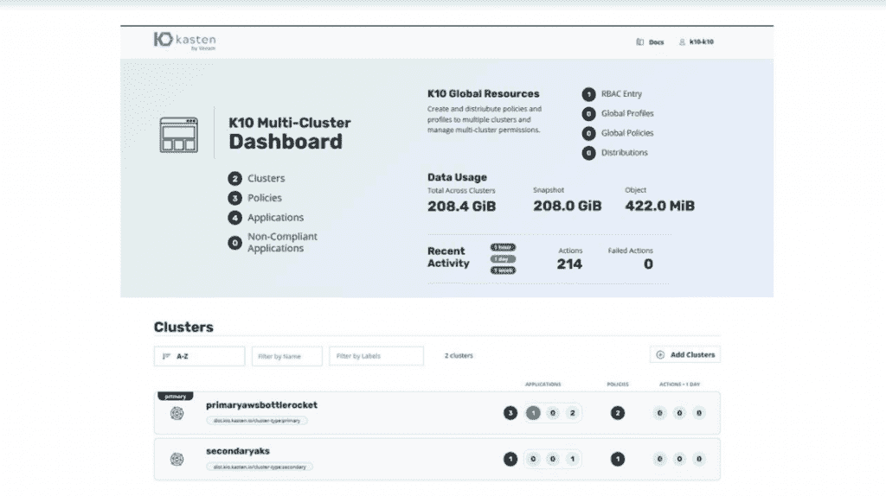
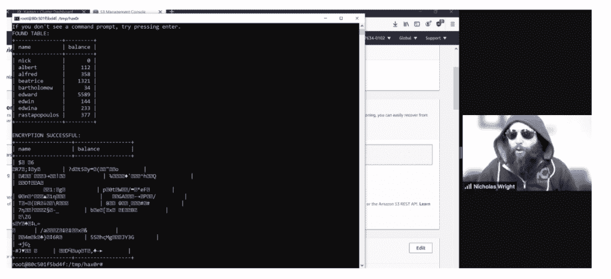
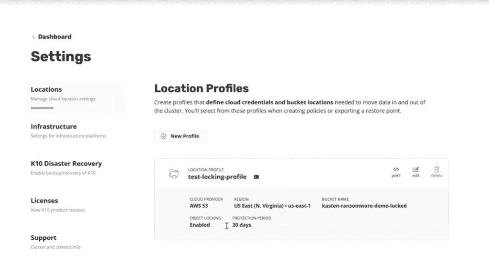

# 勒索软件:Kasten K8s 存储平台如何克服终极数据复制挑战

> 原文：<https://thenewstack.io/ransomware-how-the-kasten-k8s-storage-platform-overcomes-the-ultimate-data-replication-challenge/>

Kubernetes 的采用继续呈爆炸式增长，但与此同时，勒索软件攻击变得更加普遍和致命，因为 Kubernetes 环境共同代表了一个不断扩大的攻击载体。

根据网络安全风险投资公司(Cyber Security Ventures)委托的一份报告 Veeam，2019 年每 14 秒就发生一次勒索病毒攻击，而 2021 年应该每 11 秒就发生一次勒索病毒攻击。

随着勒索软件攻击对 Kubernetes 以及整个 IT 网络构成的威胁越来越大，Kasten 针对 Kubernetes 存储的最新 K10 v4.0 版本在很大程度上就是为了应对这种威胁而设计的。该平台提供了一项设计功能，即存储和复制的其他新功能，允许在不可思议的情况发生时恢复数据和应用程序。当组织的用户和 DevOps 团队在遭遇勒索软件攻击时无法访问他们在 Kubernetes 上运行的数据和应用程序时，K10 v4.0 通过预设的策略提供访问限制，允许用户恢复受勒索软件加密保护的数据。

在越来越多的恶意软件攻击者中，安全态势“并不像我们所有人希望的那样好——这是我们今天全面看到的，” [Niraj Tolia](https://www.linkedin.com/in/nirajtolia) ，Veeam 的 [Kasten 总经理兼总裁在最近的一次演讲中说。“问题的另一面是，在这种环境下，Kubernetes 的恢复非常复杂。我们看到更多的 Kubernetes 部署在边缘，我们看到一个大得多的足迹，所以我们需要能够保护人们的应用程序和数据的系统，以适应极小的因素，以快速移动我们的应用程序。”](https://www.kasten.io?utm_content=inline-mention)

Kasten by Veeam 的产品副总裁 Gaurav Rishi 表示，除了新的勒索软件保护之外，K10 v4.0 版本是 Kasten 使命的最新发展，为 Kubernetes 集群提供 DevOps 团队多集群视图管理和存储功能，“并大规模操作 Kubernetes 应用程序，以及保护它们”，同时支持多租户和其他安全和策略管理功能。Rishi 说:“在 K10 v4.0 中，你会看到一些相同的主题出现了，但是是以不同的方式出现的。”。“因此，安全——我认为这是我们今天面临的最大问题之一——是我们推出首个 Kubernetes 原生勒索软件保护解决方案的原因。”

## 查找、点击和恢复数据

在[演示](https://youtu.be/mgQYOgf75ng)，[中，Veeam 的 Kasten 技术人员 Nicholas Wright](https://www.linkedin.com/in/wrightnj/) 在 Kasten K10 v4.0 的虚拟发布活动中模拟攻击时扮演了入侵者的角色，他模拟了一个双管齐下的勒索软件攻击，既针对实时数据，也针对应用程序备份。Wright 说，该演示旨在展示 K10 v4.0 如何“在数据攻击后快速成功地恢复应用程序”。演示中的攻击媒介是运行在 Kubernetes 上的一个 [MySQL](https://www.mysql.com/fr/) 数据库，该数据库已经用 Kasten K10 v4.0 进行了例行备份，该版本将还原点导出到一个[亚马逊网络服务(AWS) S3](https://docs.aws.amazon.com/AmazonS3/latest/userguide/Welcome.html) 存储桶。每小时导出到对象存储的数据快照被锁定，因此无法访问应用了保留的对象。

在演示期间的模拟攻击之后，Wright 展示了通过正确的预设访问权限，他能够恢复受保护的数据，以替换被假想攻击者加密的数据。此外，他还展示了在备份恢复后，一个简单的脚本如何删除数据对象并破坏攻击者用来获得访问权限的凭证。

## 需要简单

[Evaluator Group](https://www.evaluatorgroup.com/) 的分析师 [Krista Macomber](https://www.linkedin.com/in/krista-macomber) 说，在企业准备采用生产和业务关键的 Kubernetes 环境时，防范这些类型的攻击是至关重要的。她说:“Kasten K10 v4.0 中提供的功能可以简化支持 Kubernetes 环境免受勒索软件攻击的过程，更好地定位客户，以避免可能导致极其昂贵的数据丢失和停机的覆盖缺口。”

Kasten K10 v4.0 提供的其他功能包括:

*   多集群操作:授权用户可以管理集群，为他们自己的应用命名空间创建备份策略，并通过多集群管理器直接添加辅助集群，以实现轻松的可扩展性，”Rishi 在[的博客文章](https://blog.kasten.io/ransomware-protection-kasten-k10-v4)中写道。
*   NFS 迁移和 NFS 作为备份目标，以及对象存储选项。点击此处了解更多信息。
*   关系和 NoSQL 数据服务。

<svg xmlns:xlink="http://www.w3.org/1999/xlink" viewBox="0 0 68 31" version="1.1"><title>Group</title> <desc>Created with Sketch.</desc></svg>