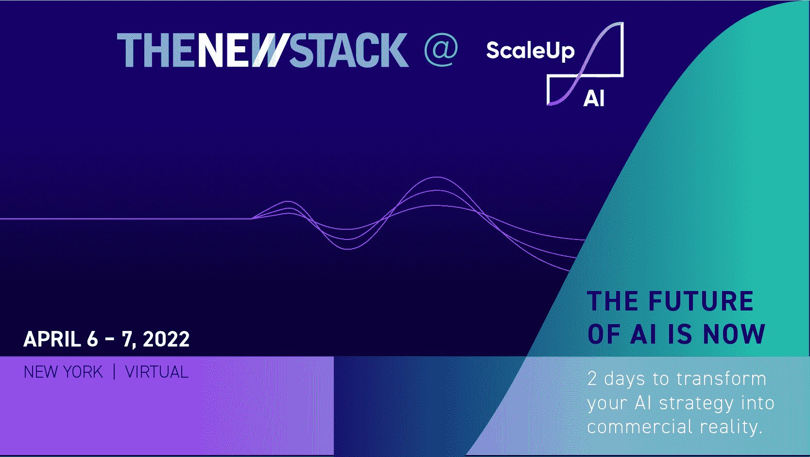

# RasgoQL 为 Python 用户带来了现代的数据堆栈

> 原文：<https://thenewstack.io/rasgoql-brings-the-modern-data-stack-to-python-users/>

这篇文章是我们为迎接 4 月 6 日至 7 日在纽约举行的“扩大规模:人工智能大会”而撰写的系列文章之一。有关 TNS“早鸟”折扣代码，请参见下面的注释。

[Patrick dough erty](https://www.linkedin.com/in/cpatrickdougherty/)

[Patrick dough erty 是 Rasgo 的首席技术官和联合创始人，他已经成为数据科学和数据工程领域的资深专家。他的职业生涯始于戴尔的数据科学，后来进入 Slalom 的咨询部门，最终领导和管理了一个由数据科学家和数据工程师组成的大型团队。Patrick 与数百家组织和数千名数据科学家合作过，不断发现由于生命周期中数据准备方面的大量摩擦，组织无法实现其数据科学目标。Patrick 负责产品的战略方向，并管理 Rasgo 的产品和工程团队。](https://www.linkedin.com/in/cpatrickdougherty/)

将模型部署到生产环境中的最大障碍通常是根本不创建模型，而是创建一个可以向模型交付新数据的数据管道。 [Rasgo](https://www.rasgoml.com/) 成立于 2020 年，旨在利用云数据仓库，让数据科学家更容易地以生产就绪的方式准备数据，从而解决这一问题。

在与多个行业的数百名数据科学家合作后，我和我的联合创始人一直看到数据科学家对与 ML 数据准备相关的繁琐工作感到沮丧。他们的大部分时间都花在提取、探索、清理、连接和转换数据上，而不是开发模型和解决棘手的问题。

在 Rasgo 之前，我的职业生涯是作为一名单独的数据科学家开始的……也就是说，我与营销和运营部门的优秀同事一起工作，但没有其他数据工程师、数据分析师或数据科学家与之合作。在这个职位上，我很快发现自己花在保持数据管道正常运行上的时间比花在全新的统计建模和分析上的时间还要多。我面临的最大挑战之一是运行在 pandas 中构建的长 python 脚本，这样我就可以重新对模型进行评分，并更新我的营销和运营团队成员用于制定日常决策的仪表板。

我所有的提取和转换脚本都是在 [Python](https://thenewstack.io/an-introduction-to-python-for-non-programmers/) 中构建的，但是我可以访问的唯一生产就绪环境支持 SQL。听起来熟悉吗？好消息是，自那以后，有三件事情发生了变化:

1.  在 [雪花](https://www.snowflake.com/) 和[biqquery](https://cloud.google.com/bigquery)(RIP，Hadoop)的推动下，数据集中化全面卷土重来。
2.  [five tran](https://www.fivetran.com/)/[/Airbyte](https://airbyte.com/)已经初步解决了 ELT 的“E”部分(提取、加载、转换)，除非您是拥有大量本地数据源的全球 2000 强企业。
3.  我们不是将数据从您的数据仓库提取到计算环境中，而是将计算带到我们的数据中，并在数据仓库中运行大多数转换工作负载(大声喊到 [dbt](https://www.getdbt.com/) )。

在 ScaleUp:AI， Rasgo，雪花和数据机器人将更详细地讨论这个问题，重点是一个特别普遍的客户终身价值模型，或 CLV。预测 CLV 是有价值的，但利用这种预测来推动营销、销售和供应链方面的明智决策更有价值。

那么，少了什么？现代的数据堆栈将一个用户冷落一旁 Python 数据科学家。这个用户生活在一个 Jupyter 笔记本中，擅长在 pandas 或 dask 中编写数据转换和特性工程的脚本。SQL 不是他们选择的语言； *select * from* 并不可怕，但是用窗口函数、cte、自连接等生成数百个特征……既令人不知所措又效率低下。

我们提议让 [RasgoQL](https://github.com/rasgointelligence/RasgoQL) 成为 Python 用户进入现代数据堆栈的桥梁。在 Jupyter 笔记本(如果你喜欢，也可以是 [Hex 笔记本](https://hex.tech/) )中使用 RasgoQL，python 数据科学家可以针对表或视图编写 [类似熊猫的转换代码](https://docs.rasgoql.com/quick-start) ，快速生成数百行 SQL，这些 SQL 将直接在你的 [Snowflake](https://www.snowflake.com/?utm_content=inline-mention) 、BigQuery 或 Postgres 数据仓库(即将推出更多数据仓库支持)中运行。最精彩的部分？在一行代码中，您可以 [将该 SQL 导出到您的 dbt 项目](https://docs.rasgoql.com/workflows/exporting-to-dbt) 中，以便它可以与其他数据管道一起在生产中运行。

现在，还不是所有的 Python 转换都可以被编译成纯 SQL 代码……随着数据仓库改进了对 python UDFs 的支持，RasgoQL 将能够轻松地将 python 中的转换代码与其他转换捆绑在一起，这样整个转换链就可以协调起来。

我们迫不及待地想得到您对 RasgoQL 的反馈。在 Rasgo，我们相信在未来，您组织的所有成员都可以在不到五分钟的时间内从数据中获得洞察力，而 RasgoQL 是一个强有力的开始。

在我们的 [Slack 用户群](https://join.slack.com/t/rasgousergroup/shared_invite/zt-nytkq6np-ANEJvbUSbT2Gkvc8JICp3g) 上 [Twitter](https://twitter.com/cpdough) 联系我，让我知道你的想法！

*附言——rasgo QL 是由我们一位不可思议的工程师[Andrew Griffin](https://www.linkedin.com/in/andrewmgriffin/)[打造的，他正在雇佣](https://jobs.gusto.com/postings/rasgo-senior-data-engineer-88fb0c73-2523-4add-b6ea-e7c9f61774c2) 。来加入我们的团队吧！*

*新堆栈的母公司 Insight Partners 将于 4 月 6 日至 7 日主办 [ScaleUp: AI](https://scaleup.events/) 会议，合作伙伴花旗集团(Citi)和人工智能行业最具变革性的领导者也将出席。这个混合会议将人工智能和创新的远见卓识者、杰出人士和实干家聚集在一起，将释放思想，解决真正的商业挑战，并说明为什么我们正处于人工智能升级革命的中期——以及如何将其转化为商业现实。立即回复以获取早期报价并获得额外的 TNS 折扣:使用代码 TNS25。*

<svg xmlns:xlink="http://www.w3.org/1999/xlink" viewBox="0 0 68 31" version="1.1"><title>Group</title> <desc>Created with Sketch.</desc></svg>