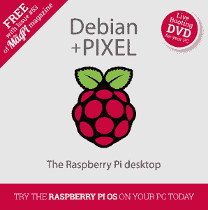
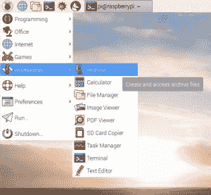
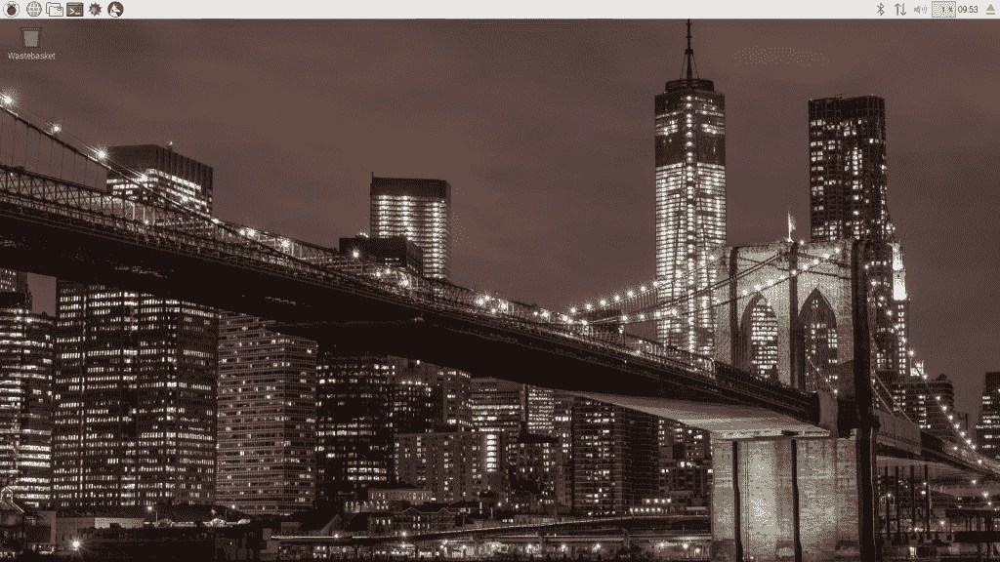

# Raspberry Pi 为老式电脑扩展其 PIXEL 桌面发行版

> 原文：<https://thenewstack.io/raspberry-pi-expands-pixel-desktop-distro-vintage-computers/>

去年九月， [Raspberry Pi 基金会](https://www.raspberrypi.org/)为其微型单板电脑系列发布了[其新的 PIXEL 桌面环境](https://www.raspberrypi.org/blog/introducing-pixel/)。该基金会的 UI 负责人[在公告](https://www.raspberrypi.org/blog/introducing-pixel/)中写道 [Simon Long](https://www.raspberrypi.org/blog/author/simon-long/) “桌面已经到了它本身就是一个完整产品的地步，应该有自己的名字。

上个月，他们决定更进一步，为 x86 平台发布了“Debian+PIXEL”发行版。

“回到夏天，我们问自己一个简单的问题:如果我们这么喜欢 PIXEL，为什么要让人们购买 Raspberry Pi 硬件来运行它？”树莓派基金会的创始人 Eben Upton 在博客中写道。“有大量的 PC 和 Mac 硬件安装在那里，它们可以很好地运行 x86 Debian。”

PIXEL/OS 组合目前只是一个从 u 盘或 DVD 临时启动的“实时映像”(出于试用目的)。当然，这意味着“如果你从 DVD 上运行，你创建的任何文件，或者你对系统所做的修改，在你关掉机器的时候，当然会丢失。”但厄普顿表示，它最终可能会创建一个安装程序。

除了《我的世界》和 Wolfram Mathematica 的之外，它包含了你在 Raspberry Pi 板上找到的所有相同的应用程序(因为那些软件许可只涵盖 Raspberry Pi 设备)。当然，因为它是基于 Debian 的，用户仍然可以安装免费的 Debian 应用程序。

厄普顿概述了一些用例场景——例如，一名学生可以在一台低成本的家用电脑上运行 Pixel，同时在她学校的机器上找到相同的桌面环境。但更重要的是，“将 PIXEL 引入 PC 和 Mac 让我们保持诚实。我们不仅仅想为 Raspberry Pi 创造最好的桌面环境:我们想创造最好的桌面环境，仅此而已。我们知道我们还没有到那一步，但通过将 PIXEL 与 Windows、Mac OS 和成熟的桌面 GNU/Linux 发行版一起运行，我们可以更容易地看到我们的弱点在哪里，并努力修复它们。”

他强调这是一个*原型*——并建议在尝试镜像之前备份您的系统——但补充说他们将尽最大努力解决一些硬件配置上的小问题，“如果我们决定这是我们想要长期致力于的事情。”

当然，它是开源的。“我们在 apt 和 [GitHub](https://github.com/raspberrypi) 上提供我们所有修改过的源代码——任何想要的人都可以免费获得，”龙在 9 月份评论道。

厄普顿邀请读者在评论中分享他们的经历，四周之内就有超过 650 个回复——其中大多数都很热情:

*“用在我的‘即将被扔掉的带古怪硬盘的惠普 D6000 展厅’……到目前为止还不错。”*

*“我有一台用了 6 年的笔记本电脑，正在积灰。是时候重获新生了！”*

*“它在配有 2GB 内存的 Compaq Mini CQ10 上运行非常快，我使用 2gb usb 加密狗从那里启动”*

回到树莓派基金会，也有一些实验。Simon Long [注意到它在一些 MAC 上遇到了问题](https://www.raspberrypi.org/blog/pixel-pc-mac/#comment-1266910)，并开始收集反馈以进行故障排除。“它在我的 2014 款 MacBook Pro 和 2013 款 MacBook Air 上都能正常启动。然而，它不能在 2015 年的 MacBook Air 和 2011 年的 Mac Mini 上启动，”他指出。但是厄普顿报告说，他甚至在他的 ThinkPad X40 上成功地测试了它——超过 20 年，并写道 Debian/PIXEL 组合应该可以在其他设备上工作,“只要它们至少有 512MB 的内存”

多年工作的巅峰之作。在他 9 月份的帖子中，龙想起了他在 2014 年夏天加入基金会的时候。“第一天，Eben 和我坐下来玩了半个小时 Raspbian 桌面，然后他问我‘你觉得你能把它做得更好吗？’"

Long 仔细研究了用户界面。“实际上，一旦你弄清楚所有这些部分是干什么的，用 [LXDE 桌面](http://lxde.org/)进行破解会非常容易，”他写道。在接下来的两年里，他“慢慢地把我觉得最能从调整中获益的部分去掉。”

最终的 PIXEL 桌面环境带来了许多具体的改进:

*   新的商务图标“带着一点趣味”——包括新的低压和高温警告图标。
*   窗户角上微妙的曲线。
*   一种渲染 Roboto 字体的新方法。
*   一个新的标题栏，设计为看起来“更干净”，具有更薄的框架和新的关闭/最小化/最大化图标。
*   禁用 WiFi 和蓝牙连接的能力。
*   桌面共享(和远程访问能力)。“RealVNC 希望将他们的产品移植到 Raspberry Pi，并慷慨地提供给我们，以及在 Pi 上使用的免费许可证，”龙在评论中解释道，并补充说“我们感激地接受了。”
*   基金会的开发者之一格雷戈·安南代尔拍摄的可爱的桌面照片。这些桌面图片现在也会出现在登录屏幕的后面(如果选择了手动登录)。

此外，它还配备了 Pi 版本的 [Chromium](https://www.chromium.org/Home) 浏览器，预装了广告拦截扩展，以及 Adobe Flash 和 [h264ify](https://addons.mozilla.org/en-US/firefox/addon/h264ify/) ，改善了 YouTube 视频的播放。“安装 h264ify 不会神奇地启用视频硬件解码，”龙后来在他的帖子中解释道。“它只会强制视频采用 H.264 格式，然后用内置的 Chromium 软件视频解码器进行解码。”

龙还向用户保证，Pi 的图像仍然包括树莓 Pi 自己的 [Epiphany 浏览器](http://blog.barisione.org/2014-09/rpi-browser/)。“我们选择使用 Chromium 的主要原因是，在性能和兼容性都很好的现代浏览器中，它最容易为我们添加硬件加速视频播放功能，”Long 在另一条评论中解释道。“我们没有支持或反对任何特定浏览器(或公司)的政治目的。”

他似乎意识到自己的作品受到了热烈欢迎。“我们发布我们认为人们可能想要的东西，我们听取反馈，我们决定下一步做什么，”他在 9 月份的评论中写道。“坦率地说，我们在这里、我们的论坛和互联网上看到的热情程度，总的来说，在这个版本发布后一直非常积极——远远超过我们的预期。”

<svg xmlns:xlink="http://www.w3.org/1999/xlink" viewBox="0 0 68 31" version="1.1"><title>Group</title> <desc>Created with Sketch.</desc></svg>