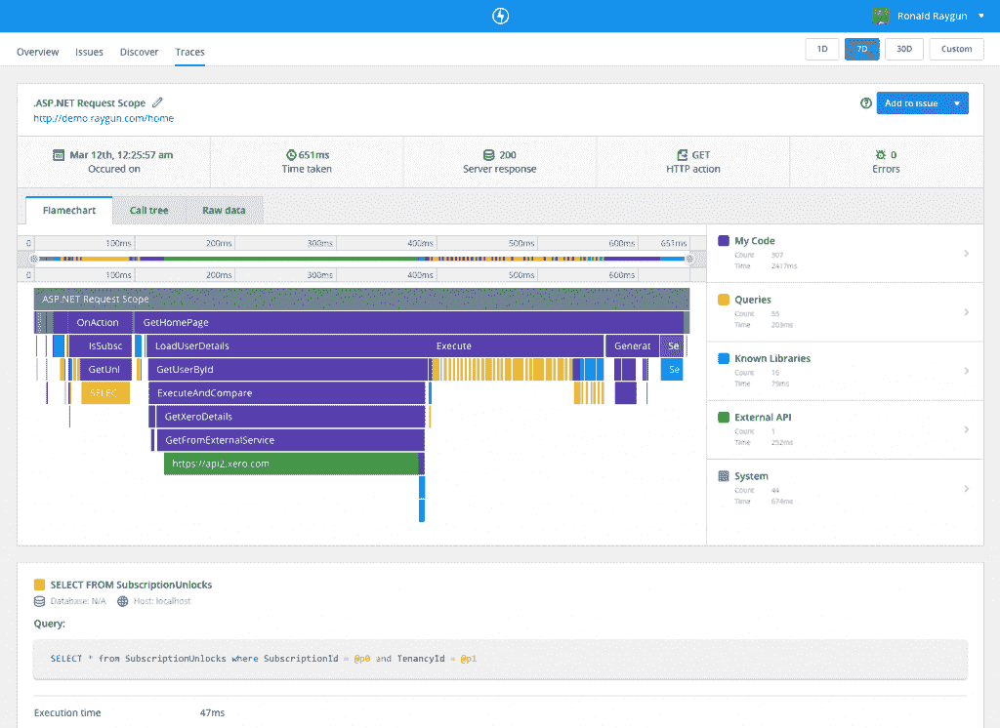

# Raygun APM 使查找性能瓶颈变得更容易、更快、更便宜

> 原文：<https://thenewstack.io/raygun-apm-makes-finding-performance-bottlenecks-easier-faster-and-cheaper/>

[Raygun](https://raygun.com/) 赞助本帖。

 [弗雷亚·斯帕文

弗雷亚·斯帕文是 Raygun 的数字营销专家，ray gun 是一个软件智能平台，帮助开发团队为用户创造无错误的体验。](https://raygun.com/) 

当您构建软件时，需要考虑的事情太多了，但是应用程序加载的速度对于为客户创造出色的软件体验至关重要。您是否完全了解每个客户在使用您的软件时发生了什么？您所有关于应用程序性能的问题现在都有答案了吗？您能在几分钟而不是几小时内找出问题的根本原因吗？如果没有，我们已经有了新的东西来帮助您的开发团队为您的用户构建更好、更快、更高质量的软件体验，让他们对性能问题有无与伦比的洞察力。

今天，我们将发布 [Raygun 应用性能监控(APM)](https://raygun.com/platform/apm) ，这是一种在服务器端可视化和了解应用性能的新方法。

您所需要做的就是安装 Raygun 代理，我们将帮助您测量应用程序中隐藏的瓶颈。

这对于各种规模的团队来说都是一件大事，它提供了一个单一的位置来诊断错误和性能问题。

适用于。NET 和 Azure 应用服务，然后是。NET 核心，以及其他语言和框架。

由于 New Relic、Appdynamics 和 Dynatrace 等公司主要以每台服务器的模式收费，Raygun 决定通过为其所有 APM 计划提供无限服务器监控来改变现状。这允许大量使用容器和微服务的团队享受从其基础设施的深远部分收集跟踪的好处，而不是由于成本原因而依赖于对其堆栈中有限数量的服务器的监控。

Raygun APM 纯粹根据我们需要为您的应用程序处理的数据量计费，因此您完全可以控制服务器端监控的成本和范围。

由于 Raygun 的 [错误监控](https://raygun.com/platform/crash-reporting) 和 [真实用户监控](https://raygun.com/platform/real-user-monitoring) 产品如今已经帮助了成千上万的软件开发团队，Raygun 也采用了 APM 的开发人员优先方法，提供了性能指标的高级细节以及工作流工具，让您可以管理从第一次检测到部署到生产的最终修复的解决方案。

定制仪表板还为经理和利益相关者提供了监控对他们最重要的关键指标的灵活性。您的整个团队都会喜欢使用 Raygun 来密切关注您的应用程序在最终用户手中的表现。

## 什么是 APM？

仅仅知道您的应用程序是运行还是停止是不够的； [速度变慢发生的频率是崩溃](https://www.slideshare.net/KenGodskind/alertsitetrac) 的 10 倍，所以尽快了解原因很重要。

APM 工具可以帮助您:

*   立即了解和深入任何应用程序问题的根本原因，包括导致问题的确切代码行、函数、数据库或 API 调用；
*   监控关键指标，如 Apdex 分数的变化，在团队仪表板上测量绩效趋势
*   在问题影响到客户之前发现问题，提供卓越的用户体验。

这些年来，我们收到了客户的反馈，认为当前的 APM 环境有所欠缺，需要改变。

首先，大多数 APM 工具缺乏为开发人员提供有意义数据的环境，这使得调试和故障排除变得困难。其次，使用当前的定价模型，APM 工具对于在现代开发环境中运营的公司来说是不可访问的，例如使用微服务和容器平台的组织。

我们构建了 Raygun APM 来满足对集成监控解决方案的需求，该解决方案为开发人员提供了从服务器到最终用户的崩溃和性能的完整可见性。这一切都以非常[经济高效的封装](https://raygun.com/pricing#platform-startup)提供给所有现代架构，没有过剩或主机限制:

*   启动平台计划:每月 199 美元
*   小企业计划:每月 549 美元
*   商业计划:每月 1499 美元
*   定制企业:联系销售

“将 APM 添加到 Raygun 平台实现了我们对完全集成的监控解决方案的愿景。Raygun 首席执行官兼联合创始人 John-Daniel Trask 表示:“崩溃、真实用户性能和服务器/应用程序监控都在一个地方，而不是孤立的。“多年来，我们一直致力于打造集成度最高的监控平台，重新思考可以实现的目标，并支持所有现代解决方案架构。”

### Raygun APM 有何不同

我们相信 Raygun 为需要 APM 解决方案的现代开发团队带来了新鲜空气。我们的目标不是给开发人员提供过多的数据点，而是提供一个对开发人员友好的产品，在提供快速修复问题所需的必要细节方面表现出色。

Raygun 提供了其他 APM 工具无法提供的功能:直观易用的界面，无与伦比的应用性能细节。

在我们的测试阶段使用 APM 的开发人员表示，他们使用我们的工具获得了比使用现有成熟平台(如 New Relic、App Insights 和 App Dynamics 以及其他 APM 播放器)更好的见解。使用 Raygun 提供的细节，他们能够更好地了解代码库中实际发生的事情，并能够解决他们以前无法用现有解决方案解决的问题。

## 示例工作流程

假设您注意到您的应用程序普遍变慢。你用来衡量你的应用程序的指标表面上看起来不错，没有什么异常，但是有几个用户报告说这个应用程序感觉很慢，当你在我周围导航时，你可以感觉到一种普遍的迟钝。但是你真的不知道这是否是一个问题，它影响了多少人，它是否真的伤害了更广泛的业务，或者为什么会发生这种情况。你有问题，但很少有答案。

鉴于 web 和移动应用程序中的许多问题会导致糟糕的用户体验，但不会导致应用程序完全崩溃或出错，当应用程序加载时，您如何了解应用程序和服务器之间实际发生了什么？你现在真的可以用 X 射线视觉看到你的软件内部，用 Raygun，你可以。

Raygun APM 在页面加载时提供完整、完整的上下文和时间线的可视化分解，包括代码的执行时间、方法调用、数据库查询、第三方库和外部 API 调用。

例如，对于查询，Raygun 能够识别具有 N+1 问题的查询，其中该查询被调用 100 次。在调查原因之后，您可以在 Raygun 中看到它可以被优化为只调用一次，从而大大减少了页面加载时间。这极大地改善了我的客户对我的应用程序的用户体验。由于 Raygun 提供这些信息的方式，确定根本原因只需几分钟而不是几小时，因为我看到了问题背后的全部背景。

传统的 APM 解决方案(如果您已经有了)不提供具有这种粒度跟踪信息的可视化时间线，而是依赖于基于文本的调用树视图。对于只需要指出问题所在的正确方向的团队来说，这是可以接受的，但通常无法给出您需要的答案。当深入研究难以解决的性能问题时，Raygun 给你的是针而不是干草堆。

以下是 Raygun 与当今 APM 环境的对比:

### 创新定价

基于使用情况的创新定价意味着您可以在整个体系中提供经济高效的 APM，无论是微服务架构还是单个大型整体架构。

### 易于安装

通过我们 14 天的免费试用和简单的安装过程，您可以在短短两分钟内获得数据流。

### 开发人员友好的用户界面

有了 Raygun APM，您只需点击几下鼠标，就能获得调试和诊断问题所需的信息。APM 的核心是我们的火焰图，它显示了跟踪的可视化时间线，有助于轻松确定未来需要改进的领域，并在几秒钟内突出显示问题。

### 无与伦比的洞察力

Raygun 擅长捕捉团队诊断问题所需的丰富细节。我们的一些客户已经能够提供与特定请求相关的详细信息，因为他们可以访问所需的所有细节。

Linbis Logistics 软件的首席执行官兼联合创始人埃里克·费尔南德斯(Eric Fernandez)表示，易于解读的诊断报告尤为重要。

费尔南德斯说:“雷根的追踪和火焰图非常清楚地表明了问题所在。”“这样大家都省了不少时间。”

### 所有东西都在一个地方

使用 Raygun 平台将服务器端计时与错误、崩溃和前端性能相关联。

## 目前可用的特性和集成

Raygun APM 可与您的开发环境协同工作，并且已经具备了快速诊断问题所需的所有特性，例如:

*   详细的交易跟踪。
*   仪表板；
*   用户体验报告；
*   真实用户监控。

集成也在发布时提供，包括:

*   GitHub
*   懈怠；
*   吉拉；
*   寻呼机关税

[(欲了解更多详情，请访问我们的集成文档。)](https://raygun.com/docs/apm/integrations)

## Raygun APM 的未来

在接下来的几个月里，我们将向 Raygun 平台添加更多的集成和功能。

虽然 Raygun APM 已经有了一个成熟的真实用户监控产品，但我们的近期目标是继续添加更多有助于实现特定业务指标的功能。期待定制报告、部署跟踪、聚焦仪表板、高级指标和服务发现等功能。

了解更多关于 [Raygun 应用性能监控](https://raygun.com/platform/apm)

我们很高兴能帮助开发团队更好地合作，我们很乐意听到你的想法， [请联系我们。](https://raygun.com/about/contact)

专题图片:Raygun 联合创始人杰里米·博伊德(左)和约翰-丹尼尔·特拉斯克(右)

<svg xmlns:xlink="http://www.w3.org/1999/xlink" viewBox="0 0 68 31" version="1.1"><title>Group</title> <desc>Created with Sketch.</desc></svg>