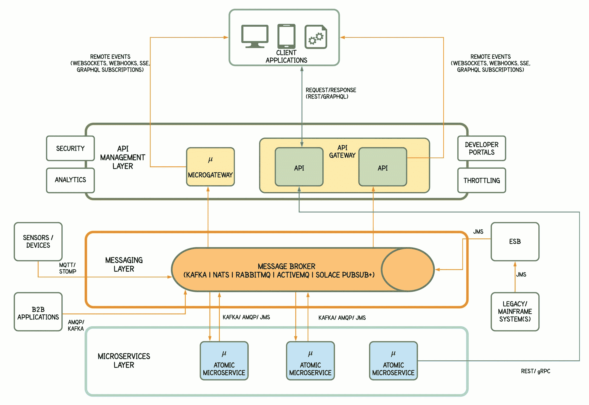

# 利用事件驱动的 API 实时做出反应

> 原文：<https://thenewstack.io/react-in-real-time-with-event-driven-apis/>

Dakshitha ratna yake

Dakshitha 是 WSO2 技术推广部的副主任。她在软件开发、解决方案架构和中间件技术方面拥有超过 10 年的经验。

我的出租车在哪？火车什么时候到达？我投资的股票价格下跌了吗？如今，用户越来越需要更多的交互体验，他们希望在发生变化时无需点击刷新按钮就能被告知。

那么，您如何构建需要基于远程事件(近)实时更新的应用程序呢？收到关于有人喜欢你的照片或在 Instagram 上对你的故事做出反应的通知，或者你的脸书新闻流显示了你朋友最近的更新，这是前端应用程序对后端事件做出反应的另一个例子。这是通过事件驱动的 API 实现的，这些 API 通过客户端应用程序和后端之间的各种异步事件驱动通信模式得到支持。

那么，作为创建反应式 web 应用程序或公开 API 以供此类应用程序使用的开发人员和架构师，我们应该如何在 API 世界中处理异步或事件驱动的通信呢？在这个世界中，同步通信占主导地位，大多数防火墙会阻止非 HTTP 流量。关键是要有一个事件驱动的后端，根据您确切的异步需求选择一种异步 web API 技术，以及一个可以处理远程事件的客户端。

今天构成 web 的绝大多数 API 都是同步 API，客户端通过向后端发送请求并等待响应来启动客户端和后端之间的所有通信。然而，这些请求/回复 API 调用一次发生一个，按照预先安排的顺序，并且每个交互都阻止流程的进展，直到它完成。如果客户端应用程序希望了解更新，它必须定期连续调用 API 进行更新。这被称为轮询，是需要了解新数据的客户端应用程序的常见手段。但是，与后端在事件发生时立即通知客户端相比，这种方法效率很低，反应也不太灵敏。“疯狂轮询”一词的产生是因为大多数轮询调用都被浪费了，因为数据没有改变。

## 什么时候应该使用事件驱动的 API？

与事件驱动架构(EDA)相比，支持事件的 API 是一个相对较新的现象，它使用 EDA 来支持发布给第三方的 API 中的可伸缩、实时(或接近实时)、基于推送的通信。事件驱动就是在事件发生时利用事件，消费者可以登记他们的兴趣(订阅)并实时对事件做出反应。使 API 成为事件驱动或异步的(以及底层的服务器端事件驱动架构)可以消除对低效轮询请求的需求，并在更新发生时立即发送给客户端(事件订阅者)。这为用户提供了更好的体验。

因此，简而言之，在以下情况下启用事件 API:

*   应用程序应该将更改从服务器推送到客户端，而不是等待客户端请求。
*   应用程序必须为用户提供一个高度活跃的双向通信渠道。
*   应用程序需要在客户端和后端之间进行大量持续的交互，如果使用同步 API，这会给后端带来伸缩问题。
*   应用程序需要能够监控系统范围的事件。

## 选择异步 API 技术

启用事件的 API 确实具有多种复杂性——从选择什么框架和网络协议开始，到构建交付的可靠性，以及确保 web 级解决方案的可伸缩性。如今普遍使用的异步协议解决了实时通信的问题，但它们以不同的方式解决了这个问题的不同方面——从而使一些协议比其他协议更好地服务于不同的目的。

对于多路复用、双向流以及需要来自连接两端的大量消息的应用程序，WebSockets 是理想的。在浏览器客户端只对订阅数据流感兴趣，而不需要在同一连接中与服务器进行通信的情况下，服务器发送的事件特别有用。Webhooks 可用于将通知推送到一台或少量服务器的简单实现。GraphQL 的较新的异步变体(订阅和实时查询)带来了与 GraphQL 相关的好处，但是，实现相对复杂，需要相当长的学习曲线。gRPC 和 Kafka 一般用于内部微服务之间的通信。

## 后端架构应该是什么样子

虽然客户端体系结构必须订阅源自后端的状态改变事件，但是典型的后端体系结构可以被扩展以通过以下方式创建与客户端的远程事件连接:

*   事件驱动的 API(理想情况下通过支持事件语义的 API 管理平台公开)。
*   消息代理(如果还没有的话)。
*   发布和处理状态改变事件的微服务。

尽管事件驱动的 API 并不明确要求代理，但是使用事件生产者和消费者之间的中介有助于实现所需的模式，从而交付更易于管理和扩展的解决方案。代理从物联网设备、变更数据捕获(CDC)工具、其他后端系统和服务以及客户端应用程序(如果启用了双向通信)接收事件。然后，它可以提醒订阅这些事件的服务。一个**可扩展的微服务架构(MSA)** 是复杂事件驱动的后端服务的最佳架构。这些事件驱动的微服务可以充当事件订阅者或发布者，以便处理事件、处理错误和保持事件驱动的状态。

后端和 web 客户端之间的远程事件连接可以通过由各种异步 API 技术支持的事件驱动 API 来建立，如 Webhooks、WebSockets、服务器发送的事件、GraphQL 订阅等。后端使用这些 API 发送与客户端相关的事件，并接收来自客户端的事件。

## 管理事件驱动的 API

事件驱动的主干网将安全、大规模地管理整体实时数据流，而异步 API 可以通过传统的 API 管理解决方案进行管理，以供外部和内部使用，该解决方案具有支持事件驱动语义的固有或扩展功能。大多数组织拥有基本的事件处理基础设施，但许多组织没有能力设计、开发、测试和管理以事件为中心的 API。API 管理解决方案提供的基本 API 管理功能——特别是治理、访问控制、监控、分析和货币化——可用于管理异步和 REST APIs。一些 API 管理解决方案已经支持 Webhooks 或/和 Websockets。

随着 [AsyncAPI 倡议](https://www.asyncapi.com/)标准化事件驱动的 API，API 管理工具中对异步 API 的支持获得了牵引力。AsyncAPI 是一种类似于开放 API 规范的开放规范格式，但是侧重于异步接口。AsyncAPI 与协议无关，允许您记录事件的结构、语义、消费者如何订阅、生产者或消费者如何传递事件，以及如何保护和验证端点。

图 1:支持事件驱动 API 和同步 API 的高级后端架构。

## 结论

同步 API 是许多场景的理想选择——尤其是当您需要即时响应的时候。在其他情况下，当客户端需要被通知事件或者响应所需的处理发生在不同的时间时，普通的同步消息传递变得棘手，事件驱动的 API 可以很好地满足这种需求。

EDA 非常灵活，您可以从简单的通知开始，或者将双向事件通信与同步方法结合起来，以提供最佳的架构。因此，将事件驱动设计与传统的 API 请求/响应设计结合使用，可以两全其美地构建高可伸缩性和反应性的 web 应用程序。此外，将传统的 API 管理功能与事件驱动的架构相结合，可以为扩展业务范围和采用提供巨大的附加值。

*有关使用异步 API 技术和 API 管理平台创建支持事件的 API 架构的更多详细信息，请阅读作者撰写的白皮书***。**

*<svg xmlns:xlink="http://www.w3.org/1999/xlink" viewBox="0 0 68 31" version="1.1"><title>Group</title> <desc>Created with Sketch.</desc></svg>*