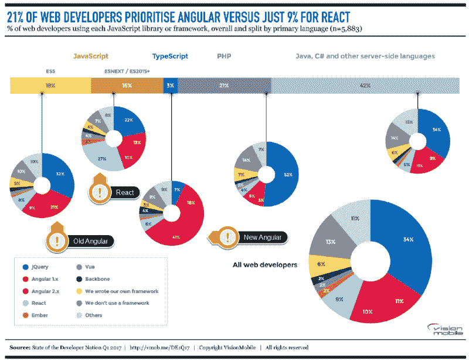

# React.js 构建了 JavaScript，便于组件化

> 原文：<https://thenewstack.io/react-js-structures-javascript-easy-encapsulation/>

 [乔恩·贾博

乔恩·贾博是 Sencha 的技术营销经理，Sencha 是一家为设计、开发和测试跨平台 web 应用程序提供统一平台的公司。](https://www.sencha.com/) 

JavaScript 正在改变开发团队对桌面、服务器和移动应用的期望。对 [JavaScript](/tag/javascript/) 的增强使其能够脱离浏览器，而 [Node.js](/tag/node.js/) 和其包管理器 npm 等技术有助于创建可移植的前端和后端应用程序，这些应用程序可以与传统上为 Windows、Linux 和移动设备等环境创建的应用程序相媲美。

React 是 JavaScript 社区内部类似转变的一部分，它帮助开发人员改进 JavaScript 成熟的 web 环境所需的开发实践。这种转变有望使 JavaScript 开发人员能够在更短的时间内创建应用程序，提高质量和可维护性，同时消除开发人员所厌恶的许多乏味工作。

## 开发人员喜欢 JavaScript 并做出反应

Stack Overflow 是软件开发人员的热门目的地，它提供了一个社区，数百万开发人员可以在这里互相帮助。每年它都会对其用户进行一次大调查。[2017 年调查](https://insights.stackoverflow.com/survey/2017)显示，JavaScript 连续第五年成为最受欢迎的编程语言。

它还查看流行的库和框架，以了解开发人员重视什么。React 开发人员可能不会惊讶 React 是最受欢迎的技术——不仅在 JavaScript 生态系统中，而且在所有语言和生态系统中。

在 [Sencha](https://www.sencha.com/) ，我们认为这种流行很大程度上是因为 React 给开发体验带来的好处。

JavaScript 应用程序代码传统上很难理解，因为代码分布在各种 JavaScript、HTML 和 CSS 文件中，事件和数据通过许多不直观的路径流动。此外，浏览器之间的不一致性和不兼容性需要对代码进行各种调整和特殊处理。结果，开发团队努力创建和维护高质量、大规模的应用程序。只有最有天赋和纪律的团队才能在这种情况下取得成功。

React 使用声明式的、基于组件的方法来解决这些棘手问题。组件封装了特定组件所需的 HTML、JavaScript 和 CSS，应用程序是通过将组件组合成更大的组件来构建的，这些组件封装了自己的数据和逻辑。这种封装在不同组件之间创建了自然的结构，使得理解、改进、重构和维护大型应用程序变得更加容易。

React 鼓励使用单向数据流，例如脸书自己的 Flux 架构或库(如 Redux)所支持的单向数据流。这使得理解数据如何流经应用程序变得容易得多，因此开发人员(甚至是新开发人员)可以更容易地开发和维护代码，而不会引入意外问题。

而且，很容易将 React 放到现有的 JavaScript 应用程序中进行测试，通常不需要对应用程序的其他部分进行大的更改。React 自动优化文档更新，这意味着开发人员花费更少的时间来争取视图的良好性能。

## 反应不是万能的

不幸的是，尽管 React 提供了一个良好的基础，但是开发团队仍然需要解决许多其他的挑战。React 密切关注视图技术。它提供了构建视图并在浏览器中高效呈现视图的工具，仅此而已。React 和脸书提供了许多建议和最佳实践来帮助开发人员构建他们的应用程序，但开发人员最终要承担构建应用程序的负担——创建或采购各种组件，设计数据架构和测试计划，建立应用程序的外观和感觉，适应必要的显示环境，等等。

可悲的是，虽然有很多选项可以解决列表中的特定部分，但很少有选项在所有领域都有帮助。事实上，对某些类别采用专门的解决方案会使解决其他类别的问题变得更加困难。

例如，许多 React 团队使用定制开发的组件和开源组件的组合，在某些情况下还使用商业组件。这在应用程序中提供了有用的功能，但在这些组件和应用程序的其余部分之间实现一致的外观和感觉会非常困难。

而且，由不同团队开发的组件必然会提供不同级别的可定制性和与用户需求的一致性。与自己不从头构建相比，用户可能会花费更多的精力来尝试使组件适应他们的需求。

## 组件选择至关重要

前面提到的挑战有助于说明为什么组件选择对开发团队如此重要:因为它很容易开始，他们可能没有意识到不兼容或不一致的范围，直到改变它们太痛苦。仔细识别技术需求，包括功能性、可测试性、可定制性等。在开始开发之前，能够更好地鉴定预期组件。

在评估组件时，不仅要考虑组件的基本功能，还要考虑让它按照您想要的方式外观和行为的能力。还要考虑文化适应性:组件是否适合您的开发工作流程和自动化系统？即使有了源代码，改变组件的基本特性也需要大量的工作，并且会带来很大的测试负担。

管理这些挑战最简单的方法是最大限度地减少组件使用的资源数量。由同一个团队开发的组件通常可以以相同的方式进行样式化和测试，通过相同的方式进行增强，在某些情况下甚至可以利用专门的工作流工具来改善开发体验。这些解决方案可以大大减少构建复杂的 React 应用程序所需的工作和时间，从而提供丰富、美观、有凝聚力的用户体验。

## 关于 Sencha 和 ExtReact

我在 Sencha 工作，在那里我们开发并支持[extremact](https://www.sencha.com/products/extreact)，这是 React 的一套全面的组件，它们无缝地协同工作，并经过专业的构建、测试和维护。除了包括 100 多个强大的预构建组件，ExtReact 还提供了一个灵活的布局系统，可以轻松构建在多种不同屏幕几何图形上看起来很棒的应用程序。

精心设计的数据包简化了高性能数据驱动应用的创建，使开发人员能够更轻松地管理前端和后端之间的数据流动。许多 ExtReact 组件利用数据包来提供一致的缓冲、排序、过滤和分页功能，而开发人员只需付出最少的努力。这些操作可以在本地或远程执行，即使数据集超过数百万行，也能确保高响应性和出色的用户体验。

如果你正在用 React 开发一个复杂的、数据驱动的应用程序，我鼓励你仔细确定你的技术需求，然后[尝试一下](https://www.sencha.com/products/extreact)，看看它是否适合你。

特征图片由[詹姆斯·帕多塞](https://unsplash.com/@padolsey)通过 [Unsplash](https://unsplash.com/?photo=tvPvROBv0F4) 拍摄。

<svg xmlns:xlink="http://www.w3.org/1999/xlink" viewBox="0 0 68 31" version="1.1"><title>Group</title> <desc>Created with Sketch.</desc></svg>