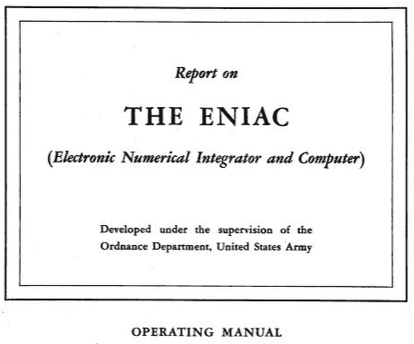
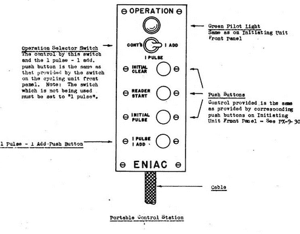
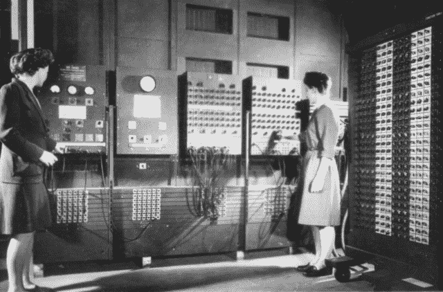

# 阅读世界上第一台电子计算机 ENIAC 的使用手册

> 原文：<https://thenewstack.io/reading-the-manual-for-eniac-the-worlds-first-electronic-computer/>

有时你必须长时间回顾才能意识到事情发生了多大的变化。如果你本月浏览我们的现代云增强网络，你会发现几个网站分享了关于 1946 年 ENIAC 计算机发布的记忆——以及所有那些不知疲倦地让它工作的不可阻挡的中世纪工程师。

ENIAC(电子数字积分器和编译器)是世界上第一台全电子通用计算机。史密森尼杂志曾称它为“开启数字时代的房间大小的政府计算机”上周，I 程序员网站分享了一个链接[到 ENIAC](https://www.i-programmer.info/news/82-heritage/12835-eniac-operating-manual.html) 的原始操作手册，该手册最初于 75 年前的这个月出版。

它的日期是 1946 年 6 月 1 日——由费城宾夕法尼亚大学工程学院出版——该手册在 Archive.org 的页面显示它仅被浏览了 2309 次。(“还没有评论，”网站上的样板文件写道。"做第一个写评论的人。")

该档案馆将其确定为“bitsavers.org 收藏”的一部分，该项目由计算机历史博物馆的软件策展人发起，拥有超过 98，500 个文件和超过 470 万个文本页面。

那么，关于 ENIAC 的历史时刻，我们能从记录其操作的手册中收集到什么呢？

看起来这台机器是喜怒无常的。例如，它警告说，在没有首先将操作开关转到“连续”之前，永远不要打开 DC 电源

"不遵守这个规则会导致某些 DC 保险丝烧断，特别是-240 和-415 . "

但是如果你在直流电源接通时打开 DC 保险丝盒，后果会更严重。“这不仅使人暴露在大约 1500 伏的电压差下，而且人可能被飞溅的熔化保险丝烧伤”(如果其中一个保险丝盒突然熔断)。事实上，ENIAC 实际上设计有一个门开关分流器，如果其中一个面板门打开，它就无法运行，“因为移除门会暴露危险的电压。”但是可以通过将门开关分流器保持在其关闭位置来绕过该特征。

在计算机历史档案项目分享的一段视频中，总工程师 j·普雷斯珀·埃克特记得很少超过一两天没有至少一根管子爆裂的情况。

除了潜在的电击，灰尘是另一个潜在的危险。“灰尘颗粒可能会导致短暂的继电器故障，”手册警告说，“所以避免在 ENIAC 房间里搅动灰尘。”

此外，如果任何继电器外壳被拆下，为了不弄乱外壳内的灰尘，一定要放回原来的位置。

ENIAC 使用 IBM 读卡器，但它也有自己的问题。在某一点上，手册实际上建议不要在穿孔卡的每一列都使用相同的数字，因为“这样会削弱穿孔卡，增加在 IBM 机器的进给机构中‘卡住’的可能性。”

## **基本说明**

尽管有这些限制，ENIAC 仍然是一项了不起的技术。该手册包括其机架、托盘、电缆和布线的复杂图纸和详细图表。但最重要的是前面板图，它“显示了开关、插座等的一些细节”。每个单元的每个面板。”

"它们包含了在 ENIAC 上设置问题的基本说明."

ENIAC 的面板上装有霓虹灯，与“分母触发器”和“除法触发器”相对应。该手册包括脚注，仔细解释了在什么情况下每个灯将被点亮。

“零的平方根也许是除法器上最容易重复的测试——”

直到第 28 页，它才解释说，打开启动开关“启动 ENIAC 的启动程序，打开 DC 电源、各种面板的加热器和风扇……”，它还会打开一个小黄灯。

“当该序列完成时，表明 ENIAC 已准备好运行，绿灯亮起…”

“常量发送器”(向“累加器”发送)有门，其电路包括“程序脉冲输入端”——用于加脉冲和减脉冲。该机器还包括两个“有效数字开关”

当需要 10 个或更多的有效数字时，左边的开关设置为 10，右边的开关设置为两个开关读数之和等于所需的有效数字数。

这一切是如何协同工作的，有一些诱人的一瞥。手册建议进行复杂的测试，以确保所有硬件都正常工作。它包括一张值为 P 11111 11111 的卡片，它被输入到机器的“累加器”中 18 次。数学结果— 19，999，999，998 —显然超出了累加器的范围，因此预期结果实际上是 M 99999 99998。然后，值为 P 00 000 00001 的卡被传输到累加器正好两次，这应该给出值 P 00000 00000，而不是 200 亿(20，000，000，000)。

"注意，这个测试假设有效数字开关设置为‘10’…"

## 令人惊叹的事业

在《史密森尼杂志》上，科技作家史蒂文·利维回忆起 20 世纪 70 年代住在费城，从一个名叫 j·普雷斯珀·小埃克特的人那里租了一套公寓。“直到几年后我成为一名科技作家，我才意识到我的房东[发明了电脑](https://www.smithsonianmag.com/history/the-brief-history-of-the-eniac-computer-3889120/)。”

https://www.youtube.com/watch?v=G8R6li54R20

20 世纪 40 年代初，埃克特是工程学院的研究生，后来成为 ENIAC 的总工程师。二战期间，一位教授曾提出用电子计算弹药轨迹来帮助美国军方。

利维称之为“令人惊叹的事业”。最初的费用估计数 15 万美元将增加到 40 万美元。这个 U 形建筑重达 30 吨，占据了一个 1500 平方英尺的房间。它的 40 个机柜，每个都有 9 英尺高，装有 18，000 个真空管，10，000 个电容器，6，000 个开关和 1，500 个继电器……两个 20 马力的鼓风机呼出冷空气，这样 ENIAC 就不会熔化。”

当他们完成建造的时候，第二次世界大战已经结束。

但是仍然有工作要做。原子遗产基金会网站报道说，ENIAC 被[用来帮助执行世界上第一颗氢弹的工程计算](https://www.atomicheritage.org/history/computing-and-manhattan-project)(以及另外两台最近开发的计算机)。"整个 1951 年夏天，整整花了 60 天的处理时间."

利维引用了一份军方新闻稿，将 ENIAC 描述为“数学机器人”，它“将科学思维从冗长的计算工作中解放出来。”

最近一部名为 *The Computers* 的纪录片提醒现代观众，ENIAC 最初的程序员都是女性——[凯·麦纽提](https://en.wikipedia.org/wiki/Kathleen_Antonelli)、[贝蒂·詹宁斯](https://en.wikipedia.org/wiki/Jean_Bartik)、[贝蒂·斯奈德](https://en.wikipedia.org/wiki/Betty_Holberton)、[玛琳·韦斯科夫](https://en.wikipedia.org/wiki/Marlyn_Meltzer)、[弗兰·比拉斯](https://en.wikipedia.org/wiki/Frances_Spence)和[露丝·利奇特曼](https://en.wikipedia.org/wiki/Ruth_Teitelbaum)。

现在还有一个名为 ENIAC 程序员项目的网站，分享这部纪录片的简要概述和更多信息。第二次世界大战期间，美国军方组建了一个由近 100 名女性组成的团队，她们接受过数学训练，负责计算复杂的弹道方程。他们中的六个人被选中为 ENIAC 编程。

早在 1996 年，IEEE 计算机历史年鉴刊登了一篇名为[“ENIAC 的女性”的简介，采访了 10 位在计算机运行的 10 年间与它一起工作的女性。](https://web.archive.org/web/20160304052225/http://www.eg.bucknell.edu/~csci203/2012-fall/hw/hw06/assets/womenOfENIAC.pdf)

这部纪录片的海报将她们描述为“六名被历史遗忘的女性，她们创造了改变我们世界的技术。”

ENIAC 最终被越来越快、越来越便宜的计算机甩在了后面。“到 1955 年退役时，它已经被用于风洞设计、随机数发生器和天气预报的研究，”橡树岭国家实验室的 ENIAC 网页上写道。

利维回忆说，尽管 ENIAC 于 1955 年退役，但 50 年后它在费城的一个简陋的仪式上被重新组装起来。

"副总统阿尔·戈尔扳动了开关，剩下的棋子咔嗒咔嗒地说出了一道加法题的答案。"

据利维说，ENIAC 的总工程师后来抱怨道:“你愿意把你一生的大部分工作都用在一平方厘米的硅上吗？”但是利维看到了另一种看待它的方式。“这个问题可以很容易地换一种说法:你会如何看待发明了改变文明进程的机器？”

然而，抛开遗产不谈，能成为作品本身的一部分似乎也是一件令人激动的事情。

“我从未见过如此激动人心的环境，”让·詹宁斯·巴提克在影片中回忆道。"我们知道我们正在向前沿推进。"

60 多年后，她仍然记得 ENIAC 计算机“是一个狗娘养的编程”

* * *

## WebReduce

<svg xmlns:xlink="http://www.w3.org/1999/xlink" viewBox="0 0 68 31" version="1.1"><title>Group</title> <desc>Created with Sketch.</desc></svg>