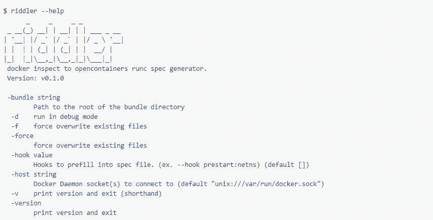

# 用谜语器为 RunC 运行时准备好 Docker 容器

> 原文：<https://thenewstack.io/ready-docker-containers-runc-runtime-riddler/>

这是一个关于标准化好处的故事……以及如何使用容器程序员[杰斯·弗雷泽勒](https://github.com/jfrazelle)编写的工具[谜语器](https://github.com/jfrazelle/riddler)将 Docker 容器转换成 runC 映像。

[IBM 开放云技术的高级技术负责人 Phil Estes](https://github.com/estesp) ，在本周举行的 LinuxCon 大会上展示了这一能力。

## 跑，跑，跑

在[开放容器倡议](https://www.opencontainers.org/)的监督下，runC 是一个开源引擎和规范，用于运行符合 OCI 规范的容器，包括 Docker 容器。与 image 规范相结合，runC 的想法是提供一个不受任何供应商控制或云栈约束的开源容器。它基于 Docker 的 LibContainer，这是该公司自己的核心容器引擎，用作操作系统的接口。

runC 本身可以运行 Docker 映像。它需要两个要素。一个是一组配置指令。这些是通常附加在 Docker run 命令后面的命令行标志；runC 从清单文件 **config.json** 中读取它们。可以手工填写，也可以由 runC 自动创建。

RunC 还需要一个根文件系统来操作容器。用户可以手动创建一个目录，作为容器的根目录，或者通过 **docker export** 命令从容器本身导出文件系统。

“有了这两条信息，runC 就可以执行容器了，”Estes 说。

## 但是为什么呢？

Estes 解释说，在很多情况下，运行 runC 可能比 Docker 自己的功能更全的容器引擎更好。

它可以为将容器移植到新环境提供基础——例如[Solaris Zones](https://docs.oracle.com/cd/E18440_01/doc.111/e18415/chapter_zones.htm#OPCUG426)——或者创建新的符合 OCI 标准的容器引擎或平台。英特尔的 Clear Containers 和 Hyper.sh 利用了 runC。

runC 是测试新特性的地方，比如现在正在 RunC 中酝酿的检查点恢复。Docker 的 [seccomp](https://thenewstack.io/docker-engine-hardened-secure-computing-nodes-user-namespaces/) ，在 Docker 1.10 推出，最早在 runC。

“RunC 是您希望第一次实现的地方，这样更高层可以利用该功能，”Estes 说。

开发人员可能还会发现 runC 很方便，因为它提供了一个简单、干净的接口来快速迭代文件系统和配置的变化。“我不必担心存储或后端，”埃斯蒂斯说。

## 输入谜语

虽然 runC 本身可以创建一个容器清单("[**runC spec>config . JSON**](https://runc.io/)")，但是生成的文件非常普通，可能仍然需要填充许多环境变量。当 Docker 引擎自动捕获这些信息时，为什么还要手动操作呢？

另一方面，谜语器允许用户仅仅通过运行容器来为容器创建完整的配置文件，并允许谜语器从 Docker 引擎本身提取必要的细节。谜语程序构建一个与刚刚运行的容器的配置文件完全匹配的配置。“如果我安装了卷，如果我使用了只读文件系统，如果我使用了用户名称空间，所有这些东西都会被复制到我的 runC 配置中，”Estes 说。

谜语者也会填充一些典型的设定。例如，seccomp 设置的许多假设与 Docker 引擎相同，比如不允许系统调用。它还捕获最初与 docker run 命令一起运行的任何命令。在 Estes 的演示中，他还运行了 Linux **date** 命令来展示该命令是如何被复制的。

其他方面仍然必须手动完成。OCI 尚未管理网络，因此必须输入这些设置。谜语者提供了一个进入网络的钩子，允许用户预先填充网络设置。用户仍然需要为容器创建一个文件系统。对于这一部分，Estes 为自己创建了一个脚本，以匹配谜语者捕获的用户网络名称空间信息。

经过这些步骤，“我们有了一个非常类似于简单 Docker 运行的环境，”Estes 说。

[https://www.youtube.com/embed/u0j4qPJy1iM?feature=oembed](https://www.youtube.com/embed/u0j4qPJy1iM?feature=oembed)

视频

## 膨胀

作为如何使用它的一个例子，Estes 演示了如何用 NGINX 复制一个最近运行的容器。他使用-d 标志在守护模式下运行软件，这种模式一直延续到 runC。他还用 Lynx 文本浏览器运行了一个容器。

在这种情况下，runC 可以以多种方式让开发人员变得更容易。通过清单，Devs 可以很容易地改变正在运行的容器的配置。容器可以访问开发人员目录树中的其他目录。

“在开发模式中，这种简单性可能对你正在做的事情非常有用，”Estes 说。

RunC 还提供了一种使用 [Linux 功能的方法](http://man7.org/linux/man-pages/man7/capabilities.7.html)有一组通常与超级用户权限相关的系统调用或资源操作，可以根据具体情况进行定制。例如，Docker 有一套 Linux 功能设置。通过清单，runC 提供了一个精确设置的列表，允许开发人员轻松地修改它们。

例如， **CAP_NET_RAW** 设置控制用户执行低级 TCP 功能的能力，例如执行互联网控制消息协议(ICMP)的能力，用于 **ping** 命令。一个快速演示显示，ping 最初确实有效，但在 Estes 做出更改后，就不再有效了。同样， **CAP_SYS_ADMIN** 可以被切换，以允许用户读取和设置主机名，或者不读取和设置主机名，以及其他特性。

Docker 和 [IBM](https://www.ibm.com/cloud) 是新堆栈的赞助商。

<svg xmlns:xlink="http://www.w3.org/1999/xlink" viewBox="0 0 68 31" version="1.1"><title>Group</title> <desc>Created with Sketch.</desc></svg>