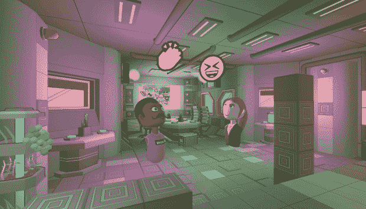
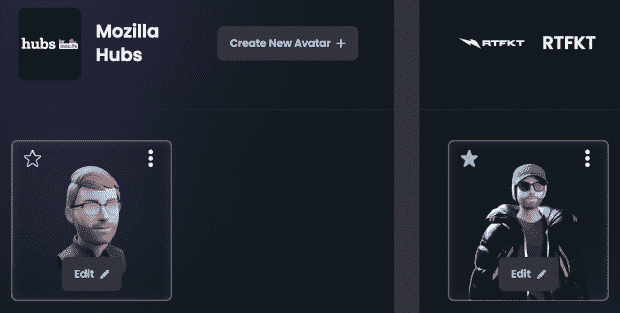

# Ready Player Me 和 3D 互操作性的挑战

> 原文：<https://thenewstack.io/ready-player-me-and-the-challenges-of-3d-interoperability/>

如果元宇宙成为现实，那么化身将是开发者的一个重要组成部分。如果这些虚拟角色可以互操作就更好了——也就是说，可以在不同的虚拟世界和在线游戏中使用。在为可互操作的化身技术提供平台的竞争中处于早期的一家公司是 Ready Player Me (RPM)，它已经被 3000 多名开发者使用——但并非没有技术挑战。

我采访了 RPM 的联合创始人兼首席技术官 Rainer Selvet，他住在爱沙尼亚。我们的讨论发生在 RPM [宣布](https://blog.readyplayer.me/series-b-announcement-a16z/)5600 万美元的 B 轮融资之前，由著名的硅谷风险投资公司 Andreessen Horowitz (a16z)牵头。

有两个部件[来控制转速](https://docs.readyplayer.me/ready-player-me/)。首先是头像创建者产品，一个任何人都可以使用的基于网络的头像生成器。其次，Ready Player Me SDK(软件开发工具包)——开发者可以使用它将 RPM(包括 Avatar Creator)集成到自己的应用程序中。SDK 有多种风格，包括支持两个领先的游戏开发平台:Unity 和 Unreal Engine。

## 用于前端渲染的 Web

我已经通过 RPM 网站使用过几次 [Avatar Creator](https://readyplayer.me/) ，为 Mozilla Hubs 和 VR Chat 等 3D 空间构建头像。我发现界面非常光滑，对我来说创建头像很容易。所以我问 Selvet 是用什么网络技术建立的。

他回答说，无论是在他们的网站上，“还是当开发人员将 RPM 作为 iframe 或 WebView 集成到他们的应用程序中时”，他们都使用 React 和 Three.js 的组合进行前端渲染。

“除此之外，”他继续说道，“同样重要的是，头像不仅要显示在 WebView 中，还要以一种可以在游戏引擎和不同的合作伙伴应用程序中互操作和加载的方式导出。这是我们在服务器端拥有的专有堆栈。”

那么一个 Unity 或者 Unreal 引擎开发者一般是怎么使用 RPM 的呢？Selvet 回答说，一个选择是使用 WebView 将 Avatar Creator 嵌入到应用程序中。例如，在 Unity 手机游戏中，开发人员可能会在 Unity 中打开 Ready Player Me 并创建一个角色。然后，角色的 URL 被传递到 Unity 应用程序中，供最终用户使用。Selvet 说:“SDK 能够加载虚拟形象，播放动画，并在引擎中设置虚拟形象的技术细节。”

## 有腿还是没有腿？

在元宇宙开发的早期阶段，avatar 技术的一个常见问题是缺乏标准化。我在 RPM 中创建的 Mozilla Hubs 头像与 VR 聊天头像完全不同(首先，前者没有腿)。所以我问 sel vet RPM 如何处理不同的头像技术需求？

通过 Mozilla Hubs 的图像

“首先，”他说，“为了让头像能在 3200 个应用程序中工作，使用 RPM 的开发者需要采用我们提供的特定标准。”然而，他承认，这是迄今为止开发者面临的“最大挑战之一”，因为“几乎所有人的应用程序都有一些与其他应用程序不同的怪癖”。

Selvet 说，为了解决这个问题，RPM 建立了自己的系统，允许开发人员“准确定义哪些参数或哪些技术规格参数最适合他们的应用”。例如，2022 年的虚拟化身没有腿是很常见的(Meta 的 Horizon 在这方面类似于 Mozilla Hubs)。因此，这可能是开发人员选择为他们的应用程序启用的参数。

Selvet 补充说，“我们也将很快推出一个新的 API，在管理参数和规范方面给予开发者更多的控制”。

## 平台支持也是一个挑战

尽管 RPM 已经支持多种虚拟应用和世界，但它还远远不够全面。体素和分散是两个新兴的元宇宙平台，还没有在 RPM 网站上列出。我问 Selvet 对这些和其他流行平台的支持是否会很快到来？

“不会很快，”他回答说，并补充说，体素化在技术上很难集成到它的平台上。体素(基本上是像素的 3D 版本)是新兴元宇宙中常见的几何类型。它有一种块状的美感，这可能是你从流行的在线游戏《我的世界》和 Roblox 中熟悉的。元宇宙的产品也采用了同样的风格，比如体素(以前叫 Cryptovoxels)、沙盒等等。

“这是我们从顶级合作伙伴那里收到的最大要求之一，”塞尔维特说。“不仅能够调整虚拟形象的技术规格，还能够调整虚拟形象的视觉审美——虚拟形象的外观和风格——以便更好地适应他们的应用程序。我们实现这一目标的能力的最终证明将是体素化，这在技术上可能是最难实现的，但也将是最令人印象深刻的。”

RPM 自己的头像美学是照片级的——事实上，RPM 的新用户被鼓励“自拍”，这被用来影响头像的外观。

几个我准备好的玩家我的头像。

## 开放标准

glTF 和 VRM(基于 glTF)是新兴的头像标准中的两个，所以我问 RPM 是否支持。

“所以基本上，从构建 Ready Player Me 的第一天起，我们就一直在 glTF 标准之上构建，”Selvet 说。“因此，虚拟角色的所有资产都在 glTF 中交付。我们采用它的原因是，甚至在两年前，我们就觉得它将成为元宇宙的 JPEG 格式。”

RPM 支持的第一个平台是 Mozilla Hubs，当时(2020 年)它使用 glTF 作为主要格式。塞尔维特说，这“也推动了我们采用 glTF”。

也就是说，除了 glTF 之外，RPM 也在积极寻找更强大的新兴标准来支持。例如，通用场景描述(USD)，一个由皮克斯开发的开放标准，被 Khronos 组(glTF 标准的[管理员](https://www.khronos.org/gltf/))称为[的 PSD 到 glTF 的 JPEG](https://thenewstack.io/metaverse-standards-forum/) ，在 RPM 的路线图上。

“也有可能在某个时候，我们将进入美元格式，”Selvet 说，“特别是当我们为我们的开发者开放内容创作能力的时候。[……]我可以看到开发者向我们发送整个场景描述符的好处，我们将能够加载并交付到我们拥有的应用网络中。”

## NFTs——但还不包括头像

在[开放元宇宙](https://thenewstack.io/how-the-open-metaverse-will-transform-our-online-identities/)圈子里的另一个话题是使用 NFT 来实现数字资产的所有权。RPM 是看好这个想法的平台之一。

塞尔维特说:“很有可能在某个时候我们不会把这些资产称为 NFTs，它将只是用户拥有的资产——或者任何一个对消费者更友好的术语。”"但最终，作为用户，你可以拥有数字资产的真正所有权."他补充道，开发者们将会追随 NFTs 的潮流，“因为他们需要确保他们的最终用户和玩家真的开心。”

然而，RPM 目前不支持头像作为 NFT 出售。它的开发者文档写道，“你不允许铸造任何现成的玩家我头像作为非功能性游戏，即使你是注册合作伙伴。”根据塞尔维特的说法，这是出于商业原因。“我们计划通过开发商销售虚拟形象的化妆品，而不是虚拟形象本身来实现盈利。”他说的化妆品指的是虚拟角色的虚拟财产——比如衣服。塞尔维特说，这项政策将来可能会改变。

## 结论

Ready Player Me 已经是一个完善的消费者工具(自己试试看)，但我最感兴趣的是它能从开发者那里获得多少吸引力。对于元宇宙开发者来说，利用现有的虚拟形象创建工具和 SDK 是有意义的，而不是尝试重新创建轮子。也许更大的平台，如 Meta 和微软，会及时发布自己的头像创建工具。但是现在，RPM 有一个很好的开端——也有一大笔风险投资资金用于扩大规模。

<svg xmlns:xlink="http://www.w3.org/1999/xlink" viewBox="0 0 68 31" version="1.1"><title>Group</title> <desc>Created with Sketch.</desc></svg>