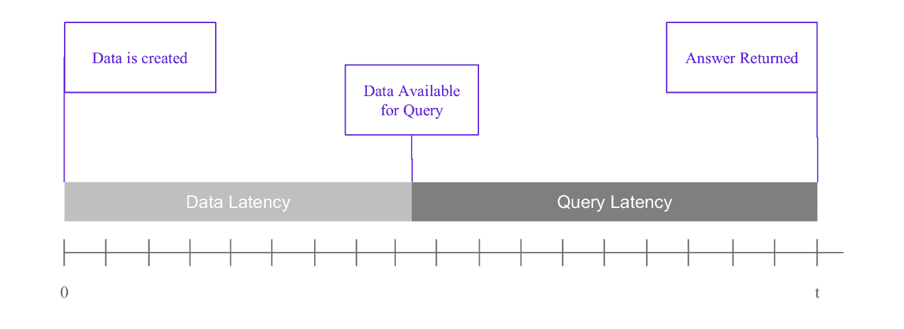
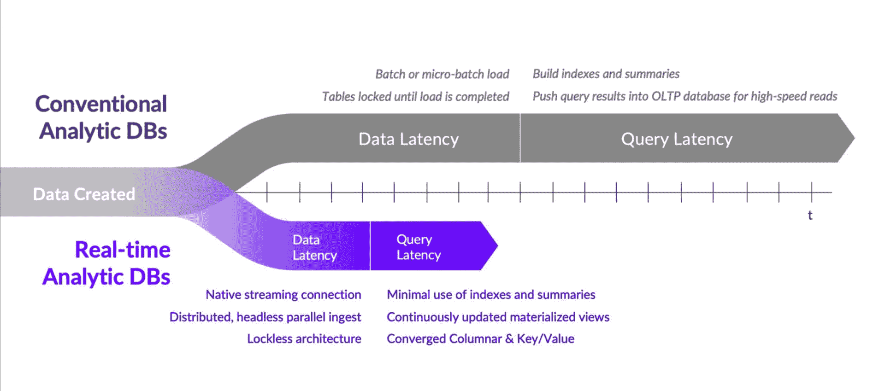

# 实时分析数据库——是物还是非物？

> 原文：<https://thenewstack.io/real-time-analytic-databases-thing-or-not-a-thing/>

虽然术语“实时”在某些情况下可以用作营销宣传，但实时分析数据库和传统分析数据库之间存在真正的技术和功能差异。实时分析数据库(又名流数据库)是[分析数据库](https://thenewstack.io/more-database-analytics-workloads-ran-on-kubernetes-in-2022/)的一个独特类别，针对近实时处理和分析大容量、高速度的数据进行了优化。

传统的分析数据库针对批量处理大量历史数据进行了优化。虽然这些数据库可以提供对过去趋势和模式的宝贵见解，但它们并不是为实时决策或在网络规模上将分析注入下游应用程序而设计的。

传统分析数据库的示例包括 Snowflake、Greenplum、BigQuery、Redshift 和 Teradata 等。

另一方面，实时分析数据库可以在数据到达时进行处理和分析，使组织能够根据最新信息做出明智的决策并立即采取行动。

它们旨在为现代设备、机器和传感器生成的流数据提供低延迟查询、快速接收和可扩展处理。这类数据库的例子包括 Kinetica，Pinot，Druid， [Rockset](https://thenewstack.io/rockset-fast-sql-querying-on-raw-data/) ，Materialize， [ClickHouse](https://thenewstack.io/clickhouse-rapidly-rivals-other-open-source-databases-in-active-contributors/) ， [SingleStore](https://thenewstack.io/whats-next-managing-data-in-cloud-native-environments/) 和 [Aerospike](https://aerospike.com?utm_content=inline-mention) 等等。

反对实时分析数据库从根本上不同于传统分析数据库的观点的“steelman”论点是，实时分析数据库只是传统分析数据库范例的扩展，增加了实时能力。这种差异更多的是程度的问题，而不是基础技术的根本转变。

这一论点的支持者指出，实时分析数据库和传统分析数据库都是为存储和分析大量数据而设计的，在这两种情况下，数据存储、索引和查询的基本原理基本上是相同的。此外，许多传统的分析数据库现在提供某种级别的[实时](https://thenewstack.io/building-real-time-location-intelligence-apps/)处理能力，例如微批量加载或最新的查询加速技术，模糊了这两个类别之间的区别。

为了使实时分析数据库成为一个独特的类别，考虑下面基于数据延迟和查询延迟的框架。数据延迟是指从数据生成到数据可用于处理和分析之间的时间延迟。这种延迟可能是由多种因素造成的，但主要是网络速度和接收开销。

查询等待时间指的是将查询提交给数据处理系统和返回查询结果之间的时间延迟。查询延迟主要是查询复杂性、被查询数据量、存储类型和查询引擎复杂程度的函数。

## **数据延迟差异**

接收数据流包括实时处理到达的数据，通常是通过连续的数据流。一个同类最佳的实时分析数据库将具有三个基本特性，以从根本上减少数据延迟。

1.  原生流连接器优化了从流数据源(想想 Kafka、NiFi、Kinesis 等)的数据摄取。)放入数据库。与通用数据库连接器相比，使用本机流连接器可以提供几个优势，包括更快的接收速度、更高的可靠性和简化的集成。领先的实时分析数据库拥有连接到[接收器和源](https://www.confluent.io/product/connectors/)的本地流连接器。

2.  在需要支持从大量源(想想成千上万个不同的传感器)摄取数据的系统中，无头摄取尤其有益，因为它允许以分散的方式摄取数据，而不需要充当瓶颈的中央协调点。

3.  数据库中的无锁体系结构是指一种设计方法，其中数据库最小化或消除锁的使用，以控制多用户环境中对共享资源的访问。锁通常用于防止两个或多个事务同时访问相同的数据，这可能导致数据不一致。但是，锁定会显著增加数据延迟，因为在加载过程中表是锁定的，并且新加载的数据在加载完成且表解锁之前不可查询。在无锁架构中，替代方法确保一致性和并发控制，例如乐观并发控制或多版本并发控制。这些方法允许多个事务在没有锁的情况下并发访问相同的数据。相反，数据库使用时间戳或版本号来跟踪数据的更改并解决冲突。无锁架构可以在大容量、分布式或实时数据库系统中提供更好的可伸缩性和性能。然而，它们也需要复杂的算法和精心的设计来确保数据的一致性和正确性。

传统的分析数据库没有到源和接收器的本地流连接，通过一个协调点集中接收数据，并大量使用表锁定，这些因素共同导致了显著的数据延迟。

## **查询延迟差异**

一旦数据可供查询，查询的速度就很重要。一个一流的实时分析数据库将有三个基本特性来从根本上减少查询延迟。

1.  由于突破性的数据库设计创新(考虑分布式、列式、内存)，查询性能经常会有阶跃函数的变化。最新的创新是矢量化(也称为数据级并行)。矢量化查询引擎将数据存储在固定大小的块(称为矢量)中，并对这些矢量而不是单个数据元素并行执行查询操作。这种方法使查询引擎能够同时处理多个数据元素，从而将查询执行速度提高了几个数量级，并提高了性能。通过使用这种矢量化方法，查询引擎不仅提高了查询性能，还最大限度地减少了所需的计算和数据工程(更少的索引和反规范化)。 [TPC-DS 基准](https://www.kinetica.com/benchmarks/)证明了这一点。

2.  物化视图是一种通过预先缓存结果来加速查询的老技巧，但是它们是以查询陈旧数据为代价的。然而，持续更新的物化视图产生聚集的结果，这些结果由于在定义的增量变化时触发刷新而保持新鲜。这消除了折衷，使数据库既快速又新鲜。

3.  在某些情况下，实时洞察的最终用户不是数据科学家或业务用户团队，而是成千上万使用数据融合应用程序的人(想想拼车应用程序或金融交易台)。为了支持如此大规模的高速读取，洞察必须从分析数据库(如 columnar)转移到运营数据库(如。键值)。这一跳增加了更多的延迟和复杂性。现代实时分析数据库通过融合这些设计模式来解决这个问题。

传统的分析数据库没有完全矢量化，因为它们有太多的技术债务，无法利用这一创新并将其所有操作矢量化。传统的分析数据库仍然依赖于物化视图的旧模型，并将大规模高速读取视为不同数据库的任务。总之，实时分析数据库为下一代融合数据的应用程序提供了迄今为止最新鲜的见解。

这并不是说所有的实时分析数据库都是一样的。有些为连接和特别查询提供了更好的支持。有些是开源的。一些专注于网络日志数据，而另一些则支持传感器和机器数据所需的时间序列和空间。无论您的实时数据库需要什么，都可能有适合您的用例。

<svg xmlns:xlink="http://www.w3.org/1999/xlink" viewBox="0 0 68 31" version="1.1"><title>Group</title> <desc>Created with Sketch.</desc></svg>