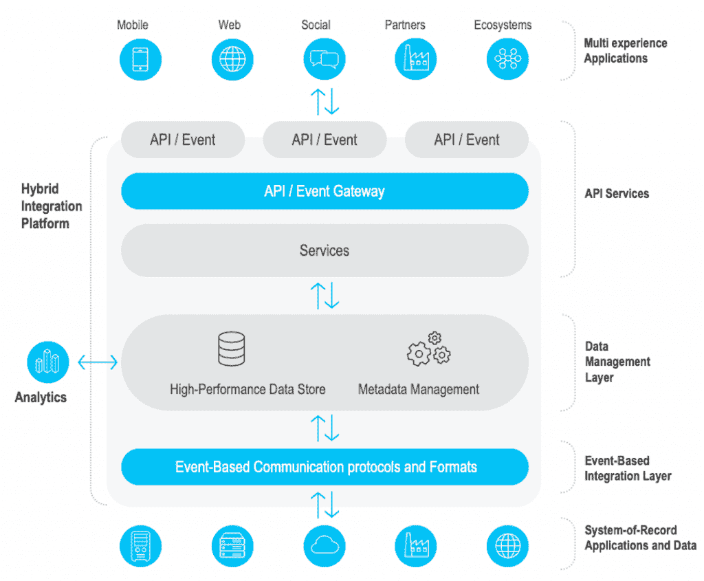
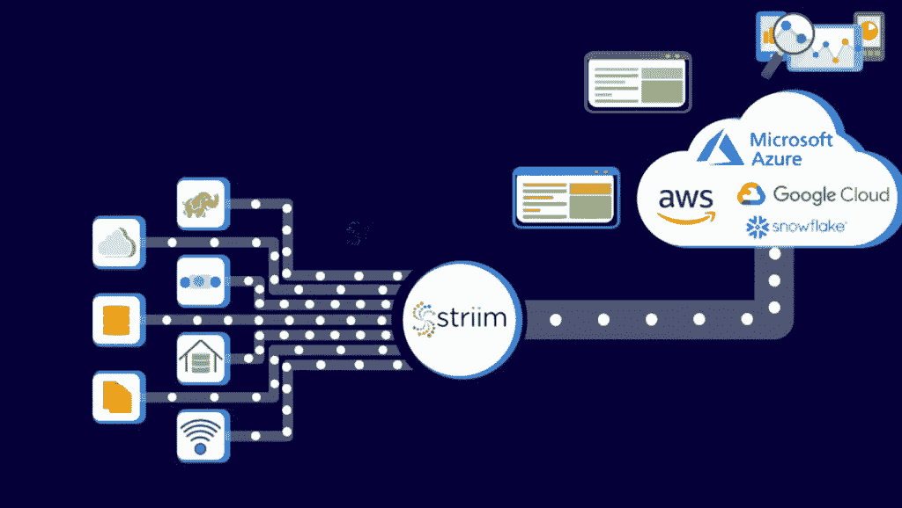

# 跨高度分布式环境的实时数据访问

> 原文：<https://thenewstack.io/real-time-data-access-across-highly-distributed-environments/>

目标很简单，但实现这一目标被证明是一个挑战:如何提供对数据的实时或接近实时的访问，这些数据在许多不同的分布式环境中根据需要不断刷新。

因此，由于不同的数据系统及其位置可能会在不同的网络环境中激增，包括多云和内部部署，在许多情况下还包括地理区域，因此组织很难维持与应用程序所需数据的低延迟连接。当用户要求并越来越多地要求他们的体验(通常基于交易)在需要数据密集型后端支持的近实时或实时条件下得到满足时，这些挑战尤其明显。

许多组织继续努力应对维护和依赖数据流和其他方式的挑战，例如通过所谓的具有缓存内存的“速度层”，来维护多云和内部环境之间的低延迟连接。

在本文中，我们描述了维护异步更新数据源所需的不同组件，这些数据源由不同的记录系统组成，实时访问对于最终用户体验来说是必不可少的。

对于首席信息官来说，挑战包括应用程序对数据进行低延迟访问的能力，这些数据通常分散在许多高度分散的数据源和记录系统中。

“首席信息官经常问‘我如何从现有环境中获取数据，如何将数据转移到云中，然后如何将数据作为托管服务来运行。’"[雷迪斯实验室的现场首席技术官艾伦·泰尔托告诉新的堆栈. "很多时候，特别是在医疗保健和金融服务领域，首席信息官会问‘我如何保持与内部的一致性，因为实际上，我的记录系统仍将保留在那里，我在生态系统和企业集成方面投入了大量资金，我不想失去这些资金。问题是如何维护整个数据管道，但仍然通过公共云公开新的数字渠道。"](https://www.linkedin.com/in/allenterleto)

for 的产品营销总监 Priya Balakrishnan 告诉 New Stack:[随着许多企业继续维护重要的本地和传统基础设施，组织通常会寻找各种方法来无缝集成所有环境中的数据，以构建下一代实时应用。她说:“跨云和内部环境的数据流的挑战是促进跨不同技术堆栈和不同环境的复杂网络的实时数据互操作性。”虽然专业工具支持将数据从本地迁移到云中，但许多工具并不提供持久的桥梁来保持数据始终同步](https://www.linkedin.com/in/priyabalakrishnan)

一致性也是关键。例如，一个组织可以提供一个高性能的云应用程序，但如果某些数据集没有异步更新，数据访问方面可能仍然是一个致命弱点，而微服务则没有达到它们需要的安全性和可靠性。“一切都需要保持一致，”泰尔托说。“如果库存不一致，我在网站上显示有五把锤子可用，然后去商店发现只剩三把，我就不是一个满意的顾客。”

## 数字集成中心(DIH)来了

一种新兴的替代方案是 Gartner 最初称之为数字集成中心(DIH)，它允许组织为要求接近或接近实时访问数据的最终用户开发应用程序。根据 [Gartner 的定义](https://www.gartner.com/doc/3987367)，DIH 将来自不同记录系统的数据聚合到一个“低延迟高性能数据层，通常可通过 API 访问”因此，开发人员可以通过创建应用程序来利用 DIHs，而无需管理应用程序、缓存和记录系统之间的同步，其中通过 API 访问不同数据源的超低延迟是关键。

数字内存 DIH 服务提供商 [GigaSpaces](https://www.gigaspaces.com/) 的产品副总裁 [Eti Gwirtz](https://il.linkedin.com/in/etigwirtz) 告诉 The New Stack:“面对来自其领域内颠覆者的竞争，以及客户期望向极致用户体验的转变，组织意识到他们需要构建一种架构，允许在其数字渠道上持续快速地引入以数据为中心的服务。“这种架构应该支持事件驱动的数据新鲜度和 24/7 API 支持的数据可访问性，以满足不断增长的业务需求。”

DIH 的典型采用者包括基于云的初创公司和传统行业，如银行和在传统基础设施上存储大量数据的行业，这些基础设施通常已有几十年的历史，必须进行现代化才能提供异步数据连接。Gwirtz 说:“DIH 显然是银行界和任何其他传统行业的任何人目前的发展方向。”。

拥有一个“速度层”——计算结果被保存和缓存，然后在新数据到达时更新——更接近使用点可以帮助本地应用程序继续运行，即使当流消息被延迟时。高级产品经理 Robert Walters 告诉新堆栈。“这种架构允许系统更松散地耦合，但仍保持连接，并有助于缓解实时用例的网络和数据延迟挑战，”Walters 说。“应用程序和数据流之间的速度层的关键必须是能够存储和处理各种数据的技术。”

Walters 说，网络延迟对于应用程序来说是否可以接受也取决于用例。例如，业务报告可能在每晚午夜从云中的数据生成，对于这种情况，非常低延迟的连接不一定是关键的。沃尔特斯说，在需要更多实时数据的不同用例中，用例对网络挑战更加敏感，例如在欺诈检测系统的情况下。“通过欺诈检测，您需要实时分析交易，并将它们与地理数据和以前的消费模式进行比较，以确定金融账户是否已被破坏，”Walters 说。在此使用案例中，您需要来自这些系统的数据近乎实时可用，因此，网络延迟将是一个重要的考虑因素

## 管道

数据必须能够通过多个数据管道流入和流出数字信息中心，这些数据管道不仅支持数据库，还支持来自不同来源的不同类型的微服务流，无论是 Kafka 流、物联网边缘设备还是任何潜在的数据源。“数据可以进入多个管道，这些管道可以写入一个或多个目标。实时数据整合提供商 [Striim](https://www.striim.com/) 的首席技术官兼联合创始人 Steve Wilkes 说:“单个管道也可以同时从多个来源读取数据。“我们有这样的例子，客户从多个数据库或数据库和文件的组合中读取数据，并在平台内实时组合这些数据，将最终结果关联并推送到某个目标或交付到多个目标，”Wilkes 说。

## 变更数据捕获

但是，缓存内存作为维护数据库更新的一种方式有其局限性。如果不能在组织的分布式环境中实时更新缓存内存，就会出现问题。例如，当设备被列为可用但实际上在清单中不可用时，仅部分更新的高速缓存中的清单数据库会在不同的销售点或内部环境中引起问题。

这就是[变更数据捕获(CDC)](https://en.wikipedia.org/wiki/Change_data_capture#:~:text=In%20databases%2C%20change%20data%20capture,taken%20using%20the%20changed%20data.) 的用武之地。正如 Striim 的 Wilkes 所说，变更数据捕获是一种可以收集数据库活动(如插入、更新、删除和相关的模式变更(DDL)语句)并将其转换为事件流的技术。利用 CDC 的平台需要完全感知变化，能够处理或修改事件，并且能够将这些变化应用到目标数据库、数据仓库或其他技术。

Wilkes 解释说，变更数据捕获在某种程度上解决了缓存问题，它从与缓存相关联的底层数据库中收集变更，并在数据发生变更时根据需要更新缓存。

数据流、CDC 和分布式数据库应用程序的主要连接线程通常主要由微服务组成。绝大多数组织依靠微服务在支持高度分布式环境中的应用的低延迟连接中发挥关键作用。根据 Redis Labs 今年与分析公司 IDC 进行的一项调查，84%的受访者表示他们在微服务应用中使用了键值或 NoSQL 数据库。

“就成熟度或采用模式而言，这不再是公司是否使用微服务的问题，而是规模的问题，”泰尔托说。“微服务是当今的架构，它们将继续在企业中扩展，因为它们克服了工作方式的困难，我们应该使用什么样的适当模式，以及我们如何以可行的方式扩展它。”

例如，当使用 CDC 技术传播数据时，微服务几乎不可避免地会被使用，Terleto 说。它们的基本属性要求它们可以孤立使用，并且是一致的和分离的。

“关键是要更快地进入市场，不要让所有的微服务相互耦合，这样你就不会陷入单一的企业发布周期，”Terleto 说。“利用流技术还可以作为整个微服务架构的主干，允许它们异步通信并提供最终的一致性。”

<svg xmlns:xlink="http://www.w3.org/1999/xlink" viewBox="0 0 68 31" version="1.1"><title>Group</title> <desc>Created with Sketch.</desc></svg>