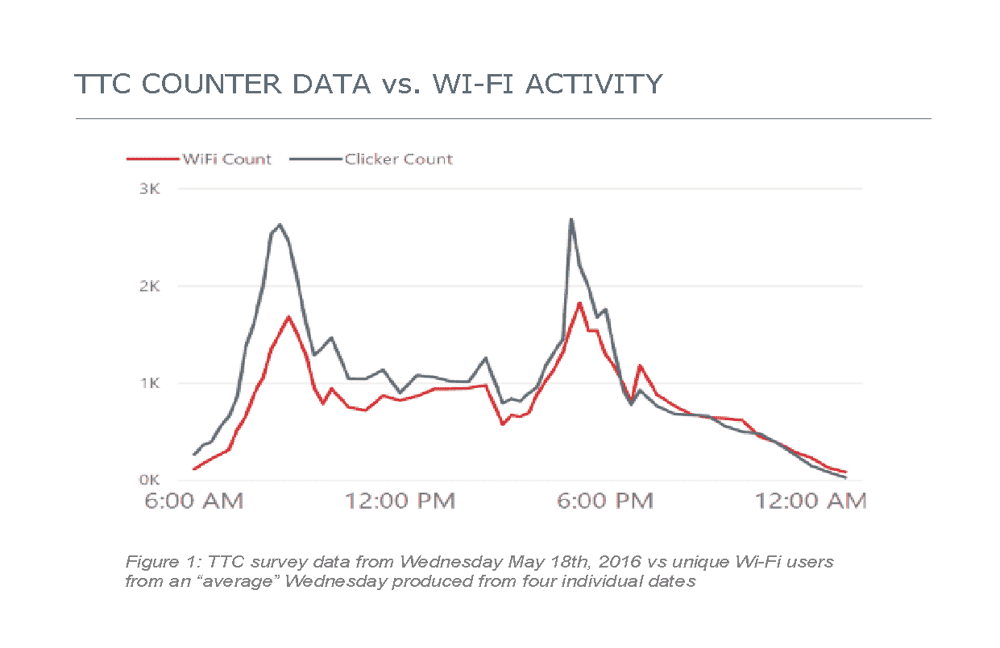

# 案例研究:实现实时可观测性解决方案

> 原文：<https://thenewstack.io/real-time-observability-with-influxdb-for-bai-communications/>

 [杰森·迈尔斯

杰森是 InfluxData 的技术营销作家。](https://www.influxdata.com/) 

在公共交通中，当涉及到乘客安全时，几乎没有出错的余地。与此同时，铁路运营商没有无限的财政资源来监管他们的铁路系统。多伦多 BAI Communications 公司的团队面临着这两种截然相反的现实。

幸运的是，通过使用他们现有的网络基础设施、时间序列平台和相当大的独创性帮助，白团队能够缩小他们的技术需求和成本之间的差距。他们是这样做的。

## 背景

BAI Communications 是一家全球性公司，在提供通信基础设施、开创先进连接的未来以及提供无处不在的覆盖方面处于领先地位，这些覆盖可以改变生活、推动商业抱负并塑造我们城市的未来。该公司专注于三个关键的垂直行业:广播、中立主机和 5G 以及公交。它寻求通过连接社区和促进经济发展来丰富生活。

BAI 负责管理和运营 TCONNECT 的网络基础设施，这是 TTC 多伦多运输委员会使用的无线网络。TCONNECT 平均每天有超过 200，000 个会话，每个工作日大约有 100，000 个不同的设备每月有超过 500 万个会话。TCONNECT 网络由遍布多伦多 75 个火车站的 1000 多个接入点、超过 72 公里的光纤、遍布全市的三个数据中心和大量相关网络硬件组成。

单击放大图像(在新标签中打开)；来源:白通讯

## InfluxDB 简介

面对如此大规模的网络，白将很多注意力放在了网络性能和用户体验上。这是该公司首次发现 InfluxDB 时间序列平台的方式。BAI 团队希望优化连接到网络的过程。他们寻找一种解决方案来提供这一过程的指标，但他们发现的一切都只关注用户建立连接后的性能。

没有一个可行的外部解决方案，白建立了自己的。该团队名为 Project Touchstone，使用 Raspberry Pi 编写了一个定制的 Python 脚本，模拟他们的 WiFi 用户的体验，并捕捉和计时连接过程的每个阶段。他们选择 InfluxDB 作为存储试金石项目收集的数据的地方。他们对该平台的体验非常积极，以至于它很快成为 BAI 用于其所有时间序列数据需求的默认时间序列平台。

## 站台拥挤

高乘客量会导致列车站台拥挤。这给铁路运营商带来了许多安全问题，他们使用闭路摄像机和电视来手动监控车站交通水平。然而，对于一个有数千个摄像头的系统，知道何时查看特定的提要是一个挑战。默认情况下，这是一个对现场报告或基于过去轶事经验的假设做出反应的反应过程，如体育赛事后增加的流量。

白团队希望找到一种更可靠、更准确的方法来确定车站客流量。他们假设，如果他们能识别乘客的位置，他们就能预测站台拥挤。为了测试这一理论，他们使用数据科学进行了一项研究，以确定乘车人数和 WiFi 使用之间是否存在关系。

他们将进入车站的人数与连接到 TCONNECT 网络的人数进行了比较，发现人数与 WiFi 活动之间具有 0.9 的高度统计相关性。

来源:白通讯

有了乘客量与 WiFi 使用相关的知识，白开始开发一种解决方案，利用现有的网络基础设施和 WiFi 分析来了解平台拥挤情况。因为他们能够显示如此强的相关性，所以没有必要向当前的基础设施添加任何额外的传感器或硬件。

## 数据管理

使用 WiFi 分析来确定车站拥挤程度的好处是，这意味着白可以使用现有的网络硬件来获得这些数据。为了实现这一点，他们建立了一个虚拟机，运行 Python 脚本从每个站点的接入点和无线控制器收集数据。该脚本还向数据添加任何必要的标记。白使用标签对数据进行动态分组。然后脚本将数据推入 InfluxDB。

来源:白通信|数据管道

## 可视化数据

一旦进入 InfluxDB，BAI 就可以分析和处理这些数据，并创建可视化效果来更好地理解这些数据。例如，查看单个火车站的数据，使用高峰指示铁路服务在早上开始的时间、早晚高峰发生的时间以及铁路服务停止的时间。

来源:白通讯|贩运站

更细致的数据视图显示了乘客进出车站时高峰和低谷的规律。这种模式是由乘客的设备在到达车站 WiFi 范围的阈值时试图连接到车站 WiFi 造成的。这些根据列车时刻表以可预测的间隔发生。模式的中断可能表明有问题。

在上图中，箭头表示服务可能会中断，因为连接到车站 WiFi 的人数会随着时间的推移而稳步增加。数据显示，车站开始清场大约需要 15 分钟，乘客量恢复到正常水平需要 20 分钟。

为了更有效地使用这些数据，BAI 使用 InfluxDB 作为后端，构建了一个多伦多铁路系统的自定义仪表盘地图。该地图实时显示了网络中乘客拥挤和站台拥挤问题发生的位置。

如果延迟增加并开始在网络中蔓延，铁路运营人员可以实时看到这些趋势，并立即知道应该关注哪些车站和安全摄像头，从而加快他们的分流和缓解工作。

来源:白交通|交通拥堵实时视图

该解决方案完全颠倒了解决多伦多火车站站台拥挤的操作顺序。旧系统依赖于随机的闭路电视监控或现场员工的报告。新系统会自动向铁路运营商指示哪里有可能发生问题，然后他们可以快速查看这些位置的闭路电视信号，并开始采取缓解措施。这种积极主动的能力提高了所有铁路客户的安全性。

通过使用 InfluxDB，BAI Communications 在多伦多的铁路运营获得了更好的可观察性。该解决方案的成功和有效性帮助 BAI 将其运输安全运营扩展到了纽约市。利用数据科学和独创性、InfluxDB 和现有的网络基础设施，BAI 提供了一个关键的安全跟踪和警报系统，安装和管理成本很低。

*要了解更多关于 InfluxDB 的信息，请访问 www.influxdata.com。*

<svg xmlns:xlink="http://www.w3.org/1999/xlink" viewBox="0 0 68 31" version="1.1"><title>Group</title> <desc>Created with Sketch.</desc></svg>