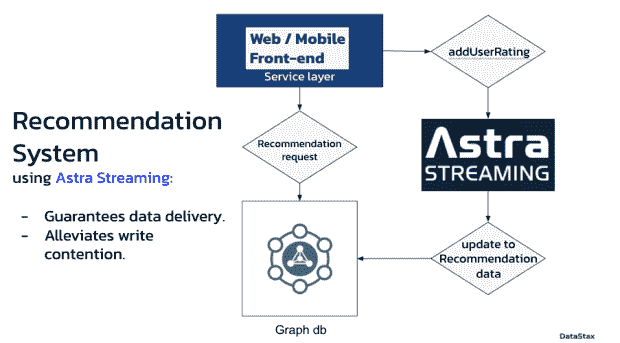

# 图形和事件流实时推荐

> 原文：<https://thenewstack.io/real-time-recommendations-with-graph-and-event-streaming/>

实时数据对企业的成功越来越重要。成功收集传入数据，同时快速而有策略地做出反应是至关重要的。

然而，数据收集过程通常并不简单。写入争用是许多大规模体系结构的常见瓶颈。随着数据存储基础设施的发展，开发人员进一步远离写入路径的关键领域。这使得对任何突然出现的写入持久性和性能问题进行故障排除变得困难。

问题变成了:我们如何确保所有数据都被存储，同时又不使存储层过载？在这里，我们将探索使用[datastas Astra Streaming](https://dtsx.io/3UAgmPC)来帮助解决一些陷阱，以确保[实时数据交付](https://thenewstack.io/how-graph-databases-are-changing-our-relationships-with-data/)。

## 技术堆栈

假设我们正在支持一项视频服务。一旦用户看完他们最喜欢的节目或电影，他们会被提示给它一个一星到五星之间的星级。由此，我们采用数据驱动的方法来推断一些我们“认为”他们可能喜欢的推荐。这个小小的评级行动有助于提高每个人未来这一推断的准确性。

我们如何构建一个系统来实现这一点？我们将需要一些简单的组件，最明显的是一个数据库和一个查询它的服务层。

### 数据库

对于我们的数据存储层，我们将使用 [DataStax Enterprise Graph](https://dtsx.io/3Ggcdwv) ，这是一个基于 [Apache Cassandra](https://dtsx.io/3TlbCfM) 构建的 Gremlin/TinkerPop 属性图数据库。图形数据库非常适合数据之间的关系和数据本身一样重要的用例。

在我们的例子中，我们关注用户和他们喜欢的电影之间的关系。这样，我们可以帮助他们找到他们可能喜欢的其他电影。

使用 DSE Graph，我们可以跟踪关于用户和电影的数据，将它们作为“顶点”存储在数据库中(图 1)。每当用户对电影进行评级时，我们可以将用户的“评级”边缘(以评级值作为属性)添加到电影中。

当我们想要获得推荐时，我们可以使用一部特定的电影作为切入点，将图表“展示”给其他用户，然后进一步展示给他们评价相似的电影。

图 1–显示“用户”和“电影”顶点如何通过包含用户评级的边连接的部分图表。

### 服务层

为了与数据库交互，我们将使用 Java Spring Boot 构建一个简单的 restful 服务。在控制器内部，我们将构建两个服务:

*   **add user rating**–接受用户对电影的新评分，并在图表中添加一条边。
*   **findrealtimerecommendationsbymoveId**–获取一部电影(id)并返回一个评分相似的电影列表。

这些服务很大程度上是不言自明的。一种是将用户评级写入数据库(存储为图中的边)。另一个基于提供的电影返回推荐，使用基于项目的协作过滤来匹配相似评级的电影。(有关基于项目的协作过滤的更多信息，请查看“[图形数据从业者指南”的第 10 章。](https://dtsx.io/3UmIu92)))

### Astra 流主题

Astra Streaming 是建立在 Apache Pulsar 之上的分布式流即服务。我们将使用一个流主题来处理传入的写流量。对 **addUserRating** 服务的调用会将用户对电影的新评级发送到主题中(如图 2 所示)。然后，我们将有一个“订阅”主题的过程，该过程将消耗数据并将其作为边写入图中。

在这种方法中使用 Astra 流给我们带来了一些优势:

*   **主题可以提供消息传递保证**–在出现故障事件的情况下，这有助于确保我们的“传输中”数据得以持久保存。
*   **防止写回压力**–如果应用程序有不可预测或“突发”的写活动，Astra 流主题可以帮助降低写吞吐量，保护底层存储基础架构不被过度利用。

图 2–推荐系统的不同组件如何相互作用的可视化表示

## 流媒体主题消费者

一旦新的评级被发送到 Astra 流媒体主题，消费者流程将接管。该流程将“订阅”主题，并等待发布到该主题的任何消息。当关于该主题的评级消息到达时，消费者将确认该消息，并使用以下(流畅的)Gremlin 代码将其作为边缘写入[图形数据库](https://thenewstack.io/the-power-of-graph-algorithms/)(图 3)。

图 3–在“用户”和“电影”节点之间创建“评级”边缘的 Fluent Gremlin。

由于消费者流程持续运行，它将继续监控主题，并在新的“评级”边出现时将其应用于图表。这样做的好处是，额外的评级消息将排队，并以一致的吞吐量水平应用。

## 遍历和结果

读取路径将使用简单的图遍历来构建。使用原始电影作为入口点，我们将沿着相似的分级边缘向用户(提交它们的人)移动，然后继续到相邻的电影节点。使用电影“回到未来”作为样本数据集的入口点运行该遍历会产生以下结果:

*表 1——类似评级为“回到未来”的电影的遍历结果*

## 摘要

我们讨论了将我们的写作路径改进为实时推荐系统的步骤。我们已经在一个图形数据库中实现了我们的主要存储模型，它提供了可以将数据发现提升到一个全新水平的方法和算法。同样，我们改进了数据持久性保证，同时保护存储层在用户流量激增时不会不堪重负。

虽然电影推荐系统的用例是这里的例子，但是所讨论的概念可以应用于许多类型的实时系统。在许多领域的用例中，例如供应链、网络安全和产品数据管理，经常会发现事件处理和图形数据库。采用上面讨论的方法可以帮助确保实时数据持久性。

*Java Spring Boot 服务层的代码可以在* [*这个库*](https://github.com/aar0np/graphRec) *中找到，Java 消费者的代码可以在*中找到

<svg xmlns:xlink="http://www.w3.org/1999/xlink" viewBox="0 0 68 31" version="1.1"><title>Group</title> <desc>Created with Sketch.</desc></svg>