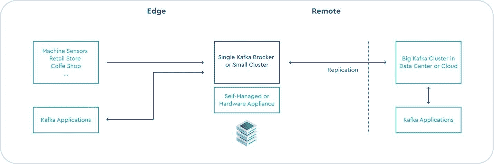
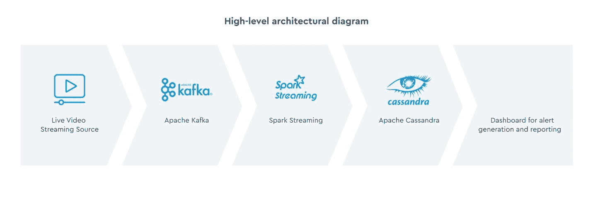
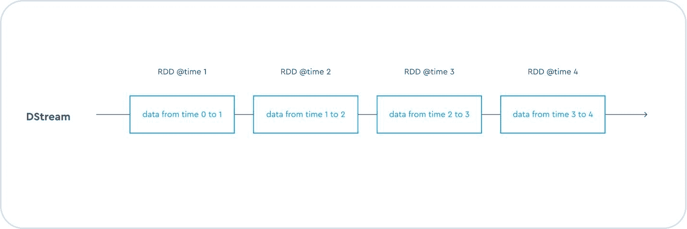

# 实时流处理应用、边缘计算和 Kafka

> 原文：<https://thenewstack.io/real-time-stream-processing-apps-edge-computing-and-kafka/>

[Joshua Bradley](https://www.linkedin.com/in/joshua-bradley-7b00918/)

[Josh 是美国第一家最后一英里边缘云提供商 Cox Edge 的技术总监和前 DevOps 工程师。他是 Cox Communications 家族的长期成员，20 年前在那里开始了他的职业生涯，并且是 Kubernetes 的早期倡导者。](https://www.linkedin.com/in/joshua-bradley-7b00918/)

当时是凌晨 3 点

在一个网络运营中心(NOC ),当数据点流过他们的屏幕时，工程师们很警觉，并准备好采取行动。偶尔，他们抬起头来看着布满彩色仪表盘的巨大监视器。

没有人说话。几分钟后，一些东西闪过电脑屏幕，仪表盘亮了起来。工程师们兴奋地大叫，客户支持人员拨打了热线。

这些工程师属于一家 CDN 公司的直播指挥中心，该中心旨在监控一家主要体育广播公司制作的直播 OTT (over-the-top)流。CDN 公司的目标是在客户意识到故障发生之前警告客户可能的直播流故障。仪表板警报显示发生了 TCP(传输控制协议)重新传输，体育广播公司非常兴奋，因为它在自己的内部网络运营中心收到警告前整整一分钟收到了警报。

> 这似乎很神奇，像这样的实时警报甚至可以用于大规模的在线事件，但对于使用边缘计算结合 Apache Kafka 的公司来说，这只是另一个例行的监控事件。

## 那么，什么是阿帕奇卡夫卡？

Apache Kafka 是一个开源的分布式事件流平台，支持边缘的实时流处理应用程序。工业物联网、电信、医疗保健、汽车和其他用例中的应用可以受益于 Kafka 的低响应时间和超低延迟。

使用卡夫卡需要理解它的架构和术语。Kafka 架构的核心是 Kafka broker，通常配置为一个服务器集群。Kafka 经纪人接收并存储来自生产者的数据。生产者是向 Kafka 代理发送数据的数据源。数据源可以是联网汽车、工厂中的物联网设备、其他智能设备、患者健康数据和其他来源。

主题是数据被写入和逻辑划分的地方。这些相关信息和消息流被分类成组。主题被写入跨多个代理的多个分区，以实现并行性，从而提高吞吐量和降低延迟。可以配置保留时间，主题中的消息在该时间结束时过期。这使得存储空间可用于新输入的数据。

Kafka 消费者从一个或多个主题中读取数据，并处理生产者发布的事件流。生产者和消费者是解耦的，这使得生产者可以自由地向主题发布数据，而不用担心消费者是否正在消费它们。

慢消费者不受快生产者的影响。消费者可以在线一次，消费来自一个主题的消息，然后再次离线。消息是写入分布在多个分区的日志文件中的单个数据元素。

当我们将数据写入一个分区时，我们创建了一个数据日志。日志是不可变的。它将保留在那里，直到其保留时间到期。随着时间的推移，当发生变化时，日志允许我们构建和跟踪我们的数据。生产者可以写入日志，数百个不同的消费者可以在日志的不同点读取数据。

日志中记录的每个数据点称为一个事件。Kafka 作为一个事件流平台的区别在于生产者和消费者对这些事件的持续处理对这些事件的持续交付。

## 消费者并行性

在消费者端，多个消费者跨代理从各个分区读取消息。因此，不是串行读取消息，而是同时读取各种消息。

这导致了可扩展的数据管道。生产者和消费者端的并行性使我们能够快速高效地扩展系统，提供实时流应用所需的高吞吐量和低延迟环境。

Kafka 代理使用 Zookeeper 来管理集群成员和选举集群控制器。

一个弹性的 Kafka 部署在边缘将包括至少三个 Kafka 代理，每个代理运行在一个单独的服务器上，以及一个由三个成员组成的 Zookeeper 合奏。

这允许我们将每个 Kafka 分区复制至少三次，并且拥有一个在两个节点发生故障时不会丢失数据的集群。

## 边缘的阿帕奇·卡夫卡

卡夫卡在《边缘》中的架构可以被认为是一个三层架构。

*   **客户端层:**由物联网设备和在客户位置(零售店、咖啡店、医院等)运行的应用组成。).物联网设备生成数据并发送到 Kafka 边缘层。
*   **边缘层:**部署在客户站点或边缘数据中心的小型 Kafka 服务器集群处理物联网设备发送给它的数据，并将其返回给使用它进行监控和报告的应用程序。
*   **云端层:**位于云端层的大型 Kafka 集群接收来自边缘层的数据，并将其与来自其他客户站点的数据相结合，以进行进一步的聚合和分析。

让我们看一个例子，Kafka 是如何在边缘的实时流处理应用程序中使用的。

## 实时 OTT 流的监控和警报

CDN 提供商可以利用其基础 CDN 产品为客户提供深度可见性、24/7 支持和实时 OTT 流缓解。

一小部分直播流数据(~10%)通过专用的服务器网络发送，分布在边缘数据中心，用于监控流故障并发出警报，如 TCP 重新传输、缓冲、延迟问题和其他故障。

这是一个高级架构图:

生产者将实时事件数据发送到 Kafka 集群，Kafka 集群将这些数据存储在分布于多个 Kafka 经纪人的多个分区的多个主题中。

Spark Streaming 等实时流处理应用程序将传入的流分成指定间隔的微批，并对它们进行处理以返回数据流(离散流)。数据流由一组底层 rdd(弹性分布式数据集)表示。

数据流中的每个 RDD 都包含指定时间间隔内的数据。

数据流经过处理，结果可以输入 NoSQL 数据库，以便进一步处理、汇总和报告。在这种情况下，Spark streaming 计算聚合并将结果存储在 Apache Cassandra 数据库中。聚合的一个例子是“最近 10 秒内的总重新传输次数”

应用程序查询 Cassandra 数据库，如果这些查询的结果确认被监控的指标违反了预定义的阈值，则生成警报。将实时流发送到边缘数据中心服务器而不是中央云服务器，可以减少像这样的实时监控和警报系统所需的延迟和响应时间。

**注意:**不能忍受秒级延迟的应用可以在 Spark 流中使用 Kafka 流。

边缘计算结合 Kafka 可以提高处理速度，降低网络成本，并使开发人员能够构建大规模实时流处理系统，而不会丢失任何数据。

<svg xmlns:xlink="http://www.w3.org/1999/xlink" viewBox="0 0 68 31" version="1.1"><title>Group</title> <desc>Created with Sketch.</desc></svg>