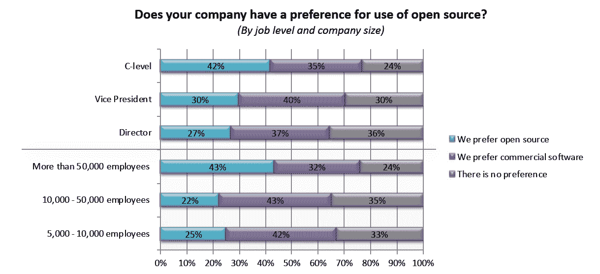
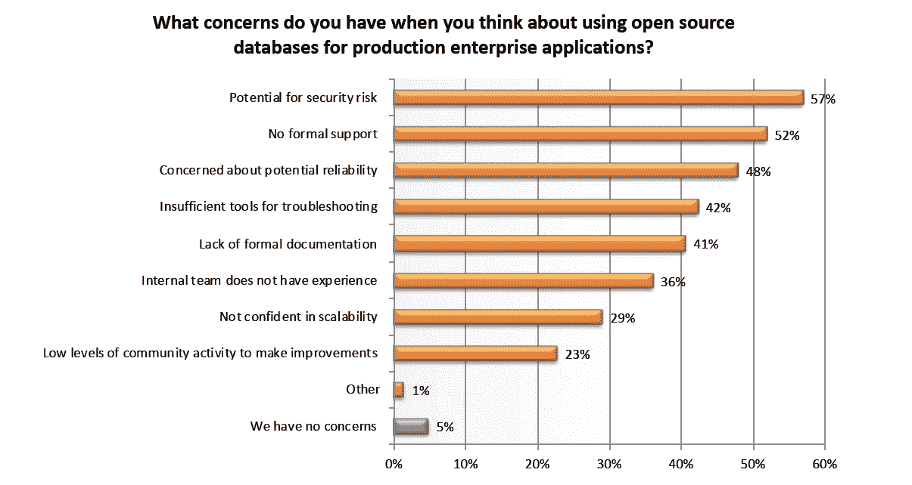

# 现实检查:每个人都不喜欢开源

> 原文：<https://thenewstack.io/reality-check-everyone-doesnt-prefer-open-source/>

我们经常与“半满玻璃杯”的传道者交谈，记住企业 it 是规避风险和缓慢改变的，这是令人振奋的。根据一项研究，许多 IT 主管说他们的公司更喜欢商业软件而不是开源软件。“ [IT 架构现代化趋势](https://www.datastax.com/resources/reports/new-research-report-2019-it-architecture-modernization-trends)”报告发现，总体而言，38%的人倾向于商业软件，32%的人更喜欢开源软件，30%的人没有偏好。你可以说我们愤世嫉俗，但员工超过 5000 人的公司中，有三分之二的高管实际上表示他们没有专有优先的软件战略，这并不值得庆祝。

值得注意的是，C 级管理人员和那些拥有超过 50，000 名员工的公司的管理人员倾向于支持开源软件而不是商业软件。对于高管来说，这可能是因为潜在的成本节约和技术灵活性。最大的公司可能也不太关心开源安全风险和可能缺乏正式支持。

今年，新的 Stack 进行了两次关于开源的调查。结果描绘了一幅更加光明的画面，部分是因为我们的参与者更有可能是以前使用过开源软件的开发人员。结果将很快公布。敬请关注。

DataStax 和 Dimensional Research 的“IT 架构现代化趋势”

这项由 DataStax 赞助的调查对数据库和应用程序的现代化进行了更详细的研究。89%的人认为数据库架构至少在构建将在混合或多云环境中运行的应用程序时非常重要，这一发现并没有给我们留下深刻印象。积极的一面是，50%的人说他们的团队将使用开源来实现应用程序现代化。微服务架构和数据流处理的使用肯定会对将要使用的数据库产生影响。

DataStax 和 Dimensional Research 的“IT 架构现代化趋势”

通过 Pixabay 的特征图像。

<svg xmlns:xlink="http://www.w3.org/1999/xlink" viewBox="0 0 68 31" version="1.1"><title>Group</title> <desc>Created with Sketch.</desc></svg>