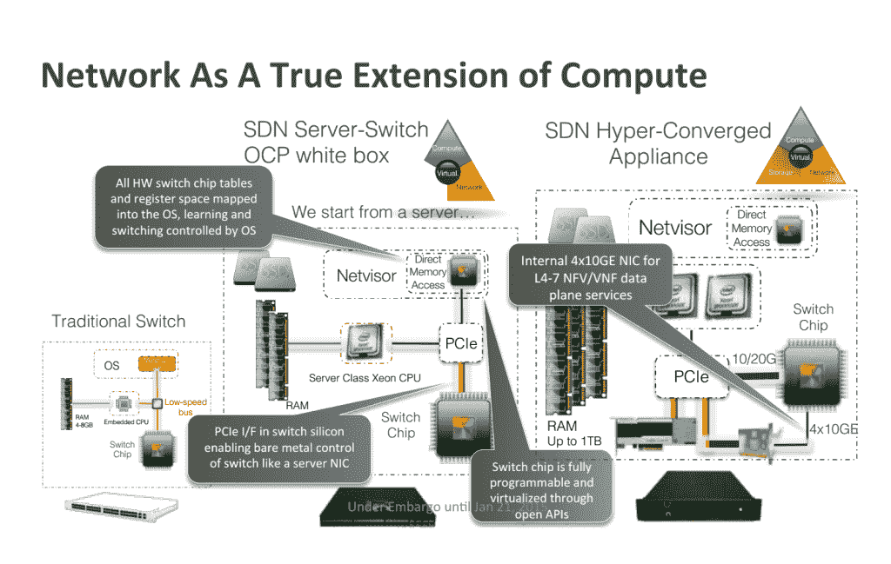
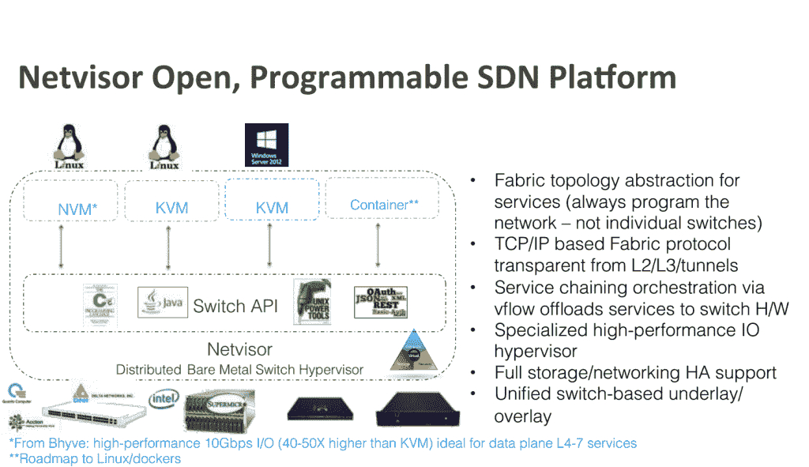
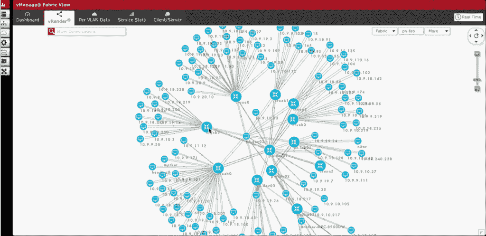
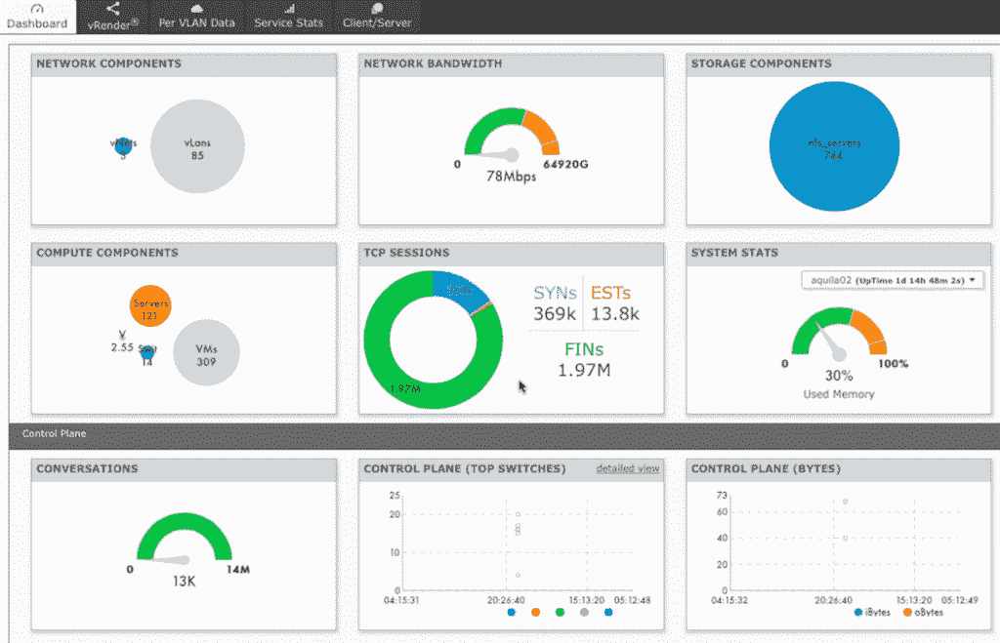
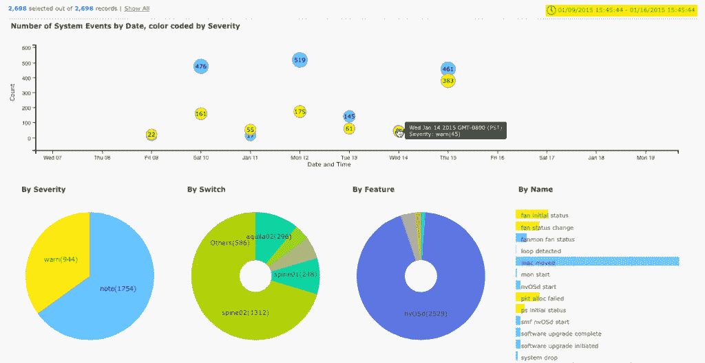

# 网络的现实:它应该是关于软件

> 原文：<https://thenewstack.io/reality-network-software/>

Pluribus Networks 代表了软件定义的网络社区的一个阵营，它开发的分布式系统更符合像 Google 这样的公司所期望的方法。

今天[公司](http://www.pluribusnetworks.com/)宣布进行 5000 万美元的 D 轮融资，以扩展其开放结构和分析平台，该平台将网络交换机视为服务器的扩展。Netvisor 是该公司在这种网络虚拟化方面的核心知识产权，该网络虚拟化充当融合网络平台，连接计算、存储和网络。

这项技术最适合与异构网络上的结构相比较。它依赖于由管理服务协调的裸机控制平面。该功能意味着 Pluribus 可以在设计为网络虚拟化环境的结构上部署应用。通过该流程聚合的数据意味着用户可以自己对网络进行分析。他们可以将安全措施作为软件应用于整个结构。网络如何建立并不是一个因素。更重要的是结构如何在物理和虚拟网络空间中工作。

下图显示了它与传统交换机的对比:

【T2

这是另一种观点:

集中式控制器将控制器与数据平面分开。Pluribus 开发了一种称为 fabric cluster 的产品，用于简化网络管理。这是一个分布式对等、高可用性集群，只需管理一个逻辑交换机。

因为它是一个结构，所以它连接网络中的所有节点，然后可以通过管理控制台查看这些节点。例如，Pluribus 有一个图表分析，供经理查看网络。

这是另一种观点:

还有一个:

Pluribus 与思科和其他网络供应商存在良性竞争。但它有一种方法，适合互联网无所不包的新兴世界。公平地说，谷歌和脸书拥有独特的环境，需要具有详细分析功能的完全感知结构。公平地说，大多数公司都有任何技术堆栈的组合，需要根据他们自己的特殊用例来对待。

对特殊用途的硬件总会有需求。但是它变得商品化了，甚至被软件抽象化了。

更重要的是，这是一个服务提供商选择使用什么以及他们提供的基础设施如何用于最大化应用程序和简化操作的问题，因此让平板电脑正常工作并不是他们几个月来一直说要交付的一件棘手的事情。导致延误的不是官僚问题。这是 Pong 时代的服务器网络和旧系统。

Pluribus 在运动的右边。将操作系统构建到基础架构中以扩展服务器，这只是软件深入组织的一种方式。平板电脑、智能手机、微型服务器和网络盒只是让软件更容易使用的抽象概念，而不是只有 it 王子才有权利配置的皇家队伍。

*特色图片[通过](https://www.flickr.com/photos/124240658@N06/15822931679/in/photolist-q7dEjT-offojj-prFasu-prE6UE-qoAb2J-q75Yp5-oHnU8G-pR8K8i-pfH6R5-q73nQY-pRUSBr-pRLrQb-pRMo53-q73VLw-pPR7Pi-ppXevT-pxFHgE-pMZfWe-ppXeKR-pGmgc1-qDYvg5-op7RPF-qmnLwy-oCyksp-qsp3YM-oy1Ci1-qcbiw1-pADmdA-q7djBT-q1Df6D-oJedTV-pRV9Qt-pRKMb5-q9ga1h-pRTC66-q9hedd-pRThF4-pRKkN1-q9ankD-pczvEt-pRVuZg-pRKEwo-pckZEq-pVer7W-qAepad-qbKfCL-pbM6C4-pjBuAL-qbJxwk-pgDLDV) Flickr 知识共享。*

**

<svg xmlns:xlink="http://www.w3.org/1999/xlink" viewBox="0 0 68 31" version="1.1"><title>Group</title> <desc>Created with Sketch.</desc></svg>