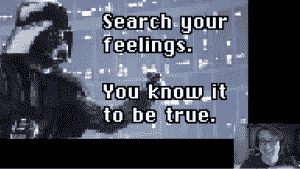

# 讨厌 Linux 的理由:2020 版

> 原文：<https://thenewstack.io/reasons-to-hate-linux-2020-edition/>

十多年来， [Bryan Lunduke](https://www.linkedin.com/in/bryanlunduke%20) 一直在 Linux 和开源会议上发表演讲，提出了 Linux 很烂的异端观点。

你可以说这是一种传统。

他本周向我们证实，事实上，Linux 是他一直以来最喜欢的操作系统之一。事实上，自 2018 年以来，他一直是《Linux 杂志》的[副主编](https://www.linuxjournal.com/content/bryan-lunduke-new-lj-deputy-editor)。他还在 SuSE 和 Purism 等知名开源公司担任营销职位，尽管他说现在他是“我自己的人”，更新他的[伦杜克杂志](http://www.lunduke.com/)网站，同时在网上发布[视频](https://www.youtube.com/channel/UCkK9UDm_ZNrq_rIXCz3xCGA)和[音频](https://play.google.com/music/m/I3eptvmuqocsoc5qmqj4xcs2dcm?t=The_Lunduke_Show)播客。

然而，沉浸在 Linux 文化中的伦杜克也将自己标榜为人民的拥护者，大声说出他自己对用户群体的批评。随着今年会议的取消，当他躲在俄勒冈州某个地方的家中时，Linux 社区自己的崇拜者牛虻决定在互联网的荒野中发泄他的愤怒。

因此，上周他创作了一段 73 分钟的欢快咆哮——他是乡村白痴还是城镇哭泣者？—提供了一个广泛而愉快的 Linux 宇宙状态之旅，以及一个对社区弱点的爱的戳戳。偶尔半开玩笑的面无表情——或者这是他自己轻率的意见？—伦杜克分享了他生动活泼、偶尔挑衅但大多温和善意的观点，即 Linux 很烂。

他以说他会想念那些质问者开始…

[https://www.youtube.com/embed/cZN5n6C9gM4?feature=oembed](https://www.youtube.com/embed/cZN5n6C9gM4?feature=oembed)

视频

## 不是桌面 Linux 年

伦杜克以 Linux 的一些积极方面开始了他的演讲——从服务器上的 Linux 开始，因为“我们已经赢了。”

但是伦杜克继续在移动设备上使用 Linux，就技术而言，他称之为“目前最可悲的计算”他的问题是支撑 Android 的 Linux 内核的形态。“当你将它与我们的台式机或服务器进行比较时，它几乎是一个无法识别的庞然大物。它充满了数字版权管理和封闭源代码，但它不是 Linux。”

他承认 Pine 和 Libre V 手机实际上运行的是纯 Linux 版本——“这些手机棒极了。但是那些就像…(他合起手指，发出微弱的声音)…这么多的市场份额。对不对？”

所以你可以想象他会对桌面上的 Linux 说些什么…

伦杜克声称，估算 Linux 桌面使用市场份额的各种方法都存在缺陷，但即使你认为这些统计数据不可信，搜索引擎对 Linux 的搜索等指标在过去 16 年中也一直在下降。“在 2020 年，它是如此之低，不仅没有填满那里的第一个像素栏，它只有三个像素。”他笑了。

然后伦杜克指出了一个显而易见的事实——“如果这些数字发生在 Windows 身上，我们会说 Windows 正在走向灭亡……”

“不管你我喜不喜欢，桌面 Linux 目前正在慢慢死去。我们只是还没有意识到。它没有陷进去。”

## 不该责备的事情

在列举了一些关于 Linux 的积极方面之后，Lunduke 进入了一个中间类别——我们不应该因为 Linux 糟糕的原因而指责这些方面，但它们仍然导致了非最佳的 Linux 体验。例如，虽然伦杜克抱怨 Ubuntu(和 Canonical)扼杀了一些有前途的项目，但“这不会伤害整个 Linux，对吗？”他还对 Arch 和 Gentoo 发行版进行了间接的宣传。“阿奇是不是真气人？没错。Arch 用户说自己是 Arch 用户是不是太多了…？是的。我们知道这一点。”但是它们不能成为 Linux 糟糕的原因——仅仅因为它们在 Linux 的整体使用中只占很小一部分。

“现在很多人都在往屏幕上扔东西，”他补充道。

当伦杜克分享我们不应该因为 Linux 的糟糕而责怪的一件事时，我笑出声来: [systemd](/systemd-vs-linux-kernel/) 。“systemd 让我很烦吗？答案是肯定的。这太不符合 Unix 了。这不是我喜欢的拥有 *init* 脚本的方式。这不是我喜欢的启动系统的方式。

“但这是在摧毁 Linux 吗？不。”他叹了口气。“没有。”

他还认为，人们应该停止说缺乏 Linux 游戏是该操作系统糟糕的一个原因——因为今天的 Linux 游戏可以在 Steam 和 gog.com 上获得,“许多游戏分发平台都在 Linux 上工作，至少在一定程度上，拥有高调的 3a 游戏。也许不是全部，但是很多。现在，我可以在 Linux 上玩许许多多的游戏，它们棒极了。”

## 是时候面对现实了

因此，直到他 72 分钟的演讲进行了 30 多分钟，伦杜克才最终转向“Linux 在 2020 年完全糟糕的真正原因。”

**原因一？向后兼容性。正如 Lunduke 所看到的，5 到 15 年前为 Linux 开发的软件是“一件非常非常头疼的事情”**

“偶尔，你会碰到会跑的东西。但是你的软件越复杂，“这种可能性就越小。

问题是应用程序依赖于特定库的特定版本——这让伦杜克抓狂。他甚至认为，这就像每隔几年就在沙滩上划一条线，并宣布它是一个时代的终结，使所有旧的东西“现在成为一个完全不受支持、极度不安全和不稳定的逆向计算平台”。这真的，真的很糟糕。”

伦杜克假装听到了一些好消息——他告诉他的在线观众关于 [AppImage](https://appimage.org/) 的事情，它“将所有那些旧软件的所有依赖项打包成一个单一的 ISO 文件，就像你用来刻录 CD 或闪存盘一样。”文件很大，但“在我看来，这解决了一大堆问题，”他说。

“但真正让我心烦的是，”他压低声音说道。“主要的 Linux 发行版忽略了这一点，大多数 Linux 开发人员并没有以这种方式发布他们的软件——有些人是这样，但大多数人不是。这非常非常令人沮丧。”

相反，大型桌面环境正在尝试竞争解决方案，如 [FlatPak](https://flatpak.org/) 和 Canonical 的[Snappy](https://snapcraft.io/)——伦杜克认为这些解决方案目前没有解决依赖管理的问题。

“好家伙，不用担心这个就好了，”他说。

大约 41 分钟后，伦杜克终于找到了为什么 Linux 糟糕的第二个原因，他称之为“令人兴奋的话题”他开始写道，Linux 是一个操作系统——“如果你愿意这么称呼它的话，”他补充道，并交替给出了“不同操作系统块的集合”的描述但是不管你怎么称呼它，它都是由一个委员会运行的，不管你是在谈论桌面环境、应用程序还是完整的发行版。"事情是这样的:委员会不会有什么好结果."

他承认“在某种意义上，这种与整个开源思维方式背道而驰。比如‘让我们发布代码，伙计，我们一起努力，伙计。’我喜欢，对吧？我想把花插在我的头发上，当我们谈论这些的时候，我也想围着篝火跳舞。

“但在这里，我得当一会儿达斯·维达，”他笑着说。

“你需要一个独裁者。你就是这样。”这就把伦杜克带到了为什么 Linux 很烂的第三个原因**。“总的来说，开源和 Linux 生态系统不仅仅是由一个委员会管理——它是由一个必须取悦多个大公司的委员会管理的。”这让他想到了 Linux 糟糕的一个相关原因——“我们现在有点像**公司控制的**，但我们也有点不像。”**

 **“你有作为一个大公司的一部分的所有缺点，但你也有被一个半组织化的社区管理的所有缺点，”他说。

Linux 糟糕的另一个主要原因是大量的杰出人士在推广 Linux 的同时使用其他操作系统。伦杜克放了一张幻灯片，宣称“这就像百事可乐的负责人一边喝可乐一边做广告。”违规者很多，包括在 Linux 会议上使用 Mac(或 Windows)笔记本电脑的人，或者“讲 Linux 但不运行 Linux 的播客”。

“我知道很多 YouTube 视频制作者和其他人越来越多地使用 Linux，这很好，”他说。“但我知道一个事实，大量的 Linux 播客谈论 Linux，并以 Linux 为主题——在麦金塔电脑或 Windows 电脑上录制、编辑和分发。”

然后他开始下一张幻灯片(“我们赶走任何我们不同意的人。甚至是我们的创始人。”)但很快就到了他的大结局。“也许我们应该找到一种更好的组织方式……也许我们应该找到一种方式来确保做出 Linux 决策的人使用 Linux。”

然后，他用最后两个字的幻灯片结束了演示:“Linux 糟透了。”

但是伦杜克不能就此罢休。他必须展望更美好的未来，告诉他看不见的在线观众“我希望一年后 Linux 会做得很棒。

“我希望在 2021 年，当我站在某个地方的舞台上，告诉每个人 Linux 糟糕的所有原因——它可能主要是关于 systemd 的，他说。”我刚刚谈到的所有这些事情都有望成为过眼云烟。"

* * *

## WebReduce

<svg xmlns:xlink="http://www.w3.org/1999/xlink" viewBox="0 0 68 31" version="1.1"><title>Group</title> <desc>Created with Sketch.</desc></svg>**